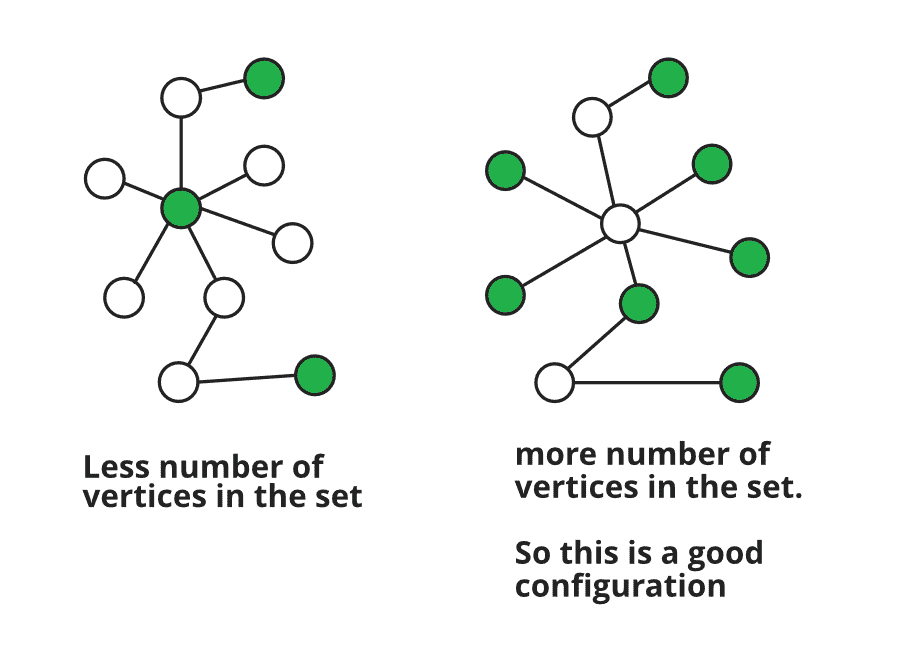

# 使用图着色在图中寻找独立集合的 Java 程序

> 原文:[https://www . geeksforgeeks . org/Java-程序查找独立图中集合-使用图着色/](https://www.geeksforgeeks.org/java-program-to-find-independent-sets-in-a-graph-using-graph-coloring/)

[](https://www.geeksforgeeks.org/mathematics-independent-sets-covering-and-matching/)**独立集是任意两个顶点或边对不相邻的顶点或边的集合。假设独立集意味着顶点的独立集，我们必须找到任意两对顶点不相邻的顶点集。**

**使用 [**图着色**](https://www.geeksforgeeks.org/graph-coloring-applications/) 我们可以解决这个问题。我们将修改图形着色方法，因为我们将只使用两种颜色，即 0，1，而不是使用不同的颜色。所以我们假设那些标为 0 的顶点是集合的一部分，而其他的不是。所以标为 0 的顶点没有相邻的标为 0 的顶点。**

**java 中引用调用功能的基本思想和向量的[概念是必须的。此外，我们假设标记为顶点名称的索引和该索引处向量的值为该顶点的颜色(0 或 1)。最初找到的变量设置为假，即没有找到所需大小的集合。我们将使用单词删除和颜色' 0 '的任何顶点。两者都表明相同的事情，即特定顶点可以从图中移除，并且可以包含在集合中。](https://www.geeksforgeeks.org/java-util-vector-class-java/)**

****进场:****

*   **程序的输入是图的相邻矩阵，这里给出了集合的最大大小。首先我们要制作图矩阵的[邻接表](https://www.geeksforgeeks.org/graph-and-its-representations/)。现在，我们将为每个顶点运行一个循环，首先给第 I 个顶点赋予颜色“0”，然后找到所有其他可以赋予颜色“0”(包含在集合中)的可能顶点。**
*   **因此，我们正在制作一个名为“颜色”的向量，并用所有索引(顶点)的颜色为“1”和第 I 个顶点为“0”来初始化该向量。然后，我们将使用 Util()方法检查所有可能被赋予颜色“0”(包含在集合中)的顶点，如下所述。**
*   ****Util()方法:**该方法调用另外两个名为 can_remove()和 remove_all()的方法。该方法的主要目的是，如果“ith”顶点被移除(分配为“0”)，则移除所有可以从颜色向量中移除的顶点。此方法查找可以使用上述两种方法移除的顶点的索引。然后，它将“0”分配给该顶点，并继续这样做，直到不再有要移除的顶点。它返回修改后的颜色向量。**
*   ****can_remove()方法**检查给定顶点是否可以毫无困难地被赋值为‘0’。它会比较给定顶点的每个相邻顶点，并检查是否有“0”的相邻顶点。如果在这种情况下没有顶点，那么这个顶点被赋予一个值“0”。它返回一个布尔值，表示是或否。**
*   ****remove_all()方法**用于查找每次移除都会给出大量待移除顶点的顶点。这一步主要是贪心的做法。它查找在移除特定顶点后可以移除的顶点数，并查找所有这些数的最大值，并返回移除将导致移除最大顶点的特定顶点的索引。然后在 Util()方法中移除这个顶点。**
*   **到目前为止，我们已经理解了 Util()，remove_all()和 can_remove()方法正在做什么。基本上，对于每个“ith”顶点为“0”的 ith 颜色向量，这些方法试图找到可以从图中移除的顶点数(分配为“0”)。所以在调用了这个 Util()方法之后，颜色向量被修改了，可以被赋值‘0’的顶点数被赋予了这个值。**
*   **现在，由于修改了颜色向量，所以我们必须计算分配给“0”的顶点数(这意味着可以包含在集合中的顶点)。如果计数大于所需的大小，那么我们已经找到了解决方案，并且找到的变量被设置为真，输出完成，循环中断，否则它继续尝试下一个颜色向量，删除下一个顶点。计数由 Util3()方法完成。**

****但是我们忘记了一种情况，如下图所示:****

****

**这里，我们将为第二个图中的一个相邻顶点着色，而不是为第一个图中的第二个着色顶点着色。这样做，我们将获得集合中的许多顶点。因此，对于每个颜色向量，我们将调用 Util2()方法。只有当某个顶点的值为“1”(未着色)并且只有一个相邻的彩色顶点时，才会出现这种情况，如上所示。**

*   ****Util2()方法**基本上检查每个未被移除的顶点(值为“1”)，该顶点是否只有一个相邻的顶点被着色(值为“1”)。如果找到任何这样的顶点，那么这个方法将在顶点之间交换颜色，并调用 Util()方法来刷新颜色向量。这可以很容易地证明，这种方法将总是要么增加具有“0”的顶点的数量，要么数量保持不变。它永远不会减少彩色顶点的数量。因此，这种方法证明对我们的方法特别有益。**

> ****为什么总是增加？****
> 
> **两个相邻顶点之间只有颜色的交换。因此，计数将保持不变，直到现在。考虑到配置的其余部分，我们可以说在交换新着色的顶点之前，没有一个以上的相邻着色顶点。因此，在交换之后，也没有相邻的顶点被着色。这将保持独立集的属性。**

*   **到目前为止，如果我们有任何解决方案，那么我们将设置发现为真，否则将保存颜色向量的配置以供进一步使用。所有这些都是针对循环中的每个“第 I 个”顶点完成的，修改后的颜色向量存储在程序中名为 set _ 的向量向量中。**
*   **如果到目前为止还没有找到所需的大小，那么我们将尝试最后一种情况，即对所有生成的配置集执行成对交集。**

**在这种情况下，我们将再次从颜色向量开始重复相同的过程，并保持生成的配置。唯一的区别是，我们不会从给第 I 个顶点赋值“0”开始。取而代之的是，我们将检查配置对(在 set _ found 中)中那些标记为“0”且为两个集合所共有的顶点。它们将在颜色向量中被标记为“0”，对于其余部分，上述过程将是相同的，以检查集合的最大可能大小和上述情况。**

****实施:****

## **Java 语言(一种计算机语言，尤用于创建网站)**

```
// Java Program to Find Independent Sets
// in a Graph using Graph Coloring

import java.io.*;
import java.util.*;

// save file with the name "GFG2.java"

public class GFG2 {

    // main class
    public static void main(String[] args) throws Exception
    {
        // inputting the graph and forming it's adjacency
        // list.

        System.out.println("The number of vertices in the graph is taken as 4");

        int n = 4;
        Vector<Vector<Integer> > adjacency_matrix
            = new Vector<Vector<Integer> >(n, (n));

        /* the input matrix is
           0111
           1011
           1101
           1110
        */

        for (int i = 0; i < n; ++i) {

            Vector<Integer> adj = new Vector<Integer>(n);

            for (int j = 0; j < n; ++j)
                if (i == j)
                    adj.add(0);
                else
                    adj.add(1);

            adjacency_matrix.add(adj);
        }

        Vector<Vector<Integer> > adjacency_list  = new Vector<Vector<Integer> >();

        for (int i = 0; i < n; ++i) {

            Vector<Integer> adj_list  = new Vector<Integer>();

            for (int j = 0; j < n; ++j) {
                if (adjacency_matrix.get(i).get(j) == 1)
                    adj_list.add(j);
            }
            adjacency_list.add(adj_list);
        }

        // taking the minimum size of the set required.
        System.out.println("The minimum size of the set required is taken as 2");

        // the least size of the set required
        int x = 2;

        // complement of the size
        int y = n - x;

        int found = 0;
        int size = 0;
        int min = n + 1;

        // making a set_found vector to store all the
        // possible sets .
        Vector<Vector<Integer> > set_found
            = new Vector<Vector<Integer> >();

        System.out.println("Searching for the set");

        for (int i = 0; i < n; ++i) {

            // if set is found
            if (found == 1)
                break;

            // a cover vector to have the state of all the
            // vertices initially.
            Vector<Integer> color = new Vector<Integer>(n);

            for (int j = 0; j < n; ++j)
                color.add(1);

            // starting by putting the ith node in set
            color.set(i, 0);

            // then finding all the nodes to be pushed in
            // the set by calling function
            Util(adjacency_list, color);

            // finding the number of those which cannot be
            // pushed in set
            size = Util3(color);

            if (size < min)
                min = size;

            // if the number of elements in set are more or
            // equal to the amount required.
            if (size <= y) {

                System.out.println("Independent set of size " + (n - size)
                    + "found");

                for (int j = 0; j < n; ++j)
                    if (color.get(j) == 0)
                        System.out.print(j + 1 + " ");

                System.out.println();

                set_found.add(color);
                found = 1;
                break;
            }

            // not sufficient nodes found
            // calling util2 function
            // main aim of calling this function 'x' times
            // is that for any undirected graph the maximum
            // number of edges with x nodes is x(x+1)/2; so
            // we are trying for each possible edge .
            for (int j = 0; j < x; ++j)
                Util2(adjacency_list, color, j);

            // repeating same procedure as discussed above
            size = Util3(color);

            if (size < min)
                min = size;
            System.out.println("Independent set of size "
                               + (n - size) + "found");

            for (int j = 0; j < n; ++j)
                if (color.get(j) == 0)
                    System.out.print(j + 1 + " ");

            System.out.println();

            set_found.add(color);

            if (size <= y) {
                found = 1;
                break;
            }
        }

        int r = set_found.size();

        // searching pairwise.
        // repeating same procedure as above
        // this time taking those set which have common
        // vertices in them and again trying for uncommon
        // ones.

        for (int a = 0; a < r; ++a) {
            if (found == 1)
                break;
            for (int b = a + 1; b < r; ++b) {
                if (found == 1)
                    break;

                Vector<Integer> color = new Vector<Integer>(n);

                for (int j = 0; j < n; ++j)
                    color.add(1);

                for (int c = 0; c < n; ++c)
                    if (set_found.get(a).get(c) == 0
                        && set_found.get(b).get(c) == 0)
                        color.set(c, 0);

                Util(adjacency_list, color);

                size = Util3(color);

                if (size < min)
                    min = size;
                if (size <= y) {
                    System.out.println("Independent set of size"
                        + (n - size));

                    for (int j = 0; j < n; ++j)
                        if (color.get(j) == 0)
                            System.out.print(j + 1 + " ");

                    System.out.println();
                    found = 1;
                    break;
                }

                for (int j = 0; j < y; ++j)
                    Util2(adjacency_list, color, j);

                size = Util3(color);

                if (size < min)
                    min = size;
                System.out.println("Independent set of size " + (n - size)
                    + "found");

                for (int j = 0; j < n; ++j)
                    if (color.get(j) == 0)
                        System.out.print(j + 1 + " ");

                System.out.println();

                if (size <= y) {
                    found = 1;
                    break;
                }

            }
        }

        // if found
        if (found == 1)
            System.out.println(
                "Found the set of given least possible size");
        else
            System.out.println(
                "Couldn't find the set of least size given");
    }

    // utility function to label maximum vertices with
    // 0,that can be included in the set. It takes the
    // maximum number of vertices which can be removed each
    // time.
    public static void Util(Vector<Vector<Integer> > adjacency_list,
         Vector<Integer> color)
    {
        int a = 0;
        while (a != -1) {
            a = remove_all(adjacency_list, color);
            if (a != -1)
                color.set(a, 0);
        }
    }

    // This method tries whether it is possible to
    // remove any adjacent vertex of any removed vertex if
    // yes then it will remove that and call Util again and
    // modify the set.
    public static void Util2(Vector<Vector<Integer> > adjacency_list,
          Vector<Integer> color, int j)
    {

        int cnt = 0;

        Vector<Integer> tmp_color = new Vector<Integer>();

        for (int g = 0; g < color.size(); ++g)
            tmp_color.add(color.get(g));

        for (int i = 0; i < color.size(); ++i) {

            if (tmp_color.get(i) == 1) {

                int sum = 0;
                int idx = -1;

                for (int g = 0; g < adjacency_list.get(i).size(); ++g)
                    if (tmp_color.get(adjacency_list.get(i).get(g))== 0)
                    {
                        idx = g;
                        sum++;
                    }

                if (sum == 1 && color.get(adjacency_list.get(i).get(idx)) == 0)
                {
                    tmp_color.set(adjacency_list.get(i).get(idx), 1);

                    tmp_color.set(i, 0);

                    Util(adjacency_list, tmp_color);

                    ++cnt;
                }

                if (cnt > j)
                    break;
            }
        }

        for (int g = 0; g < color.size(); ++g)
            color.set(g, tmp_color.get(g));
    }

    // returning the number of vertices that can't be
    // included in the set.
    public static int Util3(Vector<Integer> color)
    {
        int cnt = 0;
        for (int i = 0; i < color.size(); i++)
            if (color.get(i) == 1)
                ++cnt;
        return cnt;
    }

    // returns the index of the vertex whose removal will
    // give more vertex to be removed. This is basically a
    // greedy approach to get the maximum possible set size.
    public static int remove_all(Vector<Vector<Integer> > adjacency_list,
               Vector<Integer> color)
    {
        int a = -1, max = -1;

        for (int i = 0; i < color.size(); ++i)
        {
            if (color.get(i) == 1
                && can_remove(adjacency_list.get(i), color) == 1)
            {
                Vector<Integer> tmp_color = new Vector<Integer>();

                for (int j = 0; j < color.size(); ++j)
                    tmp_color.add(color.get(j));

                tmp_color.set(i, 0);

                int sum = 0;

                for (int j = 0; j < tmp_color.size(); ++j)
                    if (tmp_color.get(j) == 1
                        && can_remove(adjacency_list.get(j),
                                      tmp_color)== 1)
                        ++sum;

                if (sum > max)
                {
                    max = sum;
                    a = i;
                }
            }
        }
        return a;
    }

    // checking that a vertex can be removed or not
    public static int can_remove(Vector<Integer> adj_list,
                                 Vector<Integer> color)
    {
        int check = 1;

        for (int i = 0; i < adj_list.size(); ++i)
            if (color.get(adj_list.get(i)) == 0)
                check = 0;

        return check;
    }
}
```

****Output**

```
The number of vertices in the graph is taken as 4
The minimum size of the set required is taken as 2
Searching for the set
Independent set of size 1found
1 
Independent set of size 1found
2 
Independent set of size 1found
2 
Independent set of size 1found
2 
Independent set of size 1found
1 
Independent set of size 1found
1 
Independent set of size 1found
1 
Independent set of size 1found
2 
Independent set of size 1found
2 
Independent set of size 1found
2 
Couldn't find the set of least size given
```**