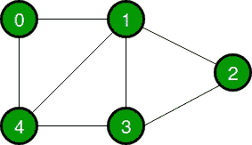
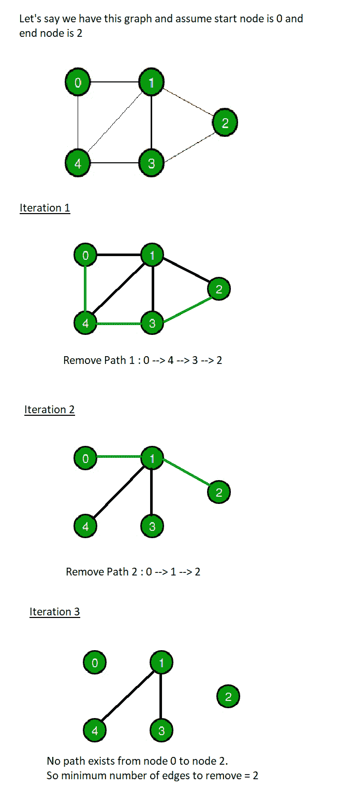

# 寻找最小切割边数使图形断开的 Java 程序

> 原文:[https://www . geesforgeks . org/Java-程序-查找-最小边数-切割-使图形断开/](https://www.geeksforgeeks.org/java-program-to-find-minimum-number-of-edges-to-cut-to-make-the-graph-disconnected/)

给定一个连通图，任务是找到使给定图断开的最小边数。

如果图中至少有两个顶点没有通过路径连接，则该图是断开的。

**示例:**

> **输入:**
> 
> 
> 
> **输出:**要移除的最小边数= 2

**进场:**

解决这个问题的方法是找到从图中的开始顶点到结束顶点的[边不相交路径集合](https://www.geeksforgeeks.org/find-edge-disjoint-paths-two-vertices/)中的路径数量。边不相交的路径集是指在任意两条路径之间没有公共边的一组路径。

1.  选择一个节点作为开始节点，另一个节点作为结束节点。
2.  从开始节点启动 BFS，并检查从开始节点到结束节点是否存在路径。
3.  如果是，那么删除该路径的所有边，并再次运行 BFS。
4.  重复步骤 2 和 3，直到从开始节点到结束节点不存在路径。
5.  返回路径被删除的次数。

**举例说明:**



**代码:**

## Java 语言(一种计算机语言，尤用于创建网站)

```
// Java Program to Find
// Minimum Number of Edges
// to Cut to make the
// Graph Disconnected

import java.util.*;

public class GFG {

    // Function to find the min number of edges
    public static int minEdgesRemoval(int[][] edges, int n)
    {
        // Initialize adjacency list for Graph
        Map<Integer, List<Integer> > graph
            = new HashMap<Integer, List<Integer> >();

        // Initializing starting and ending vertex
        int start = edges[0][0];
        int end = edges[0][1];

        // Create adjacency list of the graph
        for (int i = 0; i < n; i++) {
            int n1 = edges[i][0];
            int n2 = edges[i][1];
            List<Integer> li;

            // Add edges node 1
            if (graph.containsKey(n1)) {
                li = graph.get(n1);
            }
            else {
                li = new ArrayList<Integer>();
            }

            li.add(n2);
            graph.put(n1, li);

            // Add edges node 2
            if (graph.containsKey(n2)) {
                li = graph.get(n2);
            }
            else {
                li = new ArrayList<Integer>();
            }

            li.add(n1);
            graph.put(n2, li);
        }

        // Variable to count the number of paths getting
        // deleted
        int deleteEdgeCount = 0;

        while (true) {

            // bfsTraversalPath is the BFS path from start
            // to end node It is a map of parent vertex and
            // child vertex
            Map<Integer, Integer> bfsTraversalPath = bfs(graph, start);

            // If end is present on the path from start node
            // then delete that path and increment
            // deleteEdgeCount
            if (bfsTraversalPath.containsKey(end)) {

                deleteEdgeCount++;
                int parent = bfsTraversalPath.get(end);
                int currEnd = end;

                // Delete all the edges in the current path
                while (parent != -1)
                {
                    deleteEdge(graph, parent, currEnd);
                    deleteEdge(graph, currEnd, parent);
                    currEnd = parent;
                    parent = bfsTraversalPath.get(currEnd);
                }
            }

            // If end is not present in the path
            // then we have a disconnected graph.
            else {
                break;
            }
        }

        return deleteEdgeCount;
    }

    // Function to delete/remove an edge
    private static void deleteEdge(Map<Integer, List<Integer> > graph,
               Integer start, Integer end)
    {

        List<Integer> list = graph.get(start);
        list.remove(end);
    }

    // Function for BFS Path
    private static Map<Integer, Integer>
    bfs(Map<Integer, List<Integer> > graph, int start)
    {

        // Map for BFS Path
        Map<Integer, Integer> bfsTraversalPath
            = new HashMap<Integer, Integer>();

        // Array for marking visited vertex
        List<Integer> visited = new ArrayList<Integer>();

        // Array for BFS
        List<Integer> queue = new ArrayList<Integer>();

        int qStartIndex = 0;

        bfsTraversalPath.put(start, -1);
        queue.add(start);

        while (qStartIndex < queue.size())
        {
            int curr = queue.get(qStartIndex++);
            visited.add(curr);

            for (int k : graph.get(curr))
            {
                if (!visited.contains(k))
                {
                    queue.add(k);
                    if (!bfsTraversalPath.containsKey(k))
                    {
                        bfsTraversalPath.put(k, curr);
                    }
                }
            }
        }

        return bfsTraversalPath;
    }

    // Driver Code
    public static void main(String[] args)
    {

        // Number of edges
        int n = 7;

        // Edge List
        int[][] edges
            = { { 0, 1 }, { 1, 2 }, { 2, 3 }, { 3, 4 },
                { 4, 0 }, { 4, 1 }, { 1, 3 } };

        // Run the function
        System.out.println("Minimum Number of Edges to Remove = "
            + minEdgesRemoval(edges, n));
    }
}
```

**Output**

```
Minimum Number of Edges to Remove = 2
```