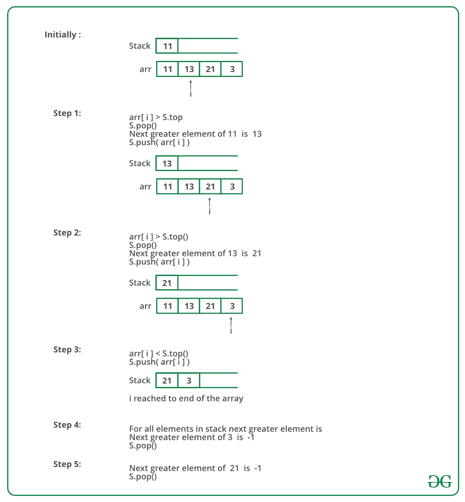

# 寻找下一个更大元素的 Java 程序

> 原文:[https://www . geesforgeks . org/Java-program-to-find-next-greater-element/](https://www.geeksforgeeks.org/java-program-to-find-next-greater-element/)

给定一个数组，为每个元素打印下一个更大的元素(NGE)。元素 x 的下一个较大元素是数组中 x 右侧的第一个较大元素。不存在更大元素的元素，将下一个更大的元素视为-1。

**示例:**

1.  对于数组，最右边的元素总是将下一个较大的元素作为-1。
2.  对于按降序排序的数组，所有元素的下一个较大元素为-1。
3.  对于输入数组[4，5，2，25]，每个元素的下一个较大元素如下。

```
Element       NGE
   4      -->   5
   5      -->   25
   2      -->   25
   25     -->   -1
```

**d)** 对于输入数组[13，7，6，12]，每个元素的下一个较大元素如下。

```
  Element        NGE
   13      -->    -1
   7       -->     12
   6       -->     12
   12      -->     -1
```

**方法 1(简单)**
使用两个循环:外循环逐个拾取所有元素。内环为外环拾取的元素寻找第一个较大的元素。如果找到更大的元素，则该元素被打印为下一个，否则，打印-1。

下面是上述方法的实现:

## Java 语言(一种计算机语言，尤用于创建网站)

```
// Simple Java program to print next 
// greater elements in a given array

class Main
{ 
    /* prints element and NGE pair for 
     all elements of arr[] of size n */
    static void printNGE(int arr[], int n)
    {
        int next, i, j;
        for (i=0; i<n; i++)
        {
            next = -1;
            for (j = i+1; j<n; j++)
            {
                if (arr[i] < arr[j])
                {
                    next = arr[j];
                    break;
                }
            }
            System.out.println(arr[i]+" -- "+next);
        }
    }

    public static void main(String args[])
    {
        int arr[]= {11, 13, 21, 3};
        int n = arr.length;
        printNGE(arr, n);
    }
}
```

**Output**

```
11 -- 13
13 -- 21
21 -- -1
3 -- -1
```

***时间复杂度:**O(N<sup>2</sup>)*
***辅助空间:** O(1)*

**方法 2(使用堆栈)**

*   将第一个元素推入堆栈。
*   一个接一个地拾取剩余的元素，并按照以下步骤循环。
    1.  将当前元素标记为*下一个*。
    2.  如果堆栈不为空，将堆栈的顶部元素与下一个*进行比较。*
    3.  *如果 next 大于 top 元素，则从堆栈中弹出元素。*下一个*是弹出元素的下一个更大的元素。*
    4.  *当弹出的元素小于下一个时，继续从堆栈中弹出。*下一个*成为所有这些弹出元素的下一个更大的元素。*
*   *最后，推送堆栈中的下一个。*
*   *步骤 2 中的循环结束后，从堆栈中弹出所有元素，并打印-1 作为它们的下一个元素。*

*下图是上述方法的模拟运行:*

**

*下面是上述方法的实现:*

## *Java 语言(一种计算机语言，尤用于创建网站)*

```
*// Java program to print next
// greater element using stack

public class NGE {
    static class stack {
        int top;
        int items[] = new int[100];

        // Stack functions to be used by printNGE
        void push(int x)
        {
            if (top == 99) 
            {
                System.out.println("Stack full");
            }
            else
            {
                items[++top] = x;
            }
        }

        int pop()
        {
            if (top == -1) 
            {
                System.out.println("Underflow error");
                return -1;
            }
            else {
                int element = items[top];
                top--;
                return element;
            }
        }

        boolean isEmpty()
        {
            return (top == -1) ? true : false;
        }
    }

    /* prints element and NGE pair for
       all elements of arr[] of size n */
    static void printNGE(int arr[], int n)
    {
        int i = 0;
        stack s = new stack();
        s.top = -1;
        int element, next;

        /* push the first element to stack */
        s.push(arr[0]);

        // iterate for rest of the elements
        for (i = 1; i < n; i++) 
        {
            next = arr[i];

            if (s.isEmpty() == false)
            {

                // if stack is not empty, then
                // pop an element from stack
                element = s.pop();

                /* If the popped element is smaller than
                   next, then a) print the pair b) keep
                   popping while elements are smaller and
                   stack is not empty */
                while (element < next) 
                {
                    System.out.println(element + " --> "
                                       + next);
                    if (s.isEmpty() == true)
                        break;
                    element = s.pop();
                }

                /* If element is greater than next, then
                   push the element back */
                if (element > next)
                    s.push(element);
            }

            /* push next to stack so that we can find next
               greater for it */
            s.push(next);
        }

        /* After iterating over the loop, the remaining
           elements in stack do not have the next greater
           element, so print -1 for them */
        while (s.isEmpty() == false)
        {
            element = s.pop();
            next = -1;
            System.out.println(element + " -- " + next);
        }
    }

    // Driver Code
    public static void main(String[] args)
    {
        int arr[] = { 11, 13, 21, 3 };
        int n = arr.length;
        printNGE(arr, n);
    }
}

// Thanks to Rishabh Mahrsee for contributing this code*
```

***Output***

```
*11 --> 13
13 --> 21
3 --> -1
21 --> -1*
```