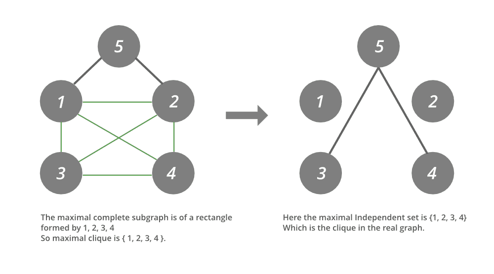

# 寻找平面图中最大团的 Java 程序

> 原文:[https://www . geesforgeks . org/Java-program-to-find-平面图中最大的团/](https://www.geeksforgeeks.org/java-program-to-find-the-largest-clique-in-a-planar-graph/)

[独立的图形集](https://www.geeksforgeeks.org/mathematics-independent-sets-covering-and-matching/)作为一个先决条件是没有两个相邻的顶点集。它在定义上与团正好相反，因此为了走得更远，关于图的[补语](https://www.geeksforgeeks.org/shortest-path-in-a-complement-graph/)的知识是必要的。基本上，[平面图](https://www.geeksforgeeks.org/mathematics-planar-graphs-graph-coloring/)的想法不是最重要的，但可以参考。因此，我们将利用这三个概念来解决上述问题。

我们需要找到给定平面图中最大的团。任何平面图的团是顶点的子集，使得该子集中的任意两个顶点彼此相邻，即顶点集形成完整的图，并且该完整的图是给定平面图的子图。换句话说，最大团是顶点的最大子集，使得它们在给定的图中形成完整的子图，并且没有更多的顶点可以添加到该子集。如果我们熟悉独立集的概念，那么我们可以发现两个概念之间模糊的关系:团和独立集。

因此，如下所述，关系和差异是密切相关的:

*   团是无向图或平面图的一组顶点，使得团中每两个不同的顶点相邻。
*   独立集是指没有两个顶点彼此相邻的一组顶点。
*   两个集合的极大概念是相同的。

一个图的 Clique 和[独立集](https://www.geeksforgeeks.org/mathematics-independent-sets-covering-and-matching/)的定义都直接表明它们之间存在某种互补关系。

假设如果我们对给定的图进行补，那么根据最大独立集的定义，它将是实图中那些不相邻的顶点的最大集合(因为我们在补图中寻找独立集)。因此，给定图的补的最大独立集就是给定图中的最大团。

**概念:**

所以给定图的最大团可以看作是给定图的补图中最大的独立集。因为我们有许多方法可以找到给定平面图的最大独立集(尽管它们是 NP 难问题)，所以我们可以使用它们中的任何一个来找到团。我们只需要在给定的算法中做一个小的改变，因为我们必须输入输入图的补码。

**实现:**如下图所示如下:

*   现在我们将在上面给定的图中找到最大的团。(这是由绿色边组成的子图)
*   下面给出的是上述寻找图的补集的独立集的思想的实现，补集间接是图的团。

> [如果不知道思路，通过](https://www.geeksforgeeks.org/java-program-to-find-the-largest-independent-set-in-a-graph-by-complements/)用不同的方法找到图的独立集



**例**

## Java 语言(一种计算机语言，尤用于创建网站)

```
// Java Program to Find Independent Sets in a Graph
// By Graph Coloring

// Importing input output classes
import java.io.*;
// Importing utility classes from java.util package
import java.util.*;

// Class 1
// Helper class
class GFGUTIL {

    // Method 1
    // To label maximum vertices with 0
    // that can be included in the set
    public static void
    Util(Vector<Vector<Integer> > adjacency_list,
         Vector<Integer> color)
    {
        int a = 0;

        // Condition check
        while (a != -1) {
            a = remove_all(adjacency_list, color);

            if (a != -1)
                color.set(a, 0);
        }
    }

    // Method 2
    // Tries whether it is possible to remove
    // any adjacent vertex of any removed vertex
    public static void
    Util2(Vector<Vector<Integer> > adjacency_list,
          Vector<Integer> color, int j)
    {

        int cnt = 0;

        // Implementation
        // It removes the colored node i.e. uncolor it
        // so that some of the adjacent vertices which can
        // provide more elements to
        //  set are colored who were hindered due to the
        //  previous node.

        Vector<Integer> tmp_color = new Vector<Integer>();

        for (int g = 0; g < color.size(); ++g)
            tmp_color.add(color.get(g));

        for (int i = 0; i < color.size(); ++i) {

            if (tmp_color.get(i) == 1) {

                int sum = 0;
                int idx = -1;

                for (int g = 0;
                     g < adjacency_list.get(i).size(); ++g)

                    if (tmp_color.get(
                            adjacency_list.get(i).get(g))
                        == 0) {

                        idx = g;
                        sum++;
                    }

                if (sum == 1
                    && color.get(
                           adjacency_list.get(i).get(idx))
                           == 0) {

                    tmp_color.set(
                        adjacency_list.get(i).get(idx), 1);
                    tmp_color.set(i, 0);
                    Util(adjacency_list, tmp_color);
                    ++cnt;
                }

                if (cnt > j)
                    break;
            }
        }

        for (int g = 0; g < color.size(); ++g)
            color.set(g, tmp_color.get(g));
    }

    // Method 3
    // Returning the number of vertices
    // that can't be included in the set
    public static int Util3(Vector<Integer> color)
    {

        int cnt = 0;

        // Checking the condition when the vertices cannot
        // be included.
        for (int i = 0; i < color.size(); i++)

            if (color.get(i) == 1)
                ++cnt;

        return cnt;
    }

    // Method 4
    // This method return all the elements which can be
    // removed.
    public static int
    remove_all(Vector<Vector<Integer> > adjacency_list,
               Vector<Integer> color)
    {

        int a = -1, max = -1;

        for (int i = 0; i < color.size(); ++i) {
            if (color.get(i) == 1
                && can_remove(adjacency_list.get(i), color)
                       == 1) {

                Vector<Integer> tmp_color
                    = new Vector<Integer>();

                for (int j = 0; j < color.size(); ++j)
                    tmp_color.add(color.get(j));
                tmp_color.set(i, 0);

                int sum = 0;

                for (int j = 0; j < tmp_color.size(); ++j)

                    if (tmp_color.get(j) == 1
                        && can_remove(adjacency_list.get(j),
                                      tmp_color)
                               == 1)
                        ++sum;

                if (sum > max) {
                    max = sum;
                    a = i;
                }
            }
        }

        // Index of the vertex
        return a;
    }

    // Method 5
    // To check whether a vertex can be removed or not
    public static int can_remove(Vector<Integer> adj_list,
                                 Vector<Integer> color)
    {

        int check = 1;
        // condition checking for removal
        for (int i = 0; i < adj_list.size(); ++i)

            // cannot be removed if this condition happens
            if (color.get(adj_list.get(i)) == 0)
                check = 0;

        return check;
    }
}

// Class 2
// Main class
public class GFG {

    // Main driver method
    public static void main(String[] args) throws Exception
    {
        // Graph input alongside forming it's adjacency List

        // Display message for better readability
        System.out.println(
            "The number of vertices in the graph is taken as 5");

        // Custom input is taken here
        int n = 5;

        // Creating a vector object for adjacency matrix.
        Vector<Vector<Integer> > adjacency_matrix
            = new Vector<Vector<Integer> >(n, (n));

        // Input matrix is
        // 01111
        // 10111
        // 11010
        // 11100
        // 11000

        // Complement graph's matrix of the given input
        // graph 00000 00000 00001 00001 00110

        // Nested for loops for iterations
        // creating the adjacency matrix of the input graph

        // As shown above
        for (int i = 0; i < n; ++i) {
            Vector<Integer> adj = new Vector<Integer>(n);

            for (int j = 0; j < n; ++j)

                if ((i == 2 && j == 4) || (i == 3 && j == 4)
                    || (i == 4 && j == 2)
                    || (i == 4 && j == 3))
                    adj.add(1);
                else

                    adj.add(0);
            adjacency_matrix.add(adj);
        }

        // Creating a vector object for adjacency list
        Vector<Vector<Integer> > adjacency_list
            = new Vector<Vector<Integer> >();

        // Nested for loops for creating the adjacency list
        // of graph given
        for (int i = 0; i < n; ++i) {
            Vector<Integer> adj_list
                = new Vector<Integer>();

            for (int j = 0; j < n; ++j) {
                if (adjacency_matrix.get(i).get(j) == 1)
                    adj_list.add(j);
            }

            adjacency_list.add(adj_list);
        }

        // Display message only for
        // taking the minimum size of the set required.
        System.out.println(
            "The maximal independent set's size to be find is 4");

        // Declaring and initializing variable with
        // least size of the set required
        // can be set to full size too.
        int x = 4;

        // Complement of the size
        int y = n - x;
        int found = 0;
        c // variable to check if answer is found
            int size
            = 0;
        int min = n + 1;

        // Creating a set found vector to
        // store all the possible set
        Vector<Vector<Integer> > set_found
            = new Vector<Vector<Integer> >();

        // Display message
        System.out.println("Searching for the set");

        for (int i = 0; i < n; ++i) {

            // If set is found
            if (found == 1)

                // Hault the further execution of Program
                break;

            // graph coloring method is used.
            // Color vector to have the state of all the
            // vertices initially
            Vector<Integer> color = new Vector<Integer>(n);

            for (int j = 0; j < n; ++j)
                color.add(1);

            // Starting by putting the ith node in set
            color.set(i, 0);

            // Then finding all the nodes to be pushed
            GFGUTIL.Util(adjacency_list, color);

            // Finding the number of those which cannot be
            // pushed in set
            size = GFGUTIL.Util3(color);
            if (size < min)
                min = size;

            // If the number of elements in set
            //  are more or equal
            if (size <= y) {

                // Print and display the size
                System.out.println(
                    "Independent set of size " + (n - size)
                    + "found");

                for (int j = 0; j < n; ++j)

                    if (color.get(j) == 0)

                        System.out.print(j + 1 + " ");
                System.out.println();
                set_found.add(color);

                // Set flag to 1
                found = 1;

                // Hault the further execution of Program
                break;
            }

            // If sufficient nodes are not found then
            // we call util2 function

            for (int j = 0; j < x; ++j)
                GFGUTIL.Util2(adjacency_list, color, j);

            // Getting the possible size from util2
            size = GFGUTIL.Util3(color);

            if (size < min)
                min = size;

            // Printing what's found of which size and
            // contents
            System.out.println("Independent set of size "
                               + (n - size) + "found");

            for (int j = 0; j < n; ++j)

                if (color.get(j) == 0)

                    System.out.print(j + 1 + " ");
            System.out.println();
            set_found.add(color);

            // If found then set the flag to 1 and hault
            if (size <= y) {
                found = 1;

                break;
            }
        }

        int r = set_found.size();

        // Now searching pairwise and
        // repeating same procedure as above discussed
        // But using the idea discussed above in the
        // article.
        for (int a = 0; a < r; ++a) {

            if (found == 1)
                break;

            for (int b = a + 1; b < r; ++b) {

                if (found == 1)
                    break;

                Vector<Integer> color
                    = new Vector<Integer>(n);

                for (int j = 0; j < n; ++j)
                    color.add(1);

                for (int c = 0; c < n; ++c)
                    if (set_found.get(a).get(c) == 0
                        && set_found.get(b).get(c) == 0)
                        color.set(c, 0);

                GFGUTIL.Util(adjacency_list, color);
                size = GFGUTIL.Util3(color);

                if (size < min)
                    min = size;
                if (size <= y) {

                    System.out.println(
                        "Independent set of size"
                        + (n - size));

                    for (int j = 0; j < n; ++j)

                        if (color.get(j) == 0)

                            System.out.print(j + 1 + " ");

                    System.out.println();
                    found = 1;
                    break;
                }

                for (int j = 0; j < y; ++j)
                    GFGUTIL.Util2(adjacency_list, color, j);
                size = GFGUTIL.Util3(color);
                if (size < min)
                    min = size;

                System.out.println(
                    "Independent set of size " + (n - size)
                    + "found");

                for (int j = 0; j < n; ++j)

                    if (color.get(j) == 0)
                        System.out.print(j + 1 + " ");

                System.out.println();

                if (size <= y) {
                    found = 1;
                    break;
                }
            }
        }

        // If it is found
        if (found == 1)

            // Display command
            System.out.println(
                "Found set of " + (n - size)
                + " size whose elements are displayed above as a clique for the input graph");

        // Not found
        else

            // Display command
            System.out.println(
                "Found set of " + (n - size)
                + " size whose elements are displayed above as a clique for the input graph");
    }
}
```

**Output**

```
The number of vertices in the graph is taken as 5
The maximal independent set's size to be find is 4
Searching for the set
Independent set of size 4found
1 2 3 4 
Found set of 4 size whose elements are displayed above as a clique for the input graph
```

输出解释:

正如我们可以看到的，输出告诉我们所取的顶点数是 5，在找到大小为 4 的独立集之后，它返回顶点集，这些顶点集一起形成了补图中的独立集，并且由于我们已经讨论过独立补集在原始图中是团，因此这些集是原始图中的团。

> **注意:**如果我们要提到图的全尺寸(即上面 eg 中的 5)，那么输出如下所示:

```
The number of vertices in the graph is taken as 5
The maximal independent set's size to be find is 5
Searching for the set
Independent set of size 4found
1 2 3 4 
Independent set of size 4found
1 2 3 4 
Independent set of size 4found
1 2 3 4 
Independent set of size 4found
1 2 3 4 
Independent set of size 4found
1 2 3 4 
Independent set of size 4found
1 2 3 4 
Independent set of size 4found
1 2 3 4 
Independent set of size 4found
1 2 3 4 
Independent set of size 4found
1 2 3 4 
Independent set of size 4found
1 2 3 4 
Independent set of size 4found
1 2 3 4 
Independent set of size 4found
1 2 3 4 
Independent set of size 4found
1 2 3 4 
Independent set of size 4found
1 2 3 4 
Independent set of size 4found
1 2 3 4 
Found set of 4 size whose elements are displayed above as a clique for the input graph
```

输出解释:

为了找到最大团集，只需提到图的原始大小(即这里的 5)。如果找到任何这样大小的独立集合，那么它被返回到输出，否则返回最接近的最大值。因此，用这种思想我们总能找到图的最大团集。因此，我们可以看到，上述想法奏效了，我们能够找到给定图的最大团。