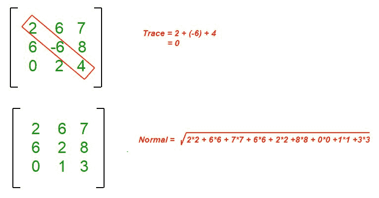

# 寻找矩阵法线和轨迹的 Java 程序

> 原文:[https://www . geesforgeks . org/Java-program-to-find-the-normal-and-trace-of-a-matrix/](https://www.geeksforgeeks.org/java-program-to-find-the-normal-and-trace-of-a-matrix/)

对于给定的 2D 矩阵，目的是找到矩阵的迹和法向。

**矩阵的法线**定义为矩阵所有元素平方和的平方根。

**给定方阵的迹**定义为对角线上所有元素的和。

**示例:**

```
Input : matrix[][] = {{1, 4, 4},
                     {2, 3, 7},
                     {0, 5, 1}};
Output : Normal = 11  
         Trace = 5
Explanation : 
Normal = sqrt(1*1+ 4*4 + 4*4 + 2*2 +
             3*3 + 7*7 + 0*0 + 5*5 + 1*1)    
       = 11
Trace  = 1+3+1 = 5

Input :matrix[][] = {{8, 9, 11},
                    {0, 1, 15},
                    {4, 10, -7}};
Output : Normal = 25  
         Trace  = 2
Explanation : 
Normal = sqrt(8*8 +9*9 + 11*11 + 0*0 + 1*1 +  
            15*15 + 4*4 + 10*10 + -7*-7) = 25   
Trace  = (8+1-7) = 2
```



**示例:**

## Java 语言(一种计算机语言，尤用于创建网站)

```
// Java program to find the trace
// and normal of the given matrix

import java.io.*;

class geeksforgeeks {

    // Dimension of the given matrix
    static int max = 50;

    // Finds Normal of the given
    // matrix of size N x N
    static int Normal(int matrix[][], int N)
    {
        // Initializing sum
        int s = 0;
        for (int j = 0; j < N; j++)
            for (int k = 0; k < N; k++)
                s += matrix[j][k] * matrix[j][k];
        return (int)Math.sqrt(s);
    }

    // Finds trace of the given
    // matrix of size N x N
    static int Trace(int matrix[][], int N)
    {
        int s = 0;
        for (int j = 0; j < N; j++)
            s += matrix[j][j];
        return s;
    }

    // The Driver code
    public static void main(String[] args)
    {

        int matrix[][] = {
            { 2, 3, 5, 6, 7 },      { 8, 9, 10, 11, 12 },
            { 13, 14, 15, 16, 17 }, { 18, 1, 3, 0, 6 },
            { 7, 8, 11, 8, 11 },
        };

        System.out.println("Trace of the Matrix is: "
                           + Trace(matrix, 5));
        System.out.println("Normal of the Matrix is: "
                           + Normal(matrix, 5));
    }
}
```

**Output**

```
Trace of the Matrix is: 37
Normal of the Matrix is: 50

```