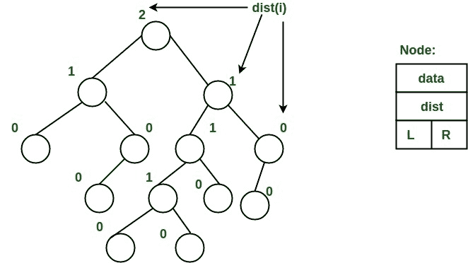
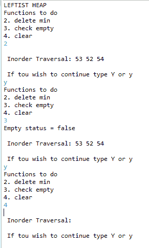

# 实现左倾堆的 Java 程序

> 原文:[https://www . geesforgeks . org/Java-程序到实现-左派-堆/](https://www.geeksforgeeks.org/java-program-to-implement-leftist-heap/)

一个[左堆](https://www.geeksforgeeks.org/leftist-tree-leftist-heap/)是一个用二进制堆实现的优先级队列。每个节点都有一个距离其他节点最近的值。现在，我们将编写一个 java 程序，用于对左倾堆(Inorder Traversation)执行某些操作，如插入、删除、清除和检查是否为空。

**左树是二叉树，属性:**

1.  **正常最小堆属性:**键(i) > =键(父(I))
2.  **左侧较重:** dist(右(i)) < = dist(左(I))。这里，dist(i)是在扩展二叉树表示中从节点 I 到叶节点的最短路径上的边数(在该表示中，空子被认为是外部或叶节点)。到后代外部节点的最短路径是通过正确的子节点。每个子树也是左树，dist( i ) = 1 + dist(右(I))。

**示例:**下面的左树显示了通过上述过程为每个节点计算的距离。最右边的节点的等级为 0，因为该节点的右子树为空，其父节点的距离为 1 乘 dist( i ) = 1 + dist( right( i))。每个节点都遵循相同的方法，并计算它们的 s 值(或等级)。



从上面的第二个性质，我们可以得出两个结论:

1.  从根到最右边叶子的路径是从根到叶子的最短路径。
2.  如果最右边的叶子的路径有 x 个节点，那么左边的堆至少有 2<sup>x</sup>–1 个节点。这意味着对于具有 n 个节点的左边堆，到最右边叶的路径长度是 O(log n)。

**示例:**

```
LEFTIST HEAP
Functions to do
2\. delete min
3\. check empty
4\. clear
2
Inorder Traversal: 53 52 54  
If you wish to continue type Y or y
y
Functions to do
2\. delete min
3\. check empty
4\. clear
3
Empty status = false
Inorder Traversal: 53 52 54  
If you wish to continue type Y or y
y
Functions to do
2\. delete min
3\. check empty
4\. clear
4
Inorder Traversal:  
If you wish to continue type Y or y
```

**进场:**

*   我们将首先获取一个节点类，并创建它的构造函数和各种参数。
*   然后我们将创建一个类 LeftHeap，在这个类中，我们将创建各种方法并尝试执行它们的操作。
*   我们将创建一个构造函数，其中我们保持根为空。
*   我们将创建一个方法 isEmpty()来检查堆是否为空。
*   我们将创建一个方法 clear()，来清除堆。
*   我们创建了一个合并方法:
    *   这里我们需要取两个节点，然后检查它们是否都是空的
    *   然后，我们会根据自己的方便将值设置为右或左。
    *   该函数用于查找堆中的最小元素
*   然后我们声明一个名为 del()的函数。
    *   这个函数是用来求最小数的，然后我们去掉它。
*   然后我们声明主函数，并调用该函数，并在开关情况的帮助下执行操作。执行的操作是检查它是否为空，还是清空堆或删除最小元素。

**实施:**

## Java 语言(一种计算机语言，尤用于创建网站)

```
// Java Program to Implement Leftist Heap

// Declare all libraries
import java.io.*;
import java.util.Scanner;

// Class Node
class Node {

    // elements, and sValue are the variables in class Node
    int element, sValue;

    // class has two parameters
    Node left, right;

    public Node(int element) { this(element, null, null); }

    // Function Node where we are using this keyword
    // Which will help us to avoid confusion if we are having
    // same elements

    public Node(int element, Node left, Node right)
    {
        this.element = element;
        this.left = left;
        this.right = right;
        this.sValue = 0;
    }
}

// Class Left heap
class LeftHeap {

    // Now parameter is created named head.
    private Node head;

    // Its constructor is created named left heap
    // Returns null
    public LeftHeap() { head = null; }

    // Now we will write function to check if the list is
    // empty
    public boolean isEmpty()
    {
        // If head is null returns true
        return head == null;
    }

    // Now we will write a function clear
    public void clear()
    {
        // We will put head is null
        head = null;
    }

    // Now Now let us create a function merge which will
    // help us merge
    public void merge(LeftHeap rhs)
    {
        // If the present function is rhs
        // then we return it
        if (this == rhs)
            return;

        // Here we call the function merge
        // And make rhs is equal to null
        head = merge(head, rhs.head);
        rhs.head = null;
    }

    // Function merge with two Nodes a and b
    public Node merge(Node a, Node b)
    {
        // If A is null
        // We return b
        if (a == null)
            return b;

        // If b is null
        // we return A
        if (b == null)
            return a;

        // If we put a element greater than b element
        if (a.element > b.element) {

            // We write the swap code
            Node temp = a;
            a = b;
            b = temp;
        }

        // Now we call the function merge to merge a and b
        a.right = merge(a.right, b);

        // If a is null we swap rright with left and empty
        // right
        if (a.left == null) {
            a.left = a.right;
            a.right = null;
        }

        // else
        // if value in a is less than the svalue of right
        // If the condition is satisfied , we swap the left
        // with right
        else {

            if (a.left.sValue < a.right.sValue) {
                Node temp = a.left;
                a.left = a.right;
                a.right = temp;
            }

            // we store the value in a s Value of right
            // SValue
            a.sValue = a.right.sValue + 1;
        }

        // We now return the value of a
        return a;
    }

    // Function insert
    public void insert(int a)
    {
        // This root will help us insert a new variable
        head = merge(new Node(a), head);
    }

    // The below function will help us delete minimum
    // function present in the Heap
    public int del()
    {
        // If is empty return -1
        if (isEmpty())
            return -1;

        // Now we will store the element in variable and
        // Call the merge function to del that is converging
        // to head then  we return min
        int min = head.element;

        head = merge(head.left, head.right);
        return min;
    }

    // Function order
    // will print the starting and ending points in order.
    public void order()
    {
        order(head);
        System.out.println();
    }

    // Function order with Node r
    // If r not equal to r
    // It prints all the elements iterating from order left
    // to right
    private void order(Node r)
    {
        if (r != null) {
            order(r.left);
            System.out.print(r.element + " ");
            order(r.right);
        }
    }
}

// Class gfg

class GFG {
    public static void main(String[] args)
    {

        // Creating the scanner object
        Scanner sc = new Scanner(System.in);
        System.out.println("LEFTIST HEAP");

        // Creating object for class LeftHeap
        LeftHeap h = new LeftHeap();

        // Char ch
        char ch;

        // Now taking the loop
        do {
            // Now writing down all the functions
            System.out.println("Functions to do");
            System.out.println("1\. insert");
            System.out.println("2\. delete min");
            System.out.println("3\. check empty");
            System.out.println("4\. clear");

            // Scanning the choice to be used in switch
            int choice = sc.nextInt();

            // Using switch
            switch (choice) {

                // Case 1
                // to insert the elements in the heap
                // call the insert func
            case 1:
                System.out.println("Enter integer element to insert");
                h.insert(sc.nextInt());
                break;

                // Delete the minimum element in the func

            case 2:
                h.del();

                break;
                // To check the empty status of the heap
            case 3:
                System.out.println("Empty status = "
                                   + h.isEmpty());
                break;

                // Cleaning the heap
            case 4:
                h.clear();
                break;

            default:
                System.out.println("Wrong entry");
                break;
            }

            // Prints the inorder traversal
            // Calling the func
            System.out.print("\n Inorder Traversal: ");
            h.order();

            // Whether to continue or not
            System.out.println("\n If you wish to continue type Y or y");

            ch = sc.next().charAt(0);
        }

        // Closing of loop
        while (ch == 'Y' || ch == 'y');
    }
}
```

**输出:**

