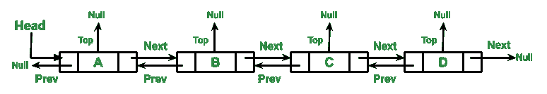
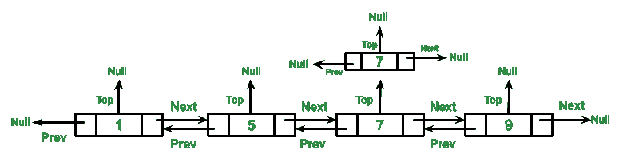
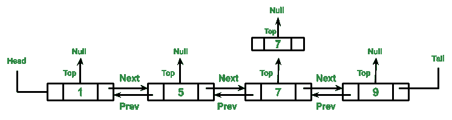

# 实现三重链表的 Java 程序

> 原文:[https://www . geesforgeks . org/Java-程序到实现-三重链表/](https://www.geeksforgeeks.org/java-program-to-implement-triply-linked-list/)

与数组不同，[链表](https://www.geeksforgeeks.org/linked-list-set-1-introduction/)元素不存储在连续的位置；使用指针链接元素。在这篇文章中，讨论了在链表中插入新节点的方法。一个节点可以通过三种方式[插入](https://www.geeksforgeeks.org/linked-list-set-2-inserting-a-node/)，要么在链表的前面，要么在给定的节点之后，要么在链表的末尾。正如我们已经讨论过的[双链表(DLL)](https://www.geeksforgeeks.org/doubly-linked-list/) 确实包含一个额外的指针，通常称为*前一个指针*，以及存在于单链表中的下一个指针和数据。

类似地，一个带墨水的 **L** ist (TLL)包含一个额外的指针，通常称为**顶部**指针，以及双链表中的下一个指针、前一个指针和数据。这里称为**顶部**的额外指针可以用于各种目的。例如，在同一级别存储相等的值。为了更好的理解，请参考下图。在本文中，我们将按排序顺序在链表中插入节点。我们将在同一层存储相同的元素，这意味着它们将被**顶部的**指针访问。

 

**图示:**DLL 节点的表示

```
// Class for Triply Linked List
public class TLL {  

      // Triply Linked list Node
    class Node {
        int data;
        Node prev;
        Node next;
          Node top;
    }

      // Head and Tail pointer
      Node head = null, tail = null;

      // To keep track of the number 
      // of nodes
      int node_count = 0;
}
```

**程序:**

**1。插入新节点**

因为我们是按排序顺序存储节点的，所以我们必须找到给定节点在链表中的正确位置。

1.  如果列表中没有节点(列表为空)，那么只需将头部和尾部指向该节点。
2.  如果给定的节点小于头节点，则只需在开头插入该节点。
3.  如果给定节点不小于头节点，则遍历列表并找到大于给定节点的第一个节点。
    *   如果这样的节点不存在，这意味着给定的节点大于所有的节点。所以把它插入列表的末尾。
    *   如果这样的节点确实存在，那么在找到的节点之前插入给定的节点。
    *   如果给定节点等于某个已经存在的节点，则将给定节点插入列表的**顶部**。

**2(A):从头开始遍历列表**我们从头开始，一直到下一个节点。如果当前节点的顶部不为空，则首先打印顶部节点，然后继续遍历列表的其余部分。

**2(B):从尾部遍历列表或者反向遍历**我们从尾部开始，一直到上一个节点。如果当前节点的顶部不为空，则首先打印顶部节点，然后继续遍历列表的其余部分。

**示例:**

## Java 语言(一种计算机语言，尤用于创建网站)

```
// Java Program to Implement Triply Linked List

// Importing all utility classes
import java.util.*;

// Main Class
public class GFG {

    // First let us create a Node class
    class Node {

        // Data refers to the value in node
        int data;

        // Being triply linked list,
        // three pointers needs to be defined
        Node prev;
        Node next;
        Node top;

        // Parameterized constructor of Node class
        // to initialize the node whenever created
        Node(int data)
        {

            // this keyword refers to current object itself
            this.data = data;

            // Initializing all 3 pointers to null
            prev = null;
            next = null;
            top = null;
        }
    }

    // Defining two new pointers for iterate over to perform
    // operations over the triply linked list Head and Tail
    // pointer
    Node head = null, tail = null;

    // Declaring and initializing variable to
    // keep track of the number of nodes
    int node_count = 0;

    // Method 1
    // To insert a new node
    public void insert(int new_data)
    {

        // Create new node with the given data
        Node new_node = new Node(new_data);

        // curr_node to traverse the List
        Node curr_node = null;

        // If List is empty then
        // make head and tail
        // equal to this node
        if (node_count == 0) {

            // Case 1: Of LinkedList is empty
            // If there is no such node existing
            tail = new_node;
            head = new_node;
            curr_node = head;

            // So next will be assigned a null
            curr_node.next = null;
            curr_node.prev = null;
            curr_node.top = null;

            // Increment the node count
            node_count++;
        }

        // Case 2: If LinkedList is not empty

        // Case 2(A): If given node is less then the head
        else {

            // Make curr_node point to head
            curr_node = head;

            // If given node is less then the head
            // insert at the beginning
            if (new_node.data < curr_node.data) {

                // Linking two nodes through addresses
                new_node.next = curr_node;
                curr_node.prev = new_node;
                new_node.prev = null;
                head = new_node;
                curr_node = head;

                // Adjusting the tail
                do {

                    curr_node = curr_node.next;
                } while (curr_node.next != null);
                tail = curr_node;
            }

            // CAse 2(B): If given node is not less then the
            // head
            else {

                // last_node to keep track of
                // the last visited node
                Node last_node = curr_node;

                // Goal is to traverse the List and
                // find first node greater than new_node
                while (curr_node != null
                       && new_node.data > curr_node.data) {
                    last_node = curr_node;
                    curr_node = curr_node.next;

                    // If curr_node is null that
                    // means we have reached the
                    // end of the list so insert the
                    // node at the end and update the tail
                    if (curr_node == null) {

                        last_node.next = new_node;
                        new_node.prev = last_node;
                        new_node.next = null;
                        tail = new_node;

                        // Haulting the execution of the
                        // program using break keyword
                        break;
                    }

                    else if (new_node.data
                             <= curr_node.data) {

                        // If curr_node is greater than
                        // the new_node then insert the
                        // new_node before curr_nod and
                        // update the tail
                        if (new_node.data
                            < curr_node.data) {

                            last_node.next = new_node;
                            new_node.prev = last_node;
                            new_node.next = curr_node;
                            curr_node.prev = new_node;
                            if (curr_node.next != null) {

                                do {

                                    curr_node
                                        = curr_node.next;
                                }

                                while (curr_node.next
                                       != null);
                            }

                            tail = curr_node;

                            break;
                        }

                        // If curr_node is equal to the
                        // new_node then insert the
                        // new_node to the top of the
                        // curr_nod and update the tail
                        else if (curr_node.data
                                 == new_node.data) {
                            last_node = curr_node;
                            while (last_node.top != null) {

                                last_node = last_node.top;
                            }

                            last_node.top = new_node;
                            new_node.top = null;

                            break;
                        }
                    }
                }
            }
        }
    }

    // Method 2
    // Traversing list from head
    public void traverse_head()
    {

        Node node = head;
        Node curr = null;

        while (node != null) {
            System.out.print(node.data + "\t");
            curr = node;

            // If curr has top node
            // then traverse them first
            while (curr.top != null) {
                curr = curr.top;

                // Print top node first followed by rest of
                // list
                System.out.print("top->" + curr.data
                                 + "\t");
            }

            // Update the node to next node
            node = node.next;
        }

        // New line
        System.out.println();
    }

    // Method 3
    // Traversing list from tail
    public void traverse_tail()
    {

        Node node = tail;
        Node curr = null;

        while (node != null) {

            System.out.print(node.data + "\t");
            curr = node;

            // If curr has top node
            // then traverse them first
            while (curr.top != null) {

                curr = curr.top;

                // Print top node first followed by rest of
                // list
                System.out.print("top->" + curr.data
                                 + "\t");
            }

            // Update the node to prev node
            node = node.prev;
        }

        // New line
        System.out.println();
    }

    // Method 4
    // Main driver method
    public static void main(String args[])
    {
        // Creating an object of main class in the main()
        // method
        //  by starting with the empty list
        GFG tll = new GFG();

        // Inserting custom input integer numbers
        // using insert() method
        // Number Set = {7,9,1,5,7}

        // Insert the first number i.e 7,
        // so linked list become
        // 7 -> NULL
        tll.insert(7);

        // Insert the second number i.e 9,
        // so linked list becomes
        // 7 -> 9 -> NULL
        tll.insert(9);

        // Insert the third number i.e 1,
        // so linked list becomes
        // 1 -> 7 -> 9 -> NULL
        tll.insert(1);

        // Insert the fourth number i.e 5,
        // so linked list becomes
        // 1 -> 5 -> 7 -> 9 -> NULL
        tll.insert(5);

        // Insert the fifth number i.e 7,
        // so linked list becomes
        // 1 -> 5 -> 7 (top->7) -> 9 -> NULL
        tll.insert(7);

        // Display message only
        System.out.println(
            "\nTraversing Linked List head: ");

        // Calling the traverse_head() method () / Method 2
        tll.traverse_head();

        // Display message only
        System.out.println(
            "\nTraversing Linked List tail: ");

        // Calling the traverse_tail() method / Method 3
        tll.traverse_tail();
    }
}
```

**Output**

```
Traversing Linked List head: 
1    5    7    top->7    9    

Traversing Linked List tail: 
9    7    top->7    5    1    
```

> 运行上述程序后，工作流链表的表示如下:

