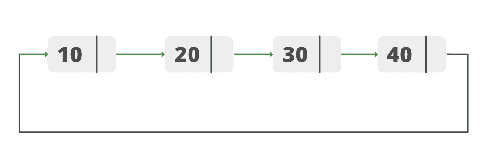
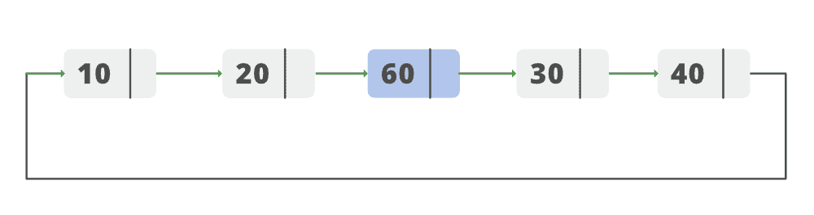

# 在循环链表中间插入新节点的 Java 程序

> 原文:[https://www . geesforgeks . org/Java-program-to-insert-一个位于循环链表中间的新节点/](https://www.geeksforgeeks.org/java-program-to-insert-a-new-node-at-the-middle-of-the-circular-linked-list/)

给定一个循环链表，任务是在链表的中间添加一个新节点。让我们考虑以下循环链表:



插入前列表



插入后列表

1.  创建新节点(新节点)。
2.  检查是否有空列表。如果列表为空，则插入节点作为标题。
3.  对于非空列表，计算列表的长度。
4.  创建可变的中间并在其中存储中间长度。
5.  创建两个节点“临时”和“当前”。
6.  现在使用中间变量遍历列表，直到临时到达列表的中点。
7.  在当前节点后插入新节点。
8.  将“当前”设为“下一个”。指向“新节点”和“新节点”。指向“临时”。
9.  节点已插入。

下面是上述方法的实现:

## Java 语言(一种计算机语言，尤用于创建网站)

```
// Java Program to Insert a New Node at
// the Middle of the Circular Linked List
import java.io.*;

public class GFG {
    // Stores Information about Node of List
    public class Node {
        int data;
        Node next;
        public Node(int data) { this.data = data; }
    }

    // Declaring Head of the Node
    public Node head_of_node = null;

    // A last pointer to help append values to our list
    public Node last = null;

    // keep count of  size of the list
    public int length_of_list;

    // Add method adds values to the end of the list
    public void add(int data)
    {
        Node newNode = new Node(data);
        if (head_of_node == null) {
            head_of_node = newNode;
            last = newNode;
            newNode.next = head_of_node;
        }
        else {
            last.next = newNode;
            last = newNode;
            last.next = head_of_node;
        }
        // keep count of size of list
        length_of_list++;
    }

    // Method to insert Node in the middle of the list
    public void Insert_In_Middle(int data)
    {

        // creating a new node that is to be inserted
        Node New_node = new Node(data);

        // check for empty list
        if (head_of_node == null) {
            head_of_node = New_node;
            last = New_node;
            New_node.next = head_of_node;
        }

        // If the list is not empty
        else {
            // Declaring nodes
            Node temporary;
            Node current;

            // Checking if the length of list
            // if even or odd

            int mid_point_check = (length_of_list % 2);

            // mid point for even length
            if (mid_point_check == 0) {
                length_of_list = length_of_list / 2;
            }
            // mid point for odd length
            else {
                length_of_list = (length_of_list + 1) / 2;
            }

            // temporary points to the head of list
            temporary = head_of_node;
            current = null;
            // loop till we reach the mid point
            while (length_of_list > 0) {

                // make current point to the previous node
                current = temporary;
                temporary = temporary.next;
                length_of_list -= 1;
            }

            // make the previous node point to the new node
            current.next = New_node;

            //  make the new_node.next point to temporary
            New_node.next = temporary;
        }
        // increasing the length of list after insertion of
        // new node
        length_of_list++;
    }

    // Print_list method iterates through the list and
    // prints the values stored in the list
    public void Print_List()
    {
        Node current = head_of_node;
        if (head_of_node == null) {
            System.out.println("Your list is empty");
        }
        else {
            do {
                System.out.print(" " + current.data);
                current = current.next;
            } while (current != head_of_node);
            System.out.println();
        }
    }

    // Driver code
    public static void main(String[] args)
    {

        GFG circular_list = new GFG();
        circular_list.add(10);
        circular_list.add(20);
        circular_list.add(30);
        circular_list.add(40);

        System.out.print("Original List        --> ");
        circular_list.Print_List();
        circular_list.Insert_In_Middle(60);
        System.out.print("List after Inserting --> ");
        circular_list.Print_List();
    }
}
```

**Output**

```
Original List        -->  10 20 30 40
List after Inserting -->  10 20 60 30 40

```