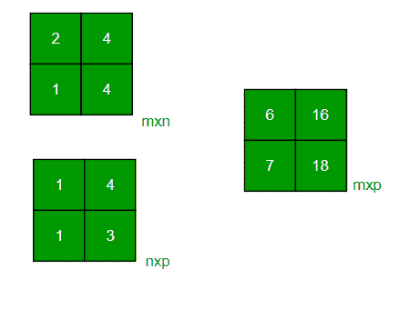

# 任意大小两个矩阵相乘的 Java 程序

> 原文:[https://www . geesforgeks . org/Java-任意大小的二乘二矩阵程序/](https://www.geeksforgeeks.org/java-program-to-multiply-two-matrices-of-any-size/)

给定两个任意大小的矩阵 **A** 和 **B** ，在 Java 中把它们相乘的任务。
**例:**

```
Input: A[][] = {{1, 2}, 
                {3, 4}}
       B[][] = {{1, 1}, 
                {1, 1}}
Output: {{3, 3}, 
         {7, 7}}

Input: A[][] = {{2, 4}, 
                {3, 4}}
       B[][] = {{1, 2}, 
                {1, 3}}       
Output: {{6, 16}, 
         {7, 18}}
```

**进场:**

*   取两个矩阵相乘
*   检查两个矩阵是否兼容相乘



*   创建一个新的矩阵来存储两个矩阵的乘积
*   遍历两个矩阵的每一个元素并相乘。将该产品存储在相应索引处的新矩阵中。
*   打印最终产品矩阵

以下是上述方法的实现:

## Java 语言(一种计算机语言，尤用于创建网站)

```
// Java program to multiply two square matrices.

import java.io.*;

class GFG {

    // Function to print Matrix
    static void printMatrix(int M[][],
                            int rowSize,
                            int colSize)
    {
        for (int i = 0; i < rowSize; i++) {
            for (int j = 0; j < colSize; j++)
                System.out.print(M[i][j] + " ");

            System.out.println();
        }
    }

    // Function to multiply
    // two matrices A[][] and B[][]
    static void multiplyMatrix(
        int row1, int col1, int A[][],
        int row2, int col2, int B[][])
    {
        int i, j, k;

        // Print the matrices A and B
        System.out.println("\nMatrix A:");
        printMatrix(A, row1, col1);
        System.out.println("\nMatrix B:");
        printMatrix(B, row2, col2);

        // Check if multiplication is Possible
        if (row2 != col1) {

            System.out.println(
                "\nMultiplication Not Possible");
            return;
        }

        // Matrix to store the result
        // The product matrix will
        // be of size row1 x col2
        int C[][] = new int[row1][col2];

        // Multiply the two matrices
        for (i = 0; i < row1; i++) {
            for (j = 0; j < col2; j++) {
                for (k = 0; k < row2; k++)
                    C[i][j] += A[i][k] * B[k][j];
            }
        }

        // Print the result
        System.out.println("\nResultant Matrix:");
        printMatrix(C, row1, col2);
    }

    // Driver code
    public static void main(String[] args)
    {

        int row1 = 4, col1 = 3, row2 = 3, col2 = 4;

        int A[][] = { { 1, 1, 1 },
                      { 2, 2, 2 },
                      { 3, 3, 3 },
                      { 4, 4, 4 } };

        int B[][] = { { 1, 1, 1, 1 },
                      { 2, 2, 2, 2 },
                      { 3, 3, 3, 3 } };

        multiplyMatrix(row1, col1, A,
                       row2, col2, B);
    }
}
```

**Output:** 

```
Matrix A:
1 1 1 
2 2 2 
3 3 3 
4 4 4 

Matrix B:
1 1 1 1 
2 2 2 2 
3 3 3 3 

Resultant Matrix:
6 6 6 6 
12 12 12 12 
18 18 18 18 
24 24 24 24
```