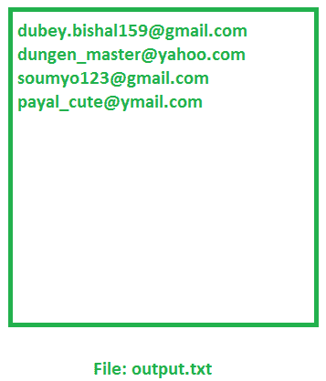

# 读取给定文件中所有电子邮件的 Java 程序

> 原文:[https://www . geesforgeks . org/Java-程序读取所有电子邮件-存在于给定文件中/](https://www.geeksforgeeks.org/java-program-to-read-all-emails-present-in-a-given-file/)

给定一个文件作为 **input.txt** ，其中包含一些**电子邮件 id**，它们与其他数据混合在一起。任务是逐行读取该输入文件，如果在该行中找到任何电子邮件 id，则将该电子邮件 id 写入另一个文件，即 **output.txt** 。

**示例:**

> **输入:**输入. txt
> [](https://media.geeksforgeeks.org/wp-content/uploads/20200228121957/input8.png) 
> **输出:**输出. txt
> [](https://media.geeksforgeeks.org/wp-content/uploads/20200228121955/output140.png)

**方法**:检测那个文件中的邮件 id，一个简单的解决方法就是 **[正则表达式](https://www.geeksforgeeks.org/regular-expressions-in-java/)** 。首先，我们必须为电子邮件 id 形成一个[正则表达式。每当 input.txt 文件中的任何字符串与我们为电子邮件 id 形成的正则表达式匹配时，匹配的字符串将被写入 output.txt 文件。](https://www.geeksforgeeks.org/check-email-address-valid-not-java/)

**如果字符串符合以下条件，则称该字符串为电子邮件 id:**

*   第一个字符可以是小写或大写字母，也可以包含 0 到 9 之间的任何数字。对于这个标准，正则表达式[a-zA-Z0-9]
*   第一个字符之后的剩余字符，在到达@，字符可以是小写或大写字母，也可以包含从 0 到 9 的任何数字或特殊符号“_”和“.”。对于这个标准，正则表达式[a-Za-Z0-9 _]。]*
*   在上述两个条件之后，字符串包含符号“@”。之后的字符串应该包含任何小写或大写字母，或者它可以包含从 0 到 9 的任何数字。对于这个标准，正则表达式@[a-zA-Z0-9]
*   在包含“@”符号后，字符串应该包含“.”符号，其后的字符串应包含任何小写或大写字母。对于此标准，正则表达式[。][a-zA-Z]

以下是上述方法的实现:

## Java 语言(一种计算机语言，尤用于创建网站)

```
// Java program to extract the
// email ids from a given text file

import java.util.regex.*;
import java.io.*;

class EmailIdExtraction {
    public static void extractEmailIds(
        BufferedReader br,
        PrintWriter pw,
        Pattern p)
    {

        String line = br.readLine();

        while (line != null) {

            Matcher m = p.matcher(line);

            // If any match
            while (m.find()) {

                // write the email id
                // to output.txt file
                pw.println(m.group());
            }

            // Goto next line in input.txt file
            line = br.readLine();
        }

        pw.flush();
    }

    // Driver code
    public static void main(String[] args)
        throws IOException
    {

        // PrintWriter for writing email id
        // to output.txt file
        PrintWriter pw
            = new PrintWriter("output.txt");

        // Compile() argument is the
        // regular expression for email id
        Pattern p
            = Pattern.compile(
                "[a-zA-Z0-9]"
                + "[a-zA-Z0-9_.]"
                + "*@[a-zA-Z0-9]"
                + "+([.][a-zA-Z]+)+");

        // BufferedReader for reading
        // from input.txt file
        BufferedReader br
            = new BufferedReader(
                new FileReader("input.txt"));

        // Calling extractEmailIds
        extractEmailIds(br, pw, p);
    }
}
```

**Input:**

> 你好，我的名字是比沙尔·杜比，我的邮箱是 dubey.bishal159@gmail.com。欢迎来到极客的计算机科学门户网站。它包含写得好，想得好，解释得好的计算机科学和编程文章，测验。我的兄弟比卡什·杜比有 bikashdubey42@gmail.com 的电子邮件 id，我的朋友塔努·贾恩有 tanu_jain@gmail.com 的电子邮件 id。如果你喜欢极客博客并想投稿，你也可以把你的文章邮寄到 contribute@geeksforgeeks.org。

**输出:**

> dubey.bishal159@gmail.com
> bikashdubey42@gmail.com
> tanu_jain@gmail.com
> contribute@geeksforgeeks.org