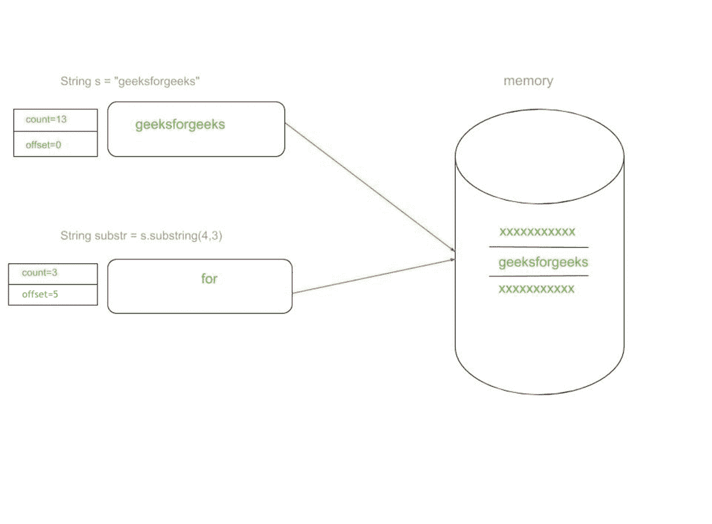
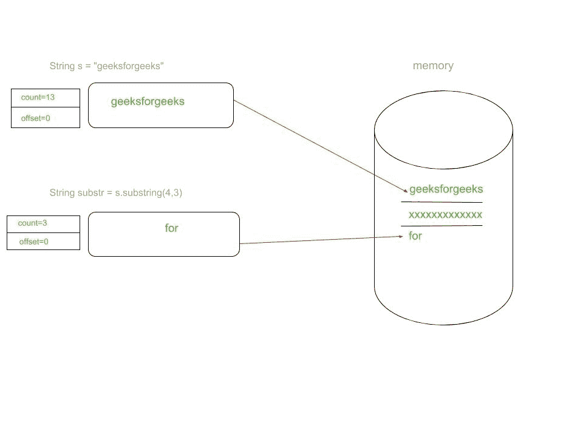

# Java substring()方法内存泄漏问题并修复

> 原文:[https://www . geesforgeks . org/Java-substring-method-memory-leak-issue-and-fix/](https://www.geeksforgeeks.org/java-substring-method-memory-leak-issue-and-fix/)

**String** 是 Java 中的一个特殊类。 **substring()** 是 **String** 类广泛使用的方法之一。它用于提取字符串的一部分，有两个重载变量:
**1。substring(int beginIndex)**
此方法用于从 **beginIndex** 开始提取字符串的一部分。
**例:**

## Java 语言(一种计算机语言，尤用于创建网站)

```
class GFG {
    public static void main(String args[]) {
        String s = "geeksforgeeks";
        String subString = s.substring(4);
        System.out.print(subString);
    }
}
```

**beginIndex** 参数必须在源字符串的范围内，否则会出现以下异常:

> Java . lang . stringindexoutofboundsexception:字符串索引超出范围:

**2。substring(int beginIndex，int endIndex)**
这个变体接受两个参数 **beginIndex** 和 **endIndex** 。它从**开始索引**直到**endIndex–1**断开字符串。
**例:**

## Java 语言(一种计算机语言，尤用于创建网站)

```
class GFG {
    public static void main(String args[]) {
        String s = "geeksforgeeks";
        String subString = s.substring(5, 13);
        System.out.print(subString);
    }
}
```

【substring()内部是如何工作的
我们都知道 Java 中的 **String** 是字符序列。字符串在内部由字符数组表示，当创建新的字符串对象时，它有以下字段。

*   **字符值[]**–字符数组
*   **整数**–字符串中的字符总数
*   **int 偏移量**–字符数组中的起始索引偏移量

> String s = " geeksforgeeks
> 值[] = {'g '，' e '，' e '，' k '，' s '，' f '，' o '，' r '，' g '，' e '，' e '，' k '，' s'}
> 计数= 13
> 偏移量= 0

当我们从原始字符串中提取**子字符串**时，将在常量池或堆中创建新的字符串对象。值[]字符数组将在两个字符串对象之间共享，但是字符串对象的计数和偏移量属性将根据子字符串长度和起始索引而变化。

> String s = " geeksforgeeks
> String substr = s.substring(5，8)
> For substr:
> value[]= { ' g '，' e '，' e '，' k '，' s '，' f '，' o '，' r '，' g '，' e '，' e '，' k '，' s'}
> count = 3
> offset = 5



**子串()引起的问题在 JDK 6**
这个方法对于小字符串效果很好。但是，当从包含更多字符的字符串中获取 substring()时，如果使用 JDK 6 或更低版本，就会导致严重的内存问题。
**例:**

> 字符串 bigString =新字符串(新字节[100000])

上面的字符串已经在堆中占用了大量内存。现在考虑我们需要 bigString 中前 2 个字符的场景。

> String substr = bigString.substring（0， 2）

现在我们不需要原来的 String 了。

> 大字符串 = 零

我们可能认为 **bigString** 对象会是**垃圾回收**就像我们把**设为 null** 一样，但是我们的假设是错误的。当我们调用 **substring()** 时，会在内存中创建新的 string 对象。但它仍然引用原始字符串中的 **char[]** 数组值。这防止了**大字符串**的垃圾收集过程，我们不必要地将 **100000 字节**存储在内存**中(仅用于 2 个字符)**。bug 详情可以在[这里](https://bugs.java.com/bugdatabase/view_bug.do?bug_id=6294060)找到。
**在 JDK 处理子字符串()**6
这个问题应该由开发者来处理。一个选项是从返回的子字符串创建新的字符串对象。

> String substr = new String（bigString.substring（0， 2））

现在，新的 String 对象在 java 堆中创建，拥有自己的 char[]数组，最终原始的 bigString 将有资格进行垃圾收集过程。
其他选项是，对子串调用 [**intern()**](https://www.geeksforgeeks.org/interning-of-string/) 方法，然后从池中取出一个现有的字符串，必要时添加。

> String substr = bigString.substring（0， 2）.intern（）

**修复 JDK 7**
中的 substring()Sun Microsystems 已经从 JDK 7 更改了 substring()的实现。当我们在 JDK 7 中调用 substring()时，jvm 不是从原始字符串引用 char[]数组，而是用自己的 char[]数组创建新的 string 对象。

## Java 语言(一种计算机语言，尤用于创建网站)

```
//JDK 7
public String(char value[], int offset, int count) {
    //check boundary
    this.value = Arrays.copyOfRange(value, offset, offset + count);
}

public String substring(int beginIndex, int endIndex) {
    //check boundary
    int subLen = endIndex - beginIndex;
    return new String(value, beginIndex, subLen);
}
```



值得注意的是，在 JDK 7 中调用 substring()方法时，会引用内存中新的 **String** 对象，从而使原始字符串符合垃圾收集的条件。