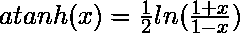

# JavaScript | Math . atanah()函数

> 原文:[https://www . geesforgeks . org/JavaScript-math-atanh-function/](https://www.geeksforgeeks.org/javascript-math-atanh-function/)

**Math . atanah()函数**是 JavaScript 中的一个内置函数，用来获取一个数的双曲反正切。
双曲反正切有很多名字，比如双曲反正切和阿塔赫。它是双曲正切函数的反函数，即任何值的反双曲正切表示 x 是 y 的值，y 的双曲正切是 x

```
*if y = atanh(x)
then x = tanh(y)*
```

我们有，



**语法:**

```
*Math.atanh(x)*
```

**参数:**

*   Here x is a number whose hyperbolic arctangent is going to be calculated.

    **返回值:**

*   It returns the hyperbolic arc-tangent of the given number.

    **浏览器支持:**

*   这里第二列包含相应浏览器版本的 int 值。
    T41】八 T43T45】安卓网页视图 T53】是

    | 特征 | 基本支持 |
    | 铬 | 三十八 |
    | 边缘 | 是 |
    | 火狐浏览器 | 二十五 |
    | 微软公司出品的网浏览器 | 不 |
    | 歌剧 | 二十五 |
    | 旅行队 |
    | 是 |
    | 安卓镀铬 |
    | 边缘移动 | 是 |
    | 安卓火狐 | 二十五 |
    | 歌剧安卓 | 是 |
    | iOS 浏览器 | 八 |

**示例:**

```
Input: Math.atanh(-1)
Output: -Infinity

```

**解释:**
这里输出 0 是数字 1 的双曲反正弦。

```
Input: Math.atanh(0)
Output: 0

```

```
Input: Math.atanh(0.5)
Output: 0.5493061443340548

```

```
Input: Math.atanh(1)
Output: Infinity

```

```
Input: Math.atanh(1.2)
Output: NaN

```

```
Input: Math.atanh(-2.2)
Output: NaN

```

对于大于 1 或小于-1 的值，返回 NaN，即不返回数字。
**我们来看看 JavaScripts 程序:**

```
// Here different values is being used for
// getting hyperbolic tangent function's values.
console.log(Math.atanh(-1));
console.log(Math.atanh(0));
console.log(Math.atanh(0.5));
console.log(Math.atanh(1));
console.log(Math.atanh(1.2));
console.log(Math.atanh(-2.2));
```

**输出:**

```
> 0
> 0.5493061443340548
> Infinity
> NaN
> NaN

```

**应用:**
每当我们需要得到一个数字的双曲反正切时，我们可以借助 JavaScript 中的 Math.atanh()函数。

```
// Here different values is being used for getting
// hyperbolic cosine function's values.
console.log(Math.atanh(0.1));
console.log(Math.atanh(22));
```

**输出:**

```
> 0.10033534773107558
> NaN

```