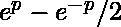
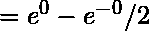
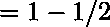

# JavaScript | Math.sinh()函数

> 原文:[https://www . geesforgeks . org/JavaScript-math-sinh-function/](https://www.geeksforgeeks.org/javascript-math-sinh-function/)

**Math.sinh()** 是 JavaScript 中的一个内置函数，用来计算一个数的双曲正弦值。

**语法:**

```
Math.sinh(p)
```

**参数:**该函数接受单个参数 **p** 是一个将要计算双曲正弦值的数字。

**返回:**返回数字的双曲正弦的计算值。

**示例:**

```
*Input  :* Math.sinh(0)

*Output :* 0
```

**说明:**
这里计算任意数双曲正弦的公式是:数 **e** 是一个数学常数，其近似值等于 **2.718** 。

> 
> 
> 
> 
> 
> 
> 

用同样的方法，只要用所需的数代替 p，就可以计算出任意数的双曲正弦。

```
*Input  :* Math.sinh(15)

*Output :* 1634508.6862359024
```

**解释:**
这里和上面的计算一样，当我们放 15 而不是 p，那么这个值就变成了如上图所示的输出。
我们来看看一些 JavaScript 代码:

*   **Example 1:**

    ```
    <script>
      // Printing hyperbolic sine of some numbers
      // taken as parameter of Math.sinh() function.
      document.write(Math.sinh(0) + "<br>");
      document.write(Math.sinh(1) + "<br>");
      document.write(Math.sinh(5) + "<br>");
      document.write(Math.sinh(22) + "<br>");
      document.write(Math.sinh(-2) + "<br>");
      document.write(Math.sinh(4));
    </script>
    ```

    **输出:**

    ```
    0
    1.1752011936438014
    74.20321057778875
    1792456423.065796
    -3.626860407847019
    27.28991719712775
    ```

*   **Example 2:** >It is an error case because complex number can not be taken as the parameter of the function only integer value can be taken as the parameter.

    ```
    <script>
      // complex number can not be calculated as 
      //the hyperbolic sine.
      document.write(Math.sinh(1 + 2i));
    </script>
    ```

    **输出:**

    ```
    Error: Invalid or unexpected token
    ```

*   **Example 3:** Other than integer nothing is accepted as the parameter of the function that is why here string as the parameter gives NaN i.e, not a number.

    ```
    <script>
      // Any string value as the parameter of the function
      // gives NaN i.e, not a number
      // because only number can be used as the parameters.
      document.write(Math.sinh("geeksforgeeks") + "<br>");
      document.write(Math.sinh("gfg"));
    </script>
    ```

    **输出:**

    ```
    NaN
    NaN
    ```

**应用:**它的实际应用是每当我们需要求一个数的双曲正弦值的时候，那时候我们就借助 JavaScript 中的 Math.sinh()函数。

*   **Example 1:**

    ```
    <script>
      // Printing hyperbolic sine of some numbers from 0 to 9
      // taken as parameter of Math.sinh() function.
      for (i = 0; i < 10; i++) {
        document.write(Math.sinh(i) + "<br>");
      }
    </script>
    ```

    **输出:**

    ```
    0
    1.1752011936438014
    3.626860407847019
    10.017874927409903
    27.28991719712775
    74.20321057778875
    201.71315737027922
    548.3161232732465
    1490.4788257895502
    4051.54190208279
    ```

**支持的浏览器:**JavaScript math . sinh()函数支持的浏览器如下:

*   谷歌 Chrome
*   微软公司出品的 web 浏览器
*   火狐浏览器
*   歌剧
*   旅行队