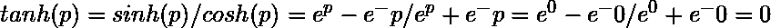

# JavaScript 数学 tanh()方法

> 原文:[https://www.geeksforgeeks.org/javascript-math-tanh-method/](https://www.geeksforgeeks.org/javascript-math-tanh-method/)

下面是**数学 tanh()** 方法的例子。

*   **例:**

    ```
    <script>
      // Printing hyperbolic tangent of some numbers
      // taken as parameter of Math.tanh() function.
      document.write(Math.tanh(0)+"<br>");
      document.write(Math.tanh(1)+"<br>");
      document.write(Math.tanh(5)+"<br>");
      document.write(Math.tanh(22)+"<br>");
      document.write(Math.tanh(-2)+"<br>");
      document.write(Math.tanh(4)+"<br>");
    </script>
    ```

*   **输出:**

    ```
    0
    0.7615941559557649
    0.9999092042625951
    1
    -0.9640275800758169
    0.999329299739067
    ```

**Math.tanh()** 方法用于计算一个数的双曲正切值。

**语法:**

```
Math.tanh(x)
```

**参数:**该方法接受如上所述的单个参数，描述如下:

*   **x:** 这是一个将要计算双曲正切值的数字。

**返回值:**返回数字的双曲正切的计算值。<下面的例子说明了 JavaScript 中的 Math tanh()方法:

*   **例 1:** 这里计算任意数的双曲正切的公式 **e** 是一个数学常数，其近似值等于 **2.718** 。

    > 

    ```
    Input :Math.tanh(0)
    Output : 0
    ```

*   **例 2:** 同样，只要用所需的数代替 p，就可以计算出任意数的双曲正切。这里与上面的计算相同，当我们用 18 代替 x 时，该值变成如上所示的输出。

    ```
    Input : Math.tanh(18)
    Output : 0.9999999999999996
    ```

以上方法的更多代码如下:
**程序 1:** 因为复数不能作为函数的参数，只能取整数值作为参数，所以是错误的情况。

```
<script>
  // complex number can not be calculated
  // as the hyperbolic tangent.
  document.write(Math.tanh(1 + 2i));
</script>
```

**输出:**

```
Error: Invalid or unexpected token
```

**程序 2:** 除了整数之外，没有任何东西被接受为函数的参数，这就是为什么这里字符串作为参数给出 NaN，即不是数字。

```
<script>
  // Any string value as the parameter of the function
  // gives NaN i.e, not a number
  // because only number can be used as the parameters.
  document.write(Math.tanh("geeksforgeeks")+"<br>");
  document.write(Math.tanh("gfg"));
</script>
```

**输出:**

```
NaN
NaN
```

**程序 3:** 它的实际应用是每当我们需要求一个数的双曲正切值的时候，那时候我们就借助 JavaScript 中的 Math.tanh()函数。

```
<script>
  // Printing hyperbolic tangent of some 
  // numbers from 0 to 9
  // taken as parameter of Math.tanh() function.
  for (i = 0; i < 10; i++)
  {
     document.write(Math.tanh(i) + "<br>");
  }
</script>
```

**输出:**

```
0
0.7615941559557649
0.9640275800758169
0.9950547536867305
0.999329299739067
0.9999092042625951
0.9999877116507956
0.9999983369439447
0.9999997749296758
0.999999969540041
```

**支持的浏览器:**

*   谷歌 Chrome
*   微软公司出品的 web 浏览器
*   火狐浏览器
*   歌剧
*   旅行队