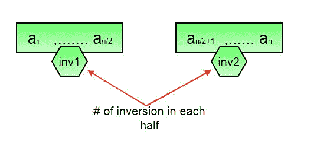
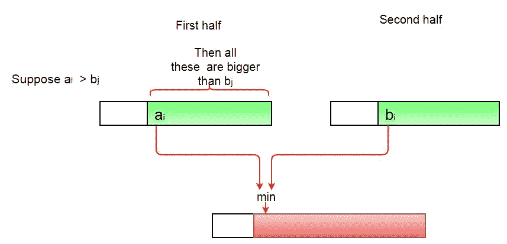
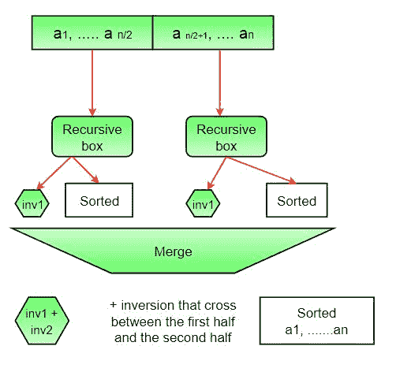

# 用于计算数组中反转的 Javascript 程序–集合 1(使用合并排序)

> 原文:[https://www . geesforgeks . org/JavaScript-用于计数的程序-数组中的反转-集合-1-使用-合并-排序/](https://www.geeksforgeeks.org/javascript-program-for-counting-inversions-in-an-array-set-1-using-merge-sort/)

*数组的反转计数*表示数组离排序有多远(或多近)。如果数组已经排序，则反转计数为 0，但是如果数组以相反的顺序排序，则反转计数为最大值。
形式上讲，如果 a[I]>a[j]I<j
**例:**

```
Input: arr[] = {8, 4, 2, 1}
Output: 6
Explanation: Given array has six inversions:
(8, 4), (4, 2), (8, 2), (8, 1), (4, 1), (2, 1).

Input: arr[] = {3, 1, 2}
Output: 2
Explanation: Given array has two inversions:
(3, 1), (3, 2) 
```

**<u>方法 1(简单):</u>**

**方法:**遍历数组，对于每个索引，找到数组右侧较小元素的数量。这可以使用嵌套循环来完成。合计数组中所有索引的计数，并打印总和。

**算法:**

1.  从头到尾遍历数组
2.  对于每个元素，使用另一个循环查找小于当前数字的元素计数，直到该索引。
3.  合计每个索引的反转计数。
4.  打印倒计数。

**实施:**

## java 描述语言

```
<script>
// Javascript program to count inversions 
// in an array
arr = [1, 20, 6, 4, 5];

function getInvCount(arr)
{
    let inv_count = 0;
    for(let i = 0; i < arr.length - 1; i++)
    {
        for(let j = i + 1; j < arr.length; j++)
        {
            if(arr[i] > arr[j]) inv_count++;
        }
    }
    return inv_count;
}

// function call
document.write("Number of inversions are "+ 
                getInvCount(arr));

// This code is contributed by Karthik SP
</script>
```

**输出:**

```
 Number of inversions are 5
```

**复杂度分析:**

*   **时间复杂度:** O(n^2)，需要两个嵌套循环从头到尾遍历数组，所以时间复杂度为 O(n^2)
*   **空间**复杂度 **:** O(1)，不需要额外空间。

**<u>方法 2(增强合并排序):</u>**

**逼近:**
假设数组左半部分和右半部分的逆序个数(设为 inv1 和 inv 2)；Inv1 + Inv2 中有哪些类型的反转没有被考虑？答案是–在合并步骤中需要计算的反转。因此，要得到需要相加的逆的总数，需要左子阵、右子阵和 merge()中的逆的个数。



**如何得到 merge()中的求逆次数？**
在合并过程中，let i 用于索引左子数组，j 用于索引右子数组。在 merge()中的任何一步，如果 a[i]大于 a[j]，则有(mid–I)个反转。因为左右子阵列是排序的，所以左子阵列中的所有剩余元素(a[i+1]，a[i+2] … a[mid])都将大于 a[j]



**全图:**



**算法:**

1.  这个想法类似于合并排序，在每一步中将数组分成相等或几乎相等的两半，直到达到基本大小写。
2.  创建一个函数 merge，计算当数组的两个半部分被合并时的求逆次数，创建两个索引 I 和 j，I 是前半部分的索引，j 是后半部分的索引。如果 a[i]大于 a[j]，则存在(mid–I)反转。因为左右子阵是排序的，所以左子阵中所有剩余的元素(a[i+1]，a[i+2] … a[mid])都会大于 a[j]。
3.  创建一个递归函数，将数组分成两半，通过相加求逆的次数是前半部分，后半部分求逆的次数和两者合并求逆的次数来找到答案。
4.  递归的基本情况是给定的一半只有一个元素。
5.  打印答案

**实施:**

## java 描述语言

```
<script>
// Javascript program to implement
// the above approach
// Function to count the number of 
// inversions during the merge process
function mergeAndCount(arr, l, m, r)
{    
    // Left subarray
    let left = [];

    for(let i = l; i < m + 1; i++)
    {
        left.push(arr[i]); 
    }

    // Right subarray
    let right = [];

    for(let i = m + 1; i < r + 1; i++)
    {
        right.push(arr[i]);
    }

    let i = 0, j = 0, k = l, swaps = 0;
    while (i < left.length && 
           j < right.length)
    {
        if (left[i] <= right[j])
        {
            arr[k++] = left[i++];
        }
        else
        {
            arr[k++] = right[j++];
            swaps += (m + 1) - (l + i);
        }
    }
    while (i < left.length)
    {
        arr[k++] = left[i++];
    }

    while (j < right.length)
    {
        arr[k++] = right[j++];
    }
    return swaps;
}

// Merge sort function
function mergeSortAndCount(arr, l, r)
{        
    // Keeps track of the inversion count 
    // at a particular node of the recursion 
    //                             tree
    let count = 0;

    if (l < r) 
    {
        let m = Math.floor((l + r) / 2);

         // Total inversion count = left subarray 
         // count + right subarray count + merge count

         // Left subarray count
         count += mergeSortAndCount(arr, l, m);

         // Right subarray count
         count += mergeSortAndCount(arr, m + 1, r);

         // Merge count
         count += mergeAndCount(arr, l, m, r);
    }
    return count;
}

// Driver code
let arr = new Array(1, 20, 6, 4, 5 );
document.write(
mergeSortAndCount(
arr, 0, arr.length - 1));

// This code is contributed by avanitrachhadiya2155
</script>
```

**输出:**

```
Number of inversions are 5
```

**复杂度分析:**

*   **时间复杂度:** O(n log n)，使用的算法是分治法，所以在每一层都需要一次全数组遍历，而且有 log n 层，所以时间复杂度为 O(n log n)。
*   **空间**复杂度 **:** O(n)，临时阵。

请注意，上面的代码修改(或排序)了输入数组。如果我们只想计算逆序，我们需要创建一个原始数组的副本，并在副本上调用 mergeSort()来保持原始数组的顺序。