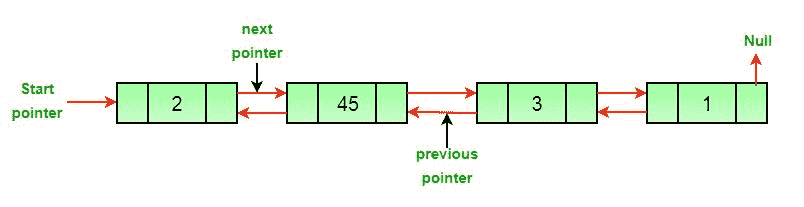

# 删除双向链表中节点的 Javascript 程序

> 原文:[https://www . geesforgeks . org/JavaScript-用于删除双链表中节点的程序/](https://www.geeksforgeeks.org/javascript-program-for-deleting-a-node-in-a-doubly-linked-list/)

**先决条件:** [双向链接列表集 1|介绍和插入](https://www.geeksforgeeks.org/doubly-linked-list/)

编写一个函数来删除双向链表中的给定节点。
**原双链表**



**方法:**双链表中节点的删除可以分为三大类:

*   **删除头节点后。**


*   **删除中间节点后。**


*   **删除最后一个节点后。**


**如果要删除的节点的指针和头指针已知，那么上述三种情况都可以分两步处理。**

1.  如果要删除的节点是头节点，则将下一个节点作为头。
2.  如果删除了一个节点，请连接已删除节点的下一个和上一个节点。


**算法**

*   让要删除的节点为 *del* 。
*   如果要删除的节点是头节点，则将头指针更改为下一个当前头。

```
if *headnode* == *del* then
      *headnode* =  *del*.nextNode
```

*   如果存在上一个 *del* ，则将上一个的*下一个*设置为 *del* 。

```
if *del*.nextNode != *none* 
      *del*.nextNode.previousNode = *del*.previousNode 
```

*   如果在 *del* 旁边，则设置 *del* 旁边的 *prev* 。

```
if *del*.previousNode != *none* 
      *del*.previousNode.nextNode = *del*.next
```

## java 描述语言

```
<script>
// Javascript program to delete a node from
// Doubly Linked List

// Class for Doubly Linked List
// Head of list
var head; 

// Doubly Linked list Node 
class Node 
{
    // Constructor to create a new node
    // next and prev is by default 
    // initialized as null
    constructor(val) 
    {
        this.data = val;
        this.prev = null;
        this.next = null;
    }
}

// Adding a node at the front of the list
function push(new_data) 
{
    // 1\. allocate node
    // 2\. put in the data
    new_Node = new Node(new_data);

    // 3\. Make next of new node as head
    // and previous as NULL
    new_Node.next = head;
    new_Node.prev = null;

    // 4\. change prev of head node to 
    //    new node
    if (head != null)
            head.prev = new_Node;

    // 5\. move the head to point to the 
    //    new node
    head = new_Node;
}

// This function prints contents of 
// linked list starting from the given node
function printlist(node) 
{
    last = null;

    while (node != null) 
    {
        document.write(node.data + " ");
        last = node;
        node = node.next;
    }
    document.write("<br/>");
}

// Function to delete a node in a Doubly 
// Linked List. head_ref --> pointer to 
// head node pointer. del --> data of 
// node to be deleted.
function deleteNode(del) 
{
    // Base case
    if (head == null || del == null) 
    {
        return;
    }

    // If node to be deleted is head node
    if (head == del) 
    {
        head = del.next;
    }

    // Change next only if node to be 
    // deleted is NOT the last node
    if (del.next != null) 
    {
        del.next.prev = del.prev;
    }

    // Change prev only if node to be 
    // deleted is NOT the first node
    if (del.prev != null) 
    {
        del.prev.next = del.next;
    }

    // Finally, free the memory occupied 
    // by del
    return;
}

// Driver Code
// Start with the empty list

// Insert 2\. So linked list becomes 
// 2->NULL
push(2);

// Insert 4\. So linked list becomes 
// 4->2->NULL
push(4);

// Insert 8\. So linked list becomes 
// 8->4->2->NULL
push(8);

// Insert 10\. So linked list becomes 
// 10->8->4->2->NULL
push(10);

document.write("Created DLL is: ");
printlist(head);

// Deleting first node
deleteNode(head);
deleteNode(head.next);
deleteNode(head.next);

document.write("Modified Linked list: ");
printlist(head);
// This code is contributed by todaysgaurav
</script>
```

**输出:**

```
Original Linked list 10 8 4 2 
Modified Linked list 8
```

**复杂度分析:**

*   **时间复杂度:** O(1)。
    因为不需要遍历链表，所以时间复杂度是恒定的。
*   **空间复杂度:** O(1)。
    由于不需要额外的空间，所以空间复杂度不变。

详情请参考[删除双向链表](https://www.geeksforgeeks.org/delete-a-node-in-a-doubly-linked-list/)中的一个节点的完整文章！