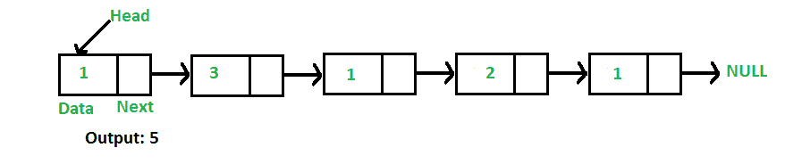

# 查找链表长度的 Javascript 程序

> 原文:[https://www . geeksforgeeks . org/JavaScript-for-program-find-length-a-link-list-iterative-and-recursive-approach/](https://www.geeksforgeeks.org/javascript-program-for-finding-length-of-a-linked-list-iterative-and-recursive-approach/)

编写一个函数来计算给定单链表中的节点数。



例如，对于链表 1->3->1->2->1，函数应该返回 5。

**迭代解:**

```
1) Initialize count as 0 
2) Initialize a node pointer, current = head.
3) Do following while current is not NULL
     a) current = current -> next
     b) count++;
4) Return count 
```

下面是上述算法的迭代实现，用于查找给定单链表中的节点数。

## java 描述语言

```
<script>
// Javascript program to count number
// of nodes in a linked list

// Linked list Node
class Node
{
    constructor(val)
    {
        this.data = val;
        this.next = null;
    }
}

// Head of list
var head;

// Inserts a new Node at front of the list.
function push(new_data)
{
    // 1 & 2: Allocate the Node & Put in
    // the data
    var new_node = new Node(new_data);

    // 3\. Make next of new Node as head
    new_node.next = head;

    // 4\. Move the head to point to new Node
    head = new_node;
}

// Returns count of nodes in linked list
function getCount()
{
    var temp = head;
    var count = 0;
    while (temp != null)
    {
        count++;
        temp = temp.next;
    }
    return count;
}

// Driver code
// Start with the empty list
push(1);
push(3);
push(1);
push(2);
push(1);

document.write("Count of nodes is " + getCount());

// This code contributed by Rajput-Ji
</script>
```

**输出:**

```
count of nodes is 5
```

**递归解:**

```
int getCount(head)
1) If head is NULL, return 0.
2) Else return 1 + getCount(head->next) 
```

下面是上述算法的递归实现，用于查找给定单链表中的节点数。

## java 描述语言

```
<script>
// Recursive javascript program to count
// number of nodes in a linked list

// Linked list Node
class Node
{
    constructor(val)
    {
        this.data = val;
        this.next = null;
    }
}

// Linked List class
// Head of list
var head;

// Inserts a new Node at front of the list.
function push( new_data)
{
    // 1 & 2: Allocate the Node &
    // Put in the data
    var new_node = new Node(new_data);

    // 3\. Make next of new Node as head
    new_node.next = head;

    // 4\. Move the head to point to new Node
    head = new_node;
}

Returns count of nodes in linked list
function getCountRec(node)
{
    // Base case
    if (node == null)
        return 0;

    // Count is this node plus rest
    // of the list
    return 1 + getCountRec(node.next);
}

// Wrapper over getCountRec()
function getCount()
{
    return getCountRec(head);
}

// Driver code
// Start with the empty list   
push(1);
push(3);
push(1);
push(2);
push(1);

document.write("Count of nodes is " + getCount());

// This code contributed by gauravrajput1
</script>
```

**输出:**

```
Count of nodes is 5
```

详情请参考[求链表长度(迭代和递归)](https://www.geeksforgeeks.org/find-length-of-a-linked-list-iterative-and-recursive/)整篇文章！