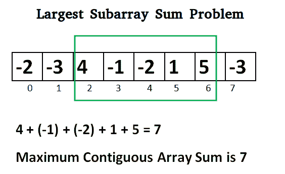

# 最大和连续子数组的 Javascript 程序

> 原文:[https://www . geesforgeks . org/JavaScript-program-for-maximum-sum-continuous-subarray/](https://www.geeksforgeeks.org/javascript-program-for-largest-sum-contiguous-subarray/)

写一个高效的程序，找出一维数组中具有最大和的相邻子数组的和。



**卡丹算法:**

```
Initialize:
    max_so_far = INT_MIN
    max_ending_here = 0

Loop for each element of the array
  (a) max_ending_here = max_ending_here + a[i]
  (b) if(max_so_far < max_ending_here)
            max_so_far = max_ending_here
  (c) if(max_ending_here < 0)
            max_ending_here = 0
return max_so_far
```

**解释:**
卡丹算法的简单思想是寻找数组中所有正的连续段(这里 max _ end _ 用于此)。并跟踪所有正段之间的最大和连续段(max_so_far 用于此)。每次我们得到一个正和时，将其与 max_so_far 进行比较，如果 max_so_far 大于 max_so_far，则更新 max _ so _ far

```
    Lets take the example:
    {-2, -3, 4, -1, -2, 1, 5, -3}

    max_so_far = max_ending_here = 0

    for i=0,  a[0] =  -2
    max_ending_here = max_ending_here + (-2)
    Set max_ending_here = 0 because max_ending_here < 0

    for i=1,  a[1] =  -3
    max_ending_here = max_ending_here + (-3)
    Set max_ending_here = 0 because max_ending_here < 0

    for i=2,  a[2] =  4
    max_ending_here = max_ending_here + (4)
    max_ending_here = 4
    max_so_far is updated to 4 because max_ending_here greater 
    than max_so_far which was 0 till now

    for i=3,  a[3] =  -1
    max_ending_here = max_ending_here + (-1)
    max_ending_here = 3

    for i=4,  a[4] =  -2
    max_ending_here = max_ending_here + (-2)
    max_ending_here = 1

    for i=5,  a[5] =  1
    max_ending_here = max_ending_here + (1)
    max_ending_here = 2

    for i=6,  a[6] =  5
    max_ending_here = max_ending_here + (5)
    max_ending_here = 7
    max_so_far is updated to 7 because max_ending_here is 
    greater than max_so_far

    for i=7,  a[7] =  -3
    max_ending_here = max_ending_here + (-3)
    max_ending_here = 4
```

**程序:**

## java 描述语言

```
<script>

// JavaScript program to find maximum
// contiguous subarray

// Function to find the maximum
// contiguous subarray
function maxSubArraySum(a, size)
{
    var maxint = Math.pow(2, 53)
    var max_so_far = -maxint - 1
    var max_ending_here = 0

    for (var i = 0; i < size; i++)
    {
        max_ending_here = max_ending_here + a[i]
        if (max_so_far < max_ending_here)
            max_so_far = max_ending_here

        if (max_ending_here < 0)
            max_ending_here = 0
    }
    return max_so_far
}

// Driver code
var a = [ -2, -3, 4, -1, -2, 1, 5, -3 ]
document.write("Maximum contiguous sum is",
               maxSubArraySum(a, a.length))

// This code is contributed by AnkThon

</script>
```

**输出:**

```
Maximum contiguous sum is 7
```

**另一种方法:**

## java 描述语言

```
<script>
        // JavaScript Program to implement
        // the above approach

        function maxSubarraySum(arr, size)
        {
            let max_ending_here = 0, max_so_far = Number.MIN_VALUE;
            for (let i = 0; i < size; i++) {

                // include current element to previous subarray only
                // when it can add to a bigger number than itself.
                if (arr[i] <= max_ending_here + arr[i]) {
                    max_ending_here += arr[i];
                }

                // Else start the max subarray from current element
                else {
                    max_ending_here = arr[i];
                }
                if (max_ending_here > max_so_far) {
                    max_so_far = max_ending_here;
                }
            }
            return max_so_far;
        }

// This code is contributed by Potta Lokesh
    </script>
```

**时间复杂度:**O(n)
T3】算法范式:动态规划
以下是**莫希特库马尔**建议的另一个简单实现。该实现处理数组中所有数字都为负数的情况。

## java 描述语言

```
<script>
// C# program to print largest
// contiguous array sum

function maxSubArraySum(a,size)
{
  let max_so_far = a[0];
  let curr_max = a[0];

  for (let i = 1; i < size; i++)
  {
      curr_max = Math.max(a[i], curr_max+a[i]);
      max_so_far = Math.max(max_so_far, curr_max);
  }

return max_so_far;
}

// Driver code

let a = [-2, -3, 4, -1, -2, 1, 5, -3];
let n = a.length;
document.write("Maximum contiguous sum is ",maxSubArraySum(a, n));

</script>
```

**输出:**

```
Maximum contiguous sum is 7
```

为了打印具有最大和的子阵列，只要我们得到最大和，我们就维护索引。

## java 描述语言

```
<script>
// javascript program to print largest
// contiguous array sum   
function maxSubArraySum(a , size) {
        var max_so_far = Number.MIN_VALUE, max_ending_here = 0, start = 0, end = 0, s = 0;

        for (i = 0; i < size; i++) {
            max_ending_here += a[i];

            if (max_so_far < max_ending_here) {
                max_so_far = max_ending_here;
                start = s;
                end = i;
            }

            if (max_ending_here < 0) {
                max_ending_here = 0;
                s = i + 1;
            }
        }
        document.write("Maximum contiguous sum is " + max_so_far);
        document.write("<br/>Starting index " + start);
        document.write("<br/>Ending index " + end);
    }

    // Driver code

        var a = [ -2, -3, 4, -1, -2, 1, 5, -3 ];
        var n = a.length;
        maxSubArraySum(a, n);

// This code is contributed by Rajput-Ji
</script>
```

**输出:**

```
Maximum contiguous sum is 7
Starting index 2
Ending index 6
```

卡丹的算法既可以被视为贪婪的，也可以被视为动态规划的。正如我们所看到的，我们保持一个整数的运行和，当它变得小于 0 时，我们将其重置为 0(贪婪部分)。这是因为继续负和比重新开始一个新的范围更糟糕。现在它也可以被视为一个 DP，在每个阶段我们有 2 个选择:要么接受当前元素并继续以前的总和，要么重新开始一个新的范围。这两种选择在实现中都得到了考虑。

***时间复杂度:** O(n)*

***辅助空间:** O(1)*

现在试试下面的问题
给定一个整数数组(可能有些元素是负的)，编写一个 C 程序，通过将数组中的‘n’个连续整数相乘，找出可能的*最大乘积*其中 n ≤ ARRAY_SIZE。另外，打印最大产品子阵列的起点。

更多详情请参考[最大和邻接子阵列](https://www.geeksforgeeks.org/largest-sum-contiguous-subarray/)整篇文章！