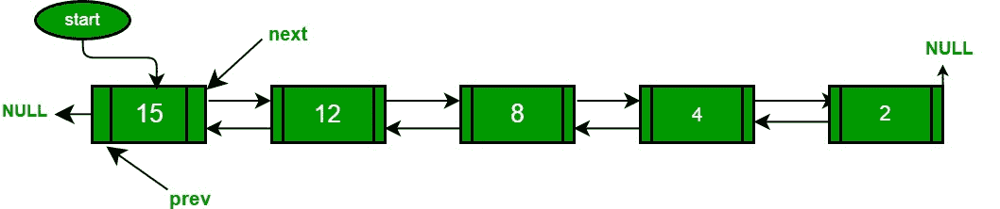

# 双向链表快速排序的 Javascript 程序

> 原文:[https://www . geesforgeks . org/JavaScript-program-for-quick sort-on-double-link-list/](https://www.geeksforgeeks.org/javascript-program-for-quicksort-on-doubly-linked-list/)

以下是数组的[快速排序](http://en.wikipedia.org/wiki/Quicksort)的典型递归实现。该实现使用最后一个元素作为透视。

## java 描述语言

```
<script>
/* A typical recursive implementation of
   Quicksort for array*/

/* This function takes last element as pivot,
   places the pivot element at its correct
   position in sorted array, and places all
   smaller (smaller than pivot) to left of
   pivot and all greater elements to right
   of pivot */

function partition (arr,l,h)
{
    let x = arr[h];
    let i = (l - 1);

    for(let j = l; j <= h - 1; j++)
    {
        if (arr[j] <= x)
        {
            i++;
            let tmp = arr[i];
            arr[i] = arr[j];
            arr[j] = tmp;
        }
    }   
    let tmp = arr[i + 1];
    arr[i + 1] = arr[h];
    arr[h] = tmp;
    return(i + 1);
}

/* A[] --> Array to be sorted,
    l  --> Starting index,
    h  --> Ending index */
function quickSort(A,l,h)
{
    if (l < h)
    {

        // Partitioning index
        let p = partition(A, l, h);
        quickSort(A, l, p - 1); 
        quickSort(A, p + 1, h);
    }
}

// This code is contributed by unknown2108
</script>
```

**链表可以用同样的算法吗？**
下面是双链表的 C++实现。思路很简单，我们先找出指向最后一个节点的指针。一旦我们有了指向最后一个节点的指针，我们就可以使用指向链表的第一个和最后一个节点的指针来递归地对链表进行排序，类似于上面的递归函数，在那里我们传递第一个和最后一个数组元素的索引。链表的分区函数也类似于数组的分区。它不是返回透视元素的索引，而是返回指向透视元素的指针。在下面的实现中，quickSort()只是一个包装函数，主要的递归函数是 _quickSort()，对于数组的实现类似于 quickSort()。



## java 描述语言

```
<script>
// A Javascript program to sort a linked list using Quicksort
let  head;

/* a node of the doubly linked list */ 
class Node
{
    constructor(d)
    {
        this.data = d;
        this.next = null;
        this.prev = null;
    }
}

// A utility function to find last node of linked list   
function lastNode(node)
{
    while(node.next != null)
            node = node.next;
        return node;
}

/* Considers last element as pivot, places the pivot element at its
   correct position in sorted array, and places all smaller (smaller than
   pivot) to left of pivot and all greater elements to right of pivot */
function partition(l, h)
{

    // set pivot as h element
        let x = h.data;

        // similar to i = l-1 for array implementation
        let i = l.prev;

        // Similar to "for (int j = l; j <= h- 1; j++)"
        for(let j=l; j!=h; j=j.next)
        {
            if(j.data <= x)
            {
                // Similar to i++ for array
                i = (i == null) ? l : i.next;
                let temp = i.data;
                i.data = j.data;
                j.data = temp;
            }
        }
        i = (i == null) ? l : i.next;  // Similar to i++
        let temp = i.data;
        i.data = h.data;
        h.data = temp;
        return i;
}

/* A recursive implementation of quicksort for linked list */
function _quickSort(l,h)
{
    if(h != null && l!=h && l != h.next){
            let temp = partition(l, h);
            _quickSort(l,temp.prev);
            _quickSort(temp.next,h);
        }
}

// The main function to sort a linked list. It mainly calls _quickSort()
function quickSort(node)
{
    // Find last node
        let head = lastNode(node);

        // Call the recursive QuickSort
        _quickSort(node,head);
}

// A utility function to print contents of arr
function printList(head)
{
    while(head!=null){
            document.write(head.data+" ");
            head = head.next;
        }
}

/* Function to insert a node at the beginning of the Doubly Linked List */
function push(new_Data)
{
    let new_Node = new Node(new_Data);     /* allocate node */

        // if head is null, head = new_Node
        if(head==null){
            head = new_Node;
            return;
        }

        /* link the old list off the new node */
        new_Node.next = head;

        /* change prev of head node to new node */
        head.prev = new_Node;

        /* since we are adding at the beginning, prev is always NULL */
        new_Node.prev = null;

        /* move the head to point to the new node */
        head = new_Node;
}

/* Driver program to test above function */
push(5);
push(20);
push(4);
push(3);
push(30);

document.write("Linked List before sorting <br>");
printList(head);
document.write("<br>Linked List after sorting<br>");
quickSort(head);
printList(head);

// This code is contributed by patel2127
</script>
```

**输出:**

```
Linked List before sorting
30  3  4  20  5
Linked List after sorting
3  4  5  20  30
```

**时间复杂度:**上述实现的时间复杂度与快速排序()对于数组的时间复杂度相同。最坏的情况下需要 O(n^2 时间，一般情况下和最好的情况下都需要 0。最坏的情况发生在链表已经排序的时候。
我们能为链表实现随机快速排序吗？
只有当我们可以选择一个固定点作为轴心时(就像上面实现中的最后一个元素)，链表才能实现快速排序。随机快速排序不能通过选择随机透视来有效地实现链表。

详情请参考[双链表快速排序](https://www.geeksforgeeks.org/quicksort-for-linked-list/)整篇文章！