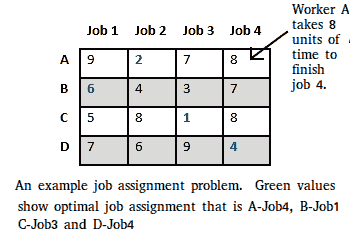
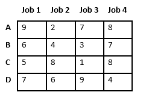
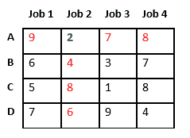
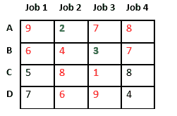
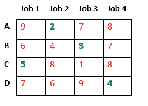
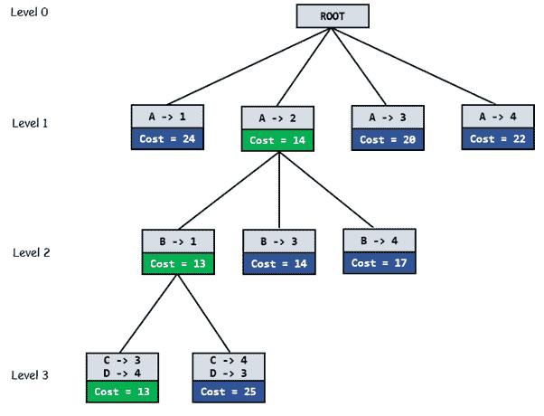

# 使用分支定界的作业分配问题

> 原文:[https://www . geesforgeks . org/job-assignment-problem-use-branch-and-bound/](https://www.geeksforgeeks.org/job-assignment-problem-using-branch-and-bound/)

让有 N 个工人，N 个工作。任何工人都可以被分配从事任何工作，所产生的费用可能会因工作任务的不同而有所不同。要求执行所有作业时，每个作业只分配一个工人，每个座席只分配一个作业，以使分配的总成本最小化。



让我们探索解决这个问题的所有方法。

**解决方案 1:蛮力**
我们生成 n！可能的工作分配，对于每个这样的分配，我们计算其总成本，并返回较便宜的分配。因为解是 n 个作业的排列，所以它的复杂度是 O(n！).

[**解 2:匈牙利算法**](https://www.geeksforgeeks.org/hungarian-algorithm-assignment-problem-set-1-introduction/)
使用匈牙利算法可以找到最优分配。匈牙利算法的运行时间复杂度是 O(n^3).算法的最坏情况

**解 3:状态空间树上的 DFS/BFS**
状态空间树是一个 N 元树，它的性质是从根到叶节点的任何路径都持有给定问题的许多解之一。我们可以在状态空间树上执行深度优先搜索，但是连续的移动会使我们远离目标，而不是靠近目标。状态空间树的搜索遵循从根开始的最左边的路径，而不考虑初始状态。在这种方法中可能永远找不到答案节点。我们还可以在状态空间树上执行广度优先搜索。但是不管初始状态是什么，算法都会像 DFS 一样尝试相同的移动顺序。

**解 4:利用分支定界**
寻找最优解 BFS 和 DFS 下一个节点的选择规则是“盲”。也就是说，选择规则没有给有很大机会快速搜索到答案节点的节点任何优先权。对最优解的搜索通常可以通过使用“智能”排序函数(也称为近似成本函数)来加速，以避免在不包含最优解的子树中搜索。它类似于 BFS 式的搜索，但有一个主要的优化。我们选择成本最低的活动节点，而不是遵循先进先出的顺序。我们可能无法通过跟踪承诺成本最低的节点来获得最优解，但它将提供很好的机会来快速搜索到答案节点。

计算成本函数有两种方法:

1.  对于每个员工，我们从未分配的工作列表中选择成本最低的工作(从每一行中选择最少的条目)。
2.  对于每个职务，我们从未分配的员工列表中为该职务选择成本最低的员工(从每个列中选择最少的条目)。

本文遵循第一种方法。

让我们举下面的例子，试着计算当工作 2 分配给工人 a 时的承诺成本。



由于作业 2 被分配给工人 A(标记为绿色)，成本变为 2，作业 2 和工人 A 变为不可用(标记为红色)。



现在，我们将作业 3 分配给工人 B，因为它具有未分配作业列表中的最小成本。成本变为 2 + 3 = 5，作业 3 和工人 B 也变得不可用。



最后，作业 1 被分配给工人 C，因为它在未分配的作业中具有最小成本，而作业 4 被分配给工人 C，因为它是唯一剩下的作业。总成本变成 2 + 3 + 5 + 4 = 14。



下图显示了完整的搜索空间图，以绿色显示了最优解路径。



**完整算法:**

```
/* findMinCost uses Least() and Add() to maintain the
   list of live nodes

   Least() finds a live node with least cost, deletes
   it from the list and returns it

   Add(x) calculates cost of x and adds it to the list
   of live nodes

   Implements list of live nodes as a min heap */

// Search Space Tree Node
node
{
   int job_number;
   int worker_number;
   node parent;
   int cost;
}

// Input: Cost Matrix of Job Assignment problem
// Output: Optimal cost and Assignment of Jobs
algorithm findMinCost (costMatrix mat[][])
{
   // Initialize list of live nodes(min-Heap)
   // with root of search tree i.e. a Dummy node
   while (true)
   {
      // Find a live node with least estimated cost
      E = Least();

      // The found node is deleted from the list
      // of live nodes
      if (E is a leaf node)
      {
         printSolution();
         return;
      }

     for each child x of E
     {
         Add(x); // Add x to list of live nodes;
         x->parent = E; // Pointer for path to root
     }
   }
} 
```

下面是它的 C++实现。

## C++

```
// Program to solve Job Assignment problem
// using Branch and Bound
#include <bits/stdc++.h>
using namespace std;
#define N 4

// state space tree node
struct Node
{
    // stores parent node of current node
    // helps in tracing path when answer is found
    Node* parent;

    // contains cost for ancestors nodes
    // including current node
    int pathCost;

    // contains least promising cost
    int cost;

    // contain worker number
    int workerID;

    // contains Job ID
    int jobID;

    // Boolean array assigned will contains
    // info about available jobs
    bool assigned[N];
};

// Function to allocate a new search tree node
// Here Person x is assigned to job y
Node* newNode(int x, int y, bool assigned[],
              Node* parent)
{
    Node* node = new Node;

    for (int j = 0; j < N; j++)
        node->assigned[j] = assigned[j];
    node->assigned[y] = true;

    node->parent = parent;
    node->workerID = x;
    node->jobID = y;

    return node;
}

// Function to calculate the least promising cost
// of node after worker x is assigned to job y.
int calculateCost(int costMatrix[N][N], int x,
                  int y, bool assigned[])
{
    int cost = 0;

    // to store unavailable jobs
    bool available[N] = {true};

    // start from next worker
    for (int i = x + 1; i < N; i++)
    {
        int min = INT_MAX, minIndex = -1;

        // do for each job
        for (int j = 0; j < N; j++)
        {
            // if job is unassigned
            if (!assigned[j] && available[j] &&
                costMatrix[i][j] < min)
            {
                // store job number
                minIndex = j;

                // store cost
                min = costMatrix[i][j];
            }
        }

        // add cost of next worker
        cost += min;

        // job becomes unavailable
        available[minIndex] = false;
    }

    return cost;
}

// Comparison object to be used to order the heap
struct comp
{
    bool operator()(const Node* lhs,
                   const Node* rhs) const
    {
        return lhs->cost > rhs->cost;
    }
};

// print Assignments
void printAssignments(Node *min)
{
    if(min->parent==NULL)
        return;

    printAssignments(min->parent);
    cout << "Assign Worker " << char(min->workerID + 'A')
         << " to Job " << min->jobID << endl;

}

// Finds minimum cost using Branch and Bound.
int findMinCost(int costMatrix[N][N])
{
    // Create a priority queue to store live nodes of
    // search tree;
    priority_queue<Node*, std::vector<Node*>, comp> pq;

    // initialize heap to dummy node with cost 0
    bool assigned[N] = {false};
    Node* root = newNode(-1, -1, assigned, NULL);
    root->pathCost = root->cost = 0;
    root->workerID = -1;

    // Add dummy node to list of live nodes;
    pq.push(root);

    // Finds a live node with least cost,
    // add its childrens to list of live nodes and
    // finally deletes it from the list.
    while (!pq.empty())
    {
      // Find a live node with least estimated cost
      Node* min = pq.top();

      // The found node is deleted from the list of
      // live nodes
      pq.pop();

      // i stores next worker
      int i = min->workerID + 1;

      // if all workers are assigned a job
      if (i == N)
      {
          printAssignments(min);
          return min->cost;
      }

      // do for each job
      for (int j = 0; j < N; j++)
      {
        // If unassigned
        if (!min->assigned[j])
        {
          // create a new tree node
          Node* child = newNode(i, j, min->assigned, min);

          // cost for ancestors nodes including current node
          child->pathCost = min->pathCost + costMatrix[i][j];

          // calculate its lower bound
          child->cost = child->pathCost +
            calculateCost(costMatrix, i, j, child->assigned);

          // Add child to list of live nodes;
          pq.push(child);
        }
      }
    }
}

// Driver code
int main()
{
    // x-coordinate represents a Worker
    // y-coordinate represents a Job
    int costMatrix[N][N] =
    {
        {9, 2, 7, 8},
        {6, 4, 3, 7},
        {5, 8, 1, 8},
        {7, 6, 9, 4}
    };

    /* int costMatrix[N][N] =
    {
        {82, 83, 69, 92},
        {77, 37, 49, 92},
        {11, 69,  5, 86},
        { 8,  9, 98, 23}
    };
    */

    /* int costMatrix[N][N] =
    {
        {2500, 4000, 3500},
        {4000, 6000, 3500},
        {2000, 4000, 2500}
    };*/

    /*int costMatrix[N][N] =
    {
        {90, 75, 75, 80},
        {30, 85, 55, 65},
        {125, 95, 90, 105},
        {45, 110, 95, 115}
    };*/

    cout << "\nOptimal Cost is "
        << findMinCost(costMatrix);

    return 0;
}
```

**输出:**

```
Assign Worker A to Job 1
Assign Worker B to Job 0
Assign Worker C to Job 2
Assign Worker D to Job 3

Optimal Cost is 13
```

**参考:**T2[www.cs.umsl.edu/~sanjiv/classes/cs5130/lectures/bb.pdf](http://www.cs.umsl.edu/~sanjiv/classes/cs5130/lectures/bb.pdf)

本文由**阿迪蒂亚·戈尔**供稿。如果你喜欢极客博客并想投稿，你也可以写一篇文章并把你的文章邮寄到 contribute@geeksforgeeks.org。看到你的文章出现在极客博客主页上，帮助其他极客。
如发现任何不正确的地方，请写评论，或者您想分享更多关于上述话题的信息