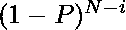

# 作业选择问题–损失最小化策略|第 2 集

> 原文:[https://www . geesforgeks . org/job-selection-problem-loss-minimum-strategy-set-2/](https://www.geeksforgeeks.org/job-selection-problem-loss-minimization-strategy-set-2/)

我们之前讨论过一个损失最小化策略:[作业排序问题——损失最小化](https://www.geeksforgeeks.org/job-sequencing-problem-loss-minimization/)。在本文中，我们将研究适用于稍微不同的问题的另一种策略。
我们有一个从 1 到 N 的 N 种产品的序列。每种产品都有一个体积，用(Vi)表示。约束条件是，一旦完成一件商品，其体积开始以每天固定的百分比(P)衰减。所有的货物都以同样的速度腐烂，而且每一件货物都需要一天的时间才能完成。
我们需要找到货物的生产顺序，以使货物的整体数量最大化。
**例-1:**

```
Input: 4, 2, 151, 15, 1, 52, 12 and P = 10%
Output: 222.503
```

解决方案:在最佳的作业顺序中，所有作业结束时剩余的货物总量为 222.503
**例-2:**

```
Input: 3, 1, 41, 52, 15, 4, 1, 63, 12 and P = 20%
Output: 145.742
```

解决方案:在最佳工作顺序中，所有工作结束时剩余的货物总量为 145.72

**解释–**
由于这是一个优化问题，我们可以尝试使用贪婪算法来解决这个问题。每天我们都从尚未生产的商品中挑选。因此，我们所需要的是一个局部选择标准或启发式，当应用于选择工作时，它会给我们最佳的结果。
我们可以不去尝试最大化成交量，也可以尝试最小化损失。因为从所有货物中可以获得的总体积也是恒定的，如果我们把损失降到最低，我们就能得到最佳答案。
现在考虑任何在第 1 天之后出现体积 V
损失的商品:PV
在第 2 天之后出现损失:PV + P(1-P)V 或 V(2P-P^2)
在第 3 天之后出现损失:v(2p-p^2)+p(1-2p+p^2)v)或 v(3p-3p^2+p^3)
随着时间的增加，损失也会增加。因此，诀窍在于确保产品在生产后不会闲置。此外，由于要求我们每天至少生产一个作业，因此我们应该先执行小批量作业，然后再执行大批量作业。这一策略之所以有效，有两个原因。

1.  大量货物在生产后不会闲置。
2.  随着数量的减少，每天的损失也减少了，所以对于低数量的货物，几天后损失变得可以忽略不计。

因此，为了获得最佳解决方案，我们在以后生产更大体积的产品。第一天选择体积最小的商品并生产出来。从货物清单中删除生产的货物。第二天重复同样的步骤。剩下要生产的货物时，继续重复。
在计算生产结束时的总数量时，请记住第一天生产的货物将会有



乘以它的左音量。显然，从

开始，在第 N 天(最后一天)生产的货物将保持其体积不变

**算法–**

```
Step 1: Add all the goods to a min-heap       
Step 2: Repeat following steps while Queue is not empty
        Extract the good  at the head of the heap
        Print the good
        Remove the good from the heap
        [END OF LOOP]
Step 4: End
```

**复杂性–**
我们精确地执行 N 个 push()和 pop()操作，每个操作都需要 log (N)时间。因此，时间复杂度为 0(N * log(N))。
下面是解决方案的实现。

## C++

```
// C++ implementation of the
// above approach
#include <bits/stdc++.h>
using namespace std;

void optimum_sequence_jobs(vector<int>& V, double P)
{
    int j = 1, N = V.size() - 1;
    double result = 0;

    // Create a min-heap (priority queue)
    priority_queue<int, vector<int>, greater<int> > Queue;

    // Add all goods to the Queue
    for (int i = 1; i <= N; i++)
        Queue.push(V[i]);   

    // Pop Goods from Queue as long as it is not empty
    while (!Queue.empty()) {

        // Print the good
        cout << Queue.top() << " ";

        // Add the Queue to the vector
        // so that total volume can be calculated
        V[j++] = Queue.top();
        Queue.pop();
    }

    // Calclulating volume of goods left when all
    // are produced. Move from right to left of
    // sequence multiplying each volume by
    // increasing powers of 1 - P starting from 0
    for (int i = N; i >= 1; i--)
        result += pow((1 - P), N - i) * V[i];   

    // Print result
    cout << endl << result << endl;
}

// Driver code
int main()
{
    // For implementation simplicity days are numbered
    // from 1 to N. Hence 1 based indexing is used
    vector<int> V{ -1, 3, 5, 4, 1, 2, 7, 6, 8, 9, 10 };

    // 10% loss per day
    double P = 0.10;

    optimum_sequence_jobs(V, P);

    return 0;
}
```

## Java 语言(一种计算机语言，尤用于创建网站)

```
// Java implementation of the
// above approach
import java.util.*;
class GFG{

  static void optimum_sequence_jobs(int[] V,
                                    double P)
{
    int j = 1, N = V.length - 1;
    double result = 0;

    // Create a min-heap
    // (priority queue)
    PriorityQueue<Integer> Queue =
                  new PriorityQueue<>();

    // Add all goods to the Queue
    for (int i = 1; i <= N; i++)
      Queue.add(V[i]);   

    // Pop Goods from Queue as
    // long as it is not empty
    while (!Queue.isEmpty())
    {
      // Print the good
      System.out.print(Queue.peek() +
                       " ");

      // Add the Queue to the vector
      // so that total volume can
      // be calculated
      V[j++] = Queue.peek();
      Queue.remove();
    }

    // Calclulating volume of goods
    // left when all are produced.
    // Move from right to left of
    // sequence multiplying each
    // volume by increasing powers
    // of 1 - P starting from 0
    for (int i = N; i >= 1; i--)
      result += Math.pow((1 - P),
                          N - i) * V[i];   

    // Print result
    System.out.printf("\n%.2f\n",
                      result );
  }

// Driver code
public static void main(String[] args)
{
  // For implementation simplicity
  // days are numbered from 1 to N.
  // Hence 1 based indexing is used
  int[] V = {-1, 3, 5, 4, 1,
             2, 7, 6, 8, 9, 10};

  // 10% loss per day
  double P = 0.10;

  optimum_sequence_jobs(V, P);
}
}

// This code is contributed by Amit Katiyar
```

**输出–**

```
1 2 3 4 5 6 7 8 9 10 
41.3811
```