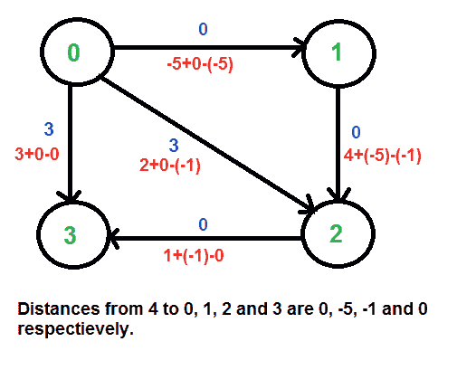

# 约翰逊全对最短路径算法

> 原文:[https://www.geeksforgeeks.org/johnsons-algorithm/](https://www.geeksforgeeks.org/johnsons-algorithm/)

问题是在给定的加权有向图中找到每对顶点之间的最短路径，权重可能是负的。对于这个问题，我们已经讨论了[弗洛伊德·沃肖尔算法](https://www.geeksforgeeks.org/dynamic-programming-set-16-floyd-warshall-algorithm/)。弗洛伊德沃肖尔算法的时间复杂度为θ(V<sup>3</sup>)。*使用约翰逊算法，我们可以在 O(V <sup>2</sup> log V + VE)时间内找到所有的对最短路径。*约翰逊的算法同时使用[迪克斯特拉](https://www.geeksforgeeks.org/greedy-algorithms-set-6-dijkstras-shortest-path-algorithm/)和[贝尔曼-福特](https://www.geeksforgeeks.org/dynamic-programming-set-23-bellman-ford-algorithm/)作为子程序。

如果我们对每一个顶点应用 [Dijkstra 的单源最短路径算法](https://www.geeksforgeeks.org/greedy-algorithms-set-6-dijkstras-shortest-path-algorithm/)，将每一个顶点都视为源，就可以在 O(V*VLogV)时间内找到所有的对最短路径。所以使用 Dijkstra 的单源最短路径似乎是比 [Floyd Warshell](https://www.geeksforgeeks.org/dynamic-programming-set-16-floyd-warshall-algorithm/) 更好的选择，但是 Dijkstra 算法的问题是，它不适用于负权重边。
*约翰逊算法的思想是对所有边重新加权，使其全部为正，然后对每个顶点应用 Dijkstra 算法。*

**如何将一个给定的图转化为所有非负权边的图？**
人们可能会想到一个简单的方法，找到最小权重的边，并把这个权重加到所有边上。不幸的是，这不起作用，因为在不同的路径中可能有不同数量的边(参见[这个](http://geeksquiz.com/data-structures-graph-question-31/)的例子)。如果从一个顶点 u 到 v 有多条路径，那么所有的路径都必须增加相同的数量，这样最短的路径在转换后的图中保持最短。
约翰逊算法的思想是给每个顶点分配一个权重。让分配给顶点 u 的权重为 h[u]。我们使用顶点权重重新加权边。例如，对于权重 w(u，v)的边(u，v)，新权重变为 w(u，v)+h[u]–h[v]。这种重新加权的好处是，任意两个顶点之间的所有路径集都增加了相同的数量，所有负权重都变成非负的。考虑两个顶点 s 和 t 之间的任意路径，每条路径的权重增加 h[s]–h[t]，从 s 到 t 的路径上所有顶点的 h[]值相互抵消。

我们如何计算 h[]值？[贝尔曼-福特算法](https://www.geeksforgeeks.org/dynamic-programming-set-23-bellman-ford-algorithm/)用于此目的。下面是完整的算法。一个新的顶点被添加到图中，并连接到所有现有的顶点。从新顶点到所有现有顶点的最短距离值是 h[]值。

**算法:**
**1)** 让给定的图是 G .给图添加一个新的顶点 s，将新顶点的边添加到 G 的所有顶点.让修改后的图是 G’。

**2)** 在以 s 为源的 G '上运行[贝尔曼-福特算法](https://www.geeksforgeeks.org/dynamic-programming-set-23-bellman-ford-algorithm/)。设贝尔曼-福特计算的距离为 h[0]，h[1]，..h[V-1]。如果我们发现一个负的重量循环，那么返回。请注意，负权重循环不能由新顶点 s 创建，因为 s 没有边。所有边都来自 s

**3)** 重新加权原始图的边。对于每条边(u，v)，指定新的权重为“原始权重+h[u]–h[v]”。

**4)** 移除添加的顶点 s，并对每个顶点运行[迪克斯特拉算法](https://www.geeksforgeeks.org/greedy-algorithms-set-6-dijkstras-shortest-path-algorithm/)。

**变换如何保证非负权边？**
以下关于 h[]值的属性总是正确的，因为它们是最短距离。

```
   h[v] <= h[u] + w(u, v) < pre>该属性简单地表示，从 s 到 v 的最短距离必须小于或等于从 s 到 u 的最短距离加上边的权重(u，v)。新的权重是 w(u，v) + h[u] - h[v]。新权重的值必须大于或等于零，因为不等式“h[v] <= h[u] + w(u, v)". **”示例:
让我们考虑下图。** **[  ](https://media.geeksforgeeks.org/wp-content/cdn-uploads/Johnson1.png)**  我们添加一个源 s，并从 s 向原始图的所有顶点添加边。下图中的 s 是 4。

[](https://media.geeksforgeeks.org/wp-content/cdn-uploads/Johnson2.png)

我们使用贝尔曼-福特算法计算从 4 到所有其他顶点的最短距离。从 4 到 0、1、2 和 3 的最短距离分别为 0、-5、-1 和 0，即 h[] = {0、-5、-1、0}。一旦我们得到这些距离，我们移除源顶点 4，并使用以下公式重新加权边。w(u，v) = w(u，v) + h[u] - h[v]。

[](https://media.geeksforgeeks.org/wp-content/cdn-uploads/Johnson3.png)

由于现在所有权重都是正的，我们可以对每个顶点作为源运行 Dijkstra 的最短路径算法。

 **时间复杂度:**算法中的主要步骤是 Bellman Ford Algorithm 调用一次，Dijkstra 调用 V 次。贝尔曼·福特的时间复杂度是 O(VE)，迪杰斯特拉的时间复杂度是 O(VLogV)。所以整体时间复杂度为 O(V <sup> 2 </sup> log V + VE)。
当图形完成时，约翰逊算法的时间复杂度变得与[弗洛伊德·瓦尔谢尔](https://www.geeksforgeeks.org/dynamic-programming-set-16-floyd-warshall-algorithm/)相同(对于一个完整的图形 E = O(V)<sup>2</sup>)。但是对于稀疏图，该算法的性能要比 [Floyd Warshell](https://www.geeksforgeeks.org/dynamic-programming-set-16-floyd-warshall-algorithm/) 好得多。

 **参考文献:** 
 [算法导论第三版作者:克利福德·斯坦、托马斯·h·科曼、查尔斯·e·雷瑟森、罗纳德·L·李维斯特](http://www.flipkart.com/introduction-algorithms-3/p/itmczynzhyhxv2gs?pid=9788120340077&affid=sandeepgfg)
[http://www.youtube.com/watch?v=b6LOHvCzmkI](http://www.youtube.com/watch?v=b6LOHvCzmkI)
T48】http://www.youtube.com/watch?v=TV2Z6nbo1ic
T51】http://en.wikipedia.org/wiki/Johnson%27s_algorithm
[http://www.youtube.com/watch?v=Sygq1e0xWnM](http://www.youtube.com/watch?v=Sygq1e0xWnM)

如果发现任何不正确的地方，请写评论，或者想分享以上讨论话题的更多信息。

 = > =>
```