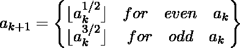

# 杂耍者序列

> 原文:[https://www.geeksforgeeks.org/juggler-sequence/](https://www.geeksforgeeks.org/juggler-sequence/)

杂耍器序列是一系列整数，其中第一个术语以正整数 *a* 开头，其余术语使用以下递归关系从前一个术语生成:

杂耍器序列以数字 3 开头:
5、11、36、6、2、1
杂耍器序列以数字 9 开头:
9、27、140、11、36、6、2、1
给定一个数字 *n* we
示例:

```
Input: 9
Output: 9, 27, 140, 11, 36, 6, 2, 1
We start with 9 and use above formula to get
next terms.

Input: 6
Output: 6, 2, 1
```

## C++

```
// C++ implementation of Juggler Sequence
#include <bits/stdc++.h>
using namespace std;

// This function prints the juggler Sequence
void printJuggler(long long n)
{
    long long a = n;

    // print the first term
    cout << a << " ";

    // calculate terms until
    // last term is not 1
    while (a != 1)
    {
        long long b = 0;

        // Check if previous term
        // is even or odd
        if (a % 2 == 0)

            // calculate next term
            b = floor(sqrt(a));

        else

            // for odd previous term
            // calculate next term
            b = floor(sqrt(a) *
                      sqrt(a) * sqrt(a));

        cout << b << " ";
        a = b;
    }
}

// Driver Code
int main()
{
    printJuggler(37);
    cout <<"\n";
    printJuggler(9);
    return 0;
}

// This code is contributed by shubhamsingh10
```

## C

```
// C implementation of Juggler Sequence
#include<stdio.h>
#include<math.h>

// This function prints the juggler Sequence
void printJuggler(int n)
{
    int a = n;

    // print the first term
    printf("%d ", a);

    // calculate terms until last term is not 1
    while (a != 1)
    {
        int b = 0;

        // Check if previous term is even or odd
        if (a%2 == 0)

            // calculate next term
            b  = floor(sqrt(a));

        else

            // for odd previous term calculate
            // next term
            b = floor(sqrt(a)*sqrt(a)*sqrt(a));

        printf("%d ", b);
        a = b;
    }
}

//driver program to test above function
int main()
{
    printJuggler(3);
    printf("\n");
    printJuggler(9);
    return 0;
}
```

## Java 语言(一种计算机语言，尤用于创建网站)

```
// Java implementation of Juggler Sequence
import java.io.*;
import java.math.*;

class GFG {

    // This function prints the juggler Sequence
    static void printJuggler(int n)
    {
        int a = n;

       // print the first term
       System.out.print(a+" ");

      // calculate terms until last term is not 1
       while (a != 1)
       {
          int b = 0;

          // Check if previous term is even or odd
          if (a%2 == 0)

             // calculate next term
                b  = (int)Math.floor(Math.sqrt(a));

          else

            // for odd previous term calculate
            // next term
                b =(int) Math.floor(Math.sqrt(a) *
                               Math.sqrt(a) * Math.sqrt(a));

          System.out.print( b+" ");
          a = b;
        }
    }

// Driver program to test above function
public static void main (String[] args) {
    printJuggler(3);
    System.out.println();
    printJuggler(9);
    }
}

//This code is contributed by Nikita Tiwari.
```

## 计算机编程语言

```
import math

#This function prints the juggler Sequence
def printJuggler(n) :
    a = n

    # print the first term
    print a,

    # calculate terms until last term is not 1
    while (a != 1) :
        b = 0

        # Check if previous term is even or odd
        if (a%2 == 0) :

            # calculate next term
            b  = (int)(math.floor(math.sqrt(a)))

        else :
            # for odd previous term calculate
            # next term
            b = (int) (math.floor(math.sqrt(a)*math.sqrt(a)*
                                         math.sqrt(a)))

        print b,
        a = b

printJuggler(3)
print
printJuggler(9)

# This code is contributed by Nikita Tiwari.
```

## C#

```
// C# implementation of Juggler Sequence
using System;

class GFG {

    // This function prints the juggler Sequence
    static void printJuggler(int n)
    {
        int a = n;

    // print the first term
    Console.Write(a+" ");

    // calculate terms until last term is not 1
    while (a != 1)
    {
        int b = 0;

        // Check if previous term is even or odd
        if (a%2 == 0)

            // calculate next term
                b = (int)Math.Floor(Math.Sqrt(a));

        else

            // for odd previous term calculate
            // next term
                b =(int) Math.Floor(Math.Sqrt(a) *
                     Math.Sqrt(a) * Math.Sqrt(a));

        Console.Write( b+" ");
        a = b;
        }
    }

// Driver Code
public static void Main () {
    printJuggler(3);
    Console.WriteLine();
    printJuggler(9);
    }
}

// This code is contributed by Nitin Mittal
```

## 服务器端编程语言（Professional Hypertext Preprocessor 的缩写）

```
<?php
// PHP implementation of
// Juggler Sequence

// function prints the
// juggler Sequence
function printJuggler($n)
{
    $a = $n;

    // print the first term
    echo($a . " ");

    // calculate terms until
    // last term is not 1
    while ($a != 1)
    {
        $b = 0;

        // Check if previous
        // term is even or odd
        if ($a % 2 == 0)

            // calculate next term
            $b = floor(sqrt($a));

        else

            // for odd previous term
            // calculate next term
            $b = floor(sqrt($a) * sqrt($a) *
                                  sqrt($a));

        echo($b . " ");
        $a = $b;
    }
}

// Driver Code
printJuggler(3);
echo("\n");
printJuggler(9);

// This code is contributed by Ajit.
?>
```

## java 描述语言

```
<script>

// Javascript implementation of Juggler Sequence

    // This function prints the juggler Sequence
    function printJuggler(n)
    {
        let a = n;

       // print the first term
       document.write(a+" ");

      // calculate terms until last term is not 1
       while (a != 1)
       {
          let b = 0;

          // Check if previous term is even or odd
          if (a%2 == 0)

             // calculate next term
                b  = Math.floor(Math.sqrt(a));

          else

            // for odd previous term calculate
            // next term
                b = Math.floor(Math.sqrt(a) *
                               Math.sqrt(a) * Math.sqrt(a));

          document.write( b+" ");
          a = b;
        }
    }

// Driver code to test above methods

    printJuggler(3);
    document.write("<br/>");
    printJuggler(9);

 // This code is contributed by avijitmondal1998.
</script>
```

输出:

```
3 5 11 36 6 2 1 
9 27 140 11 36 6 2 1
```

**要点:**

*   杂耍序列中的术语首先增加到峰值，然后开始减少。
*   杂耍序列中的最后一项总是 1。

**参考:**
[https://en.wikipedia.org/wiki/Juggler_sequence](https://en.wikipedia.org/wiki/Juggler_sequence)
本文由 [**Harsh Agarwal**](https://www.facebook.com/harsh.agarwal.16752) 供稿。如果你喜欢 GeeksforGeeks 并想投稿，你也可以使用[write.geeksforgeeks.org](https://write.geeksforgeeks.org)写一篇文章或者把你的文章邮寄到 contribute@geeksforgeeks.org。看到你的文章出现在极客博客主页上，帮助其他极客。
如果发现有不正确的地方，或者想分享更多关于上述话题的信息，请写评论。