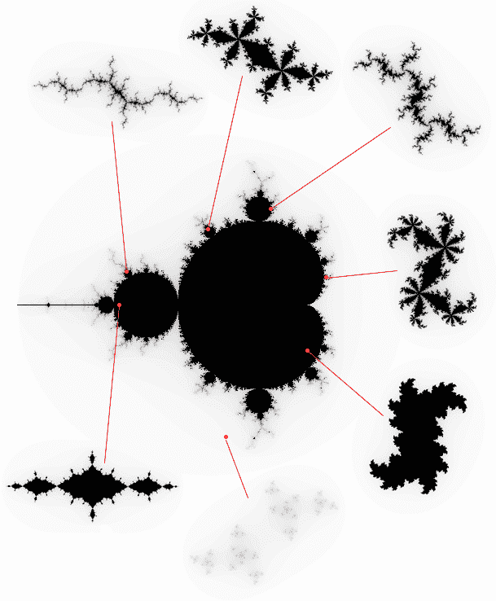
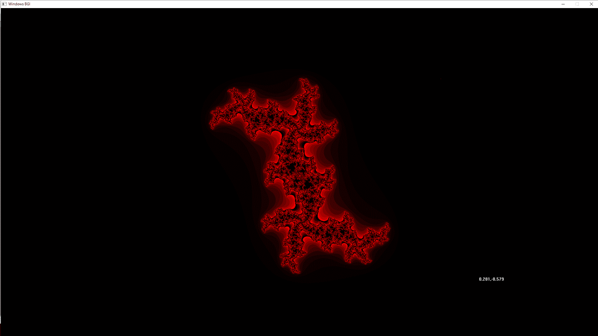
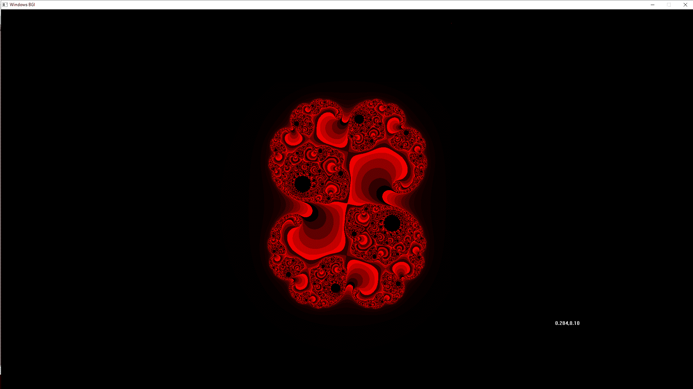
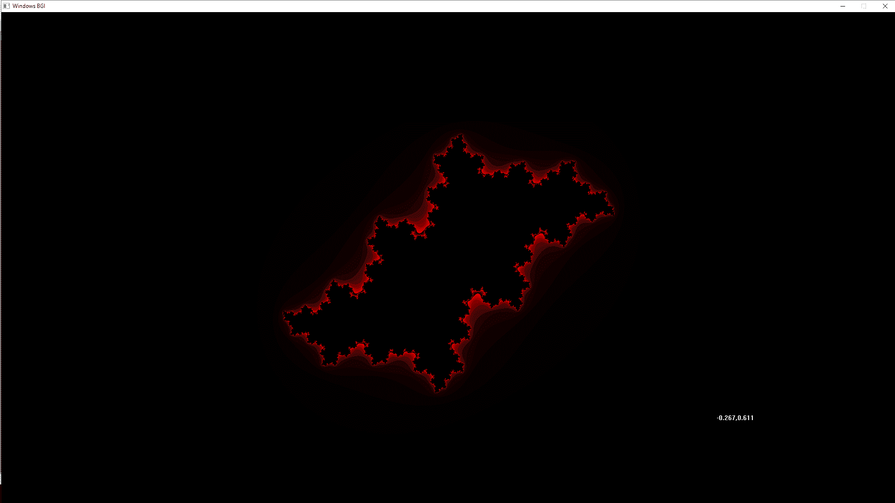
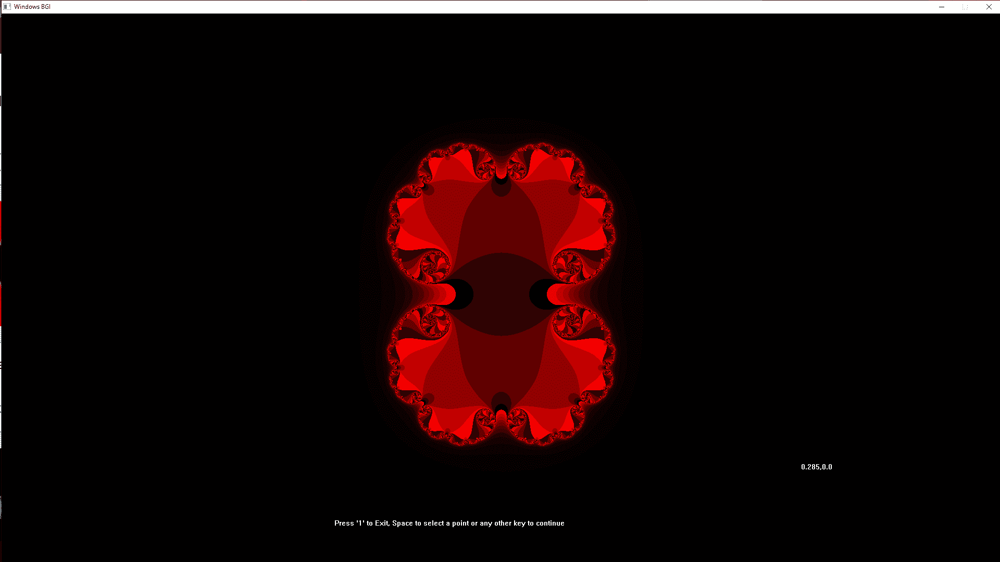

# 朱莉娅分形集在 C/C++中使用图形

> 原文:[https://www . geesforgeks . org/Julia-fractal-set-in-c-c-using-graphics/](https://www.geeksforgeeks.org/julia-fractal-set-in-c-c-using-graphics/)

[](https://commons.wikimedia.org/wiki/File:JSr07885.gif#/media/File:JSr07885.gif)

[CC BY-SA 4.0](https://creativecommons.org/licenses/by-sa/4.0 "Creative Commons Attribution-Share Alike 4.0"), [Link](https://commons.wikimedia.org/w/index.php?curid=44398419)

Julia 集与复平面上的那些点 **z = x + iy** 相关联，对于这些点，级数 zn+1 = zn2 + c 不趋向于无穷大。c 是一个复常数，每个 c 得到一个不同的 Julia 集，级数的初始值 z0 是像平面上的每个点。

众所周知的曼德勃罗集构成了朱莉娅集的一种索引。一个 Julia 集要么是连通的，要么是不连通的，从 Mandelbrot 集中选择的 c 值是连通的，而从 Mandelbrot 集中选择的 c 值是不连通的。不相连的集合通常被称为“尘埃”，它们由单个点组成，无论以什么分辨率观察它们。



### 代码

```
#include <complex.h>
#include <stdio.h>
#include <tgmath.h>
#include <winbgim.h>

#define Y 1079
#define X 1919

// To recursively find the end value
// of the passed point till the pixel
// goes out of the bounded region
// or the maximum depth is reached.
int julia_point(float x, float y,
                int r, int depth,
                int max,
                double _Complex c,
                double _Complex z)
{
    if (cabs(z) > r) {
        putpixel(x, y,
                 COLOR(255 - 255 * ((max - depth) * (max - depth)) % (max * max),
                       0, 0));
        depth = 0;
    }
    if (sqrt(pow((x - X / 2), 2)
             + pow((y - Y / 2), 2))
        > Y / 2) {
        putpixel(x, y, 0);
    }
    if (depth < max / 4) {
        return 0;
    }
    julia_point(x, y, r,
                depth - 1, max,
                c, cpow(z, 2) + c);
}

// To select the points in a Julia set.
void juliaset(int depth, double _Complex c, int r, int detail)
{
    for (float x = X / 2 - Y / 2; x < X / 2 + Y / 2; x += detail) {
        for (float y = 0; y < Y; y += detail) {
            julia_point(x, y, r,
                        depth, depth, c,
                        (2 * r * (x - X / 2) / Y)
                            + (2 * r * (y - Y / 2) / Y)
                                  * _Complex_I);
        }
    }
}

// Driver code
int main()
{
    initwindow(X, Y);
    int depth = 100, r = 2, detail = 1;

    // Initial value for Julia
    // set taken by my personal preference.
    double _Complex c = 0.282 - 0.58 * _Complex_I;
    while (1) {

        cleardevice();

        // To formulate the display text
        // for the 'c' coordinate
        // into string format.
        char str1[100], str2[100], strtemp[100];
        if (floor(creal(c)) == -1) {
            strcpy(str1, "-0.");
        }
        if (floor(creal(c)) == -0) {
            strcpy(str1, "0.");
        }
        if (floor(cimag(c)) == -1) {
            strcpy(str2, "-0.");
        }
        if (floor(cimag(c)) == -0) {
            strcpy(str2, "0.");
        }
        itoa(sqrt(pow(creal(c), 2)) * 1000, strtemp, 10);
        strcat(str1, strtemp);
        strcat(str1, ", ");
        itoa(sqrt(pow(cimag(c), 2)) * 1000, strtemp, 10);
        strcat(str2, strtemp);
        strcat(str1, str2);
        outtextxy(X * 0.8, Y * 0.8, str1);

        // To call the julia-set for the selected value of 'c'.
        juliaset(depth, c, r, detail);
        outtextxy(X / 3, Y * 0.9,
                  "Press '1' to Exit, Space to"
                  " select a point or any "
                  "other key to continue");
        char key = getch();

        if (key == '\n') {
            break;
        }

        // To select the value of 'c'
        // using the position of the mouse and then
        // normalizing it between a value of -1-1i and 1+1i.
        while (key == ' ') {

            c = 2 * (double)(mousex() - X / 2) / X + 2 * (mousey() - Y / 2) * _Complex_I / Y;

            if (floor(creal(c)) == -1) {
                strcpy(str1, "-0.");
            }

            if (floor(creal(c)) == -0) {
                strcpy(str1, "0.");
            }

            if (floor(cimag(c)) == -1) {
                strcpy(str2, "-0.");
            }

            if (floor(cimag(c)) == -0) {
                strcpy(str2, "0.");
            }

            itoa(sqrt(pow(creal(c), 2))
                     * 1000,
                 strtemp, 10);
            strcat(str1, strtemp);
            strcat(str1, ", ");
            itoa(sqrt(pow(cimag(c), 2))
                     * 1000,
                 strtemp, 10);
            strcat(str2, strtemp);
            strcat(str1, str2);
            outtextxy(X * 0.8, Y * 0.8, str1);
            if (kbhit()) {
                key = getch();
            }
        }
    }
    closegraph();
    return 0;
}
```

### ****输出****

**


**