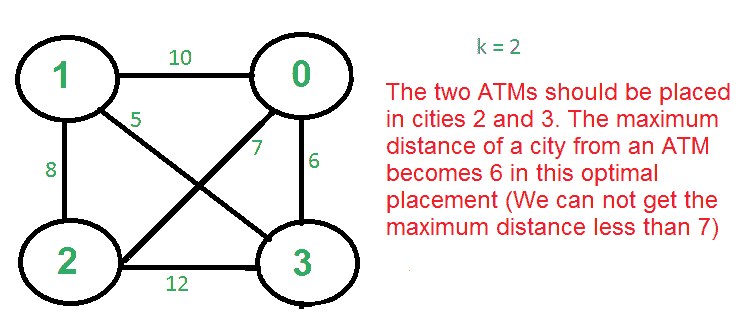

# K 个中心问题|集合 1(贪婪近似算法)

> 原文:[https://www . geesforgeks . org/k-centers-problem-set-1-greedy-approach-algorithm/](https://www.geeksforgeeks.org/k-centers-problem-set-1-greedy-approximate-algorithm/)

给定 n 个城市和每对城市之间的距离，选择 k 个城市放置仓库(或自动取款机或云服务器)，使得一个城市到仓库(或自动取款机或云服务器)的最大距离最小。

例如，考虑以下四个城市，0、1、2 和 3，以及它们之间的距离，如何在这四个城市中放置 2 台自动取款机，使一个城市到自动取款机的最大距离最小化。



这个问题没有多项式时间的解决方案，因为这个问题是一个已知的 NP-Hard 问题。有一个多项式时间的贪婪近似算法，贪婪算法提供了一个永远不会比最优解差两倍的解。只有当城市之间的距离遵循[三角不等式](http://en.wikipedia.org/wiki/Triangle_inequality)(两点之间的距离总是小于通过第三点的距离之和)时，贪婪解才有效。

**2-近似贪婪算法:**
1)任意选择第一个中心。
2)使用以下标准选择剩余的 k-1 中心。
让 c1，c2，c3，… ci 成为已经选择的中心。选择
(i+1)第一个中心，选择距离已经
选定中心最远的城市，即点 p，其最大值如下
Min[dist(p，c1)，dist(p，c2)，dist(p，c3)，…。距离(p，ci)]


**示例(上图中 k = 3)**
a)让第一个任意拾取的顶点为 0。
b)下一个顶点是 1，因为 1 是距离 0 最远的顶点。
c)剩下的城市是 2 和 3。计算它们与已选中心(0 和 1)的距离。贪婪算法基本上计算以下值。
从 2 到已经考虑的中心的所有距离的最小值
Min[dist(2，0)，dist(2，1)] = Min[7，8] = 7
从 3 到已经考虑的中心的所有距离的最小值
Min[dist(3，0)，dist(3，1)] = Min[6，5] = 5
计算上述值后，选择城市 2 作为对应于 2 的最大值。

请注意，贪婪算法没有给出 k = 2 的最佳解，因为这只是一个近似算法，其界限是最佳值的两倍。

**证明上述贪婪算法是 2 近似。**
让 OPT 为最优解中一个城市到中心的最大距离。我们需要证明从贪婪算法获得的最大距离是 2*OPT。
可以用矛盾做证明。
a)假设最远点到所有中心的距离为> 2 OPT。
b)这意味着所有中心之间的距离也是> 2 OPT。
c)我们有 k + 1 个点，每对之间有距离> 2 个 OPT。
d)每个点都有一个距离< = OPT 的最优解的中心。
e)最优解中存在一对中心 X 相同的点(鸽子洞原理:k 个最优中心，k+1 个点)
f)它们之间的距离最多为 2 OPT(三角不等式)，这是一个矛盾。

## C++

```
// C++ program for the above approach
#include <bits/stdc++.h>
using namespace std;

int maxindex(int* dist, int n)
{
    int mi = 0;
    for (int i = 0; i < n; i++) {
        if (dist[i] > dist[mi])
            mi = i;
    }
    return mi;
}

void selectKcities(int n, int weights[4][4], int k)
{
    int* dist = new int[n];
    vector<int> centers;
    for (int i = 0; i < n; i++) {
        dist[i] = INT_MAX;
    }

    // index of city having the
    // maximum distance to it's
    // closest center
    int max = 0;
    for (int i = 0; i < k; i++) {
        centers.push_back(max);
        for (int j = 0; j < n; j++) {

            // updating the distance
            // of the cities to their
            // closest centers
            dist[j] = min(dist[j], weights[max][j]);
        }

        // updating the index of the
        // city with the maximum
        // distance to it's closest center
        max = maxindex(dist, n);
    }

    // Printing the maximum distance
    // of a city to a center
    // that is our answer
    cout << endl << dist[max] << endl;

    // Printing the cities that
    // were chosen to be made
    // centers
    for (int i = 0; i < centers.size(); i++) {
        cout << centers[i] << " ";
    }
    cout << endl;
}

// Driver Code
int main()
{
    int n = 4;
    int weights[4][4] = { { 0, 4, 8, 5 },
                          { 4, 0, 10, 7 },
                          { 8, 10, 0, 9 },
                          { 5, 7, 9, 0 } };
    int k = 2;

    // Function Call
    selectKcities(n, weights, k);
}
// Contributed by Balu Nagar
```

## Java 语言(一种计算机语言，尤用于创建网站)

```
// Java program for the above approach
import java.util.*;

class GFG{

static int maxindex(int[] dist, int n)
{
    int mi = 0;
    for(int i = 0; i < n; i++)
    {
        if (dist[i] > dist[mi])
            mi = i;
    }
    return mi;
}

static void selectKcities(int n, int weights[][],
                          int k)
{
    int[] dist = new int[n];
    ArrayList<Integer> centers = new ArrayList<>();
    for(int i = 0; i < n; i++)
    {
        dist[i] = Integer.MAX_VALUE;
    }

    // Index of city having the
    // maximum distance to it's
    // closest center
    int max = 0;
    for(int i = 0; i < k; i++)
    {
        centers.add(max);
        for(int j = 0; j < n; j++)
        {

            // Updating the distance
            // of the cities to their
            // closest centers
            dist[j] = Math.min(dist[j],
                               weights[max][j]);
        }

        // Updating the index of the
        // city with the maximum
        // distance to it's closest center
        max = maxindex(dist, n);
    }

    // Printing the maximum distance
    // of a city to a center
    // that is our answer
    System.out.println(dist[max]);

    // Printing the cities that
    // were chosen to be made
    // centers
    for(int i = 0; i < centers.size(); i++)
    {
        System.out.print(centers.get(i) + " ");
    }
    System.out.print("\n");
}

// Driver Code
public static void main(String[] args)
{
    int n = 4;
    int[][] weights = new int[][]{ { 0, 4, 8, 5 },
                                   { 4, 0, 10, 7 },
                                   { 8, 10, 0, 9 },
                                   { 5, 7, 9, 0 } };
    int k = 2;

    // Function Call
    selectKcities(n, weights, k);
}
}

// This code is contributed by nspatilme
```

## 蟒蛇 3

```
# Python3 program for the above approach
def maxindex(dist, n):
    mi = 0
    for i in range(n):
        if (dist[i] > dist[mi]):
            mi = i
    return mi

def selectKcities(n, weights, k):
    dist = [0]*n
    centers = []

    for i in range(n):
        dist[i] = 10**9

    # index of city having the
    # maximum distance to it's
    # closest center
    max = 0
    for i in range(k):
        centers.append(max)
        for j in range(n):

            # updating the distance
            # of the cities to their
            # closest centers
            dist[j] = min(dist[j], weights[max][j])

        # updating the index of the
        # city with the maximum
        # distance to it's closest center
        max = maxindex(dist, n)

    # Printing the maximum distance
    # of a city to a center
    # that is our answer
    # print()
    print(dist[max])

    # Printing the cities that
    # were chosen to be made
    # centers
    for i in centers:
        print(i, end = " ")

# Driver Code
if __name__ == '__main__':
    n = 4
    weights = [ [ 0, 4, 8, 5 ],
              [ 4, 0, 10, 7 ],
              [ 8, 10, 0, 9 ],
              [ 5, 7, 9, 0 ] ]
    k = 2

    # Function Call
    selectKcities(n, weights, k)

# This code is contributed by mohit kumar 29.
```

## C#

```
using System;
using System.Collections.Generic;

public class GFG{

    static int maxindex(int[] dist, int n)
    {
        int mi = 0;
        for(int i = 0; i < n; i++)
        {
            if (dist[i] > dist[mi])
                mi = i;
        }
        return mi;
    }

    static void selectKcities(int n, int[,] weights,
                              int k)
    {
        int[] dist = new int[n];
        List<int> centers = new List<int>();
        for(int i = 0; i < n; i++)
        {
            dist[i] = Int32.MaxValue;
        }

        // Index of city having the
        // maximum distance to it's
        // closest center
        int max = 0;
        for(int i = 0; i < k; i++)
        {
            centers.Add(max);
            for(int j = 0; j < n; j++)
            {

                // Updating the distance
                // of the cities to their
                // closest centers
                dist[j] = Math.Min(dist[j],
                                   weights[max,j]);
            }

            // Updating the index of the
            // city with the maximum
            // distance to it's closest center
            max = maxindex(dist, n);
        }

        // Printing the maximum distance
        // of a city to a center
        // that is our answer
        Console.WriteLine(dist[max]);

        // Printing the cities that
        // were chosen to be made
        // centers
        for(int i = 0; i < centers.Count; i++)
        {
            Console.Write(centers[i] + " ");
        }
        Console.Write("\n");
    }

    // Driver Code
    static public void Main (){

        int n = 4;
    int[,] weights = new int[,]{ { 0, 4, 8, 5 },
                                   { 4, 0, 10, 7 },
                                   { 8, 10, 0, 9 },
                                   { 5, 7, 9, 0 } };
    int k = 2;

    // Function Call
    selectKcities(n, weights, k);

    }
}

// This code is contributed by avanitrachhadiya2155.
```

## java 描述语言

```
<script>
// Javascript program for the above approach

    function maxindex(dist,n)
    {
        let mi = 0;
    for(let i = 0; i < n; i++)
    {
        if (dist[i] > dist[mi])
            mi = i;
    }
    return mi;
    }

    function selectKcities(n,weights,k)
    {
        let dist = new Array(n);
    let centers = [];
    for(let i = 0; i < n; i++)
    {
        dist[i] = Number.MAX_VALUE;
    }

    // Index of city having the
    // maximum distance to it's
    // closest center
    let max = 0;
    for(let i = 0; i < k; i++)
    {
        centers.push(max);
        for(let j = 0; j < n; j++)
        {

            // Updating the distance
            // of the cities to their
            // closest centers
            dist[j] = Math.min(dist[j],
                               weights[max][j]);
        }

        // Updating the index of the
        // city with the maximum
        // distance to it's closest center
        max = maxindex(dist, n);
    }

    // Printing the maximum distance
    // of a city to a center
    // that is our answer
    document.write(dist[max]+"<br>");

    // Printing the cities that
    // were chosen to be made
    // centers
    for(let i = 0; i < centers.length; i++)
    {
        document.write(centers[i] + " ");
    }
    document.write("<br>");
    }

    // Driver Code
    let n = 4;
    let weights = [ [ 0, 4, 8, 5 ],
              [ 4, 0, 10, 7 ],
              [ 8, 10, 0, 9 ],
              [ 5, 7, 9, 0 ] ]
    let k = 2
    selectKcities(n, weights, k)

    // This code is contributed by unknown2108
</script>
```

**Output**

```
5
0 2 
```

**来源:**
http://algo2.iti.kit.edu/vanstee/courses/kcenter.pdf
本文由 **Harshit** 供稿。如果你发现任何不正确的地方，或者你想分享更多关于上面讨论的话题的信息，请写评论。