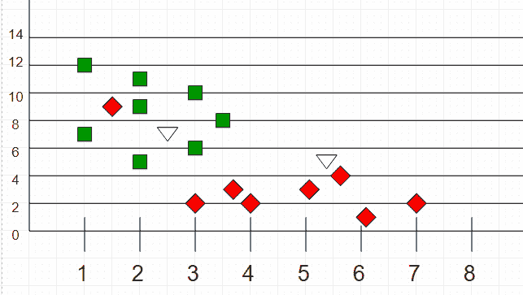

# K-最近邻

> 原文:[https://www.geeksforgeeks.org/k-nearest-neighbours/](https://www.geeksforgeeks.org/k-nearest-neighbours/)

k 近邻算法是机器学习中最基本也是最基本的分类算法之一。它属于监督学习领域，在模式识别、数据挖掘和入侵检测中有着广泛的应用。
由于它是非参数的，也就是说，它对数据的分布不做任何潜在的假设(与其他算法如 [GMM](https://en.wikipedia.org/wiki/Mixture_model) 相反，后者假设给定数据是高斯分布的)，因此在现实场景中被广泛使用。
给我们一些先验数据(也叫训练数据)，把坐标分类成一个属性标识的组。
例如，考虑包含两个特征的下表数据点:


现在，给定另一组数据点(也称为测试数据)，通过分析训练集将这些点分配到一个组中。请注意，未分类的点标记为“白色”。



**直觉**
如果我们把这些点画在一个图上，我们也许能找到一些集群或群体。现在，给定一个未分类的点，我们可以通过观察它最近的邻居属于哪个组来将其分配给一个组。这意味着靠近被归类为“红色”的一组点的一个点被归类为“红色”的概率更高。
直观来看，我们可以看到第一点(2.5，7)应该归类为‘绿色’，第二点(5.5，4.5)应该归类为‘红色’。
**算法**
设 m 为训练数据样本数。设 p 为未知点。

1.  将训练样本存储在数据点数组 arr[]中。这意味着这个数组的每个元素代表一个元组(x，y)。

```
for i=0 to m:
  Calculate Euclidean distance d(arr[i], p).
```

1.  得到最小距离的集合。这些距离中的每一个都对应于已经分类的数据点。
2.  在 s 中返回多数标签。

k 可以保持为奇数，这样我们就可以在只有两个组的情况下(例如红色/蓝色)计算出明显的多数。随着 K 的增加，我们在不同的分类中得到更平滑、更明确的边界。此外，随着训练集中数据点数量的增加，上述分类器的精度也会提高。
**示例程序**
假设 0 和 1 作为两个分类器(组)。

## C++

```
// C++ program to find groups of unknown
// Points using K nearest neighbour algorithm.
#include <bits/stdc++.h>
using namespace std;

struct Point
{
    int val;     // Group of point
    double x, y;     // Co-ordinate of point
    double distance; // Distance from test point
};

// Used to sort an array of points by increasing
// order of distance
bool comparison(Point a, Point b)
{
    return (a.distance < b.distance);
}

// This function finds classification of point p using
// k nearest neighbour algorithm. It assumes only two
// groups and returns 0 if p belongs to group 0, else
// 1 (belongs to group 1).
int classifyAPoint(Point arr[], int n, int k, Point p)
{
    // Fill distances of all points from p
    for (int i = 0; i < n; i++)
        arr[i].distance =
            sqrt((arr[i].x - p.x) * (arr[i].x - p.x) +
                 (arr[i].y - p.y) * (arr[i].y - p.y));

    // Sort the Points by distance from p
    sort(arr, arr+n, comparison);

    // Now consider the first k elements and only
    // two groups
    int freq1 = 0;     // Frequency of group 0
    int freq2 = 0;     // Frequency of group 1
    for (int i = 0; i < k; i++)
    {
        if (arr[i].val == 0)
            freq1++;
        else if (arr[i].val == 1)
            freq2++;
    }

    return (freq1 > freq2 ? 0 : 1);
}

// Driver code
int main()
{
    int n = 17; // Number of data points
    Point arr[n];

    arr[0].x = 1;
    arr[0].y = 12;
    arr[0].val = 0;

    arr[1].x = 2;
    arr[1].y = 5;
    arr[1].val = 0;

    arr[2].x = 5;
    arr[2].y = 3;
    arr[2].val = 1;

    arr[3].x = 3;
    arr[3].y = 2;
    arr[3].val = 1;

    arr[4].x = 3;
    arr[4].y = 6;
    arr[4].val = 0;

    arr[5].x = 1.5;
    arr[5].y = 9;
    arr[5].val = 1;

    arr[6].x = 7;
    arr[6].y = 2;
    arr[6].val = 1;

    arr[7].x = 6;
    arr[7].y = 1;
    arr[7].val = 1;

    arr[8].x = 3.8;
    arr[8].y = 3;
    arr[8].val = 1;

    arr[9].x = 3;
    arr[9].y = 10;
    arr[9].val = 0;

    arr[10].x = 5.6;
    arr[10].y = 4;
    arr[10].val = 1;

    arr[11].x = 4;
    arr[11].y = 2;
    arr[11].val = 1;

    arr[12].x = 3.5;
    arr[12].y = 8;
    arr[12].val = 0;

    arr[13].x = 2;
    arr[13].y = 11;
    arr[13].val = 0;

    arr[14].x = 2;
    arr[14].y = 5;
    arr[14].val = 1;

    arr[15].x = 2;
    arr[15].y = 9;
    arr[15].val = 0;

    arr[16].x = 1;
    arr[16].y = 7;
    arr[16].val = 0;

    /*Testing Point*/
    Point p;
    p.x = 2.5;
    p.y = 7;

    // Parameter to decide group of the testing point
    int k = 3;
    printf ("The value classified to unknown point"
            " is %d.\n", classifyAPoint(arr, n, k, p));
    return 0;
}
```

## 蟒蛇 3

```
# Python3 program to find groups of unknown
# Points using K nearest neighbour algorithm.

import math

def classifyAPoint(points,p,k=3):
    '''
     This function finds the classification of p using
     k nearest neighbor algorithm. It assumes only two
     groups and returns 0 if p belongs to group 0, else
      1 (belongs to group 1).

      Parameters -
          points: Dictionary of training points having two keys - 0 and 1
                   Each key have a list of training data points belong to that

          p : A tuple, test data point of the form (x,y)

          k : number of nearest neighbour to consider, default is 3
    '''

    distance=[]
    for group in points:
        for feature in points[group]:

            #calculate the euclidean distance of p from training points
            euclidean_distance = math.sqrt((feature[0]-p[0])**2 +(feature[1]-p[1])**2)

            # Add a tuple of form (distance,group) in the distance list
            distance.append((euclidean_distance,group))

    # sort the distance list in ascending order
    # and select first k distances
    distance = sorted(distance)[:k]

    freq1 = 0 #frequency of group 0
    freq2 = 0 #frequency og group 1

    for d in distance:
        if d[1] == 0:
            freq1 += 1
        elif d[1] == 1:
            freq2 += 1

    return 0 if freq1>freq2 else 1

# driver function
def main():

    # Dictionary of training points having two keys - 0 and 1
    # key 0 have points belong to class 0
    # key 1 have points belong to class 1

    points = {0:[(1,12),(2,5),(3,6),(3,10),(3.5,8),(2,11),(2,9),(1,7)],
              1:[(5,3),(3,2),(1.5,9),(7,2),(6,1),(3.8,1),(5.6,4),(4,2),(2,5)]}

    # testing point p(x,y)
    p = (2.5,7)

    # Number of neighbours
    k = 3

    print("The value classified to unknown point is: {}".\
          format(classifyAPoint(points,p,k)))

if __name__ == '__main__':
    main()

# This code is contributed by Atul Kumar (www.fb.com/atul.kr.007)
```

输出:

```
The value classified to unknown point is 0.
```

**时间复杂度:**O(N * logN)
T3】辅助空间: O(1)

本文由 **Anannya Uberoi** 供稿。如果你喜欢 GeeksforGeeks 并想投稿，你也可以使用[write.geeksforgeeks.org](http://www.write.geeksforgeeks.org)写一篇文章或者把你的文章邮寄到 review-team@geeksforgeeks.org。看到你的文章出现在极客博客主页上，帮助其他极客。
如果你发现任何不正确的地方，或者你想分享更多关于上面讨论的话题的信息，请写评论。