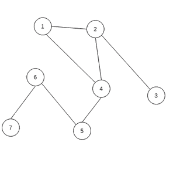

# 社交网络上的 K 壳分解

> 原文:[https://www . geesforgeks . org/k-shell-分解-on-social-networks/](https://www.geeksforgeeks.org/k-shell-decomposition-on-social-networks/)

**先决条件:** [社交网络入门](https://www.geeksforgeeks.org/introduction-to-social-networks-using-networkx-in-python/)

K-shell 分解是一种根据节点的度来划分节点的方法，比如一个桶中的度为 1 的节点等。

考虑一个例子，假设有 n 个节点，并在其中应用 k-shell 分解。因此，具有 1 级的节点将位于*桶 1* 中，然后我们将看到断开这些节点后，是否还有剩余的具有 1 级的节点。如果是，那么我们将把它们添加到桶 1 中，并再次检查和重复这些步骤以获得 2 级、3 级等，然后将它们放入*桶 2* 、*桶 3* 等。



具有 7 个节点的初始图

首先在上面的图中，我们将把 1 度的节点放在桶 1 中，即节点 3 和 7。之后，我们将删除节点 3 和 7，并检查是否还有节点 1，即节点 6。现在我们将移除节点 6，并检查剩下的任何 1 级节点，也就是节点 5。因此，我们将移除节点 5，并再次检查，但是没有剩余 1 度的节点，因此，现在我们将检查 2 度的节点，即节点 1、2 和 4，现在图中还有剩余的节点。所以*七叶树 1 = [3，7，6，5]* 和*七叶树 2 = [1，2，4]* 。

以下是社交网络上 K 壳分解的实现:

## 蟒蛇 3

```
# Import required modules
import networkx as nx
import matplotlib.pyplot as plt

# Check if there is any node left with degree d
def check(h, d):
    f = 0  # there is no node of deg <= d
    for i in h.nodes():
        if (h.degree(i) <= d):
            f = 1
            break
    return f

# Find list of nodes with particular degree
def find_nodes(h, it):
    set1 = []
    for i in h.nodes():
        if (h.degree(i) <= it):
            set1.append(i)
    return set1

# Create graph object and add nodes
g = nx.Graph()
g.add_edges_from(
    [(1, 2), (1, 9), (3, 13), (4, 6),
     (5, 6), (5, 7), (5, 8), (5, 9), 
     (5, 10), (5, 11), (5, 12), (10, 12), 
     (10, 13), (11, 14), (12, 14), 
     (12, 15), (13, 14), (13, 15), 
     (13, 17), (14, 15), (15, 16)])

# Copy the graph
h = g.copy()
it = 1

# Bucket being filled currently
tmp = []

# list of lists of buckets
buckets = []
while (1):
    flag = check(h, it)
    if (flag == 0):
        it += 1
        buckets.append(tmp)
        tmp = []
    if (flag == 1):
        node_set = find_nodes(h, it)
        for each in node_set:
            h.remove_node(each)
            tmp.append(each)
    if (h.number_of_nodes() == 0):
        buckets.append(tmp)
        break
print(buckets)

# Illustrate the Social Network 
# in the form of a graph
nx.draw(g, with_labels=1)
plt.show()
```

**输出:**

```
[[2, 3, 4, 7, 8, 17, 16, 1, 6, 9], [11, 5, 10, 13, 12, 14, 15]]

```


有 17 个节点的图形