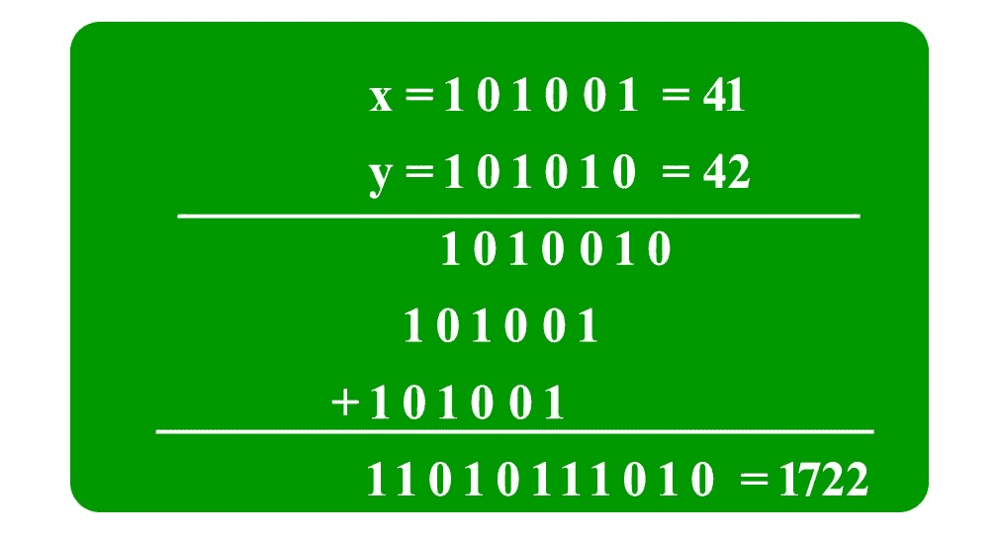

# 使用分治算法进行快速乘法的 Karatsuba 算法

> 原文:[https://www . geeksforgeeks . org/karatsuba-快速乘法算法-使用分治算法/](https://www.geeksforgeeks.org/karatsuba-algorithm-for-fast-multiplication-using-divide-and-conquer-algorithm/)

给定两个代表两个整数值的二进制字符串，求两个字符串的乘积。例如，如果第一个位串是“1100”，第二个位串是“1010”，那么输出应该是 120。

为了简单起见，让两个字符串的长度相同，并且为 n。

一种**幼稚的做法**就是跟着我们在学校学习的过程走。一个接一个地取第二个数的所有位，并与第一个数的所有位相乘。最后将所有乘法相加。这个算法需要 O(n^2 时间。



使用**分而治之**，我们可以用更少的时间复杂度将两个整数相乘。我们把给定的数字分成两半。让给定的数字是 X 和 y。

为了简单起见，让我们假设 n 是偶数

```
X =  Xl*2n/2 + Xr    [Xl and Xr contain leftmost and rightmost n/2 bits of X]
Y =  Yl*2n/2 + Yr    [Yl and Yr contain leftmost and rightmost n/2 bits of Y]
```

产品 XY 可以写成如下形式。

```
XY = (Xl*2n/2 + Xr)(Yl*2n/2 + Yr)
   = 2n XlYl + 2n/2(XlYr + XrYl) + XrYr
```

如果我们看一下上面的公式，大小 n/2 有四次乘法，所以我们基本上把大小 n 的问题分成大小 n/2 的四个子问题。但这没有帮助，因为递推 T(n) = 4T(n/2) + O(n)的解是 O(n^2).这个算法的棘手部分是将中间的两个项改为其他形式，这样只需要一次额外的乘法就足够了。下面是中间两个术语的巧妙表达。

```
XlYr + XrYl = (Xl + Xr)(Yl + Yr) - XlYl- XrYr
```

所以 XY 的最终值变成了

```
XY = 2n XlYl + 2n/2 * [(Xl + Xr)(Yl + Yr) - XlYl - XrYr] + XrYr
```

利用上述技巧，递推式变成 T(n) = 3T(n/2) + O(n)，这个递推式的解是 O(n <sup>1.59</sup> )。

*如果输入字符串的长度不同且不均匀怎么办？*为了处理不同长度的情况，我们在开头追加 0。为了处理奇数长度，我们将*地板(n/2)* 位放在左半部分，将*天花板(n/2)* 位放在右半部分。所以 XY 的表达式改为如下。

```
XY = 22ceil(n/2) XlYl + 2ceil(n/2) * [(Xl + Xr)(Yl + Yr) - XlYl - XrYr] + XrYr
```

上述算法称为 Karatsuba 算法，它可以用于任何基础。

下面是上述算法的 C++实现。

## C++

```
// C++ implementation of Karatsuba algorithm for bit string multiplication.
#include<iostream>
#include<stdio.h>

using namespace std;

// FOLLOWING TWO FUNCTIONS ARE COPIED FROM http://goo.gl/q0OhZ
// Helper method: given two unequal sized bit strings, converts them to
// same length by adding leading 0s in the smaller string. Returns the
// the new length
int makeEqualLength(string &str1, string &str2)
{
    int len1 = str1.size();
    int len2 = str2.size();
    if (len1 < len2)
    {
        for (int i = 0 ; i < len2 - len1 ; i++)
            str1 = '0' + str1;
        return len2;
    }
    else if (len1 > len2)
    {
        for (int i = 0 ; i < len1 - len2 ; i++)
            str2 = '0' + str2;
    }
    return len1; // If len1 >= len2
}

// The main function that adds two bit sequences and returns the addition
string addBitStrings( string first, string second )
{
    string result;  // To store the sum bits

    // make the lengths same before adding
    int length = makeEqualLength(first, second);
    int carry = 0;  // Initialize carry

    // Add all bits one by one
    for (int i = length-1 ; i >= 0 ; i--)
    {
        int firstBit = first.at(i) - '0';
        int secondBit = second.at(i) - '0';

        // boolean expression for sum of 3 bits
        int sum = (firstBit ^ secondBit ^ carry)+'0';

        result = (char)sum + result;

        // boolean expression for 3-bit addition
        carry = (firstBit&secondBit) | (secondBit&carry) | (firstBit&carry);
    }

    // if overflow, then add a leading 1
    if (carry)  result = '1' + result;

    return result;
}

// A utility function to multiply single bits of strings a and b
int multiplyiSingleBit(string a, string b)
{  return (a[0] - '0')*(b[0] - '0');  }

// The main function that multiplies two bit strings X and Y and returns
// result as long integer
long int multiply(string X, string Y)
{
    // Find the maximum of lengths of x and Y and make length
    // of smaller string same as that of larger string
    int n = makeEqualLength(X, Y);

    // Base cases
    if (n == 0) return 0;
    if (n == 1) return multiplyiSingleBit(X, Y);

    int fh = n/2;   // First half of string, floor(n/2)
    int sh = (n-fh); // Second half of string, ceil(n/2)

    // Find the first half and second half of first string.
    // Refer http://goo.gl/lLmgn for substr method
    string Xl = X.substr(0, fh);
    string Xr = X.substr(fh, sh);

    // Find the first half and second half of second string
    string Yl = Y.substr(0, fh);
    string Yr = Y.substr(fh, sh);

    // Recursively calculate the three products of inputs of size n/2
    long int P1 = multiply(Xl, Yl);
    long int P2 = multiply(Xr, Yr);
    long int P3 = multiply(addBitStrings(Xl, Xr), addBitStrings(Yl, Yr));

    // Combine the three products to get the final result.
    return P1*(1<<(2*sh)) + (P3 - P1 - P2)*(1<<sh) + P2;
}

// Driver program to test above functions
int main()
{
    printf ("%ld\n", multiply("1100", "1010"));
    printf ("%ld\n", multiply("110", "1010"));
    printf ("%ld\n", multiply("11", "1010"));
    printf ("%ld\n", multiply("1", "1010"));
    printf ("%ld\n", multiply("0", "1010"));
    printf ("%ld\n", multiply("111", "111"));
    printf ("%ld\n", multiply("11", "11"));
}
```

**输出:**

```
120
60
30
10
0
49
9
```

**时间复杂度:**上述解的时间复杂度为 O(n<sup>log</sup><sub>T5】2</sub>T8】3)= O(n<sup>1.59</sup>。
使用另一种分治算法——快速傅里叶变换，可以进一步提高乘法的时间复杂度。我们很快将讨论快速傅立叶变换作为一个单独的帖子。

**练习**
上面的程序返回一个长整型值，不适用于大字符串。扩展上面的程序，返回一个字符串，而不是一个长整型值。

**解**
大数乘法过程是计算机科学中的一个重要问题。给定的方法使用分治法。
运行代码查看正常二进制乘法和 Karatsuba 算法的时间复杂度比较。
你可以在这个[仓库](https://github.com/uysalemre/Analysis-of-Algorithms2/tree/master/Binary%20Multiplication)看到完整的代码

**示例:**

```
First Binary Input : 101001010101010010101001010100101010010101010010101 
Second Binary Input : 101001010101010010101001010100101010010101010010101
Decimal Output : Not Representable 
Output : 2.1148846e+30
```

```
First Binary Input : 1011 
Second Binary Input : 1000
Decimal Output : 88
Output : 5e-05
```

## C++

```
#include <iostream>
#include <ctime>
#include <fstream>
#include <string.h>
#include <cmath>
#include <sstream>

using namespace std;

// classical method class
class BinaryMultiplier
{
public:
    string MakeMultiplication(string,string);     
    string MakeShifting(string,int);              
    string addBinary(string,string);
    void BinaryStringToDecimal(string);
};

// karatsuba method class
class Karatsuba
{
public:
    int lengthController(string &,string &);
    string addStrings(string,string);
    string multiply(string,string);
    string DecimalToBinary(long long int);
    string Subtraction(string,string);
    string MakeShifting(string,int);
};

// this function get strings and go over str2 bit bit
// if it sees 1  it calculates the shifted version according to position bit
// Makes add operation for binary strings
// returns result string
string BinaryMultiplier::MakeMultiplication(string str1, string str2)
{
    string allSum = "";
    for (int j = 0 ; j<str2.length(); j++)
    {
        int secondDigit = str2[j] - '0';
        if (secondDigit == 1)
        {
            string shifted = MakeShifting(str1,str2.size()-(j+1));
            allSum = addBinary(shifted, allSum);
        }
        else
        {
            continue;
        }

    }
    return allSum;
}

// this function adds binary strings with carry
string BinaryMultiplier::addBinary(string a, string b)
{
    string result = "";
    int s = 0;

    int i = a.size() - 1;
    int j = b.size() - 1;
    while (i >= 0 || j >= 0 || s == 1)
    {
        s += ((i >= 0)? a[i] - '0': 0);
        s += ((j >= 0)? b[j] - '0': 0);

        result = char(s % 2 + '0') + result;

        s /= 2;

        i--;
        j--;
    }
    return result;
}

// this function shifts the given string according to given number
// returns shifted version
string BinaryMultiplier::MakeShifting(string str, int stepnum)
{
    string shifted = str;
    for (int i = 0 ; i < stepnum ; i++)
        shifted = shifted + '0';
    return shifted;
}

// this function converts Binary String Number to Decimal Number
// After 32 bits it gives 0 because it overflows the size of int
void BinaryMultiplier::BinaryStringToDecimal(string result)
{
    cout<<"Binary Result : "<<result<<endl;
    unsigned long long int val = 0;
    for (int i = result.length()-1; i >= 0; i--)
    {
        if (result[i] == '1')
        {
            val += pow(2,(result.length()-1)-i);
        }
    }
    cout<<"Decimal Result (Not proper for Large Binary Numbers):" <<val<<endl;
}

// this function controls lengths of strings and make their lengths equal
// returns the maximum length
int Karatsuba::lengthController(string &str1, string &str2)
{
    int len1 = str1.size();
    int len2 = str2.size();
    if (len1 < len2)
    {
        for (int i = 0 ; i < len2 - len1 ; i++)
            str1 = '0' + str1;
        return len2;
    }
    else if (len1 > len2)
    {
        for (int i = 0 ; i < len1 - len2 ; i++)
            str2 = '0' + str2;
    }
    return len1;
}

// this function add strings with carry
// uses one by one bit addition methodology
// returns result string
string Karatsuba::addStrings(string first, string second)
{
    string result;  // To store the sum bits

    // make the lengths same before adding
    int length = lengthController(first, second);
    int carry = 0;  // Initialize carry

    // Add all bits one by one
    for (int i = length-1 ; i >= 0 ; i--)
    {
        int firstBit = first.at(i) - '0';
        int secondBit = second.at(i) - '0';

        // boolean expression for sum of 3 bits
        int sum = (firstBit ^ secondBit ^ carry)+'0';

        result = (char)sum + result;

        // Boolean expression for 3-bit addition
        carry = (firstBit&secondBit) | (secondBit&carry) | (firstBit&carry);
    }

    // if overflow, then add a leading 1
    if (carry)
    {
        result = '1' + result;
    }

    return result;
}

// this function converts decimal number to binary string
string Karatsuba::DecimalToBinary(long long int number)
{
    string result = "";
    if (number <= 0)
    {
        return "0";
    }
    else
    {
        int i = 0;
        while (number > 0)
        {

            long long int num= number % 2;
            stringstream ss;
            ss<<num;
            result = ss.str() + result;
            number = number / 2;
            i++;
        }
        return result;

    }
}

// this function makes binary string subtraction with overflow
string Karatsuba::Subtraction(string lhs, string rhs)
{

    int length = lengthController(lhs, rhs);
    int diff;
    string result;

    for (int i = length-1; i >= 0; i--)
    {
        diff = (lhs[i]-'0') - (rhs[i]-'0');
        if (diff >= 0)
        {
            result = DecimalToBinary(diff) + result;
        }
        else
        {
            for (int j = i-1; j>=0; j--)
            {
                lhs[j] = ((lhs[j]-'0') - 1) % 10 + '0';
                if (lhs[j] != '1')
                {
                    break;
                }
            }
            result = DecimalToBinary(diff+2) + result;
        }
    }
    return result;
}

// this function makes shifting
string Karatsuba::MakeShifting(string str, int stepnum)
{
    string shifted = str;
    for (int i = 0 ; i < stepnum ; i++)
        shifted = shifted + '0';
    return shifted;
}

// this function is the core of the Karatsuba
// divides problem into 4 subproblems
// recursively multiplies them
// returns the result string
string Karatsuba::multiply(string X,  string Y)
{
    int n = lengthController(X, Y);

    if (n == 1) return ((Y[0]-'0' == 1) && (X[0]-'0' == 1)) ? "1" : "0";

    int fh = n/2;   // First half of string, floor(n/2)
    int sh = (n-fh); // Second half of string, ceil(n/2)

    // Find the first half and second half of first string.
    string Xl = X.substr(0, fh);
    string Xr = X.substr(fh, sh);

    // Find the first half and second half of second string
    string Yl = Y.substr(0, fh);
    string Yr = Y.substr(fh, sh);

    // Recursively calculate the three products of inputs of size n/2
    string P1 = multiply(Xl, Yl);
    string P2 = multiply(Xr, Yr);
    string P3 = multiply(addStrings(Xl, Xr), addStrings(Yl, Yr));

    // return added string version
    return addStrings(addStrings(MakeShifting(P1, 2*(n-n/2)),P2),MakeShifting(Subtraction(P3,addStrings(P1,P2)), n-(n/2)));
}

int main(int argc, const char * argv[])
{
    // get the binary numbers as strings
    string firstNumber,secondNumber;

    cout<<"Please give the First Binary number : ";
    cin>>firstNumber;
    cout<<endl<<"Please give the Second Binary number : ";
    cin>>secondNumber;
    cout << endl;

    // make the initial lengths equal by adding zeros
    int len1 = firstNumber.size();
    int len2 = secondNumber.size();
    int general_len = firstNumber.size();

    if (len1 < len2)
    {
        for (int i = 0 ; i < len2 - len1 ; i++)
            firstNumber = '0' + firstNumber;
        general_len = firstNumber.size();
    }
    else if (len1 > len2)
    {
        for (int i = 0 ; i < len1 - len2 ; i++)
            secondNumber = '0' + secondNumber;
        general_len = secondNumber.size();
    }

    // In classical methodology Binary String Multiplication
    cout<<"Classical Algorithm : "<<endl;
    BinaryMultiplier newobj;
    const clock_t classical_time = clock();
    string classic = newobj.MakeMultiplication(firstNumber, secondNumber);
    cout << float( clock () - classical_time ) /  CLOCKS_PER_SEC<<endl<<endl;
    float c_time = float( clock () - classical_time ) /  CLOCKS_PER_SEC;
    newobj.BinaryStringToDecimal(classic);

    // Using Karatsuba Multiplication Algorithm Binary String Multiplication
    cout<<endl<<"Karatsuba Algorithm : "<<endl;
    Karatsuba obj;
    const clock_t karatsuba_time = clock();
    string karatsuba = obj.multiply(firstNumber, secondNumber);
    cout << float( clock () - karatsuba_time ) /  CLOCKS_PER_SEC<<endl<<endl;
    float k_time = float( clock () - classical_time ) /  CLOCKS_PER_SEC;
    newobj.BinaryStringToDecimal(karatsuba);

    return 0;
}
```

**相关文章:**
[用字符串表示的大数相乘](https://www.geeksforgeeks.org/multiply-large-numbers-represented-as-strings/)

**参考资料:**
[Karatsuba 算法的维基百科页面](http://en.wikipedia.org/wiki/Karatsuba_algorithm)
[算法第一版作者:Sanjoy Dasgupta、Christos Papadimitriou 和 Umesh Vazirani](http://www.flipkart.com/algorithms-1st-edition/p/itmczynvb7p2zacz?pid=9780070636613&affid=sandeepgfg)
[http://courses . csail . MIT . edu/6.006/spring 11/exacts/notes 3-Karatsuba](http://courses.csail.mit.edu/6.006/spring11/exams/notes3-karatsuba)
[http://www . cc . gatech . edu/~ ninamf/algos 11/讲座/lect](http://www.cc.gatech.edu/~ninamf/Algos11/lectures/lect0131.pdf)