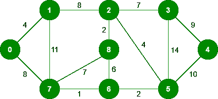
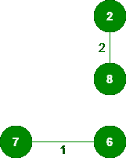
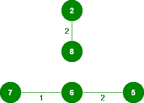
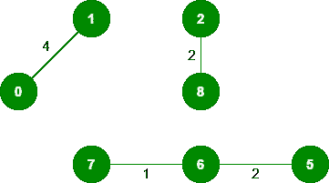
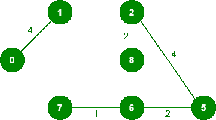
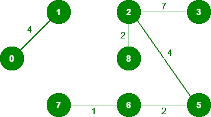
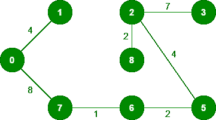
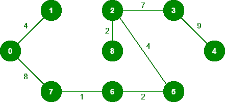

# 克鲁斯卡尔最小生成树算法|贪婪算法-2

> 原文:[https://www . geesforgeks . org/kruskals-最小生成树-算法-greedy-algo-2/](https://www.geeksforgeeks.org/kruskals-minimum-spanning-tree-algorithm-greedy-algo-2/)

***什么是最小生成树？***
给定一个连通无向图，该图的*生成树*是将所有顶点连接在一起的树。一个图可以有许多不同的生成树。加权、连通、无向图的*最小生成树(MST)* 或最小权重生成树是权重小于或等于所有其他生成树的权重的生成树。生成树的权重是赋予生成树每条边的权重之和。
*最小生成树有几条边？*
最小生成树有(V–1)条边，其中 V 是给定图中的顶点数。
**最小生成树有哪些应用？*
MST 的应用见[本](https://www.geeksforgeeks.org/applications-of-minimum-spanning-tree/)。*

*以下是使用克鲁斯卡尔算法寻找最小二乘的步骤*

> ***1。**按权重非递减顺序对所有边进行排序。
> T3】2。挑最小的边。检查它是否与到目前为止形成的生成树形成一个循环。如果没有形成循环，包括这条边。否则，丢弃它。
> **3。**重复步骤#2，直到生成树中有(V-1)条边。*

*步骤 2 使用[联合查找算法](https://www.geeksforgeeks.org/union-find/)来检测周期。所以我们建议阅读以下帖子作为先决条件。
[联合-查找算法|集合 1(检测图中的循环)](https://www.geeksforgeeks.org/union-find/)
[联合-查找算法|集合 2(按等级和路径压缩进行联合)](https://www.geeksforgeeks.org/union-find-algorithm-set-2-union-by-rank/)
该算法是一个贪婪算法。贪婪选择是选择最小权重边，它不会导致到目前为止构造的最小权重边的循环。让我们用一个例子来理解它:考虑下面的输入图。* 

**

*该图包含 9 个顶点和 14 条边。因此，形成的最小生成树将具有(9–1)= 8 条边。*

```
*After sorting:

Weight   Src    Dest
1         7      6
2         8      2
2         6      5
4         0      1
4         2      5
6         8      6
7         2      3
7         7      8
8         0      7
8         1      2
9         3      4
10        5      4
11        1      7
14        3      5*
```

*现在从排序后的边列表
**1 中逐个拾取所有边。** *挑边 7-6:* 没有周期形成，包括它。* 

**

***2。** *挑边 8-2:* 没有形成循环，包括它。* 

**

***3。** *挑边 6-5:* 没有形成循环，包括它。* 

**

***4。** *挑边 0-1:* 没有形成循环，包括它。* 

**

***5。** *挑边 2-5:* 没有形成循环，包括它。* 

**

***6。** *拾取 8-6 号边:*由于包含此边会导致循环，因此将其丢弃。
**7。** *挑边 2-3:* 没有形成循环，包含它。* 

**

***8。** *拾取边 7-8:* 由于包含此边会导致循环，因此将其丢弃。
**9。** *挑边 0-7:* 没有形成循环，包含它。* 

**

***10。** *拾取边 1-2:* 由于包含此边会导致循环，因此将其丢弃。
**11。** *挑边 3-4:* 没有形成循环，包含它。* 

**

*由于包含的边数等于(V–1)，算法到此为止。* 

*下面是上述想法的实现:*

## *Java 语言(一种计算机语言，尤用于创建网站)*

```
*// Java program for Kruskal's algorithm to
// find Minimum Spanning Tree of a given
//connected, undirected and  weighted graph
import java.util.*;
import java.lang.*;
import java.io.*;

class Graph {
    // A class to represent a graph edge
    class Edge implements Comparable<Edge>
    {
        int src, dest, weight;

        // Comparator function used for
        // sorting edgesbased on their weight
        public int compareTo(Edge compareEdge)
        {
            return this.weight - compareEdge.weight;
        }
    };

    // A class to represent a subset for
    // union-find
    class subset
    {
        int parent, rank;
    };

    int V, E; // V-> no. of vertices & E->no.of edges
    Edge edge[]; // collection of all edges

    // Creates a graph with V vertices and E edges
    Graph(int v, int e)
    {
        V = v;
        E = e;
        edge = new Edge[E];
        for (int i = 0; i < e; ++i)
            edge[i] = new Edge();
    }

    // A utility function to find set of an
    // element i (uses path compression technique)
    int find(subset subsets[], int i)
    {
        // find root and make root as parent of i
        // (path compression)
        if (subsets[i].parent != i)
            subsets[i].parent
                = find(subsets, subsets[i].parent);

        return subsets[i].parent;
    }

    // A function that does union of two sets
    // of x and y (uses union by rank)
    void Union(subset subsets[], int x, int y)
    {
        int xroot = find(subsets, x);
        int yroot = find(subsets, y);

        // Attach smaller rank tree under root
        // of high rank tree (Union by Rank)
        if (subsets[xroot].rank
            < subsets[yroot].rank)
            subsets[xroot].parent = yroot;
        else if (subsets[xroot].rank
                 > subsets[yroot].rank)
            subsets[yroot].parent = xroot;

        // If ranks are same, then make one as
        // root and increment its rank by one
        else {
            subsets[yroot].parent = xroot;
            subsets[xroot].rank++;
        }
    }

    // The main function to construct MST using Kruskal's
    // algorithm
    void KruskalMST()
    {
        // Tnis will store the resultant MST
        Edge result[] = new Edge[V];

        // An index variable, used for result[]
        int e = 0;

        // An index variable, used for sorted edges
        int i = 0;
        for (i = 0; i < V; ++i)
            result[i] = new Edge();

        // Step 1:  Sort all the edges in non-decreasing
        // order of their weight.  If we are not allowed to
        // change the given graph, we can create a copy of
        // array of edges
        Arrays.sort(edge);

        // Allocate memory for creating V subsets
        subset subsets[] = new subset[V];
        for (i = 0; i < V; ++i)
            subsets[i] = new subset();

        // Create V subsets with single elements
        for (int v = 0; v < V; ++v)
        {
            subsets[v].parent = v;
            subsets[v].rank = 0;
        }

        i = 0; // Index used to pick next edge

        // Number of edges to be taken is equal to V-1
        while (e < V - 1)
        {
            // Step 2: Pick the smallest edge. And increment
            // the index for next iteration
            Edge next_edge = edge[i++];

            int x = find(subsets, next_edge.src);
            int y = find(subsets, next_edge.dest);

            // If including this edge does't cause cycle,
            // include it in result and increment the index
            // of result for next edge
            if (x != y) {
                result[e++] = next_edge;
                Union(subsets, x, y);
            }
            // Else discard the next_edge
        }

        // print the contents of result[] to display
        // the built MST
        System.out.println("Following are the edges in "
                           + "the constructed MST");
        int minimumCost = 0;
        for (i = 0; i < e; ++i)
        {
            System.out.println(result[i].src + " -- "
                               + result[i].dest
                               + " == " + result[i].weight);
            minimumCost += result[i].weight;
        }
        System.out.println("Minimum Cost Spanning Tree "
                           + minimumCost);
    }

    // Driver Code
    public static void main(String[] args)
    {

        /* Let us create following weighted graph
                 10
            0--------1
            |  \     |
           6|   5\   |15
            |      \ |
            2--------3
                4       */
        int V = 4; // Number of vertices in graph
        int E = 5; // Number of edges in graph
        Graph graph = new Graph(V, E);

        // add edge 0-1
        graph.edge[0].src = 0;
        graph.edge[0].dest = 1;
        graph.edge[0].weight = 10;

        // add edge 0-2
        graph.edge[1].src = 0;
        graph.edge[1].dest = 2;
        graph.edge[1].weight = 6;

        // add edge 0-3
        graph.edge[2].src = 0;
        graph.edge[2].dest = 3;
        graph.edge[2].weight = 5;

        // add edge 1-3
        graph.edge[3].src = 1;
        graph.edge[3].dest = 3;
        graph.edge[3].weight = 15;

        // add edge 2-3
        graph.edge[4].src = 2;
        graph.edge[4].dest = 3;
        graph.edge[4].weight = 4;

        // Function call
        graph.KruskalMST();
    }
}
// This code is contributed by Aakash Hasija*
```

## *计算机编程语言*

```
*# Python program for Kruskal's algorithm to find
# Minimum Spanning Tree of a given connected,
# undirected and weighted graph

from collections import defaultdict

# Class to represent a graph

class Graph:

    def __init__(self, vertices):
        self.V = vertices  # No. of vertices
        self.graph = []  # default dictionary
        # to store graph

    # function to add an edge to graph
    def addEdge(self, u, v, w):
        self.graph.append([u, v, w])

    # A utility function to find set of an element i
    # (uses path compression technique)
    def find(self, parent, i):
        if parent[i] == i:
            return i
        return self.find(parent, parent[i])

    # A function that does union of two sets of x and y
    # (uses union by rank)
    def union(self, parent, rank, x, y):
        xroot = self.find(parent, x)
        yroot = self.find(parent, y)

        # Attach smaller rank tree under root of
        # high rank tree (Union by Rank)
        if rank[xroot] < rank[yroot]:
            parent[xroot] = yroot
        elif rank[xroot] > rank[yroot]:
            parent[yroot] = xroot

        # If ranks are same, then make one as root
        # and increment its rank by one
        else:
            parent[yroot] = xroot
            rank[xroot] += 1

    # The main function to construct MST using Kruskal's
        # algorithm
    def KruskalMST(self):

        result = []  # This will store the resultant MST

        # An index variable, used for sorted edges
        i = 0

        # An index variable, used for result[]
        e = 0

        # Step 1:  Sort all the edges in
        # non-decreasing order of their
        # weight.  If we are not allowed to change the
        # given graph, we can create a copy of graph
        self.graph = sorted(self.graph,
                            key=lambda item: item[2])

        parent = []
        rank = []

        # Create V subsets with single elements
        for node in range(self.V):
            parent.append(node)
            rank.append(0)

        # Number of edges to be taken is equal to V-1
        while e < self.V - 1:

            # Step 2: Pick the smallest edge and increment
            # the index for next iteration
            u, v, w = self.graph[i]
            i = i + 1
            x = self.find(parent, u)
            y = self.find(parent, v)

            # If including this edge does't
            #  cause cycle, include it in result
            #  and increment the indexof result
            # for next edge
            if x != y:
                e = e + 1
                result.append([u, v, w])
                self.union(parent, rank, x, y)
            # Else discard the edge

        minimumCost = 0
        print ("Edges in the constructed MST")
        for u, v, weight in result:
            minimumCost += weight
            print("%d -- %d == %d" % (u, v, weight))
        print("Minimum Spanning Tree" , minimumCost)

# Driver code
g = Graph(4)
g.addEdge(0, 1, 10)
g.addEdge(0, 2, 6)
g.addEdge(0, 3, 5)
g.addEdge(1, 3, 15)
g.addEdge(2, 3, 4)

# Function call
g.KruskalMST()

# This code is contributed by Neelam Yadav*
```

## *C#*

```
*// C# Code for above approach
using System;

class Graph {

    // A class to represent a graph edge
    class Edge : IComparable<Edge> {
        public int src, dest, weight;

        // Comparator function used for sorting edges
        // based on their weight
        public int CompareTo(Edge compareEdge)
        {
            return this.weight
                   - compareEdge.weight;
        }
    }

    // A class to represent
    // a subset for union-find
    public class subset
    {
        public int parent, rank;
    };

    int V, E; // V-> no. of vertices & E->no.of edges
    Edge[] edge; // collection of all edges

    // Creates a graph with V vertices and E edges
    Graph(int v, int e)
    {
        V = v;
        E = e;
        edge = new Edge[E];
        for (int i = 0; i < e; ++i)
            edge[i] = new Edge();
    }

    // A utility function to find set of an element i
    // (uses path compression technique)
    int find(subset[] subsets, int i)
    {
        // find root and make root as
        // parent of i (path compression)
        if (subsets[i].parent != i)
            subsets[i].parent
                = find(subsets, subsets[i].parent);

        return subsets[i].parent;
    }

    // A function that does union of
    // two sets of x and y (uses union by rank)
    void Union(subset[] subsets, int x, int y)
    {
        int xroot = find(subsets, x);
        int yroot = find(subsets, y);

        // Attach smaller rank tree under root of
        // high rank tree (Union by Rank)
        if (subsets[xroot].rank < subsets[yroot].rank)
            subsets[xroot].parent = yroot;
        else if (subsets[xroot].rank > subsets[yroot].rank)
            subsets[yroot].parent = xroot;

        // If ranks are same, then make one as root
        // and increment its rank by one
        else {
            subsets[yroot].parent = xroot;
            subsets[xroot].rank++;
        }
    }

    // The main function to construct MST
    // using Kruskal's algorithm
    void KruskalMST()
    {
        // This will store the
        // resultant MST
        Edge[] result = new Edge[V];
        int e = 0; // An index variable, used for result[]
        int i
            = 0; // An index variable, used for sorted edges
        for (i = 0; i < V; ++i)
            result[i] = new Edge();

        // Step 1: Sort all the edges in non-decreasing
        // order of their weight. If we are not allowed
        // to change the given graph, we can create
        // a copy of array of edges
        Array.Sort(edge);

        // Allocate memory for creating V subsets
        subset[] subsets = new subset[V];
        for (i = 0; i < V; ++i)
            subsets[i] = new subset();

        // Create V subsets with single elements
        for (int v = 0; v < V; ++v) {
            subsets[v].parent = v;
            subsets[v].rank = 0;
        }

        i = 0; // Index used to pick next edge

        // Number of edges to be taken is equal to V-1
        while (e < V - 1)
        {
            // Step 2: Pick the smallest edge. And increment
            // the index for next iteration
            Edge next_edge = new Edge();
            next_edge = edge[i++];

            int x = find(subsets, next_edge.src);
            int y = find(subsets, next_edge.dest);

            // If including this edge does't cause cycle,
            // include it in result and increment the index
            // of result for next edge
            if (x != y) {
                result[e++] = next_edge;
                Union(subsets, x, y);
            }
            // Else discard the next_edge
        }

        // print the contents of result[] to display
        // the built MST
        Console.WriteLine("Following are the edges in "
                          + "the constructed MST");

        int minimumCost = 0
        for (i = 0; i < e; ++i)
        {
            Console.WriteLine(result[i].src + " -- "
                              + result[i].dest
                              + " == " + result[i].weight);
          minimumCost += result[i].weight;
        }

        Console.WriteLine("Minimum Cost Spanning Tree"
                          + minimumCost);
        Console.ReadLine();
    }

    // Driver Code
    public static void Main(String[] args)
    {

        /* Let us create following weighted graph
                10
            0--------1
            | \ |
        6| 5\ |15
            | \ |
            2--------3
                4 */
        int V = 4; // Number of vertices in graph
        int E = 5; // Number of edges in graph
        Graph graph = new Graph(V, E);

        // add edge 0-1
        graph.edge[0].src = 0;
        graph.edge[0].dest = 1;
        graph.edge[0].weight = 10;

        // add edge 0-2
        graph.edge[1].src = 0;
        graph.edge[1].dest = 2;
        graph.edge[1].weight = 6;

        // add edge 0-3
        graph.edge[2].src = 0;
        graph.edge[2].dest = 3;
        graph.edge[2].weight = 5;

        // add edge 1-3
        graph.edge[3].src = 1;
        graph.edge[3].dest = 3;
        graph.edge[3].weight = 15;

        // add edge 2-3
        graph.edge[4].src = 2;
        graph.edge[4].dest = 3;
        graph.edge[4].weight = 4;

        // Function call
        graph.KruskalMST();
    }
}

// This code is contributed by Aakash Hasija*
```

## *C++*

```
*#include <bits/stdc++.h>
using namespace std;
// DSU data structure
//  path compression + rank by union

class DSU
{
    int *parent;
    int *rank;

public:
    DSU(int n)
    {
        parent = new int[n];
        rank = new int[n];

        for (int i = 0; i < n; i++)
        {
            parent[i] = -1;
            rank[i] = 1;
        }
    }

    // Find function
    int find(int i)
    {
        if (parent[i] == -1)
            return i;

        return parent[i] = find(parent[i]);
    }
    // union function
    void unite(int x, int y)
    {
        int s1 = find(x);
        int s2 = find(y);

        if (s1 != s2)
        {
            if (rank[s1] < rank[s2])
            {
                parent[s1] = s2;
                rank[s2] += rank[s1];
            }
            else
            {
                parent[s2] = s1;
                rank[s1] += rank[s2];
            }
        }
    }
};

class Graph
{
    vector<vector<int>> edgelist;
    int V;

public:
    Graph(int V)
    {
        this->V = V;
    }

    void addEdge(int x, int y, int w)
    {
        edgelist.push_back({w, x, y});
    }

    int kruskals_mst()
    {
        // 1\. Sort all edges
        sort(edgelist.begin(), edgelist.end());

        // Initialize the DSU
        DSU s(V);
        int ans = 0;
        for (auto edge : edgelist)
        {
            int w = edge[0];
            int x = edge[1];
            int y = edge[2];

            // take that edge in MST if it does form a cycle
            if (s.find(x) != s.find(y))
            {
                s.unite(x, y);
                ans += w;
            }
        }
        return ans;
    }
};
int main()
{
    Graph g(4);
    g.addEdge(0, 1, 1);
    g.addEdge(1, 3, 3);
    g.addEdge(3, 2, 4);
    g.addEdge(2, 0, 2);
    g.addEdge(0, 3, 2);
    g.addEdge(1, 2, 2);

    // int n, m;
    // cin >> n >> m;

    // Graph g(n);
    // for (int i = 0; i < m; i++)
    // {
    //     int x, y, w;
    //     cin >> x >> y >> w;
    //     g.addEdge(x, y, w);
    // }

    cout << g.kruskals_mst();
    return 0;
}*
```

***Output**

```
Following are the edges in the constructed MST
2 -- 3 == 4
0 -- 3 == 5
0 -- 1 == 10
Minimum Cost Spanning Tree: 19
```* 

***时间复杂度:** O(ElogE)或 O(ElogV)。边的排序需要时间。排序后，我们遍历所有边，并应用查找-并集算法。查找和联合操作最多需要 0(LogV)时间。所以整体复杂度是 O(ELogE + ELogV)时间。E 的值最多可以是 O(V <sup>2</sup> ，所以 O(LogV)就是 O(LogE)一样。因此，整体时间复杂度为 O(ElogE)或 O(ElogV)*

*参考文献:
[【http://www.ics.uci.edu/~eppstein/161/960206.html】](http://www.ics.uci.edu/~eppstein/161/960206.html)
[【http://en.wikipedia.org/wiki/Minimum_spanning_tree】](http://en.wikipedia.org/wiki/Minimum_spanning_tree)
本文由[aashis Barnwal](https://www.facebook.com/barnwal.aashish)编辑，GeeksforGeeks 团队审核。如果你发现任何不正确的地方，或者你想分享更多关于上面讨论的话题的信息，请写评论。*