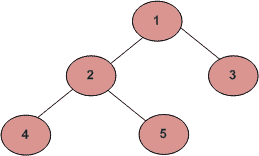

# 二叉树中节点的第 Kth 个祖先|集合 2

> 原文:[https://www . geesforgeks . org/kth-祖先-节点-二叉树-集合-2/](https://www.geeksforgeeks.org/kth-ancestor-node-binary-tree-set-2/)

给定一棵二叉树，其中节点的编号从 1 到 n。给定一个节点和一个正整数 k。我们必须打印二叉树中给定节点的第 k 个祖先。如果不存在任何这样的祖先，那么打印-1。
例如，在下面给出的二叉树中，5 的第二个祖先是 1。节点 5 的第三个祖先将是-1。



在我们之前的文章中，我们已经讨论了这个问题的 BFS 解决方案。如果您仔细观察该解决方案，您会发现基本方法是首先找到节点，然后回溯到第 k 个父节点。同样的事情可以使用递归 [DFS](https://www.geeksforgeeks.org/depth-first-traversal-for-a-graph/) 来完成，而不需要使用额外的数组。
使用 DFS 的思想是首先在树中找到给定的节点，然后回溯 k 次到达第 k 个祖先，一旦我们到达第 k 个父节点，我们将简单地打印该节点并返回 NULL。
以下是上述思路的实现:

## C++

```
/* C++ program to calculate Kth ancestor of given node */
#include <bits/stdc++.h>
using namespace std;

// A Binary Tree Node
struct Node
{
    int data;
    struct Node *left, *right;
};

// temporary node to keep track of Node returned
// from previous recursive call during backtrack
Node* temp = NULL;

// recursive function to calculate Kth ancestor
Node* kthAncestorDFS(Node *root, int node , int &k)
{  
    // Base case
    if (!root)
        return NULL;

    if (root->data == node||
       (temp =  kthAncestorDFS(root->left,node,k)) ||
       (temp =  kthAncestorDFS(root->right,node,k)))
    {  
        if (k > 0)       
            k--;

        else if (k == 0)
        {
            // print the kth ancestor
            cout<<"Kth ancestor is: "<<root->data;

            // return NULL to stop further backtracking
            return NULL;
        }

        // return current node to previous call
        return root;
    }
}

// Utility function to create a new tree node
Node* newNode(int data)
{
    Node *temp = new Node;
    temp->data = data;
    temp->left = temp->right = NULL;
    return temp;
}

// Driver program to test above functions
int main()
{
    // Let us create binary tree shown in above diagram
    Node *root = newNode(1);
    root->left = newNode(2);
    root->right = newNode(3);
    root->left->left = newNode(4);
    root->left->right = newNode(5);

    int k = 2;
    int node = 5;

    // print kth ancestor of given node
    Node* parent = kthAncestorDFS(root,node,k);

    // check if parent is not NULL, it means
    // there is no Kth ancestor of the node
    if (parent)
        cout << "-1";

    return 0;
}
```

## Java 语言(一种计算机语言，尤用于创建网站)

```
// Java program to calculate Kth ancestor of given node
class Solution
{

// A Binary Tree Node
static class Node
{
    int data;
    Node left, right;
};

// temporary node to keep track of Node returned
// from previous recursive call during backtrack
static Node temp = null;
static int k;

// recursive function to calculate Kth ancestor
static Node kthAncestorDFS(Node root, int node )
{
    // Base case
    if (root == null)
        return null;

    if (root.data == node||
    (temp = kthAncestorDFS(root.left,node)) != null ||
    (temp = kthAncestorDFS(root.right,node)) != null)
    {
        if (k > 0)    
            k--;

        else if (k == 0)
        {
            // print the kth ancestor
            System.out.print("Kth ancestor is: "+root.data);

            // return null to stop further backtracking
            return null;
        }

        // return current node to previous call
        return root;
    }
    return null;
}

// Utility function to create a new tree node
static Node newNode(int data)
{
    Node temp = new Node();
    temp.data = data;
    temp.left = temp.right = null;
    return temp;
}

// Driver code
public static void main(String args[])
{
    // Let us create binary tree shown in above diagram
    Node root = newNode(1);
    root.left = newNode(2);
    root.right = newNode(3);
    root.left.left = newNode(4);
    root.left.right = newNode(5);

    k = 2;
    int node = 5;

    // print kth ancestor of given node
    Node parent = kthAncestorDFS(root,node);

    // check if parent is not null, it means
    // there is no Kth ancestor of the node
    if (parent != null)
        System.out.println("-1");
}
}

// This code is contributed by Arnab Kundu
```

## 蟒蛇 3

```
""" Python3 program to calculate Kth
    ancestor of given node """

# A Binary Tree Node
# Utility function to create a new tree node
class newNode:

    # Constructor to create a new node
    def __init__(self, data):
        self.data = data
        self.left = None
        self.right = None

# recursive function to calculate
# Kth ancestor
def kthAncestorDFS(root, node, k):

    # Base case
    if (not root):
        return None

    if (root.data == node or
       (kthAncestorDFS(root.left, node, k)) or
       (kthAncestorDFS(root.right, node, k))):

        if (k[0] > 0):
            k[0] -= 1

        elif (k[0] == 0):

            # print the kth ancestor
            print("Kth ancestor is:", root.data)

            # return None to stop further
            # backtracking
            return None

        # return current node to previous call
        return root

# Driver Code
if __name__ == '__main__':
    root = newNode(1)
    root.left = newNode(2)
    root.right = newNode(3)
    root.left.left = newNode(4)
    root.left.right = newNode(5)

    k = [2]
    node = 5

    # prkth ancestor of given node
    parent = kthAncestorDFS(root,node,k)

    # check if parent is not None, it means
    # there is no Kth ancestor of the node
    if (parent):
        print("-1")

# This code is contributed
# by SHUBHAMSINGH10
```

## C#

```
// C# program to calculate Kth ancestor of given node
using System;

class GFG
{

// A Binary Tree Node
public class Node
{
    public int data;
    public Node left, right;
};

// temporary node to keep track of Node returned
// from previous recursive call during backtrack
static Node temp = null;
static int k;

// recursive function to calculate Kth ancestor
static Node kthAncestorDFS(Node root, int node )
{
    // Base case
    if (root == null)
        return null;

    if (root.data == node||
    (temp = kthAncestorDFS(root.left,node)) != null ||
    (temp = kthAncestorDFS(root.right,node)) != null)
    {
        if (k > 0)    
            k--;

        else if (k == 0)
        {
            // print the kth ancestor
            Console.Write("Kth ancestor is: "+root.data);

            // return null to stop further backtracking
            return null;
        }

        // return current node to previous call
        return root;
    }
    return null;
}

// Utility function to create a new tree node
static Node newNode(int data)
{
    Node temp = new Node();
    temp.data = data;
    temp.left = temp.right = null;
    return temp;
}

// Driver code
public static void Main(String []args)
{
    // Let us create binary tree shown in above diagram
    Node root = newNode(1);
    root.left = newNode(2);
    root.right = newNode(3);
    root.left.left = newNode(4);
    root.left.right = newNode(5);

    k = 2;
    int node = 5;

    // print kth ancestor of given node
    Node parent = kthAncestorDFS(root,node);

    // check if parent is not null, it means
    // there is no Kth ancestor of the node
    if (parent != null)
        Console.WriteLine("-1");
}
}

// This code is contributed by 29AjayKumar
```

## java 描述语言

```
<script>

// JavaScript program to calculate Kth
// ancestor of given node

// A Binary Tree Node
class Node
{
    constructor()
    {
        this.data = 0;
        this.left = null;
        this.right = null;
    }
};

// temporary node to keep track of Node returned
// from previous recursive call during backtrack
var temp = null;
var k = 0;

// recursive function to calculate Kth ancestor
function kthAncestorDFS(root, node )
{
    // Base case
    if (root == null)
        return null;

    if (root.data == node||
    (temp = kthAncestorDFS(root.left,node)) != null ||
    (temp = kthAncestorDFS(root.right,node)) != null)
    {
        if (k > 0)    
            k--;

        else if (k == 0)
        {
            // print the kth ancestor
            document.write("Kth ancestor is: "+root.data);

            // return null to stop further backtracking
            return null;
        }

        // return current node to previous call
        return root;
    }
    return null;
}

// Utility function to create a new tree node
function newNode(data)
{
    var temp = new Node();
    temp.data = data;
    temp.left = temp.right = null;
    return temp;
}

// Driver code
// Let us create binary tree shown in above diagram
var root = newNode(1);
root.left = newNode(2);
root.right = newNode(3);
root.left.left = newNode(4);
root.left.right = newNode(5);
k = 2;
var node = 5;
// print kth ancestor of given node
var parent = kthAncestorDFS(root,node);

// check if parent is not null, it means
// there is no Kth ancestor of the node
if (parent != null)
    document.write("-1");

</script>
```

**输出:**

```
Kth ancestor is: 1
```

**时间复杂度** : O(n)，其中 n 为二叉树中的节点数。

本文由 **Harsh Agarwal** 供稿。如果你喜欢 GeeksforGeeks 并想投稿，你也可以使用[write.geeksforgeeks.org](https://write.geeksforgeeks.org)写一篇文章或者把你的文章邮寄到 review-team@geeksforgeeks.org。看到你的文章出现在极客博客主页上，帮助其他极客。
如果你发现任何不正确的地方，或者你想分享更多关于上面讨论的话题的信息，请写评论。