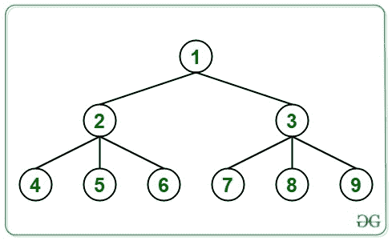

# 使用 DFS 的 N 元树中所有节点的第 k 个祖先

> 原文:[https://www . geesforgeks . org/kth-n 元树中所有节点的祖先-使用-dfs/](https://www.geeksforgeeks.org/kth-ancestor-of-all-nodes-in-an-n-ary-tree-using-dfs/)

给定一个 [N 元树](https://www.geeksforgeeks.org/generic-treesn-array-trees/)和一个整数 **K** ，任务是以级别顺序的方式打印树的所有节点的第 K 个<sup>祖先。如果某个节点不存在 K 个祖先，则打印该节点的 **-1** 。</sup>

**例:**

> **输入:** K = 2
> 
> 
> 
> **输出:** -1 -1 -1 1 1 1 1 1 1
> **说明:**
> 节点 1、2、3 不存在第二祖先
> 节点 4、5、6、7、8、9 的第二祖先为 **1** 。
> 
> **输入:** K = 1
> 
> 
> 
> **输出:**-1 1 2 2 3 3 3

**方法:**方法是用 [DFS](https://www.geeksforgeeks.org/depth-first-traversal-for-a-graph/) 找到所有节点的祖先。以下是步骤:

1.  任何节点的第**K**个父节点都可以通过使用 **DFS** 找到，并将一个节点的所有父节点存储在一个临时向量中，比如 **temp[]** 。
2.  每当在 **DFS** 中访问一个节点时，它就会被推入**温度**向量中。
3.  在 **DFS** 结束时，从**温度**向量中弹出当前访问的节点。
4.  对于当前访问的节点，向量包含该节点的所有祖先。
5.  向量末尾的第**K**节点是当前访问节点的第 **K <sup>第</sup>** 祖先，因此将其存储在一个**祖先[]** 数组中。

以下是上述方法的实现:

## C++

```
// C++ implementation of
// the above approach

#include <bits/stdc++.h>
using namespace std;

// Function to add an
// edge in the tree
void addEdge(vector<int> v[],
             int x, int y)
{
    v[x].push_back(y);
    v[y].push_back(x);
}

// DFS to find the Kth
// ancestor of every node
void dfs(vector<int> tree[],
         vector<int>& temp,
         int ancestor[], int u,
         int parent, int k)
{
    // Pushing current node
    // in the vector
    temp.push_back(u);

    // Traverse its neighbors
    for (auto i : tree[u]) {
        if (i == parent)
            continue;
        dfs(tree, temp,
            ancestor, i, u, k);
    }

    temp.pop_back();

    // If K ancestors are not
    // found for current node
    if (temp.size() < k) {
        ancestor[u] = -1;
    }
    else {

        // Add the Kth ancestor
        // for the node
        ancestor[u]
            = temp[temp.size() - k];
    }
}

// Function to find Kth
// ancestor of each node
void KthAncestor(int N, int K, int E,
                 int edges[][2])
{

    // Building the tree
    vector<int> tree[N + 1];
    for (int i = 0; i < E; i++) {
        addEdge(tree, edges[i][0],
                edges[i][1]);
    }

    // Stores all parents of a node
    vector<int> temp;

    // Store Kth ancestor
    // of all nodes
    int ancestor[N + 1];

    dfs(tree, temp, ancestor, 1, 0, K);

    // Print the ancestors
    for (int i = 1; i <= N; i++) {
        cout << ancestor[i] << " ";
    }
}

int main()
{
    // Given N and K
    int N = 9;
    int K = 2;

    // Given edges of n-ary tree
    int E = 8;
    int edges[8][2] = { { 1, 2 }, { 1, 3 }, { 2, 4 },
                        { 2, 5 }, { 2, 6 }, { 3, 7 },
                        { 3, 8 }, { 3, 9 } };

    // Function Call
    KthAncestor(N, K, E, edges);
    return 0;
}
```

## Java 语言(一种计算机语言，尤用于创建网站)

```
// Java implementation of
// the above approach
import java.util.*;

class GFG{

// Function to add an
// edge in the tree
static void addEdge(Vector<Integer> v[],
                    int x, int y)
{
    v[x].add(y);
    v[y].add(x);
}

// DFS to find the Kth
// ancestor of every node
static void dfs(Vector<Integer> tree[],
                Vector<Integer> temp,
                int ancestor[], int u,
                int parent, int k)
{

    // Pushing current node
    // in the vector
    temp.add(u);

    // Traverse its neighbors
    for(int i : tree[u])
    {
        if (i == parent)
            continue;

        dfs(tree, temp,
            ancestor, i, u, k);
    }

    temp.remove(temp.size() - 1);

    // If K ancestors are not
    // found for current node
    if (temp.size() < k)
    {
        ancestor[u] = -1;
    }
    else
    {

        // Add the Kth ancestor
        // for the node
        ancestor[u] = temp.get(temp.size() - k);
    }
}

// Function to find Kth
// ancestor of each node
static void KthAncestor(int N, int K, int E,
                        int edges[][])
{

    // Building the tree
    @SuppressWarnings("unchecked")
    Vector<Integer> []tree = new Vector[N + 1];
    for(int i = 0; i < tree.length; i++)
        tree[i] = new Vector<Integer>();

    for(int i = 0; i < E; i++)
    {
        addEdge(tree, edges[i][0],
                      edges[i][1]);
    }

    // Stores all parents of a node
    Vector<Integer> temp = new Vector<Integer>();

    // Store Kth ancestor
    // of all nodes
    int []ancestor = new int[N + 1];

    dfs(tree, temp, ancestor, 1, 0, K);

    // Print the ancestors
    for(int i = 1; i <= N; i++)
    {
        System.out.print(ancestor[i] + " ");
    }
}

// Driver code
public static void main(String[] args)
{

    // Given N and K
    int N = 9;
    int K = 2;

    // Given edges of n-ary tree
    int E = 8;
    int edges[][] = { { 1, 2 }, { 1, 3 },
                      { 2, 4 }, { 2, 5 },
                      { 2, 6 }, { 3, 7 },
                      { 3, 8 }, { 3, 9 } };

    // Function call
    KthAncestor(N, K, E, edges);
}
}

// This code is contributed by Amit Katiyar
```

## 蟒蛇 3

```
# Python3 implementation of
# the above approach

# Function to add an
# edge in the tree
def addEdge(v, x, y):

    v[x].append(y)
    v[y].append(x)

# DFS to find the Kth
# ancestor of every node
def dfs(tree, temp, ancestor, u, parent, k):

    # Pushing current node
    # in the vector
    temp.append(u)

    # Traverse its neighbors
    for i in tree[u]:
        if (i == parent):
            continue

        dfs(tree, temp, ancestor, i, u, k)

    temp.pop()

    # If K ancestors are not
    # found for current node
    if (len(temp) < k):
        ancestor[u] = -1

    else:

        # Add the Kth ancestor
        # for the node
        ancestor[u] = temp[len(temp) - k]

# Function to find Kth
# ancestor of each node
def KthAncestor(N, K, E, edges):

    # Building the tree
    tree = [[] for i in range(N + 1)]
    for i in range(E):
        addEdge(tree, edges[i][0],
                      edges[i][1])

    # Stores all parents of a node
    temp = []

    # Store Kth ancestor
    # of all nodes
    ancestor = [0] * (N + 1)

    dfs(tree, temp, ancestor, 1, 0, K)

    # Print the ancestors
    for i in range(1, N + 1):
        print(ancestor[i], end = " ")

# Driver code
if __name__ == '__main__':

    # Given N and K
    N = 9
    K = 2

    # Given edges of n-ary tree
    E = 8
    edges = [ [ 1, 2 ], [ 1, 3 ],
              [ 2, 4 ], [ 2, 5 ],
              [ 2, 6 ], [ 3, 7 ],
              [ 3, 8 ], [ 3, 9 ] ]

    # Function call
    KthAncestor(N, K, E, edges)

# This code is contributed by mohit kumar 29
```

## C#

```
// C# implementation of
// the above approach
using System;
using System.Collections.Generic;

class GFG{

// Function to add an
// edge in the tree
static void addEdge(List<int> []v,
                    int x, int y)
{
    v[x].Add(y);
    v[y].Add(x);
}

// DFS to find the Kth
// ancestor of every node
static void dfs(List<int> []tree,
                List<int> temp,
                int []ancestor, int u,
                int parent, int k)
{

    // Pushing current node
    // in the vector
    temp.Add(u);

    // Traverse its neighbors
    foreach(int i in tree[u])
    {
        if (i == parent)
            continue;

        dfs(tree, temp,
            ancestor, i, u, k);
    }

    temp.RemoveAt(temp.Count - 1);

    // If K ancestors are not
    // found for current node
    if (temp.Count < k)
    {
        ancestor[u] = -1;
    }
    else
    {

        // Add the Kth ancestor
        // for the node
        ancestor[u] = temp[temp.Count - k];
    }
}

// Function to find Kth
// ancestor of each node
static void KthAncestor(int N, int K, int E,
                        int [,]edges)
{

    // Building the tree
    List<int> []tree = new List<int>[N + 1];
    for(int i = 0; i < tree.Length; i++)
        tree[i] = new List<int>();

    for(int i = 0; i < E; i++)
    {
        addEdge(tree, edges[i, 0],
                      edges[i, 1]);
    }

    // Stores all parents of a node
    List<int> temp = new List<int>();

    // Store Kth ancestor
    // of all nodes
    int []ancestor = new int[N + 1];

    dfs(tree, temp, ancestor, 1, 0, K);

    // Print the ancestors
    for(int i = 1; i <= N; i++)
    {
        Console.Write(ancestor[i] + " ");
    }
}

// Driver code
public static void Main(String[] args)
{

    // Given N and K
    int N = 9;
    int K = 2;

    // Given edges of n-ary tree
    int E = 8;
    int [,]edges = { { 1, 2 }, { 1, 3 },
                     { 2, 4 }, { 2, 5 },
                     { 2, 6 }, { 3, 7 },
                     { 3, 8 }, { 3, 9 } };

    // Function call
    KthAncestor(N, K, E, edges);
}
}

// This code is contributed by Amit Katiyar
```

## java 描述语言

```
<script>

    // JavaScript program for the above approach

    // Function to add an
    // edge in the tree
    function addEdge(v, x, y)
    {
        v[x].push(y);
        v[y].push(x);
    }

    // DFS to find the Kth
    // ancestor of every node
    function dfs(tree, temp, ancestor, u, parent, k)
    {

        // Pushing current node
        // in the vector
        temp.push(u);

        // Traverse its neighbors
        for(let i = 0; i < tree[u].length; i++)
        {
            if (tree[u][i] == parent)
                continue;

            dfs(tree, temp, ancestor, tree[u][i], u, k);
        }

        temp.pop();

        // If K ancestors are not
        // found for current node
        if (temp.length < k)
        {
            ancestor[u] = -1;
        }
        else
        {

            // Add the Kth ancestor
            // for the node
            ancestor[u] = temp[temp.length - k];
        }
    }

    // Function to find Kth
    // ancestor of each node
    function KthAncestor(N, K, E, edges)
    {

        // Building the tree
        let tree = new Array(N + 1);
        for(let i = 0; i < tree.length; i++)
            tree[i] = [];

        for(let i = 0; i < E; i++)
        {
            addEdge(tree, edges[i][0], edges[i][1]);
        }

        // Stores all parents of a node
        let temp = [];

        // Store Kth ancestor
        // of all nodes
        let ancestor = new Array(N + 1);

        dfs(tree, temp, ancestor, 1, 0, K);

        // Print the ancestors
        for(let i = 1; i <= N; i++)
        {
            document.write(ancestor[i] + " ");
        }
    }

    // Given N and K
    let N = 9;
    let K = 2;

    // Given edges of n-ary tree
    let E = 8;
    let edges = [ [ 1, 2 ], [ 1, 3 ],
                     [ 2, 4 ], [ 2, 5 ],
                     [ 2, 6 ], [ 3, 7 ],
                     [ 3, 8 ], [ 3, 9 ] ];

    // Function call
    KthAncestor(N, K, E, edges);

</script>
```

**Output:** 

```
-1 -1 -1 1 1 1 1 1 1
```

***时间复杂度:** O(N)*
***辅助空间:** O(N)*