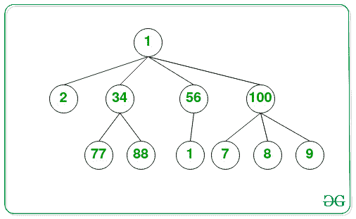
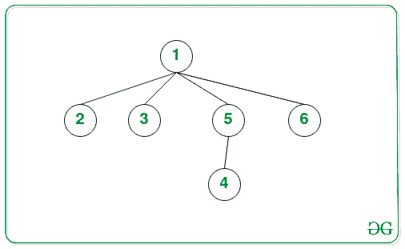

# N 数组树中第 k 个最大的元素

> 原文:[https://www . geesforgeks . org/kth-n 中最大元素数组树/](https://www.geeksforgeeks.org/kth-largest-element-in-an-n-array-tree/)

给定一个由 **N** 节点和一个整数 **K** 组成的 [N 数组树](https://www.geeksforgeeks.org/generic-treesn-array-trees/)，任务是在给定的 **N 元树**中找到 **K <sup>第</sup>T9】个最大的元素。**

**示例:**

> **输入:** K = 3
> 
> 
> 
> **输出:** 77
> **说明:**
> 给定 N 数组树中第三大元素是 77。
> 
> **输入:** K = 4
> 
> 
> 
> **输出:** 3

**方法:**给定的问题可以通过在给定的范围内为 **K** 找到[最大的元素的次数并不断更新范围的末端到目前为止找到的最大元素来解决。按照以下步骤解决问题:](https://www.geeksforgeeks.org/min-max-range-queries-array/)

*   初始化一个变量，说**大石碑**为 [**INT_MIN**](https://www.geeksforgeeks.org/int_max-int_min-cc-applications/) 。
*   定义一个[函数](https://www.geeksforgeeks.org/functions-in-c/)，称**大范围(根，数据)**，并执行以下步骤:
    *   如果当前根的值小于数据，则将**大石碑**的值更新为**大石碑**的[最大值](https://www.geeksforgeeks.org/stdmax_element-in-cpp/)和当前根的值。
    *   迭代当前根的所有子对象，并递归调用函数**的。**
*   初始化一个变量，比如说 **ans** 为 [**INT_MAX**](https://www.geeksforgeeks.org/int_max-int_min-cc-applications/) 来存储 **K <sup>th</sup>** 最大元素。
*   [迭代范围](https://www.geeksforgeeks.org/range-based-loop-c/)**【0，K–1】**递归调用函数**large stalled under range(root，ans)** 并将 **ans** 的值更新为**large stalle**和**large stalle**为 **INT_MIN** 。
*   完成上述步骤后，将**和**的值打印为最终的**K<sup>th</sup>T5】最大值。**

下面是上述方法的实现。

## C++

```
// C++ program for the above approach

#include <bits/stdc++.h>
using namespace std;

// Structure of N-array Tree
class Node {
public:
    int data;
    vector<Node*> childs;
};

// Stores the minimum element
// in the recursive call
int largestELe = INT_MIN;

// Function to find the largest
// element under the range of key
void largestEleUnderRange(
    Node* root, int data)
{
    // If the current root's value
    // is less than data
    if (root->data < data) {
        largestELe = max(root->data,
                         largestELe);
    }

    // Iterate over all the childrens
    for (Node* child : root->childs) {

        // Update under current range
        largestEleUnderRange(child, data);
    }
}

// Function to find the Kth Largest
// element in the given N-ary Tree
void KthLargestElement(Node* root,
                       int K)
{
    // Stores the resultant
    // Kth maximum element
    int ans = INT_MAX;

    // Iterate over the range [0, K]
    for (int i = 0; i < K; i++) {

        // Recursively call for
        // finding the maximum element
        // from the given range
        largestEleUnderRange(root, ans);

        // Update the value of
        // ans and largestEle
        ans = largestELe;
        largestELe = INT_MIN;
    }

    // Print the result
    cout << ans;
}

// Function to create a new node
Node* newNode(int data)
{
    Node* temp = new Node();
    temp->data = data;

    // Return the created node
    return temp;
}

// Driver Code
int main()
{
    /*   Create below the tree
     *              10
     *        /   /    \   \
     *        2  34    56   100
     *       / \         |   /  | \
     *      77  88       1   7  8  9
     */

    Node* root = newNode(10);
    (root->childs).push_back(newNode(2));
    (root->childs).push_back(newNode(34));
    (root->childs).push_back(newNode(56));
    (root->childs).push_back(newNode(100));
    (root->childs[0]->childs).push_back(newNode(77));
    (root->childs[0]->childs).push_back(newNode(88));
    (root->childs[2]->childs).push_back(newNode(1));
    (root->childs[3]->childs).push_back(newNode(7));
    (root->childs[3]->childs).push_back(newNode(8));
    (root->childs[3]->childs).push_back(newNode(9));

    int K = 3;
    KthLargestElement(root, K);

    return 0;
}
```

## Java 语言(一种计算机语言，尤用于创建网站)

```
// Java program for the above approach
import java.util.*;
public class Main
{
    // Structure of N-array Tree
    static class Node {

        public int data;
        public Vector<Node> childs = new Vector<Node>();
    }

    // Function to create a new node
    static Node newNode(int data)
    {
      Node temp = new Node();
      temp.data = data;
      return temp;
    }

    // Stores the minimum element
    // in the recursive call
    static int largestELe = Integer.MIN_VALUE;

    // Function to find the largest
    // element under the range of key
    static void largestEleUnderRange(Node root, int data)
    {
        // If the current root's value
        // is less than data
        if (root.data < data) {
            largestELe = Math.max(root.data, largestELe);
        }

        // Iterate over all the childrens
        for (int child = 0; child < root.childs.size(); child++) {

            // Update under current range
            largestEleUnderRange(root.childs.get(child), data);
        }
    }

    // Function to find the Kth Largest
    // element in the given N-ary Tree
    static void KthLargestElement(Node root, int K)
    {
        // Stores the resultant
        // Kth maximum element
        int ans = Integer.MAX_VALUE;

        // Iterate over the range [0, K]
        for (int i = 0; i < K; i++) {

            // Recursively call for
            // finding the maximum element
            // from the given range
            largestEleUnderRange(root, ans);

            // Update the value of
            // ans and largestEle
            ans = largestELe;
            largestELe = Integer.MIN_VALUE;
        }

        // Print the result
        System.out.print(ans);
    }

    public static void main(String[] args) {
        /*   Create below the tree
         *              10
         *        /   /    \   \
         *        2  34    56   100
         *       / \         |   /  | \
         *      77  88       1   7  8  9
         */

        Node root = newNode(10);
        (root.childs).add(newNode(2));
        (root.childs).add(newNode(34));
        (root.childs).add(newNode(56));
        (root.childs).add(newNode(100));
        (root.childs.get(0).childs).add(newNode(77));
        (root.childs.get(0).childs).add(newNode(88));
        (root.childs.get(2).childs).add(newNode(1));
        (root.childs.get(3).childs).add(newNode(7));
        (root.childs.get(3).childs).add(newNode(8));
        (root.childs.get(3).childs).add(newNode(9));

        int K = 3;
        KthLargestElement(root, K);
    }
}

// This code is contributed by suresh07.
```

## 蟒蛇 3

```
# Python3 program for the above approach
import sys

# Structure of N-array Tree
class Node:
    # Constructor to set the data of
    # the newly created tree node
    def __init__(self, data):
        self.data = data
        self.childs = []

# Stores the minimum element
# in the recursive call
largestELe = -sys.maxsize

# Function to find the largest
# element under the range of key
def largestEleUnderRange(root, data):
    global largestELe
    # If the current root's value
    # is less than data
    if (root.data < data) :
        largestELe = max(root.data, largestELe)

    # Iterate over all the childrens
    for child in range(len(root.childs)):
        # Update under current range
        largestEleUnderRange(root.childs[child], data)

# Function to find the Kth Largest
# element in the given N-ary Tree
def KthLargestElement(root, K):
    global largestELe
    # Stores the resultant
    # Kth maximum element
    ans = sys.maxsize

    # Iterate over the range [0, K]
    for i in range(K):
        # Recursively call for
        # finding the maximum element
        # from the given range
        largestEleUnderRange(root, ans)

        # Update the value of
        # ans and largestEle
        ans = largestELe
        largestELe = -sys.maxsize

    # Print the result
    print(ans)

"""   Create below the tree
 *              10
 *        /   /    \   \
 *        2  34    56   100
 *       / \         |   /  | \
 *      77  88       1   7  8  9
"""

root = Node(10)
(root.childs).append(Node(2));
(root.childs).append(Node(34));
(root.childs).append(Node(56));
(root.childs).append(Node(100));
(root.childs[0].childs).append(Node(77))
(root.childs[0].childs).append(Node(88))
(root.childs[2].childs).append(Node(1))
(root.childs[3].childs).append(Node(7))
(root.childs[3].childs).append(Node(8))
(root.childs[3].childs).append(Node(9))

K = 3
KthLargestElement(root, K)

# This code is contributed by rameshtravel07.
```

## C#

```
// C# program for the above approach
using System;
using System.Collections.Generic;
class GFG {

    // Structure of N-array Tree
    class Node
    {
        public int data;
        public List<Node> childs = new List<Node>();
    };

    // Function to create a new node
    static Node newNode(int data)
    {
      Node temp = new Node();
      temp.data = data;
      return temp;
    }

    // Stores the minimum element
    // in the recursive call
    static int largestELe = Int32.MinValue;

    // Function to find the largest
    // element under the range of key
    static void largestEleUnderRange(Node root, int data)
    {
        // If the current root's value
        // is less than data
        if (root.data < data) {
            largestELe = Math.Max(root.data, largestELe);
        }

        // Iterate over all the childrens
        for (int child = 0; child < root.childs.Count; child++) {

            // Update under current range
            largestEleUnderRange(root.childs[child], data);
        }
    }

    // Function to find the Kth Largest
    // element in the given N-ary Tree
    static void KthLargestElement(Node root, int K)
    {
        // Stores the resultant
        // Kth maximum element
        int ans = Int32.MaxValue;

        // Iterate over the range [0, K]
        for (int i = 0; i < K; i++) {

            // Recursively call for
            // finding the maximum element
            // from the given range
            largestEleUnderRange(root, ans);

            // Update the value of
            // ans and largestEle
            ans = largestELe;
            largestELe = Int32.MinValue;
        }

        // Print the result
        Console.Write(ans);
    }

  static void Main() {
    /*   Create below the tree
     *              10
     *        /   /    \   \
     *        2  34    56   100
     *       / \         |   /  | \
     *      77  88       1   7  8  9
     */

    Node root = newNode(10);
    (root.childs).Add(newNode(2));
    (root.childs).Add(newNode(34));
    (root.childs).Add(newNode(56));
    (root.childs).Add(newNode(100));
    (root.childs[0].childs).Add(newNode(77));
    (root.childs[0].childs).Add(newNode(88));
    (root.childs[2].childs).Add(newNode(1));
    (root.childs[3].childs).Add(newNode(7));
    (root.childs[3].childs).Add(newNode(8));
    (root.childs[3].childs).Add(newNode(9));

    int K = 3;
    KthLargestElement(root, K);
  }
}

// This code is contributed by decode2207.
```

## java 描述语言

```
<script>

    // JavaScript program for the above approach

    // Structure of N-array Tree
    class Node
    {
        constructor(data) {
          this.childs = [];
          this.data = data;
        }
    }

    // Stores the minimum element
    // in the recursive call
    let largestELe = Number.MIN_VALUE;

    // Function to find the largest
    // element under the range of key
    function largestEleUnderRange(root, data)
    {
        // If the current root's value
        // is less than data
        if (root.data < data) {
            largestELe = Math.max(root.data,
                             largestELe);
        }

        // Iterate over all the childrens
        for (let child = 0; child < root.childs.length; child++) {

            // Update under current range
            largestEleUnderRange(root.childs[child], data);
        }
    }

    // Function to find the Kth Largest
    // element in the given N-ary Tree
    function KthLargestElement(root, K)
    {
        // Stores the resultant
        // Kth maximum element
        let ans = Number.MAX_VALUE;

        // Iterate over the range [0, K]
        for (let i = 0; i < K; i++) {

            // Recursively call for
            // finding the maximum element
            // from the given range
            largestEleUnderRange(root, ans);

            // Update the value of
            // ans and largestEle
            ans = largestELe;
            largestELe = Number.MIN_VALUE;
        }

        // Print the result
        document.write(ans);
    }

    // Function to create a new node
    function newNode(data)
    {
        let temp = new Node(data);

        // Return the created node
        return temp;
    }

        /*   Create below the tree
     *              10
     *        /   /    \   \
     *        2  34    56   100
     *       / \         |   /  | \
     *      77  88       1   7  8  9
     */

    let root = newNode(10);
    (root.childs).push(newNode(2));
    (root.childs).push(newNode(34));
    (root.childs).push(newNode(56));
    (root.childs).push(newNode(100));
    (root.childs[0].childs).push(newNode(77));
    (root.childs[0].childs).push(newNode(88));
    (root.childs[2].childs).push(newNode(1));
    (root.childs[3].childs).push(newNode(7));
    (root.childs[3].childs).push(newNode(8));
    (root.childs[3].childs).push(newNode(9));

    let K = 3;
    KthLargestElement(root, K);

</script>
```

**Output:** 

```
77
```

***时间复杂度:** O(N*K)*
***辅助空间:** O(1)*