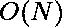

# 数 N 的第 k 个最大因子

> 原文:[https://www . geesforgeks . org/kth-最大数量因子-n/](https://www.geeksforgeeks.org/kth-largest-factor-of-number-n/)

给定两个正整数 **N** 和 **K** ，任务是打印 N 的第 K 个最大[因子。](https://www.geeksforgeeks.org/find-divisors-natural-number-set-1/)

> **输入:** N = 12，K = 3
> **输出:** 4
> **说明:**12 的因子为{1，2，3，4，6，12}。最大因子为 12，第 3 <sup>第 3</sup>最大因子为 4。
> 
> **输入:** N = 30，K = 2
> **输出:** 15
> **说明:**30 的因子为{1，2，3，5，6，10，15，30}，2 <sup>nd</sup> 最大的因子为 15。

**逼近:**思路是检查[N，1]范围内的每个数字，并打印将 N 完全除的第 k 个数字。

迭代从 **N** 到 **0** 的[循环](https://www.geeksforgeeks.org/loops-in-c-and-cpp/)。现在，对于这个循环中的每个数字:

*   检查它是否将**划分为**。
*   如果 **N** 可被当前数整除，则将 **K** 的值减 1。
*   当 **K** 变为 0 时，这意味着当前数是**的第 K 个最大因子 n**
*   根据以上观察打印答案。

下面是上述方法的实现:

## C

```
// C program for the above approach

#include <stdio.h>

// Function to print Kth largest
// factor of N
int KthLargestFactor(int N, int K)
{

    // Check for numbers
    // in the range [N, 1]
    for (int i = N; i > 0; i--) {

        // Check if i is a factor of N
        if (N % i == 0)

            // If Yes, reduce K by 1
            K--;

        // If K is 0, it means
        // i is the required
        // Kth factor of N
        if (K == 0) {
            return i;
        }
    }

    // When K is more
    // than the factors of N
    return -1;
}

// Driver Code
int main()
{
    int N = 12, K = 3;
    printf("%d", KthLargestFactor(N, K));
    return 0;
}
```

## C++

```
// C++ program for the above approach

#include <iostream>
using namespace std;

// Function to print Kth largest
// factor of N
int KthLargestFactor(int N, int K)
{
    // Check for numbers
    // in the range [N, 1]
    for (int i = N; i > 0; i--) {

        // Check if i is a factor of N
        if (N % i == 0)

            // If Yes, reduce K by 1
            K--;

        // If K is 0, it means
        // i is the required
        // Kth factor of N
        if (K == 0) {
            return i;
        }
    }

    // When K is more
    // than the factors of N
    return -1;
}

// Driver Code
int main()
{
    int N = 12, K = 3;
    cout << KthLargestFactor(N, K);
}
```

## Java 语言(一种计算机语言，尤用于创建网站)

```
// Java program for the above approach

import java.io.*;

class GFG {

    // Function to print Kth largest
    // factor of N
    static int KthLargestFactor(int N, int K)
    {
        // Check for numbers
        // in the range [N, 1]
        for (int i = N; i > 0; i--) {

            // Check if i is a factor of N
            if (N % i == 0)

                // If Yes, reduce K by 1
                K--;

            // If K is 0, it means
            // i is the required
            // Kth factor of N
            if (K == 0) {
                return i;
            }
        }

        // When K is more
        // than the factors of N
        return -1;
    }

    // Driver Code
    public static void main(String[] args)
    {
        int N = 12, K = 3;
        System.out.println(KthLargestFactor(N, K));
    }
}
```

## 计算机编程语言

```
# Python program for the above approach

# Function to print Kth largest
# factor of N
def KthLargestFactor(N, K):
    for i in range(N, 0, -1):
        if N % i == 0:
            K -= 1
        if K == 0:
            return i
    return -1

# Driver Code
N = 12
K = 3
print(KthLargestFactor(N, K))
```

## C#

```
// C# program for the above approach
using System;
using System.Collections.Generic;

class GFG{

// Function to print Kth largest
// factor of N
static int KthLargestFactor(int N, int K)
{

    // Check for numbers
    // in the range [N, 1]
    for (int i = N; i > 0; i--) {

        // Check if i is a factor of N
        if (N % i == 0)

            // If Yes, reduce K by 1
            K--;

        // If K is 0, it means
        // i is the required
        // Kth factor of N
        if (K == 0) {
            return i;
        }
    }

    // When K is more
    // than the factors of N
    return -1;
}

// Driver Code
public static void Main()
{
    int N = 12, K = 3;
    Console.Write(KthLargestFactor(N, K));
}
}

// This code is contributed by ipg2016107.
```

## java 描述语言

```
<script>
// JavaScript program for the above approach
// Function to print Kth largest
// factor of N
function KthLargestFactor(N, K)
    {
        // Check for numbers
        // in the range [N, 1]
        for (let i = N; i > 0; i--) {

            // Check if i is a factor of N
            if (N % i == 0)

                // If Yes, reduce K by 1
                K--;

            // If K is 0, it means
            // i is the required
            // Kth factor of N
            if (K == 0) {
                return i;
            }
        }

        // When K is more
        // than the factors of N
        return -1;
    }

// Driver Code
let N = 12, K = 3;
document.write(KthLargestFactor(N, K));

// This code is contributed by shivanisinghss2110
</script>
```

**Output:** 

```
4
```

**时间复杂度:** 
**辅助空间:** 