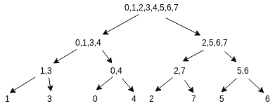

# 子阵列中第 Kth 个最小元素

> 原文:[https://www . geesforgeks . org/kth-subarray 中的最小元素/](https://www.geeksforgeeks.org/kth-smallest-element-in-a-subarray/)

给定一个大小为 **N** 的数组 **arr** 。任务是找到子阵列中的第 k 个最小元素(l 到 r，包括 l 和 r)。

**注:**

*   查询属于查询类型(l，r，k)
*   1 <= k <= r-l+1
*   可以有多个查询。

**示例:**

> **输入:** arr = {3，2，5，4，7，1，9}，查询= (2，6，3)
> **输出:** 4
> 在 2 到 6 范围内排序的子数组是{1，2，4，5，7}，第三个元素是 4
> 
> **输入:** arr = {2，3，4，1，6，5，8}，查询= (1，5，2)
> T3】输出: 2

```
Let, S = r - l + 1.
```

**天真方法:**

*   将子阵列复制到其他局部阵列中。排序后找到第 k 个元素。
    **时间复杂度:** Slog(S)
*   使用最大优先级队列“p”并在子数组中迭代。如果“p”的大小小于“k ”,则插入元素，否则移除顶部元素，并在“p”的顶部完成交互后将新元素插入“p”。
    **时间复杂度:** Slog(k)

**高效方法:**思路是使用[段树](https://www.geeksforgeeks.org/segment-tree-set-1-sum-of-given-range/)，更准确的说是使用[合并排序段树](https://www.geeksforgeeks.org/merge-sort-tree-smaller-or-equal-elements-in-given-row-range/)。这里，我们不是存储排序元素，而是存储排序元素的索引。

让 **B** 为排序后的数组**arr****seg**为我们的段树。 **seg** 的节点 **c <sub>i</sub>** 存储 **arr** 在**【ST，end】**范围内的索引排序。

```
If arr = {3, 1, 5, 2, 4, 7, 8, 6},
then B is {1, 2, 3, 4, 5, 6, 7, 8}
```

段树看起来像:



让我们假设 seg[ci]->left 持有 **p** 元素。如果 **p** 小于或等于 **k** ，我们可以在左子元素中找到 kth 最小，如果 **p** 小于 **k** ，那么移动到右子元素中，找到 **(k-p)** 最小元素。

可以通过以下方式找到位于元素 X 和 Y 之间的排序数组(A)中的元素数量:

> 上限(开始()、结束())-下限(开始()、结束())

下面是上述方法的实现:

## C++

```
// C++ program to find the kth smallest element in a range
#include <bits/stdc++.h>
using namespace std;
#define N (int)1e5

// Declaring a global segment tree
vector<int> seg[N];

// Function to build the merge sort
// segment tree of indices
void build(int ci, int st, int end,
           pair<int, int>* B)
{
    if (st == end) {
        // Using second property of B
        seg[ci].push_back(B[st].second);
        return;
    }

    int mid = (st + end) / 2;
    build(2 * ci + 1, st, mid, B);
    build(2 * ci + 2, mid + 1, end, B);

    // Inbuilt merge function
    // this takes two sorted arrays and merge
    // them into a sorted array
    merge(seg[2 * ci + 1].begin(), seg[2 * ci + 1].end(),
          seg[2 * ci + 2].begin(), seg[2 * ci + 2].end(),
          back_inserter(seg[ci]));
}

// Function to return the index of
// kth smallest element in range [l, r]
int query(int ci, int st, int end,
          int l, int r, int k)
{
    // Base case
    if (st == end)
        return seg[ci][0];

    // Finding value of 'p' as described in article
    // seg[2*ci+1] is left node of seg[ci]
    int p = upper_bound(seg[2 * ci + 1].begin(),
                        seg[2 * ci + 1].end(), r)
            - lower_bound(seg[2 * ci + 1].begin(),
                          seg[2 * ci + 1].end(), l);

    int mid = (st + end) / 2;
    if (p >= k)
        return query(2 * ci + 1, st, mid, l, r, k);
    else
        return query(2 * ci + 2, mid + 1, end, l, r, k - p);
}

// Driver code
int main()
{
    int arr[] = { 3, 1, 5, 2, 4, 7, 8, 6 };
    int n = sizeof(arr) / sizeof(arr[0]);

    pair<int, int> B[n];

    for (int i = 0; i < n; i++) {
        B[i] = { arr[i], i };
    }

    // After sorting, B's second property is
    // something upon which we will build our Tree
    sort(B, B + n);

    // Build the tree
    build(0, 0, n - 1, B);

    cout << "3rd smallest element in range 3 to 7 is: "
         << arr[query(0, 0, n - 1, 2, 6, 3)] << "\n";
}
```

**Output:** 

```
3rd smallest element in range 3 to 7 is: 5
```

**时间复杂度:**
构建段树:O(n*log(n))
对于每个查询:O(log(n)*log(n))