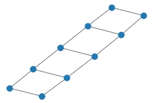
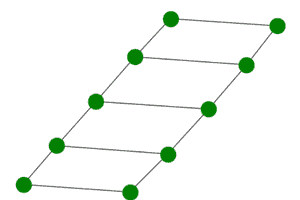

# Python 中使用 Networkx 模块的梯形图

> 原文:[https://www . geesforgeks . org/梯形图-使用-网络-python 中的模块/](https://www.geeksforgeeks.org/ladder-graph-using-networkx-module-in-python/)

在本文中，我们将看到使用 Python 的梯形图。它是一个看起来像梯子的图形，通常每个节点都以特定的方式连接到另外两个节点。我们可以通过将 n 个节点的两个路径图连接起来得到一个梯形图，每个节点与另一个路径图中的相应节点相连。

**表示:**

下面是返回长度为 4 (n)的梯形图的 L <sub>4 (n)梯形图的图像。</sub>


梯形图

**梯形图的属性:**

*   它是一个无向图。
*   它是平面的
*   一个 L <sub>n</sub> 梯形图有 2n 个。节点。
*   梯形图的色数是 2。
*   L <sub>n</sub> 梯形图有 3n-2 条边。
*   这是一个哈密顿图
*   这是一个连通图。
*   梯形图是一个二部图。

我们将使用[网络](https://www.geeksforgeeks.org/networkx-python-software-package-study-complex-networks/)模块来实现梯形图。它带有一个内置函数 networkx.ladder_graph()，可以使用 networkx.draw()方法进行说明。

> **语法:** networkx.draw(G，node_size，node_color)
> 
> **参数:**
> 
> *   g:指的是梯形图对象
> *   node_size:指节点的大小。
> *   node_color:指节点的颜色。

**下面是一些示例，描述如何用 Python 说明梯形图:**

**进场:**

*   我们将导入所需的 networkx 模块。
*   之后，我们将初始化 5 个节点。
*   我们将使用梯形图形()函数创建图形对象 G。
*   我们将使用 nx.draw()函数实现该图。

**例 1:**

## 蟒蛇 3

```
# import required module
import networkx

# number of nodes
n = 5

# create object
G = networkx.ladder_graph(n)

# illustrate graph
networkx.draw(G)
```

**输出:**



**示例 2:** 如上所述，通过向 nx.draw()函数传递额外的参数，使节点的颜色变为绿色并增加大小。

**进场:**

*   我们将导入所需的 networkx 模块。
*   之后，我们将节点数初始化为 5。
*   我们将使用梯形图形()函数创建图形对象 G。
*   我们将使用 nx.draw()函数实现该图。
*   我们将通过向 nx.draw()传递额外的参数来使节点的颜色为绿色并增加大小

## 蟒蛇 3

```
# import required module
import networkx

# create object
G = networkx.ladder_graph(5)

# illustrate graph
networkx.draw(G, node_size = 500,
            node_color = 'green')
```

**输出:**

