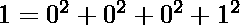
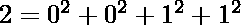
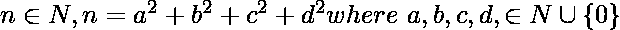

# 拉格朗日四方形定理

> 原文:[https://www . geeksforgeeks . org/拉格朗日-四方形-定理/](https://www.geeksforgeeks.org/lagranges-four-square-theorem/)

拉格朗日四平方定理指出，每个自然数都可以写成四个非负整数的平方和。

> 例如
> 同样
> 同样适用于任何
> 

以上恒等式可能来源于 [**欧拉的四个平方恒等式:**](https://www.geeksforgeeks.org/eulers-four-square-identity/) 表示我们可以把 2 个数的乘积(可以写成 4 个平方之和)写成 4 个平方之和。

## C++

```
// CPP program for Lagrange's four square identity
#include <bits/stdc++.h>
using namespace std;

// Prints all the possible combinations 4 numbers
// whose sum of squares is equal to the given no.
void printFourSquares(int a)
{
    // loops checking the sum of squares
    for (int i = 0; i * i <= a; i++) {
        for (int j = i; j * j <= a; j++) {
            for (int k = j; k * k <= a; k++) {
                for (int l = k; l * l <= a; l++) {

                    // if sum of four squares equals
                    // the given no.
                    if (i * i + j * j + k * k + l * l == a) {

                        // printing the numbers
                        cout << a << " = " << i << "*" << i
                            << " + " << j << "*" << j << " + ";
                        cout << k << "*" << k << " + "
                             << l << "*" << l << "\n";
                    }
                }
            }
        }
    }
}

// Driver Code
int main()
{
    int a = 74;
    // 74 = 0*0 + 0*0 + 5*5 + 7*7
    // 74 = 0*0 + 1*1 + 3*3 + 8*8
    // 74 = 0*0 + 3*3 + 4*4 + 7*7
    // 74 = 1*1 + 1*1 + 6*6 + 6*6
    // 74 = 2*2 + 3*3 + 5*5 + 6*6

    printFourSquares(a);

    return 0;
}
```

## Java 语言(一种计算机语言，尤用于创建网站)

```
// Java program for Lagrange's four square identity
class GFG
{
// Prints all the possible combinations 4 numbers
// whose sum of squares is equal to the given no.
static void printFourSquares(int a)
{
    // loops checking the sum of squares
    for (int i = 0; i * i <= a; i++)
    {
        for (int j = i; j * j <= a; j++)
        {
            for (int k = j; k * k <= a; k++)
            {
                for (int l = k; l * l <= a; l++)
                {

                    // if sum of four squares equals
                    // the given no.
                    if (i * i + j * j + k * k + l * l == a)
                    {

                        // printing the numbers
                        System.out.print( a + " = " + i + "*" + i
                                        + " + " + j + "*" + j + " + ");
                        System.out.println( k + "*" + k + " + "
                                           + l + "*" + l);
                    }
                }
            }
        }
    }
}

// Driver Code
public static void main(String[] args)
{
    int a = 74;
    // 74 = 0*0 + 0*0 + 5*5 + 7*7
    // 74 = 0*0 + 1*1 + 3*3 + 8*8
    // 74 = 0*0 + 3*3 + 4*4 + 7*7
    // 74 = 1*1 + 1*1 + 6*6 + 6*6
    // 74 = 2*2 + 3*3 + 5*5 + 6*6

    printFourSquares(a);
}
}
// This code is contributed by smitha
```

## 蟒蛇 3

```
# Python program for Lagrange's four square identity

# Prints all the possible combinations 4 numbers
# whose sum of squares is equal to the given no.

def printFourSquares(a) :

    # loops checking the sum of squares
    i = 0
    while (i * i <= a) :
        j = i
        while (j * j <= a) :
            k = j
            while (k * k <= a) :
                l = k
                while (l * l <= a) :

                    # if sum of four squares equals
                    # the given no.
                    if (i * i + j * j + k * k + l * l == a) :        

                        # printing the numbers
                        print ("{} = {}*{} + {}*{} +".
                                format(a,i,i,j,j), end = " ")
                        print ("{}*{} + {}*{}".
                                   format(k,k,l,l), end="\n")
                    l = l + 1
                k = k + 1
            j = j + 1
        i = i + 1

# Driver Code
a = 74

# 74 = 0*0 + 0*0 + 5*5 + 7*7
# 74 = 0*0 + 1*1 + 3*3 + 8*8
# 74 = 0*0 + 3*3 + 4*4 + 7*7
# 74 = 1*1 + 1*1 + 6*6 + 6*6
# 74 = 2*2 + 3*3 + 5*5 + 6*6

printFourSquares(a)

# This code is contributed by Manish Shaw
# (manishshaw1)
```

## C#

```
// C# program for Lagrange's four square identity
using System;

class GFG
{
// Prints all the possible combinations 4 numbers
// whose sum of squares is equal to the given no.
static void printFourSquares(int a)
{
    // loops checking the sum of squares
    for (int i = 0; i * i <= a; i++)
    {
        for (int j = i; j * j <= a; j++)
        {
            for (int k = j; k * k <= a; k++)  {
                for (int l = k; l * l <= a; l++)
                {

                    // if sum of four squares equals
                    // the given no.
                    if (i * i + j * j + k * k + l * l == a)
                    {

                        // printing the numbers
                        Console.Write( a + " = " + i + "*" + i + " + "
                                      + j + "*" + j + " + ");
                        Console.Write( k + "*" + k + " + "
                                       + l + "*" + l + "\n");
                    }
                }
            }
        }
    }
}

// Driver code
public static void Main()
{
    int a = 74;
    // 74 = 0*0 + 0*0 + 5*5 + 7*7
    // 74 = 0*0 + 1*1 + 3*3 + 8*8
    // 74 = 0*0 + 3*3 + 4*4 + 7*7
    // 74 = 1*1 + 1*1 + 6*6 + 6*6
    // 74 = 2*2 + 3*3 + 5*5 + 6*6

    printFourSquares(a);
}
}
// This code is contributed by Smitha
```

## 服务器端编程语言（Professional Hypertext Preprocessor 的缩写）

```
<?php
//PHP program for Lagrange's four square identity

// Prints all the possible combinations 4 numbers
// whose sum of squares is equal to the given no.

function printFourSquares($a)
{
    // loops checking the sum of squares
    for ($i = 0; $i * $i <= $a; $i++) {
        for ( $j = $i; $j * $j <= $a; $j++) {
            for ($k = $j; $k * $k <= $a; $k++) {
                for ($l = $k; $l * $l <= $a; $l++) {

                    // if sum of four squares equals
                    // the given no.
                    if ($i * $i + $j * $j + $k * $k
                                    + $l * $l == $a)
                    {

                        // printing the numbers
                        echo $a , " = " , $i , "*" ,$i,
                         " + " , $j , "*" , $j , " + ";
                        echo $k , "*" , $k , " + ",
                              $l , "*" , $l , "\n";
                    }
                }
            }
        }
    }
}

// Driver Code
    $a = 74;
    // 74 = 0*0 + 0*0 + 5*5 + 7*7
    // 74 = 0*0 + 1*1 + 3*3 + 8*8
    // 74 = 0*0 + 3*3 + 4*4 + 7*7
    // 74 = 1*1 + 1*1 + 6*6 + 6*6
    // 74 = 2*2 + 3*3 + 5*5 + 6*6

    printFourSquares($a);

// This code is contributed by ajit.
?>
```

## java 描述语言

```
<script>

// Javascript program for Lagrange's four
// square identity

// Prints all the possible combinations
// 4 numbers whose sum of squares is
// equal to the given no.
function printFourSquares(a)
{

    // Loops checking the sum of squares
    for(let i = 0; i * i <= a; i++)
    {
        for(let j = i; j * j <= a; j++)
        {
            for(let k = j; k * k <= a; k++) 
            {
                for(let l = k; l * l <= a; l++)
                {

                    // If sum of four squares equals
                    // the given no.
                    if (i * i + j * j + k * k + l * l == a)
                    {

                        // Printing the numbers
                        document.write(a + " = " + i + "*" +
                                       i + " + " + j + "*" +
                                       j + " + ");
                        document.write(k + "*" + k + " + " +
                                       l + "*" + l + "</br>");
                    }
                }
            }
        }
    }
}

// Driver code
let a = 74;

// 74 = 0*0 + 0*0 + 5*5 + 7*7
// 74 = 0*0 + 1*1 + 3*3 + 8*8
// 74 = 0*0 + 3*3 + 4*4 + 7*7
// 74 = 1*1 + 1*1 + 6*6 + 6*6
// 74 = 2*2 + 3*3 + 5*5 + 6*6

printFourSquares(a);

// This code is contributed by decode2207

</script>
```

**Output:** 

```
74 = 0*0 + 0*0 + 5*5 + 7*7
74 = 0*0 + 1*1 + 3*3 + 8*8
74 = 0*0 + 3*3 + 4*4 + 7*7
74 = 1*1 + 1*1 + 6*6 + 6*6
74 = 2*2 + 3*3 + 5*5 + 6*6
```