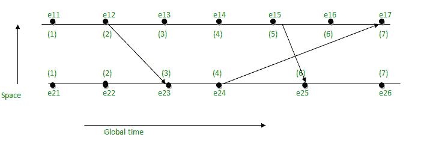
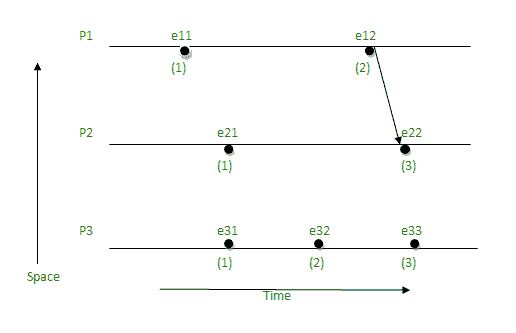

# 兰波特的逻辑时钟

> 原文:[https://www.geeksforgeeks.org/lamports-logical-clock/](https://www.geeksforgeeks.org/lamports-logical-clock/)

**兰波特的逻辑时钟**是由莱斯利·兰波特创造的。这是一个确定事件发生顺序的程序。它为更高级的[矢量时钟算法](https://www.geeksforgeeks.org/vector-clocks-in-distributed-systems/)提供了基础。由于分布式操作系统[中缺少](https://www.geeksforgeeks.org/types-of-operating-systems/)[全局时钟](https://www.geeksforgeeks.org/logical-clock-in-distributed-system/)，需要端口[逻辑时钟](https://www.geeksforgeeks.org/logical-clock-in-distributed-system/)。

**算法:**

*   **发生在关系(- > ):** a - > b，表示‘a’发生在‘b’之前。
*   **逻辑时钟:**逻辑时钟的标准是:
    *   【C1】:C<sub>I</sub>(a)<C<sub>I</sub>(b)【C<sub>I</sub>->逻辑时钟，如果‘a’发生在‘b’之前，那么在特定过程中‘a’的时间会小于‘b’。]
    *   【C2】:C<sub>I</sub>(a)<C<sub>j</sub>(b)【C<sub>I</sub>(a)的时钟值小于 C <sub>j</sub> (b)】

**参考:**

*   **流程:** P <sub>i</sub>
*   **事件:** **E <sub>ij</sub>** ，其中 I 为过程数，j:**j<sub>T8</sub>**事件中 **i <sup>第</sup>过程**。
*   **t <sub>m</sub> :消息 m 的**向量时间跨度
*   **C <sub>i</sub>** 与进程 **P <sub>i</sub>** 关联的矢量时钟， **j <sup>th</sup>** 元素为**Ci【j】**，包含 **P <sub>i</sub> 的**进程中当前时间的最新值 **P <sub>j</sub>** 。
*   **d:** 漂移时间，一般 d 为 1。

**实施细则【IR】:**

*   **【IR1】:**如果 a - > b ['a '发生在同一过程中的' b '之前]，那么，**C<sub>I</sub>(b)= C<sub>I</sub>(a)+d**
*   **【IR2】:**C<sub>j</sub>=最大值(C <sub>j</sub> ，t <sub>m</sub> + d)【如果工序数较多，则 t<sub>m</sub>= C<sub>I</sub>(a)的值，C<sub>j</sub>= C<sub>j</sub>和 t <sub>m</sub> + d 之间的最大值】

**例如:**

[](https://media.geeksforgeeks.org/wp-content/uploads/20210105123302/lamportlogicalclkgfg.png)

*   取起始值为 1，因为是 1 <sup>st</sup> 事件，在起点没有来值:
    *   e11 = 1
    *   e21 = 1
*   如果没有输入值，即遵循[IR1]，下一个点的值将继续增加 d (d = 1)。
    *   e12 = e11 + d = 1 + 1 = 2
    *   e13 = e12 + d = 2 + 1 = 3
    *   e14 = e13 + d = 3 + 1 = 4
    *   e15 = e14 + d = 4 + 1 = 5
    *   e16 = e15 + d = 5 + 1 = 6
    *   e22 = e21 + d = 1 + 1 = 2
    *   e24 = e23 + d = 3 + 1 = 4
    *   e26 = e25 + d = 6 + 1 = 7
*   当有进值时，则跟随**【IR2】**，即取**C<sub>j</sub>T5】和 **T <sub>m</sub> + d** 之间的最大值。**
    *   e17 =最大值(7，5) = 7，[e16 + d = 6 + 1 = 7，e24 + d = 4 + 1 = 5，7 和 5 之间的最大值为 7]
    *   e23 = max(3，3) = 3，[e22 + d = 2 + 1 = 3，e12 + d = 2 + 1 = 3，3 和 3 之间的最大值为 3]
    *   e25 =最大值(5，6) = 6，[e24 + 1 = 4 + 1 = 5，e15 + d = 5 + 1 = 6，5 和 6 之间的最大值为 6]

**限制**:

*   在[IR1]的情况下，如果 a -> b，那么 C(a) < C(b) ->为真。
*   在[IR2]的情况下，如果 a -> b，那么 C(a) < C(b) ->可能为真，也可能为假。

[](https://media.geeksforgeeks.org/wp-content/uploads/20210105123406/lamportclklimitationgfg.png)

下面是实现兰波特逻辑时钟的 C 程序:

## C++

```
// C++ program to illustrate the Lamport's
// Logical Clock

#include <bits/stdc++.h>
using namespace std;

// Function to find the maximum timestamp
// between 2 events
int max1(int a, int b)
{
    // Return the greatest of th two
    if (a > b)
        return a;
    else
        return b;
}

// Function to display the logical timestamp
void display(int e1, int e2,
             int p1[5], int p2[3])
{
    int i;

    cout << "\nThe time stamps of "
         "events in P1:\n";

    for (i = 0; i < e1; i++) {
        cout << p1[i] << " ";
    }

    cout << "\nThe time stamps of "
         "events in P2:\n";

    // Print the array p2[]
    for (i = 0; i < e2; i++)
        cout << p2[i] << " ";
}

// Function to find the timestamp of events
void lamportLogicalClock(int e1, int e2,
                         int m[5][3])
{
    int i, j, k, p1[e1], p2[e2];

    // Initialize p1[] and p2[]
    for (i = 0; i < e1; i++)
        p1[i] = i + 1;

    for (i = 0; i < e2; i++)
        p2[i] = i + 1;
    cout << "\t";
    for (i = 0; i < e2; i++)
        cout << "\te2" << i + 1;

    for (i = 0; i < e1; i++) {

        cout << "\n e1" << i + 1 << "\t";

        for (j = 0; j < e2; j++)
            cout << m[i][j] << "\t";
    }

    for (i = 0; i < e1; i++) {
        for (j = 0; j < e2; j++) {

            // Change the timestamp if the
            // message is sent
            if (m[i][j] == 1) {
                p2[j] = max1(p2[j], p1[i] + 1);
                for (k = j + 1; k < e2; k++)
                    p2[k] = p2[k - 1] + 1;
            }

            // Change the timestamp if the
            // message is received
            if (m[i][j] == -1) {
                p1[i] = max1(p1[i], p2[j] + 1);
                for (k = i + 1; k < e1; k++)
                    p1[k] = p1[k - 1] + 1;
            }
        }
    }

    // Function Call
    display(e1, e2, p1, p2);
}

// Driver Code
int main()
{
    int e1 = 5, e2 = 3, m[5][3];

    // message is sent and received
    // between two process

    /*dep[i][j] = 1, if message is sent
                   from ei to ej
    dep[i][j] = -1, if message is received
                    by ei from ej
    dep[i][j] = 0, otherwise*/
    m[0][0] = 0;
    m[0][1] = 0;
    m[0][2] = 0;
    m[1][0] = 0;
    m[1][1] = 0;
    m[1][2] = 1;
    m[2][0] = 0;
    m[2][1] = 0;
    m[2][2] = 0;
    m[3][0] = 0;
    m[3][1] = 0;
    m[3][2] = 0;
    m[4][0] = 0;
    m[4][1] = -1;
    m[4][2] = 0;

    // Function Call
    lamportLogicalClock(e1, e2, m);

    return 0;
}
```

## C

```
// C program to illustrate the Lamport's
// Logical Clock
#include <stdio.h>

// Function to find the maximum timestamp
// between 2 events
int max1(int a, int b)
{
    // Return the greatest of th two
    if (a > b)
        return a;
    else
        return b;
}

// Function to display the logical timestamp
void display(int e1, int e2,
             int p1[5], int p2[3])
{
    int i;

    printf("\nThe time stamps of "
           "events in P1:\n");

    for (i = 0; i < e1; i++) {
        printf("%d ", p1[i]);
    }

    printf("\nThe time stamps of "
           "events in P2:\n");

    // Print the array p2[]
    for (i = 0; i < e2; i++)
        printf("%d ", p2[i]);
}

// Function to find the timestamp of events
void lamportLogicalClock(int e1, int e2,
                         int m[5][3])
{
    int i, j, k, p1[e1], p2[e2];

    // Initialize p1[] and p2[]
    for (i = 0; i < e1; i++)
        p1[i] = i + 1;

    for (i = 0; i < e2; i++)
        p2[i] = i + 1;

    for (i = 0; i < e2; i++)
        printf("\te2%d", i + 1);

    for (i = 0; i < e1; i++) {

        printf("\n e1%d \t", i + 1);

        for (j = 0; j < e2; j++)
            printf("%d\t", m[i][j]);
    }

    for (i = 0; i < e1; i++) {
        for (j = 0; j < e2; j++) {

            // Change the timestamp if the
            // message is sent
            if (m[i][j] == 1) {
                p2[j] = max1(p2[j], p1[i] + 1);
                for (k = j + 1; k < e2; k++)
                    p2[k] = p2[k - 1] + 1;
            }

            // Change the timestamp if the
            // message is received
            if (m[i][j] == -1) {
                p1[i] = max1(p1[i], p2[j] + 1);
                for (k = i + 1; k < e1; k++)
                    p1[k] = p1[k - 1] + 1;
            }
        }
    }

    // Function Call
    display(e1, e2, p1, p2);
}

// Driver Code
int main()
{
    int e1 = 5, e2 = 3, m[5][3];

    // message is sent and received
    // between two process

    /*dep[i][j] = 1, if message is sent
                   from ei to ej
    dep[i][j] = -1, if message is received
                    by ei from ej
    dep[i][j] = 0, otherwise*/
    m[0][0] = 0;
    m[0][1] = 0;
    m[0][2] = 0;
    m[1][0] = 0;
    m[1][1] = 0;
    m[1][2] = 1;
    m[2][0] = 0;
    m[2][1] = 0;
    m[2][2] = 0;
    m[3][0] = 0;
    m[3][1] = 0;
    m[3][2] = 0;
    m[4][0] = 0;
    m[4][1] = -1;
    m[4][2] = 0;

    // Function Call
    lamportLogicalClock(e1, e2, m);

    return 0;
}
```

## 蟒蛇 3

```
# Python program to illustrate the Lamport's
# Logical Clock

# Function to find the maximum timestamp
# between 2 events
def max1(a, b) :

    # Return the greatest of th two
    if a > b :
        return a
    else :
        return b

# Function to display the logical timestamp
def display(e1, e2, p1, p2) :
    print()
    print("The time stamps of events in P1:")
    for i in range(0, e1) :
        print(p1[i], end = " ")

    print()
    print("The time stamps of events in P2:")

    # Print the array p2[]
    for i in range(0, e2) :
        print(p2[i], end = " ")

# Function to find the timestamp of events
def lamportLogicalClock(e1, e2, m) :
    p1 = [0]*e1
    p2 = [0]*e2

    # Initialize p1[] and p2[]
    for i in range (0, e1) :
        p1[i] = i + 1

    for i in range(0, e2) :
        p2[i] = i + 1

    for i in range(0, e2) :
        print(end = '\t')
        print("e2", end = "")
        print(i + 1, end = "")

    for i in range(0, e1) :
        print()
        print("e1", end = "")
        print(i + 1, end = "\t")

        for j in range(0, e2) :
            print(m[i][j], end = "\t")

    for i in range(0, e1) :

        for j in range(0, e2) :

            # Change the timestamp if the
            # message is sent
            if(m[i][j] == 1) :
                p2[j] = max1(p2[j], p1[i] + 1)
                for i in range(j + 1, e2) :
                    p2[k] = p2[k - 1] + 1

            # Change the timestamp if the
            # message is received
            if(m[i][j] == -1) :
                p1[i] = max1(p1[i], p2[j] + 1)
                for k in range(i + 1, e1) :
                    p1[k] = p1[k - 1] + 1

    # Function Call
    display(e1, e2, p1, p2)

# Driver Code

if __name__ == "__main__" :
    e1 = 5
    e2 = 3
    m = [[0]*3 for i in range(0,5)]

    # dep[i][j] = 1, if message is sent
    # from ei to ej
    # dep[i][j] = -1, if message is received
    # by ei from ej
    # dep[i][j] = 0, otherwise

    m[0][0] = 0
    m[0][1] = 0
    m[0][2] = 0
    m[1][0] = 0
    m[1][1] = 0
    m[1][2] = 1
    m[2][0] = 0
    m[2][1] = 0
    m[2][2] = 0
    m[3][0] = 0
    m[3][1] = 0
    m[3][2] = 0
    m[4][0] = 0
    m[4][1] = -1
    m[4][2] = 0

    # Function Call
    lamportLogicalClock(e1, e2, m)

    # This code is contributed by rakeshsahni
```

## java 描述语言

```
<script>
    // JavaScript program to illustrate the Lamport's
    // Logical Clock

    // Function to find the maximum timestamp
    // between 2 events
    const max1 = (a, b) => {
        // Return the greatest of th two
        if (a > b)
            return a;
        else
            return b;
    }

    // Function to display the logical timestamp
    const display = (e1, e2, p1, p2) => {
        let i;

        document.write(`<br/>The time stamps of events in P1:<br/>`);

        for (i = 0; i < e1; i++) {
            document.write(`${p1[i]} `);
        }

        document.write(`<br/>The time stamps of events in P2:<br/>`);

        // Print the array p2[]
        for (i = 0; i < e2; i++)
            document.write(`${p2[i]} `);
    }

    // Function to find the timestamp of events
    const lamportLogicalClock = (e1, e2, m) => {
        let i, j, k, p1 = [], p2 = [];

        // Initialize p1[] and p2[]
        for (i = 0; i < e1; i++)
            p1[i] = i + 1;

        for (i = 0; i < e2; i++)
            p2[i] = i + 1;

        for (i = 0; i < e2; i++)
            document.write(`\te2${i + 1}`)

        for (i = 0; i < e1; i++) {

            document.write(`<br/>e1${i + 1} `)
            for (j = 0; j < e2; j++)
                document.write(`${m[i][j]}\t`);
        }

        for (i = 0; i < e1; i++) {
            for (j = 0; j < e2; j++) {

                // Change the timestamp if the
                // message is sent
                if (m[i][j] == 1) {
                    p2[j] = max1(p2[j], p1[i] + 1);
                    for (k = j + 1; k < e2; k++)
                        p2[k] = p2[k - 1] + 1;
                }

                // Change the timestamp if the
                // message is received
                if (m[i][j] == -1) {
                    p1[i] = max1(p1[i], p2[j] + 1);
                    for (k = i + 1; k < e1; k++)
                        p1[k] = p1[k - 1] + 1;
                }
            }
        }

        // Function Call
        display(e1, e2, p1, p2);
    }

    // Driver Code

    let e1 = 5, e2 = 3;

    // message is sent and received
    // between two process

    /*dep[i][j] = 1, if message is sent
                from ei to ej
    dep[i][j] = -1, if message is received
                    by ei from ej
    dep[i][j] = 0, otherwise*/
    const m = [
        [0, 0, 0],
        [0, 0, 1],
        [0, 0, 0],
        [0, 0, 0],
        [0, -1, 0]
    ]

    // Function Call
    lamportLogicalClock(e1, e2, m);

// This code is contributed by rakeshsahni

</script>
```

**Output**

```
        e21    e22    e23
 e11    0    0    0    
 e12    0    0    1    
 e13    0    0    0    
 e14    0    0    0    
 e15    0    -1    0    
The time stamps of events in P1:
1 2 3 4 5 
The time stamps of events in P2:
1 2 3 
```

**时间复杂度:** O(e1 * e2 * (e1 + e2))
**辅助空间:** O(e1 + e2)