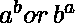
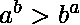
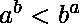

# a^b 或 b^a 中较大的一个(a 升到 b 次方或 b 升到 a 次方)

> 原文:[https://www . geesforgeks . org/biger-of-ab-or-ba-a-raid-to-power-b-or-b-raid-to-power-a/](https://www.geeksforgeeks.org/larger-of-ab-or-ba-a-raised-to-power-b-or-b-raised-to-power-a/)

给定两个数字，找出哪个大于。
如果，打印 a^b 大于
如果，打印 b^a 大于
如果，打印两者相等
T9】示例:

```
Input : 3 5
Output : a^b is greater
3^5 = 243, 5^3 = 125\. Since, 243>125, therefore a^b > b^a.

Input : 2 4
Output : Both are equal
2^4 = 16, 4^2 = 16\. Since, 16=16, therefore a^b = b^a.
```

**蛮力**的解决方案是计算并比较它们。但是由于可以足够大以至于甚至不能存储在 long long int 中，所以这个解决方案是不可行的。使用[快速取幂技术](https://www.geeksforgeeks.org/modular-exponentiation-power-in-modular-arithmetic/)计算 n 次方至少需要时间。
**有效的方法**是使用对数。我们要对比。如果我们取对数，问题简化为比较。
因此，
如果，打印 a^b 更大
如果，打印 b^a 更大
如果，打印两者相等
下面是上面讨论的高效方法的实现。

## C++

```
// C++ code for finding greater
// between the a^b and b^a
#include <bits/stdc++.h>
using namespace std;

// Function to find the greater value
void findGreater(int a, int b)
{
    long double x = (long double)a * (long double)(log((long double)(b)));
    long double y = (long double)b * (long double)(log((long double)(a)));
    if (y > x) {
        cout << "a^b is greater" << endl;
    }
    else if (y < x) {
        cout << "b^a is greater" << endl;
    }
    else {
        cout << "Both are equal" << endl;
    }
}

// Driver code
int main()
{
    int a = 3, b = 5, c = 2, d = 4;
    findGreater(a, b);
    findGreater(c, d);
    return 0;
}
```

## Java 语言(一种计算机语言，尤用于创建网站)

```
// Java code for finding greater
// between the a^b and b^a

public class GFG{

    // Function to find the greater value
    static void findGreater(int a, int b)
    {
        double x = (double)a * (double)(Math.log((double)(b)));
        double y = (double)b * (double)(Math.log((double)(a)));
        if (y > x) {
            System.out.println("a^b is greater") ;
        }
        else if (y < x) {
            System.out.println("b^a is greater") ;
        }
        else {
            System.out.println("Both are equal") ;
        }
    }

    // Driver code
    public static void main(String []args)
    {
        int a = 3, b = 5, c = 2, d = 4;
        findGreater(a, b);
        findGreater(c, d);
    }
    // This code is contributed by Ryuga
}
```

## 蟒蛇 3

```
# Python 3 code for finding greater
# between the a^b and b^a
import math

# Function to find the greater value
def findGreater(a, b):

    x = a * (math.log(b));
    y = b * (math.log(a));
    if (y > x):
        print ("a^b is greater");
    elif (y < x):
        print("b^a is greater");
    else :
        print("Both are equal");

# Driver code
a = 3;
b = 5;
c = 2;
d = 4;
findGreater(a, b);
findGreater(c, d);

# This code is contributed
# by Shivi_Aggarwal
```

## C#

```
// C# code for finding greater
// between the a^b and b^a

using System;
public class GFG{

    // Function to find the greater value
    static void findGreater(int a, int b)
    {
        double x = (double)a * (double)(Math.Log((double)(b)));
        double y = (double)b * (double)(Math.Log((double)(a)));
        if (y > x) {
            Console.Write("a^b is greater\n") ;
        }
        else if (y < x) {
            Console.Write("b^a is greater"+"\n") ;
        }
        else {
            Console.Write("Both are equal") ;
        }
    }

    // Driver code
    public static void Main()
    {
        int a = 3, b = 5, c = 2, d = 4;
        findGreater(a, b);
        findGreater(c, d);
    }

}
```

## 服务器端编程语言（Professional Hypertext Preprocessor 的缩写）

```
<?php
// PHP code for finding greater
// between the a^b and b^a

// Function to find the greater value
function findGreater($a, $b)
{
    $x = (double)$a * (double)(log((double)($b)));
    $y = (double)$b * (double)(log((double)($a)));
    if ($y > $x)
    {
        echo "a^b is greater", "\n";
    }
    else if ($y < $x)
    {
        echo "b^a is greater", "\n" ;
    }
    else
    {
        echo "Both are equal", "\n" ;
    }
}

// Driver code
$a = 3;
$b = 5;
$c = 2;
$d = 4;
findGreater($a, $b);
findGreater($c, $d);

// This code is contributed by ajit
?>
```

## java 描述语言

```
<script>
// javascript code for finding greater
// between the a^b and b^a

    // Function to find the greater value
    function findGreater(a , b) {
        var x =  a * (Math.log( (b)));
        var y =  b * (Math.log( (a)));
        if (y > x) {
            document.write("a^b is greater<br/>");
        } else if (y < x) {
            document.write("b^a is greater<br/>");
        } else {
            document.write("Both are equal<br/>");
        }
    }

    // Driver code

        var a = 3, b = 5, c = 2, d = 4;
        findGreater(a, b);
        findGreater(c, d);

// This code is contributed by todaysgaurav
</script>
```

**输出:**

```
a^b is greater
Both are equal
```

**时间复杂度:** O(1)

**辅助空间:** O(1)