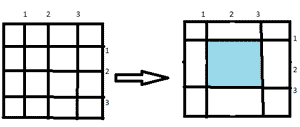

# 移除一系列水平&竖条

后可能的最大面积

> 原文:[https://www . geeksforgeeks . org/移除一系列水平竖条后的最大可能面积/](https://www.geeksforgeeks.org/largest-area-possible-after-removal-of-a-series-of-horizontal-vertical-bars/)

给定一个由大小为 **(N + 2) x (M + 2)** 的水平和垂直条以及两个表示需要移除的水平&垂直条数量的[阵列](https://www.geeksforgeeks.org/array-data-structure/) **H[]** 和 **V[]** 组成的网格，任务是在移除一系列垂直和水平条时找到最大的区域。

**示例:**

> **输入:** N = 3，M = 3，H[] = {2}，V[] = {2}
> **输出:** 4
> **说明:**
> 水平方向和垂直方向各有 3 根横条。
> 移除条形后，矩阵如下所示:
> 
> 
> 
> 因此，最大面积为 4。
> 
> **输入:** N = 3，M = 2，H[] = {1，2，3}，V[] = {1，2 }
> T3】输出: 12

**方法:**按照以下步骤解决问题:

*   初始化两个[集合](https://www.geeksforgeeks.org/set-in-java/)、 **s1 & s2** 来存储整数。
*   迭代范围**【1，N+1】**，并将每个整数存储在 **s1** 中。
*   同样，迭代范围**【1，M+1】**，并将每个整数存储在 **s2** 中。
*   [遍历阵](https://www.geeksforgeeks.org/iterating-arrays-java/) **H[]** 并从 **s1 中移除所有 **H[i]** 。**
*   同样，遍历数组 **V[]** ，从 **s2 中移除所有 **V[i]** 。**
*   将更新后的 **s1** 和 **s2** 集合转换为[列表](https://www.geeksforgeeks.org/initializing-a-list-in-java/) **l1** 和 **l2。**
*   [按升序排列两个列表](https://www.geeksforgeeks.org/how-to-sort-an-arraylist-in-ascending-order-in-java/)。
*   [遍历列表](https://www.geeksforgeeks.org/iterating-arraylists-java/) **l1** 和 **l2** 并将两个邻居之间的最大距离分别存储为 **maxH** 和 **maxV** 。
*   打印 **maxH** 和 **maxV** 的乘积作为最大面积。

下面是上述方法的实现:

## C++

```
// C++ program for the above approach
#include <bits/stdc++.h>
using namespace std;

// Function to find the largest area
// when a series of horizontal &
// vertical bars are removed
void largestArea(int N, int M, int H[],
                 int V[], int h, int v)
{

  // Stores all bars
  set<int> s1;
  set<int> s2;

  // Insert horizontal bars
  for (int i = 1; i <= N + 1; i++)
    s1.insert(i);

  // Insert vertictal bars
  for (int i = 1; i <= M + 1; i++)
    s2.insert(i);

  // Remove horizontal separators from s1
  for (int i = 0; i < h; i++) {

    s1.erase(H[i]);
  }

  // Remove vertical separators from s2
  for (int i = 0; i < v; i++) {

    s2.erase(V[i]);
  }

  // Stores left out horizontal and
  // vertical separators
  int list1[s1.size()];
  int list2[s2.size()];

  int i = 0;
  for (auto it1 = s1.begin(); it1 != s1.end(); it1++) 
  {
    list1[i++] = *it1;
  }

  i = 0;
  for (auto it2 = s2.begin(); it2 != s2.end(); it2++) 
  {
    list2[i++] = *it2;
  }

  // Sort both list in
  // ascending order
  sort(list1, list1 + s1.size());
  sort(list2, list2 + s2.size());

  int maxH = 0, p1 = 0, maxV = 0, p2 = 0;

  // Find maximum difference of neighbors of list1
  for (int j = 0; j < s1.size(); j++) {
    maxH = max(maxH, list1[j] - p1);
    p1 = list1[j];
  }

  // Find max difference of neighbors of list2
  for (int j = 0; j < s2.size(); j++) {
    maxV = max(maxV, list2[j] - p2);
    p2 = list2[j];
  }

  // Print largest volume
  cout << (maxV * maxH) << endl;
}

// Driver code
int main()
{

  // Given value of N & M
  int N = 3, M = 3;

  // Given arrays
  int H[] = { 2 };
  int V[] = { 2 };

  int h = sizeof(H) / sizeof(H[0]);
  int v = sizeof(V) / sizeof(V[0]);

  // Function call to find the largest
  // area when a series of horizontal &
  // vertical bars are removed
  largestArea(N, M, H, V, h, v);

  return 0;
}

// This code is contributed by divyeshrabadiya07.
```

## Java 语言(一种计算机语言，尤用于创建网站)

```
// Java program for the above approach

import java.lang.*;
import java.util.*;

class GFG {

    // Function to find the largest area
    // when a series of horizontal &
    // vertical bars are removed
    static void largestArea(int N, int M,
                            int[] H, int[] V)
    {
        // Stores all bars
        Set<Integer> s1 = new HashSet<>();
        Set<Integer> s2 = new HashSet<>();

        // Insert horizontal bars
        for (int i = 1; i <= N + 1; i++)
            s1.add(i);

        // Insert vertictal bars
        for (int i = 1; i <= M + 1; i++)
            s2.add(i);

        // Remove horizontal separators from s1
        for (int i = 0; i < H.length; i++) {

            s1.remove(H[i]);
        }

        // Remove vertical separators from s2
        for (int i = 0; i < V.length; i++) {

            s2.remove(V[i]);
        }

        // Stores left out horizontal and
        // vertical separators
        int[] list1 = new int[s1.size()];
        int[] list2 = new int[s2.size()];

        int i = 0;
        Iterator it1 = s1.iterator();
        while (it1.hasNext()) {
            list1[i++] = (int)it1.next();
        }

        i = 0;
        Iterator it2 = s2.iterator();
        while (it2.hasNext()) {
            list2[i++] = (int)it2.next();
        }

        // Sort both list in
        // ascending order
        Arrays.sort(list1);
        Arrays.sort(list2);

        int maxH = 0, p1 = 0, maxV = 0, p2 = 0;

        // Find maximum difference of neighbors of list1
        for (int j = 0; j < list1.length; j++) {
            maxH = Math.max(maxH, list1[j] - p1);
            p1 = list1[j];
        }

        // Find max difference of neighbors of list2
        for (int j = 0; j < list2.length; j++) {
            maxV = Math.max(maxV, list2[j] - p2);
            p2 = list2[j];
        }

        // Print largest volume
        System.out.println(maxV * maxH);
    }

    // Driver Code
    public static void main(String[] args)
    {
        // Given value of N & M
        int N = 3, M = 3;

        // Given arrays
        int[] H = { 2 };
        int[] V = { 2 };

        // Function call to find the largest
        // area when a series of horizontal &
        // vertical bars are removed
        largestArea(N, M, H, V);
    }
}
```

## 蟒蛇 3

```
# Python 3 program for the above approach

# Function to find the largest area
# when a series of horizontal &
# vertical bars are removed
def largestArea(N, M, H,
                 V, h, v):

  # Stores all bars
  s1 = set([]);
  s2 = set([]);

  # Insert horizontal bars
  for i in range(1, N + 2):
    s1.add(i);

  # Insert vertictal bars
  for i in range(1, M + 2):
    s2.add(i);

  # Remove horizontal separators from s1
  for i in range(h):
    s1.remove(H[i]);

  # Remove vertical separators from s2
  for i in range( v ):

    s2.remove(V[i]);

  # Stores left out horizontal and
  # vertical separators
  list1 = [0] * len(s1)
  list2 = [0]*len(s2);

  i = 0;
  for it1 in s1:
    list1[i] = it1;
    i += 1

  i = 0;
  for it2 in s2:
    list2[i] = it2
    i += 1

  # Sort both list in
  # ascending order
  list1.sort();
  list2.sort();

  maxH = 0
  p1 = 0
  maxV = 0
  p2 = 0;

  # Find maximum difference of neighbors of list1
  for j in range(len(s1)):
    maxH = max(maxH, list1[j] - p1);
    p1 = list1[j];

  # Find max difference of neighbors of list2
  for j in range(len(s2)):
    maxV = max(maxV, list2[j] - p2);
    p2 = list2[j];

  # Print largest volume
  print((maxV * maxH))

# Driver code
if __name__ == "__main__":

  # Given value of N & M
  N = 3
  M = 3;

  # Given arrays
  H = [2]
  V = [2];

  h = len(H)
  v = len(V);

  # Function call to find the largest
  # area when a series of horizontal &
  # vertical bars are removed
  largestArea(N, M, H, V, h, v);

  # This code is contributed by ukasp.
```

## C#

```
// C# program for the above approach
using System;
using System.Collections.Generic;
class GFG {

    // Function to find the largest area
    // when a series of horizontal &
    // vertical bars are removed
    static void largestArea(int N, int M,
                            int[] H, int[] V)
    {
        // Stores all bars
        HashSet<int> s1 = new HashSet<int>();
        HashSet<int> s2 = new HashSet<int>();

        // Insert horizontal bars
        for (int i = 1; i <= N + 1; i++)
            s1.Add(i);

        // Insert vertictal bars
        for (int i = 1; i <= M + 1; i++)
            s2.Add(i);

        // Remove horizontal separators from s1
        for (int i = 0; i < H.Length; i++) {

            s1.Remove(H[i]);
        }

        // Remove vertical separators from s2
        for (int i = 0; i < V.Length; i++) {

            s2.Remove(V[i]);
        }

        // Stores left out horizontal and
        // vertical separators
        int[] list1 = new int[s1.Count];
        int[] list2 = new int[s2.Count];

        int I = 0;
        foreach(int it1 in s1)
        {
            list1[I++] = it1;
        }

        I = 0;
        foreach(int it2 in s2)
        {
            list2[I++] = it2;
        }

        // Sort both list in
        // ascending order
        Array.Sort(list1);
        Array.Sort(list2);

        int maxH = 0, p1 = 0, maxV = 0, p2 = 0;

        // Find maximum difference of neighbors of list1
        for (int j = 0; j < list1.Length; j++) {
            maxH = Math.Max(maxH, list1[j] - p1);
            p1 = list1[j];
        }

        // Find max difference of neighbors of list2
        for (int j = 0; j < list2.Length; j++) {
            maxV = Math.Max(maxV, list2[j] - p2);
            p2 = list2[j];
        }

        // Print largest volume
        Console.WriteLine(maxV * maxH);
    }

  // Driver code
  static void Main()
  {

    // Given value of N & M
    int N = 3, M = 3;

    // Given arrays
    int[] H = { 2 };
    int[] V = { 2 };

    // Function call to find the largest
    // area when a series of horizontal &
    // vertical bars are removed
    largestArea(N, M, H, V);
  }
}

// This code is contributed by divyesh072019.
```

## java 描述语言

```
<script>
// Javascript program for the above approach

// Function to find the largest area
// when a series of horizontal &
// vertical bars are removed
function largestArea(N, M, H, V, h, v)
{

  // Stores all bars
  var s1 = new Set();
  var s2 = new Set();

  // Insert horizontal bars
  for (var i = 1; i <= N + 1; i++)
    s1.add(i);

  // Insert vertictal bars
  for (var i = 1; i <= M + 1; i++)
    s2.add(i);

  // Remove horizontal separators from s1
  for (var i = 0; i < h; i++) {

    s1.delete(H[i]);
  }

  // Remove vertical separators from s2
  for (var i = 0; i < v; i++) {

    s2.delete(V[i]);
  }

  // Stores left out horizontal and
  // vertical separators
  var list1 = Array(s1.size);
  var list2 = Array(s2.size);

  var i = 0;
  s1.forEach(element => {
    list1[i++] = element;  
  });
  i = 0;
  s2.forEach(element => {
    list2[i++] = element;  
  });

  // Sort both list in
  // ascending order
  list1.sort((a,b)=> a-b)
  list2.sort((a,b)=> a-b)

  var maxH = 0, p1 = 0, maxV = 0, p2 = 0;

  // Find maximum difference of neighbors of list1
  for (var j = 0; j < s1.size; j++) {
    maxH = Math.max(maxH, list1[j] - p1);
    p1 = list1[j];
  }

  // Find max difference of neighbors of list2
  for (var j = 0; j < s2.size; j++) {
    maxV = Math.max(maxV, list2[j] - p2);
    p2 = list2[j];
  }

  // Print largest volume
  document.write(maxV * maxH);
}

// Driver code
// Given value of N & M
var N = 3, M = 3;

// Given arrays
var H = [2 ];
var V = [2 ];
var h = H.length;
var v = V.length;

// Function call to find the largest
// area when a series of horizontal &
// vertical bars are removed
largestArea(N, M, H, V, h, v);

// This code is contributed by rutvik_56.
</script>
```

**Output:** 

```
4
```

***时间复杂度:** max(N，M) * (log(max(N，M)))*
***辅助空间** : O(max(N，M))*