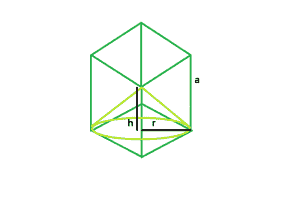

# 立方体内可内切的最大圆锥体

> 原文:[https://www . geeksforgeeks . org/可在立方体内刻制的最大圆锥体/](https://www.geeksforgeeks.org/largest-cone-that-can-be-inscribed-within-a-cube/)

这里给出的是一个边长为**和**的立方体。我们必须找到最大的右圆锥的高度和半径，它可以被内接在里面。
**示例** :

```
Input : a = 6 
Output : r = 4.24264, h = 6

Input : a = 10
Output : r = 7.07107, h = 10
```



**接近** :
让圆锥体的高度= **h** 。
和，圆锥半径= **r** 。
从图中我们可以清楚地了解到，

*   **r = a/√2**
*   **h = a**

以下是上述方法的实现:

## C++

```
// C++ Program to find the biggest cone
// inscribed within a cube

#include <bits/stdc++.h>
using namespace std;

// Function to find the radius of the cone
float coneRadius(float a)
{

    // side cannot be negative
    if (a < 0)
        return -1;

    // radius of the cone
    float r = a / sqrt(2);
    return r;
}

// Function to find the height of the cone
float coneHeight(float a)
{
    // side cannot be negative
    if (a < 0)
        return -1;

    // height of the cone
    float h = a;
    return h;
}

// Driver code
int main()
{
    float a = 6;

    cout << "r = " << coneRadius(a) << ", "
         << "h = " << coneHeight(a) << endl;

    return 0;
}
```

## Java 语言(一种计算机语言，尤用于创建网站)

```
// Java Program to find the biggest
// cone inscribed within a cube
import java.util.*;
import java.lang.*;

class GFG
{
// Function to find the radius
// of the cone
static float coneRadius(float a)
{

    // side cannot be negative
    if (a < 0)
        return -1;

    // radius of the cone
    float r = (float)(a / Math.sqrt(2));
    return r;
}

// Function to find the height
// of the cone
static float coneHeight(float a)
{
    // side cannot be negative
    if (a < 0)
        return -1;

    // height of the cone
    float h = a;
    return h;
}

// Driver code
public static void main(String args[])
{
    float a = 6;

    System.out.println("r = " + coneRadius(a) +
                    ", " + "h = " + coneHeight(a));
}
}

// This code is contributed
// by Akanksha Rai
```

## 蟒蛇 3

```
# Python 3 Program to find the biggest
# cone inscribed within a cube
import math

# Function to find the radius
# of the cone
def coneRadius(a):

    # side cannot be negative
    if (a < 0):
        return -1

    # radius of the cone
    r = a / math.sqrt(2)
    return r

# Function to find the height of the cone
def coneHeight(a):

    # side cannot be negative
    if (a < 0):
        return -1

    # height of the cone
    h = a
    return h

# Driver code
if __name__ == "__main__":

    a = 6

    print("r = ", coneRadius(a) ,
          "h = ", coneHeight(a))

# This code is contributed by ChitraNayal
```

## C#

```
// C# Program to find the biggest
// cone inscribed within a cube
using System;

class GFG
{
// Function to find the radius
// of the cone
static float coneRadius(float a)
{

    // side cannot be negative
    if (a < 0)
        return -1;

    // radius of the cone
    float r = (float)(a / Math.Sqrt(2));
    return r;
}

// Function to find the height
// of the cone
static float coneHeight(float a)
{
    // side cannot be negative
    if (a < 0)
        return -1;

    // height of the cone
    float h = a;
    return h;
}

// Driver code
public static void Main()
{
    float a = 6;

    Console.WriteLine("r = " + coneRadius(a) +
                       ", " + "h = " + coneHeight(a));
}
}

// This code is contributed
// by Akanksha Rai
```

## 服务器端编程语言（Professional Hypertext Preprocessor 的缩写）

```
<?php
// PHP Program to find the biggest
// cone inscribed within a cube

// Function to find the radius
// of the cone
function coneRadius($a)
{

    // side cannot be negative
    if ($a < 0)
        return -1;

    // radius of the cone
    $r = $a / sqrt(2);
    return $r;
}

// Function to find the height
// of the cone
function coneHeight($a)
{
    // side cannot be negative
    if ($a < 0)
        return -1;

    // height of the cone
    $h = $a;
    return $h;
}

// Driver code
$a = 6;

echo ("r = ");
echo coneRadius($a);
echo (", ");

echo ("h = ");
echo (coneHeight($a));

// This code is contributed
// by Shivi_Aggarwal
?>
```

## java 描述语言

```
<script>
// javascript Program to find the biggest
// cone inscribed within a cube

// Function to find the radius
// of the cone
function coneRadius(a)
{

    // side cannot be negative
    if (a < 0)
        return -1;

    // radius of the cone
    var r = (a / Math.sqrt(2));
    return r;
}

// Function to find the height
// of the cone
function coneHeight(a)
{

    // side cannot be negative
    if (a < 0)
        return -1;

    // height of the cone
    var h = a;
    return h;
}

// Driver code
var a = 6;
document.write("r = " + coneRadius(a).toFixed(5) +
                ", " + "h = " + coneHeight(a));

// This code is contributed by 29AjayKumar
</script>
```

**Output:** 

```
r = 4.24264, h = 6
```