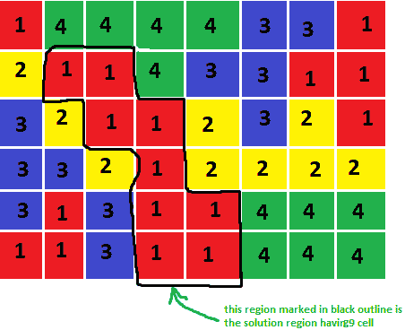
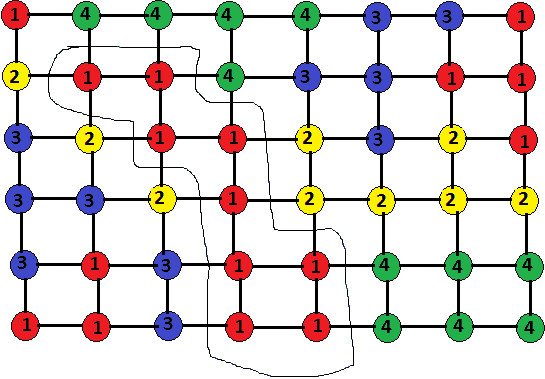

# 电网上最大的连接部件

> 原文:[https://www . geesforgeks . org/网格上最大连接组件/](https://www.geeksforgeeks.org/largest-connected-component-on-a-grid/)

给定不同单元格中不同颜色的网格，每种颜色由不同的数字表示。任务是找出网格上最大的连接组件。最大组件网格指的是一个最大的单元格集，这样，您只需在该集中相邻的单元格之间移动，就可以从任何单元格移动到该集中的任何其他单元格。
**例:**

> 输入:
> 
> [](https://media.geeksforgeeks.org/wp-content/uploads/Example-grid.png)
> 
> 不同颜色的网格
> 
> 输出:9
> 
> [](https://media.geeksforgeeks.org/wp-content/uploads/output-4.png)
> 
> 网格的最大连通分量

**方法:**
该方法是将给定的网格可视化为一个图，其中每个单元代表该图的一个单独节点，每个节点连接到该网格紧接的上、下、左、右四个其他节点。现在进行 [BFS](https://www.geeksforgeeks.org/breadth-first-search-or-bfs-for-a-graph/) 搜索图的每个节点，找到*所有连接到当前节点的节点，其颜色值与当前节点*相同。
以上示例的图表如下:

[](https://media.geeksforgeeks.org/wp-content/uploads/res.png)

网格的图形表示

。
在每个细胞(I，j)，一个 BFS 可以完成。从一个单元格可能移动到**右侧、左侧、顶部或底部**。仅移动到范围内颜色相同的单元格。如果先前访问过相同的节点，则网格的最大分量值存储在**结果[][]** 数组中。使用记忆，减少任何细胞上的 BFS 数。**visited【】【】**数组用于标记该单元之前是否被访问过，并在对每个单元进行 BFS 时计数存储连接组件的计数。存储最大计数，并使用 result[][]数组打印结果网格。
以下是上述方法的说明:

## C++

```
// CPP program to print the largest
// connected component in a grid
#include <bits/stdc++.h>
using namespace std;

const int n = 6;
const int m = 8;

// stores information about  which cell
// are already visited in a particular BFS
int visited[n][m];

// result stores the final result grid
int result[n][m];

// stores the count of cells in the largest
// connected component
int COUNT;

// Function checks if a cell is valid i.e it
// is inside the grid and equal to the key
bool is_valid(int x, int y, int key, int input[n][m])
{
    if (x < n && y < m && x >= 0 && y >= 0) {
        if (visited[x][y] == false && input[x][y] == key)
            return true;
        else
            return false;
    }
    else
        return false;
}

// BFS to find all cells in
// connection with key = input[i][j]
void BFS(int x, int y, int i, int j, int input[n][m])
{
    // terminating case for BFS
    if (x != y)
        return;

    visited[i][j] = 1;
    COUNT++;

    // x_move and y_move arrays
    // are the possible movements
    // in x or y direction
    int x_move[] = { 0, 0, 1, -1 };
    int y_move[] = { 1, -1, 0, 0 };

    // checks all four points connected with input[i][j]
    for (int u = 0; u < 4; u++)
        if (is_valid(i + y_move[u], j + x_move[u], x, input))
            BFS(x, y, i + y_move[u], j + x_move[u], input);
}

// called every time before a BFS
// so that visited array is reset to zero
void reset_visited()
{
    for (int i = 0; i < n; i++)
        for (int j = 0; j < m; j++)
            visited[i][j] = 0;
}

// If a larger connected component
// is found this function is called
// to store information about that component.
void reset_result(int key, int input[n][m])
{
    for (int i = 0; i < n; i++) {
        for (int j = 0; j < m; j++) {
            if (visited[i][j] && input[i][j] == key)
                result[i][j] = visited[i][j];
            else
                result[i][j] = 0;
        }
    }
}
// function to print the result
void print_result(int res)
{
    cout << "The largest connected "
         << "component of the grid is :" << res << "\n";

    // prints the largest component
    for (int i = 0; i < n; i++) {
        for (int j = 0; j < m; j++) {
            if (result[i][j])
                cout << result[i][j] << " ";
            else
                cout << ". ";
        }
        cout << "\n";
    }
}

// function to calculate the largest connected
// component
void computeLargestConnectedGrid(int input[n][m])
{
    int current_max = INT_MIN;

    for (int i = 0; i < n; i++) {
        for (int j = 0; j < m; j++) {
            reset_visited();
            COUNT = 0;

            // checking cell to the right
            if (j + 1 < m)
                BFS(input[i][j], input[i][j + 1], i, j, input);

            // updating result
            if (COUNT >= current_max) {
                current_max = COUNT;
                reset_result(input[i][j], input);
            }
            reset_visited();
            COUNT = 0;

            // checking cell downwards
            if (i + 1 < n)
                BFS(input[i][j], input[i + 1][j], i, j, input);

            // updating result
            if (COUNT >= current_max) {
                current_max = COUNT;
                reset_result(input[i][j], input);
            }
        }
    }
    print_result(current_max);
}
// Drivers Code
int main()
{
    int input[n][m] = { { 1, 4, 4, 4, 4, 3, 3, 1 },
                        { 2, 1, 1, 4, 3, 3, 1, 1 },
                        { 3, 2, 1, 1, 2, 3, 2, 1 },
                        { 3, 3, 2, 1, 2, 2, 2, 2 },
                        { 3, 1, 3, 1, 1, 4, 4, 4 },
                        { 1, 1, 3, 1, 1, 4, 4, 4 } };

    // function to compute the largest
    // connected component in the grid
    computeLargestConnectedGrid(input);
    return 0;
}
```

## Java 语言(一种计算机语言，尤用于创建网站)

```
// Java program to print the largest
// connected component in a grid
import java.util.*;
import java.lang.*;
import java.io.*;

class GFG
{
static final int n = 6;
static final int m = 8;

// stores information about which cell
// are already visited in a particular BFS
static final int visited[][] = new int [n][m];

// result stores the final result grid
static final int result[][] = new int [n][m];

// stores the count of
// cells in the largest
// connected component
static int COUNT;

// Function checks if a cell
// is valid i.e it is inside
// the grid and equal to the key
static boolean is_valid(int x, int y,
                        int key,
                        int input[][])
{
    if (x < n && y < m &&
        x >= 0 && y >= 0)
    {
        if (visited[x][y] == 0 &&
            input[x][y] == key)
            return true;
        else
            return false;
    }
    else
        return false;
}

// BFS to find all cells in
// connection with key = input[i][j]
static void BFS(int x, int y, int i,
                int j, int input[][])
{
    // terminating case for BFS
    if (x != y)
        return;

    visited[i][j] = 1;
    COUNT++;

    // x_move and y_move arrays
    // are the possible movements
    // in x or y direction
    int x_move[] = { 0, 0, 1, -1 };
    int y_move[] = { 1, -1, 0, 0 };

    // checks all four points
    // connected with input[i][j]
    for (int u = 0; u < 4; u++)
        if ((is_valid(i + y_move[u],
             j + x_move[u], x, input)) == true)
            BFS(x, y, i + y_move[u],
                      j + x_move[u], input);
}

// called every time before
// a BFS so that visited
// array is reset to zero
static void reset_visited()
{
    for (int i = 0; i < n; i++)
        for (int j = 0; j < m; j++)
            visited[i][j] = 0;
}

// If a larger connected component
// is found this function is
// called to store information
// about that component.
static void reset_result(int key,
                         int input[][])
{
    for (int i = 0; i < n; i++)
    {
        for (int j = 0; j < m; j++)
        {
            if (visited[i][j] ==1 &&
                input[i][j] == key)
                result[i][j] = visited[i][j];
            else
                result[i][j] = 0;
        }
    }
}

// function to print the result
static void print_result(int res)
{
    System.out.println ("The largest connected " +
                    "component of the grid is :" +
                                            res );

    // prints the largest component
    for (int i = 0; i < n; i++)
    {
        for (int j = 0; j < m; j++)
        {
            if (result[i][j] != 0)
                System.out.print(result[i][j] + " ");
            else
                System.out.print(". ");
        }
        System.out.println();
    }
}

// function to calculate the
// largest connected component
static void computeLargestConnectedGrid(int input[][])
{
    int current_max = Integer.MIN_VALUE;

    for (int i = 0; i < n; i++)
    {
        for (int j = 0; j < m; j++)
        {
            reset_visited();
            COUNT = 0;

            // checking cell to the right
            if (j + 1 < m)
                BFS(input[i][j], input[i][j + 1],
                                    i, j, input);

            // updating result
            if (COUNT >= current_max)
            {
                current_max = COUNT;
                reset_result(input[i][j], input);
            }
            reset_visited();
            COUNT = 0;

            // checking cell downwards
            if (i + 1 < n)
                BFS(input[i][j],
                    input[i + 1][j], i, j, input);

            // updating result
            if (COUNT >= current_max)
            {
                current_max = COUNT;
                reset_result(input[i][j], input);
            }
        }
    }
    print_result(current_max);
}
// Driver Code
public static void main(String args[])
{
    int input[][] = {{1, 4, 4, 4, 4, 3, 3, 1},
                     {2, 1, 1, 4, 3, 3, 1, 1},
                     {3, 2, 1, 1, 2, 3, 2, 1},
                     {3, 3, 2, 1, 2, 2, 2, 2},
                     {3, 1, 3, 1, 1, 4, 4, 4},
                     {1, 1, 3, 1, 1, 4, 4, 4}};

    // function to compute the largest
    // connected component in the grid
    computeLargestConnectedGrid(input);
}
}

// This code is contributed by Subhadeep
```

## 蟒蛇 3

```
# Python3 program to print the largest
# connected component in a grid

n = 6;
m = 8;

# stores information about  which cell
# are already visited in a particular BFS
visited = [[0 for j in range(m)]for i in range(n)]

# result stores the final result grid
result = [[0 for j in range(m)]for i in range(n)]

# stores the count of cells in the largest
# connected component
COUNT = 0

# Function checks if a cell is valid i.e it
# is inside the grid and equal to the key
def is_valid(x, y, key, input):

    if (x < n and y < m and x >= 0 and y >= 0):
        if (visited[x][y] == 0 and input[x][y] == key):
            return True;
        else:
            return False;

    else:
        return False;

# BFS to find all cells in
# connection with key = input[i][j]
def BFS(x, y, i, j, input):

    global COUNT

    # terminating case for BFS
    if (x != y):
        return;

    visited[i][j] = 1;
    COUNT += 1

    # x_move and y_move arrays
    # are the possible movements
    # in x or y direction
    x_move = [ 0, 0, 1, -1 ]
    y_move = [ 1, -1, 0, 0 ]

    # checks all four points connected with input[i][j]
    for u in range(4):

        if (is_valid(i + y_move[u], j + x_move[u], x, input)):
            BFS(x, y, i + y_move[u], j + x_move[u], input);

# called every time before a BFS
# so that visited array is reset to zero
def reset_visited():

    for i in range(n):
        for j in range(m):
            visited[i][j] = 0

# If a larger connected component
# is found this function is called
# to store information about that component.
def reset_result(key, input):

    for i in range(n):
        for j in range(m):
            if (visited[i][j] != 0 and input[i][j] == key):
                result[i][j] = visited[i][j];
            else:
                result[i][j] = 0;

# function to print the result
def print_result(res):

    print("The largest connected "+
          "component of the grid is :" + str(res));

    # prints the largest component
    for i in range(n):
        for j in range(m):
            if (result[i][j] != 0):
                print(result[i][j], end = ' ')

            else:
                print('. ',end = '')

        print()

# function to calculate the largest connected
# component
def computeLargestConnectedGrid(input):

    global COUNT
    current_max = -10000000000

    for i in range(n):
        for j in range(m):
            reset_visited();
            COUNT = 0;

            # checking cell to the right
            if (j + 1 < m):
                BFS(input[i][j], input[i][j + 1], i, j, input);

            # updating result
            if (COUNT >= current_max):
                current_max = COUNT;
                reset_result(input[i][j], input);

            reset_visited();
            COUNT = 0;

            # checking cell downwards
            if (i + 1 < n):
                BFS(input[i][j], input[i + 1][j], i, j, input);

            # updating result
            if (COUNT >= current_max):
                current_max = COUNT;
                reset_result(input[i][j], input);

    print_result(current_max);

# Drivers Code
if __name__=='__main__':

    input = [ [ 1, 4, 4, 4, 4, 3, 3, 1 ],
                        [ 2, 1, 1, 4, 3, 3, 1, 1 ],
                        [ 3, 2, 1, 1, 2, 3, 2, 1 ],
                        [ 3, 3, 2, 1, 2, 2, 2, 2 ],
                        [ 3, 1, 3, 1, 1, 4, 4, 4 ],
                        [ 1, 1, 3, 1, 1, 4, 4, 4 ] ];

    # function to compute the largest
    # connected component in the grid
    computeLargestConnectedGrid(input);

# This code is contributed by pratham76
```

## C#

```
// C# program to print the largest
// connected component in a grid
using System;

class GFG
{
public const int n = 6;
public const int m = 8;

// stores information about which cell
// are already visited in a particular BFS
public static readonly int[][] visited =
              RectangularArrays.ReturnRectangularIntArray(n, m);

// result stores the final result grid
public static readonly int[][] result =
              RectangularArrays.ReturnRectangularIntArray(n, m);

// stores the count of cells in the
// largest connected component
public static int COUNT;

// Function checks if a cell is valid i.e
// it is inside the grid and equal to the key
internal static bool is_valid(int x, int y,
                              int key, int[][] input)
{
    if (x < n && y < m &&
        x >= 0 && y >= 0)
    {
        if (visited[x][y] == 0 &&
            input[x][y] == key)
        {
            return true;
        }
        else
        {
            return false;
        }
    }
    else
    {
        return false;
    }
}

// BFS to find all cells in
// connection with key = input[i][j]
public static void BFS(int x, int y, int i,
                       int j, int[][] input)
{
    // terminating case for BFS
    if (x != y)
    {
        return;
    }

    visited[i][j] = 1;
    COUNT++;

    // x_move and y_move arrays
    // are the possible movements
    // in x or y direction
    int[] x_move = new int[] {0, 0, 1, -1};
    int[] y_move = new int[] {1, -1, 0, 0};

    // checks all four points
    // connected with input[i][j]
    for (int u = 0; u < 4; u++)
    {
        if ((is_valid(i + y_move[u],
             j + x_move[u], x, input)) == true)
        {
            BFS(x, y, i + y_move[u],
                j + x_move[u], input);
        }
    }
}

// called every time before
// a BFS so that visited
// array is reset to zero
internal static void reset_visited()
{
    for (int i = 0; i < n; i++)
    {
        for (int j = 0; j < m; j++)
        {
            visited[i][j] = 0;
        }
    }
}

// If a larger connected component is
// found this function is called to
// store information about that component.
internal static void reset_result(int key,
                                  int[][] input)
{
    for (int i = 0; i < n; i++)
    {
        for (int j = 0; j < m; j++)
        {
            if (visited[i][j] == 1 &&
                input[i][j] == key)
            {
                result[i][j] = visited[i][j];
            }
            else
            {
                result[i][j] = 0;
            }
        }
    }
}

// function to print the result
internal static void print_result(int res)
{
    Console.WriteLine("The largest connected " +
                      "component of the grid is :" + res);

    // prints the largest component
    for (int i = 0; i < n; i++)
    {
        for (int j = 0; j < m; j++)
        {
            if (result[i][j] != 0)
            {
                Console.Write(result[i][j] + " ");
            }
            else
            {
                Console.Write(". ");
            }
        }
        Console.WriteLine();
    }
}

// function to calculate the
// largest connected component
public static void computeLargestConnectedGrid(int[][] input)
{
    int current_max = int.MinValue;

    for (int i = 0; i < n; i++)
    {
        for (int j = 0; j < m; j++)
        {
            reset_visited();
            COUNT = 0;

            // checking cell to the right
            if (j + 1 < m)
            {
                BFS(input[i][j], input[i][j + 1],
                                    i, j, input);
            }

            // updating result
            if (COUNT >= current_max)
            {
                current_max = COUNT;
                reset_result(input[i][j], input);
            }
            reset_visited();
            COUNT = 0;

            // checking cell downwards
            if (i + 1 < n)
            {
                BFS(input[i][j], input[i + 1][j],
                                    i, j, input);
            }

            // updating result
            if (COUNT >= current_max)
            {
                current_max = COUNT;
                reset_result(input[i][j], input);
            }
        }
    }
    print_result(current_max);
}

public static class RectangularArrays
{
    public static int[][] ReturnRectangularIntArray(int size1,
                                                    int size2)
    {
        int[][] newArray = new int[size1][];
        for (int array1 = 0; array1 < size1; array1++)
        {
            newArray[array1] = new int[size2];
        }

        return newArray;
    }
}

// Driver Code
public static void Main(string[] args)
{
    int[][] input = new int[][]
    {
        new int[] {1, 4, 4, 4, 4, 3, 3, 1},
        new int[] {2, 1, 1, 4, 3, 3, 1, 1},
        new int[] {3, 2, 1, 1, 2, 3, 2, 1},
        new int[] {3, 3, 2, 1, 2, 2, 2, 2},
        new int[] {3, 1, 3, 1, 1, 4, 4, 4},
        new int[] {1, 1, 3, 1, 1, 4, 4, 4}
    };

    // function to compute the largest
    // connected component in the grid
    computeLargestConnectedGrid(input);
}
}
// This code is contributed by Shrikant13
```

**Output:** 

```
The largest connected component of the grid is :9
. . . . . . . . 
. 1 1 . . . . . 
. . 1 1 . . . . 
. . . 1 . . . . 
. . . 1 1 . . . 
. . . 1 1 . . .
```