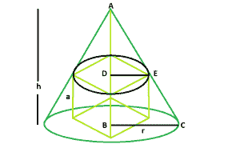

# 可内切于直角圆锥内的最大立方体

> 原文:[https://www . geesforgeks . org/可在直角圆锥内内切的最大立方体/](https://www.geeksforgeeks.org/largest-cube-that-can-be-inscribed-within-a-right-circular-cone/)

给定半径为 **r** 和垂直高度为 **h** 的右圆锥。我们必须找到最大立方体的边长，它可以被内接在里面。
**例** :

```
Input : h = 5, r = 6
Output : 3.14613

Input : h = 8, r = 12
Output : 5.43698
```



**靠近** :
让，立方体的一边= **a** 。
从图中我们可以清楚地了解到利用三角形的性质: **BC/AB = DE/AD。**
**因此，**

```
r/h = (a/√2)/(h-a)

or, a = h*r√2/(h+√2*r)
```

以下是上述方法的实现:

## C++

```
// C++ Program to find the biggest cube
// inscribed within a right circular cone
#include <bits/stdc++.h>
using namespace std;

// Function to find the side of the cube
float cubeSide(float h, float r)
{
    // height and radius cannot be negative
    if (h < 0 && r < 0)
        return -1;

    // side of the cube
    float a = (h * r * sqrt(2)) / (h + sqrt(2) * r);

    return a;
}

// Driver code
int main()
{
    float h = 5, r = 6;

    cout << cubeSide(h, r) << endl;

    return 0;
}
```

## Java 语言(一种计算机语言，尤用于创建网站)

```
// Java Program to find the the biggest cube
// which can be inscribed within a right circular cone

import java.io.*;

class GFG {

// Function to find the side of the cube

static float cube(float h, float r)
{

    // height and radius cannot be negative
    if (h < 0 && r < 0)
        return -1;

 // side of the cube
    float a = (h * r * (float)Math.sqrt(2)) / (h + (float)Math.sqrt(2) * r);

    return a;
}

// Driver code

    public static void main (String[] args) {
          float h = 5, r = 6;
    System.out.println( cube(h, r));
    }
}

// this article is contributed by Ishwar Gupta
```

## 蟒蛇 3

```
# Python3 Program to find the biggest cube
# inscribed within a right circular cone
import math

# Function to find the side of the cube
def cubeSide(h, r):

    # height and radius cannot
    # be negative
    if (h < 0 and r < 0):
        return -1

    # side of the cube
    a = ((h * r * math.sqrt(2)) /
         (h + math.sqrt(2) * r))

    return a

# Driver code
h = 5; r = 6;

print(cubeSide(h, r), "\n")

# This code is contributed
# by Akanksha Rai
```

## C#

```
// C# Program to find the the
// biggest cube which can be
// inscribed within a right
// circular cone
using System;

class GFG
{

// Function to find the side
// of the cube
static float cube(float h, float r)
{

// height and radius cannot be negative
if (h < 0 && r < 0)
    return -1;

// side of the cube
float a = (h * r * (float)Math.Sqrt(2)) /
          (h + (float)Math.Sqrt(2) * r);

    return a;
}

// Driver code
public static void Main ()
{
    float h = 5, r = 6;
    Console.Write( cube(h, r));
}
}

// This code is contributed
// by 29AjayKumar
```

## 服务器端编程语言（Professional Hypertext Preprocessor 的缩写）

```
<?php
// PHP Program to find the biggest cube
// inscribed within a right circular cone

// Function to find the side of the cube
function cubeSide($h, $r)
{
    // height and radius cannot
    // be negative
    if ($h < 0 && $r < 0)
        return -1;

    // side of the cube
    $a = ($h * $r * sqrt(2)) /
         ($h + sqrt(2) * $r);

    return $a;
}

// Driver code
$h = 5;
$r = 6;

echo cubeSide($h, $r);

// This code is contributed
// by Shivi_Aggarwal
?>
```

## java 描述语言

```
<script>

// javascript Program to find the the biggest cube
// which can be inscribed within a right circular cone

// Function to find the side of the cube

function cube(h , r)
{

    // height and radius cannot be negative
    if (h < 0 && r < 0)
        return -1;

 // side of the cube
    var a = (h * r * Math.sqrt(2)) / (h + Math.sqrt(2) * r);

    return a;
}

// Driver code

var h = 5, r = 6;
document.write( cube(h, r).toFixed(5));

// This code is contributed by 29AjayKumar

</script>
```

**Output:** 

```
3.14613
```