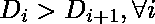
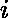

# 一个序列的最大混乱

> 原文:[https://www.geeksforgeeks.org/largest-derangement-sequence/](https://www.geeksforgeeks.org/largest-derangement-sequence/)

给定任何序列，找到中最大的**紊乱**。
错乱是的任意排列，使得和中同一位置的两个元素不相等。
最大的混乱就是。

**示例:**

```
Input : seq[] = {5, 4, 3, 2, 1}
Output : 4 5 2 1 3

Input : seq[] = {56, 21, 42, 67, 23, 74}
Output : 74, 67, 56, 42, 21, 23
```

因为我们对产生最大的混乱感兴趣，我们开始把更大的元素放在更重要的位置。
从左边开始，在任意位置将序列值中下一个最大的元素放在之前的位置。
扫描所有位置需要 N 次迭代。在每次迭代中，我们需要找到一个最大值，所以一个简单的实现就是复杂度，
然而，如果我们使用像 max-heap 这样的数据结构来找到最大值元素，那么复杂度就会降低到

下面是实现。

## C++

```
// C++ program to find the largest derangement
#include <bits/stdc++.h>
using namespace std;

void printLargest(int seq[], int N)
{
    int res[N]; // Stores result

    // Insert all elements into a priority queue
    std::priority_queue<int> pq;
    for (int i = 0; i < N; i++)
        pq.push(seq[i]);   

    // Fill Up res[] from left to right
    for (int i = 0; i < N; i++) {
        int d = pq.top();
        pq.pop();
        if (d != seq[i] || i == N - 1) {
            res[i] = d;
        } else {

            // New Element popped equals the element
            // in original sequence. Get the next
            // largest element
            res[i] = pq.top();
            pq.pop();
            pq.push(d);
        }
    }

    // If given sequence is in descending order then
    // we need to swap last two elements again
    if (res[N - 1] == seq[N - 1]) {
        res[N - 1] = res[N - 2];
        res[N - 2] = seq[N - 1];
    }

    printf("\nLargest Derangement \n");
    for (int i = 0; i < N; i++)
        printf("%d ", res[i]);
}

// Driver code
int main()
{
    int seq[] = { 92, 3, 52, 13, 2, 31, 1 };
    int n = sizeof(seq)/sizeof(seq[0]);
    printLargest(seq, n);
    return 0;
}
```

## Java 语言(一种计算机语言，尤用于创建网站)

```
// Java program to find the largest derangement
import java.io.*;
import java.util.Collections;
import java.util.PriorityQueue;

class GFG{

public static void printLargest(int a[],int n)
{
     PriorityQueue<Integer> pq = new PriorityQueue<>(
         Collections.reverseOrder());

      // Insert all elements into a priority queue
      for(int i = 0; i < n; i++)
    {
        pq.add(a[i]);
    }

    // Stores result
      int res[] = new int[n];

      // Fill Up res[] from left to right
    for(int i = 0; i < n; i++)
    {
        int p = pq.peek();
        pq.remove();

        if (p != a[i] || i == n - 1)
        {
            res[i] = p;
        }
        else
        {

            // New Element popped equals the element
            // in original sequence. Get the next
            // largest element
            res[i] = pq.peek();
            pq.remove();
            pq.add(p);
        }
    }

      // If given sequence is in descending
      // order then we need to swap last two
      // elements again
      if (res[n - 1] == a[n - 1])
    {
        res[n - 1] = res[n - 2];
        res[n - 2] = a[n - 1];
    }

      System.out.println("Largest Derangement");
    for(int i = 0; i < n; i++)
    {
        System.out.print(res[i] + " ");
    }
}

// Driver code
public static void main(String[] args)
{
      int n = 7;
    int seq[] = { 92, 3, 52, 13, 2, 31, 1 };

      printLargest(seq, n);
}
}

// This code is contributed by aditya7409
```

## 蟒蛇 3

```
# Python3 program to find the largest derangement
def printLargest(seq, N) :

    res = [0]*N # Stores result

    # Insert all elements into a priority queue
    pq = []
    for i in range(N) :
        pq.append(seq[i])  

    # Fill Up res[] from left to right
    for i in range(N) :   
        pq.sort()
        pq.reverse()
        d = pq[0]
        del pq[0]
        if (d != seq[i] or i == N - 1) :
            res[i] = d       
        else :       

            # New Element popped equals the element
            # in original sequence. Get the next
            # largest element
            res[i] = pq[0]
            del pq[0]
            pq.append(d)

    # If given sequence is in descending order then
    # we need to swap last two elements again
    if (res[N - 1] == seq[N - 1]) :   
        res[N - 1] = res[N - 2]
        res[N - 2] = seq[N - 1]

    print("Largest Derangement")
    for i in range(N) :
        print(res[i], end = " ")

# Driver code
seq = [ 92, 3, 52, 13, 2, 31, 1 ]
n = len(seq)
printLargest(seq, n)

# This code is contributed by divyesh072019.
```

## C#

```
// C# program to find the largest derangement
using System;
using System.Collections.Generic;
class GFG
{

    static void printLargest(int[] seq, int N)
    {
        int[] res = new int[N]; // Stores result

        // Insert all elements into a priority queue
        List<int> pq = new List<int>();
        for (int i = 0; i < N; i++)
            pq.Add(seq[i]);   

        // Fill Up res[] from left to right
        for (int i = 0; i < N; i++)
        {
            pq.Sort();
            pq.Reverse();
            int d = pq[0];
            pq.RemoveAt(0);
            if (d != seq[i] || i == N - 1)
            {
                res[i] = d;
            }
          else
            {

                // New Element popped equals the element
                // in original sequence. Get the next
                // largest element
                res[i] = pq[0];
                pq.RemoveAt(0);
                pq.Add(d);
            }
        }

        // If given sequence is in descending order then
        // we need to swap last two elements again
        if (res[N - 1] == seq[N - 1])
        {
            res[N - 1] = res[N - 2];
            res[N - 2] = seq[N - 1];
        }    
        Console.WriteLine("Largest Derangement");
        for (int i = 0; i < N; i++)
            Console.Write(res[i] + " ");
    }

  // Driver code
  static void Main()
  {
    int[] seq = { 92, 3, 52, 13, 2, 31, 1 };
    int n = seq.Length;
    printLargest(seq, n);
  }
}

// This code is contributed by divyeshrabadiya07
```

## java 描述语言

```
<script>

// JavaScript program to find the largest derangement

function printLargest(seq, N) {
    let res = new Array(N); // Stores result

    // Insert all elements into a priority queue
    let pq = new Array();
    for (let i = 0; i < N; i++)
        pq.push(seq[i]);

    // Fill Up res[] from left to right
    for (let i = 0; i < N; i++) {
        pq.sort((a, b) => a - b);
        pq.reverse();
        let d = pq[0];
        pq.shift();
        if (d != seq[i] || i == N - 1) {
            res[i] = d;
        }
        else {

            // New Element popped equals the element
            // in original sequence. Get the next
            // largest element
            res[i] = pq[0];
            pq.shift();
            pq.push(d);
        }
    }

    // If given sequence is in descending order then
    // we need to swap last two elements again
    if (res[N - 1] == seq[N - 1]) {
        res[N - 1] = res[N - 2];
        res[N - 2] = seq[N - 1];
    }
    document.write("Largest Derangement<br>");
    for (let i = 0; i < N; i++)
        document.write(res[i] + " ");
}

// Driver code
let seq = [92, 3, 52, 13, 2, 31, 1];
let n = seq.length;
printLargest(seq, n);

// This code is contributed by gfgking

</script>
```

**输出:**

```
Largest Derangement
52 92 31 3 13 1 2
```

**时间复杂度:** O(n log n)

**注:**
该方法也可以很容易地修改，以获得最小的紊乱。
代替**最大堆**，我们应该使用**最小堆**来连续获得最小元素

本文由 [**萨彦·马哈帕特拉**](https://auth.geeksforgeeks.org/profile.php?user=Sayan Mahapatra) 供稿。如果你喜欢 GeeksforGeeks 并想投稿，你也可以使用[write.geeksforgeeks.org](https://write.geeksforgeeks.org)写一篇文章或者把你的文章邮寄到 review-team@geeksforgeeks.org。看到你的文章出现在极客博客主页上，帮助其他极客。
如果发现有不正确的地方，或者想分享更多关于上述话题的信息，请写评论。