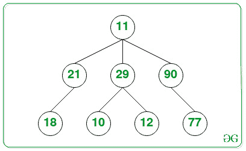

# N 元树中最大的元素

> 原文:[https://www . geesforgeks . org/n 元树中最大元素/](https://www.geeksforgeeks.org/largest-element-in-an-n-ary-tree/)

给定一个由 **N** 个节点组成的 [N 元树](https://www.geeksforgeeks.org/generic-treesn-array-trees/)，任务是在给定的 **N** 元树中找到具有最大值的节点。

**示例:**

> **输入:**
> 
> 
> 
> **输出:** 90
> **说明:**树中值最大的节点是 90。
> 
> **输入:**
> 
> 
> 
> **输出:** 95
> **说明:**树中值最大的节点是 95。

**方法:**给定的问题可以通过[遍历给定的 **N** 元树](https://www.geeksforgeeks.org/number-of-ways-to-traverse-an-n-ary-tree/)并跟踪出现的节点的最大值来解决。完成遍历后，打印得到的最大值。

下面是上述方法的实现:

## C++

```
// C++ program for the above approach

#include <bits/stdc++.h>
using namespace std;

// Structure of a
// node of N-ary tree
struct Node {
    int key;
    vector<Node*> child;
};

// Stores the node with largest value
Node* maximum = NULL;

// Function to create a new Node
Node* newNode(int key)
{
    Node* temp = new Node;
    temp->key = key;

    // Return the newly created node
    return temp;
}

// Function to find the node with
// largest value in N-ary tree
void findlargest(Node* root)
{
    // Base Case
    if (root == NULL)
        return;

    // If maximum is NULL, return
    // the value of root node
    if ((maximum) == NULL)
        maximum = root;

    // If value of the root is greater
    // than maximum, update the maximum node
    else if (root->key > (maximum)->key) {
        maximum = root;
    }

    // Recursively call for all the
    // children of the root node
    for (int i = 0;
         i < root->child.size(); i++) {
        findlargest(root->child[i]);
    }
}

// Driver Code
int main()
{
    // Given N-ary tree
    Node* root = newNode(11);
    (root->child).push_back(newNode(21));
    (root->child).push_back(newNode(29));
    (root->child).push_back(newNode(90));
    (root->child[0]->child).push_back(newNode(18));
    (root->child[1]->child).push_back(newNode(10));
    (root->child[1]->child).push_back(newNode(12));
    (root->child[2]->child).push_back(newNode(77));

    findlargest(root);

    // Print the largest value
    cout << maximum->key;

    return 0;
}
```

## Java 语言(一种计算机语言，尤用于创建网站)

```
// Java program for the above approach
import java.util.*;

class GFG{

// Structure of a
// node of N-ary tree
static class Node
{
    int key;
    Vector<Node> child = new Vector<>();
};

// Stores the node with largest value
static Node maximum = null;

// Function to create a new Node
static Node newNode(int key)
{
    Node temp = new Node();
    temp.key = key;

    // Return the newly created node
    return temp;
}

// Function to find the node with
// largest value in N-ary tree
static void findlargest(Node root)
{

    // Base Case
    if (root == null)
        return;

    // If maximum is null, return
    // the value of root node
    if ((maximum) == null)
        maximum = root;

    // If value of the root is greater
    // than maximum, update the maximum node
    else if (root.key > (maximum).key)
    {
        maximum = root;
    }

    // Recursively call for all the
    // children of the root node
    for(int i = 0;
            i < root.child.size(); i++)
    {
        findlargest(root.child.get(i));
    }
}

// Driver Code
public static void main(String[] args)
{

    // Given N-ary tree
    Node root = newNode(11);
    (root.child).add(newNode(21));
    (root.child).add(newNode(29));
    (root.child).add(newNode(90));
    (root.child.get(0).child).add(newNode(18));
    (root.child.get(1).child).add(newNode(10));
    (root.child.get(1).child).add(newNode(12));
    (root.child.get(2).child).add(newNode(77));

    findlargest(root);

    // Print the largest value
    System.out.print(maximum.key);
}
}

// This code is contributed by Princi Singh
```

## 蟒蛇 3

```
# Python3 program for the above approach

# Structure of a
# node of N-ary tree
class Node:
    # Constructor to set the data of
    # the newly created tree node
    def __init__(self, key):
        self.key = key
        self.child = []

# Stores the node with largest value
maximum = None

# Function to create a new Node
def newNode(key):
    temp = Node(key)

    # Return the newly created node
    return temp

# Function to find the node with
# largest value in N-ary tree
def findlargest(root):
    global maximum
    # Base Case
    if (root == None):
        return

    # If maximum is null, return
    # the value of root node
    if ((maximum) == None):
        maximum = root

    # If value of the root is greater
    # than maximum, update the maximum node
    elif (root.key > (maximum).key):
        maximum = root

    # Recursively call for all the
    # children of the root node
    for i in range(len(root.child)):
        findlargest(root.child[i])

# Given N-ary tree
root = newNode(11)
(root.child).append(newNode(21))
(root.child).append(newNode(29))
(root.child).append(newNode(90))
(root.child[0].child).append(newNode(18))
(root.child[1].child).append(newNode(10))
(root.child[1].child).append(newNode(12))
(root.child[2].child).append(newNode(77))

findlargest(root)

# Print the largest value
print(maximum.key)

# This code is contributed by decode2207.
```

## C#

```
// C# program for the above approach
using System;
using System.Collections.Generic;

public class GFG{

// Structure of a
// node of N-ary tree
class Node
{
    public int key;
    public List<Node> child = new List<Node>();
};

// Stores the node with largest value
static Node maximum = null;

// Function to create a new Node
static Node newNode(int key)
{
    Node temp = new Node();
    temp.key = key;

    // Return the newly created node
    return temp;
}

// Function to find the node with
// largest value in N-ary tree
static void findlargest(Node root)
{

    // Base Case
    if (root == null)
        return;

    // If maximum is null, return
    // the value of root node
    if ((maximum) == null)
        maximum = root;

    // If value of the root is greater
    // than maximum, update the maximum node
    else if (root.key > (maximum).key)
    {
        maximum = root;
    }

    // Recursively call for all the
    // children of the root node
    for(int i = 0;
            i < root.child.Count; i++)
    {
        findlargest(root.child[i]);
    }
}

// Driver Code
public static void Main(String[] args)
{

    // Given N-ary tree
    Node root = newNode(11);
    (root.child).Add(newNode(21));
    (root.child).Add(newNode(29));
    (root.child).Add(newNode(90));
    (root.child[0].child).Add(newNode(18));
    (root.child[1].child).Add(newNode(10));
    (root.child[1].child).Add(newNode(12));
    (root.child[2].child).Add(newNode(77));

    findlargest(root);

    // Print the largest value
    Console.Write(maximum.key);
}
}

// This code is contributed by 29AjayKumar
```

## java 描述语言

```
<script>
    // Javascript program for the above approach

    // Structure of a
    // node of N-ary tree
    class Node
    {
        constructor(key) {
           this.key = key;
           this.child = [];
        }
    }

    // Stores the node with largest value
    let maximum = null;

    // Function to create a new Node
    function newNode(key)
    {
        let temp = new Node(key);

        // Return the newly created node
        return temp;
    }

    // Function to find the node with
    // largest value in N-ary tree
    function findlargest(root)
    {

        // Base Case
        if (root == null)
            return;

        // If maximum is null, return
        // the value of root node
        if ((maximum) == null)
            maximum = root;

        // If value of the root is greater
        // than maximum, update the maximum node
        else if (root.key > (maximum).key)
        {
            maximum = root;
        }

        // Recursively call for all the
        // children of the root node
        for(let i = 0; i < root.child.length; i++)
        {
            findlargest(root.child[i]);
        }
    }

    // Given N-ary tree
    let root = newNode(11);
    (root.child).push(newNode(21));
    (root.child).push(newNode(29));
    (root.child).push(newNode(90));
    (root.child[0].child).push(newNode(18));
    (root.child[1].child).push(newNode(10));
    (root.child[1].child).push(newNode(12));
    (root.child[2].child).push(newNode(77));

    findlargest(root);

    // Print the largest value
    document.write(maximum.key);

// This code is contributed by surehs07.
</script>
```

**Output:** 

```
90
```

***时间复杂度:**O(N)*
T5**辅助空间:** O(1)