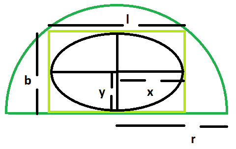

# 可内接在矩形内的最大椭圆，而矩形又内接在半圆内

> 原文:[https://www . geeksforgeeks . org/最大-可以在矩形内内接的椭圆-依次是在半圆内接的/](https://www.geeksforgeeks.org/largest-ellipse-that-can-be-inscribed-within-a-rectangle-which-in-turn-is-inscribed-within-a-semicircle/)

这里给定的是一个半径为 **r** 的半圆，它刻下一个长方形，长方形又刻下一个椭圆。任务是找到这个最大椭圆的面积。
**例:**

```
Input: r = 5
Output: 19.625

Input: r = 11
Output: 94.985
```



**接近** :

1.  让，矩形的长度= **l** 和矩形的宽度= **b**
2.  设，椭圆长轴的长度= **2x** ，椭圆短轴的长度= **2y**
3.  我们知道，半圆内最大矩形的长宽高分别为 **r/√2** 、 **√2r** [(这里请参考)](https://www.geeksforgeeks.org/largest-rectangle-that-can-be-inscribed-in-a-semicircle/)
4.  另外，矩形内椭圆的[面积](https://www.geeksforgeeks.org/area-of-the-biggest-ellipse-inscribed-within-a-rectangle/)=**(π* l * b)/4**=**(πr^2/4)**

**以下是上述方式的实施** :

## C++

```
// C++ Program to find the biggest ellipse
// which can be inscribed within a rectangle
// which in turn is inscribed within a semicircle

#include <bits/stdc++.h>
using namespace std;

// Function to find the area
// of the biggest ellipse
float ellipsearea(float r)
{

    // the radius cannot be negative
    if (r < 0)
        return -1;

    // area of the ellipse
    float a = (3.14 * r * r) / 4;

    return a;
}

// Driver code
int main()
{
    float r = 5;
    cout << ellipsearea(r) << endl;
    return 0;
}
```

## Java 语言(一种计算机语言，尤用于创建网站)

```
// Java Program to find the biggest ellipse
// which can be inscribed within a rectangle
// which in turn is inscribed within a semicircle
class GFG
{

// Function to find the area
// of the biggest ellipse
static float ellipsearea(float r)
{

    // the radius cannot be negative
    if (r < 0)
        return -1;

    // area of the ellipse
    float a = (float)((3.14f * r * r) / 4);

    return a;
}

// Driver code
public static void main(String[] args)
{
    float r = 5;
    System.out.println(ellipsearea(r));
}
}

// This code is contributed by Code_Mech.
```

## 蟒蛇 3

```
# Python3 Program to find the biggest ellipse
# which can be inscribed within a rectangle
# which in turn is inscribed within a semicircle

# Function to find the area of
# the biggest ellipse
def ellipsearea(r) :

    # the radius cannot be negative
    if (r < 0) :
        return -1;

    # area of the ellipse
    a = (3.14 * r * r) / 4;

    return a;

# Driver code
if __name__ == "__main__" :

    r = 5;
    print(ellipsearea(r));

# This code is contributed by Ryuga
```

## C#

```
// C# Program to find the biggest ellipse
// which can be inscribed within a rectangle
// which in turn is inscribed within a semicircle
using System;
class GFG
{

// Function to find the area
// of the biggest ellipse
static float ellipsearea(float r)
{

    // the radius cannot be negative
    if (r < 0)
        return -1;

    // area of the ellipse
    float a = (float)((3.14 * r * r) / 4);

    return a;
}

// Driver code
public static void Main()
{
    float r = 5;
    Console.WriteLine(ellipsearea(r));
}
}

// This code is contributed by Akanksha Rai
```

## 服务器端编程语言（Professional Hypertext Preprocessor 的缩写）

```
<?php
// PHP Program to find the biggest ellipse
// which can be inscribed within a rectangle
// which in turn is inscribed within a semicircle

// Function to find the area
// of the biggest ellipse
function ellipsearea($r)
{

    // the radius cannot be negative
    if ($r < 0)
        return -1;

    // area of the ellipse
    $a = (3.14 * $r * $r) / 4;

    return $a;
}

// Driver code
$r = 5;
echo ellipsearea($r) . "\n";

// This code is contributed by Akanksha Rai
?>
```

## java 描述语言

```
<script>

// javascript Program to find the biggest ellipse
// which can be inscribed within a rectangle
// which in turn is inscribed within a semicircle

// Function to find the area
// of the biggest ellipse
function ellipsearea(r)
{

    // the radius cannot be negative
    if (r < 0)
        return -1;

    // area of the ellipse
    var a = ((3.14 * r * r) / 4);

    return a;
}

// Driver code
var r = 5;
document.write(ellipsearea(r));

// This code is contributed by Amit Katiyar

</script>
```

**Output:** 

```
19.625
```