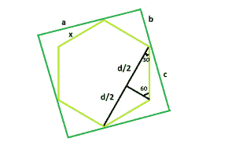

# 一个正方形内可内切的最大六边形

> 原文:[https://www . geeksforgeeks . org/最大六边形-可在正方形内刻字/](https://www.geeksforgeeks.org/largest-hexagon-that-can-be-inscribed-within-a-square/)

给定一个正方形的边 **a** ，任务是找到可以在给定正方形内内接的最大六边形的边。
**例:**

> **输入:** a = 6
> **输出:** 3.1056
> **输入:** a = 8
> **输出:** 4.1408



**逼近:**:假设，六边形的边为 **x** ，假设正方形的边为 **a** 分成更小的长度**b**T14】更大的长度 **c** 即 **a = b + c**
现在从图中我们看到，

> **b<sup>2</sup>+b<sup>2</sup>= x<sup>2</sup>**这就给出了 **b = x / √2**
> 现在再来一次， **d / (2 * x) = cos(30) = √3 / 2** 即 **d = x√3**
> ， **c <sup>2</sup> + c <sup>2 所以，**a = x/√2+x√3/√2 =((1+√3)/√2)* x = 1.932 * x**T31】所以，六边形的边，**x = 0.5176 * a**T34】</sup>**

以下是上述方法的实现:

## C++

```
// C++ Program to find the biggest hexagon which
// can be inscribed within the given square
#include <bits/stdc++.h>
using namespace std;

// Function to return the side
// of the hexagon
float hexagonside(float a)
{

    // Side cannot be negative
    if (a < 0)
        return -1;

    // Side of the hexagon
    float x = 0.5176 * a;
    return x;
}

// Driver code
int main()
{
    float a = 6;
    cout << hexagonside(a) << endl;
    return 0;
}
```

## Java 语言(一种计算机语言，尤用于创建网站)

```
// Java  Program to find the biggest hexagon which
// can be inscribed within the given square

import java.io.*;

class GFG {

// Function to return the side
// of the hexagon
static double hexagonside(double a)
{

    // Side cannot be negative
    if (a < 0)
        return -1;

    // Side of the hexagon
    double x = (0.5176 * a);
    return x;
}

// Driver code
    public static void main (String[] args) {

        double a = 6;
        System.out.println (hexagonside(a));
    }
//This code is contributed by ajit.   
}
```

## 蟒蛇 3

```
# Python 3 Program to find the biggest
# hexagon which can be inscribed within
# the given square

# Function to return the side
# of the hexagon
def hexagonside(a):

    # Side cannot be negative
    if (a < 0):
        return -1;

    # Side of the hexagon
    x = 0.5176 * a;
    return x;

# Driver code
a = 6;
print(hexagonside(a));

# This code is contributed
# by Akanksha Rai
```

## C#

```
// C# Program to find the biggest hexagon which
// can be inscribed within the given square
using System;

class GFG
{

// Function to return the side
// of the hexagon
static double hexagonside(double a)
{

    // Side cannot be negative
    if (a < 0)
        return -1;

    // Side of the hexagon
    double x = (0.5176 * a);
    return x;
}

// Driver code
public static void Main ()
{
    double a = 6;
    Console.WriteLine(hexagonside(a));
}
}

// This code is contributed by Ryuga.
```

## 服务器端编程语言（Professional Hypertext Preprocessor 的缩写）

```
<?php
// PHP Program to find the biggest hexagon which
// can be inscribed within the given square

// Function to return the side of the hexagon
function hexagonside($a)
{

    // Side cannot be negative
    if ($a < 0)
        return -1;

    // Side of the hexagon
    $x = 0.5176 * $a;
    return $x;
}

// Driver code
$a = 6;
echo hexagonside($a);

// This code is contributed by akt_mit
?>
```

## java 描述语言

```
<script>

// Javascript Program to find the biggest hexagon which
// can be inscribed within the given square

// Function to return the side
// of the hexagon
function hexagonside(a)
{

    // Side cannot be negative
    if (a < 0)
        return -1;

    // Side of the hexagon
    let x = 0.5176 * a;
    return x;
}

// Driver code

    let a = 6;
    document.write(hexagonside(a) + "<br>");

// This code is contributed by Manoj

</script>
```

**Output:** 

```
3.1056
```