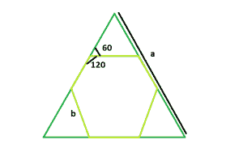

# 可内接在等边三角形内的最大六边形

> 原文:[https://www . geeksforgeeks . org/等边三角形内可内接的最大六边形/](https://www.geeksforgeeks.org/largest-hexagon-that-can-be-inscribed-within-an-equilateral-triangle/)

给定一个边长为 **a** 的等边三角形，任务是找到其中可以内切法的最大六边形。
**例:**

> **输入:** a = 6
> **输出:** 2
> **输入:** a = 9
> **输出:** 3



**做法:**从图中可以明显看出，这三个小三角形也是等边三角形。所以它们的边长 **b = a / 3** 其中 **b** 也是六边形的长度 **a** 是给定等边三角形的长度。
以下是上述方法的实施:

## C++

```
// C++ program to find the side of the
// largest hexagon which can be inscribed
// within an equilateral triangle
#include <bits/stdc++.h>
using namespace std;

// Function to find the side
// of the hexagon
float hexagonside(float a)
{

    // Side cannot be negative
    if (a < 0)
        return -1;

    // Side of the hexagon
    float x = a / 3;
    return x;
}

// Driver code
int main()
{
    float a = 6;
    cout << hexagonside(a) << endl;
    return 0;
}
```

## Java 语言(一种计算机语言，尤用于创建网站)

```
// Java program to find the side of the
// largest hexagon which can be inscribed
// within an equilateral triangle
class CLG
{
// Function to find the side
// of the hexagon
 static float hexagonside(float a)
{

    // Side cannot be negative
    if (a < 0)
        return -1;

    // Side of the hexagon
    float x = a / 3;
    return x;
}

// Driver code
public static void main(String[] args)
{
    float a = 6;
    System.out.println(hexagonside(a));

}
}
```

## 蟒蛇 3

```
# Python3 program to find the side of the
# largest hexagon which can be inscribed
# within an eqilateral triangle

# function to find the side of the hexagon
def hexagonside(a):

    # Side cannot be negative
    if a < 0:
        return -1

    # Side of the hexagon
    x = a // 3
    return x

# Driver code
a = 6
print(hexagonside(a))

# This code is contributed
# by Mohit kumar 29
```

## C#

```
using System;
// C# program to find the side of the
// largest hexagon which can be inscribed
// within an equilateral triangle
class CLG
{
// Function to find the side
// of the hexagon
 static float hexagonside(float a)
{

    // Side cannot be negative
    if (a < 0)
        return -1;

    // Side of the hexagon
    float x = a / 3;
    return x;
}

// Driver code
public static void Main()
{
    float a = 6;
    Console.Write(hexagonside(a));

}
}
```

## 服务器端编程语言（Professional Hypertext Preprocessor 的缩写）

```
<?php
// PHP program to find the side of the
// largest hexagon which can be inscribed
// within an equilateral triangle

// Function to find the side
// of the hexagon
function hexagonside($a)
{

    // Side cannot be negative
    if ($a < 0)
        return -1;

    // Side of the hexagon
    $x = $a / 3;
    return $x;
}

// Driver code
$a = 6;
echo hexagonside($a) ;

// This code is contributed by Ryuga
?>
```

## java 描述语言

```
<script>

// javascript program to find the side of the
// largest hexagon which can be inscribed
// within an equilateral triangle

// Function to find the side
// of the hexagon
 function hexagonside(a)
{

    // Side cannot be negative
    if (a < 0)
        return -1;

    // Side of the hexagon
    var x = a / 3;
    return x;
}

// Driver code

var a = 6;
document.write(hexagonside(a));

// This code contributed by Princi Singh

</script>
```

**Output:** 

```
2
```