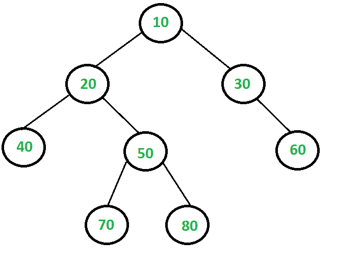

# 最大独立集问题| DP-26

> 原文:[https://www . geesforgeks . org/maximum-independent-set-problem-DP-26/](https://www.geeksforgeeks.org/largest-independent-set-problem-dp-26/)

给定一棵二叉树，找出其中最大的 T2 和独立的 T4 的大小。如果所有树节点的子集的任意两个节点之间没有边，则该子集是一个独立的集合。

例如，考虑下面的二叉树。最大的独立集是{10，40，60，70，80}，独立集的大小是 5。



动态规划解决方案以自下而上的方式使用子问题的解决方案来解决给定的问题。给定的问题能用子问题的解来解决吗？如果是，那么子问题是什么？如果我们知道 X 的所有后代的 LISS，我们能找到 X 节点的最大独立集大小(LISS)吗？如果一个节点被认为是 LIS 的一部分，那么它的子节点不能是 LIS 的一部分，但是它的子节点可以是。以下是最佳子结构特性。

**1)最优子结构:**
让 LISS(X)表示根为 X 的树的最大独立集的大小

```
     LISS(X) = MAX { (1 + sum of LISS for all grandchildren of X),
                     (sum of LISS for all children of X) }
```

想法很简单，每个节点 X 都有两种可能，要么 X 是集合的成员，要么不是成员。如果 X 是成员，那么 LISS(X)的值是 1 加上所有孙辈的 LISS。如果 X 不是成员，则该值为所有子代的 LISS 之和。

**2)重叠子问题**
以下是简单遵循上述递归结构的递归实现。

## C++

```
// A naive recursive implementation of
// Largest Independent Set problem
#include <bits/stdc++.h>
using namespace std;

// A utility function to find
// max of two integers
int max(int x, int y)
{
    return (x > y) ? x : y;
}

/* A binary tree node has data,
pointer to left child and a
pointer to right child */
class node
{
    public:
    int data;
    node *left, *right;
};

// The function returns size of the
// largest independent set in a given
// binary tree
int LISS(node *root)
{
    if (root == NULL)
    return 0;

    // Calculate size excluding the current node
    int size_excl = LISS(root->left) +
                    LISS(root->right);

    // Calculate size including the current node
    int size_incl = 1;
    if (root->left)
        size_incl += LISS(root->left->left) +
                     LISS(root->left->right);
    if (root->right)
        size_incl += LISS(root->right->left) +
                     LISS(root->right->right);

    // Return the maximum of two sizes
    return max(size_incl, size_excl);
}

// A utility function to create a node
node* newNode( int data )
{
    node* temp = new node();
    temp->data = data;
    temp->left = temp->right = NULL;
    return temp;
}

// Driver Code
int main()
{
    // Let us construct the tree
    // given in the above diagram
    node *root = newNode(20);
    root->left = newNode(8);
    root->left->left = newNode(4);
    root->left->right = newNode(12);
    root->left->right->left = newNode(10);
    root->left->right->right = newNode(14);
    root->right = newNode(22);
    root->right->right = newNode(25);

    cout << "Size of the Largest"
         << " Independent Set is "
         << LISS(root);

    return 0;
}

// This is code is contributed
// by rathbhupendra
```

## C

```
// A naive recursive implementation of Largest Independent Set problem
#include <stdio.h>
#include <stdlib.h>

// A utility function to find max of two integers
int max(int x, int y) { return (x > y)? x: y; }

/* A binary tree node has data, pointer to left child and a pointer to
   right child */
struct node
{
    int data;
    struct node *left, *right;
};

// The function returns size of the largest independent set in a given
// binary tree
int LISS(struct node *root)
{
    if (root == NULL)
       return 0;

    // Calculate size excluding the current node
    int size_excl = LISS(root->left) + LISS(root->right);

    // Calculate size including the current node
    int size_incl = 1;
    if (root->left)
       size_incl += LISS(root->left->left) + LISS(root->left->right);
    if (root->right)
       size_incl += LISS(root->right->left) + LISS(root->right->right);

    // Return the maximum of two sizes
    return max(size_incl, size_excl);
}

// A utility function to create a node
struct node* newNode( int data )
{
    struct node* temp = (struct node *) malloc( sizeof(struct node) );
    temp->data = data;
    temp->left = temp->right = NULL;
    return temp;
}

// Driver program to test above functions
int main()
{
    // Let us construct the tree given in the above diagram
    struct node *root         = newNode(20);
    root->left                = newNode(8);
    root->left->left          = newNode(4);
    root->left->right         = newNode(12);
    root->left->right->left   = newNode(10);
    root->left->right->right  = newNode(14);
    root->right               = newNode(22);
    root->right->right        = newNode(25);

    printf ("Size of the Largest Independent Set is %d ", LISS(root));

    return 0;
}
```

## Java 语言(一种计算机语言，尤用于创建网站)

```
// A naive recursive implementation of
// Largest Independent Set problem
class GFG {

// A utility function to find
// max of two integers
static int max(int x, int y)
{
    return (x > y) ? x : y;
}

/* A binary tree node has data,
pointer to left child and a
pointer to right child */
static class Node
{
    int data;
    Node left, right;
};

// The function returns size of the
// largest independent set in a given
// binary tree
static int LISS(Node root)
{
    if (root == null)
    return 0;

    // Calculate size excluding the current node
    int size_excl = LISS(root.left) +
                    LISS(root.right);

    // Calculate size including the current node
    int size_incl = 1;
    if (root.left!=null)
        size_incl += LISS(root.left.left) +
                    LISS(root.left.right);
    if (root.right!=null)
        size_incl += LISS(root.right.left) +
                    LISS(root.right.right);

    // Return the maximum of two sizes
    return max(size_incl, size_excl);
}

// A utility function to create a node
static Node newNode( int data )
{
    Node temp = new Node();
    temp.data = data;
    temp.left = temp.right = null;
    return temp;
}

// Driver Code
public static void main(String args[]) {
    // Let us construct the tree
    // given in the above diagram
    Node root = newNode(20);
    root.left = newNode(8);
    root.left.left = newNode(4);
    root.left.right = newNode(12);
    root.left.right.left = newNode(10);
    root.left.right.right = newNode(14);
    root.right = newNode(22);
    root.right.right = newNode(25);

    System.out.println("Size of the Largest"
        + " Independent Set is "
        + LISS(root));
    }
}

// This code has been contributed by 29AjayKumar
```

## 蟒蛇 3

```
# A naive recursive implementation of
# Largest Independent Set problem

# A utility function to find
# max of two integers
def max(x, y):
    if(x > y):
        return x
    else:
        return y

# A binary tree node has data,
#pointer to left child and a
#pointer to right child
class node :
    def __init__(self):
        self.data = 0
        self.left = self.right = None

# The function returns size of the
# largest independent set in a given
# binary tree
def LISS(root):

    if (root == None) :
        return 0

    # Calculate size excluding the current node
    size_excl = LISS(root.left) + LISS(root.right)

    # Calculate size including the current node
    size_incl = 1
    if (root.left != None):
        size_incl += LISS(root.left.left) + \
                    LISS(root.left.right)
    if (root.right != None):
        size_incl += LISS(root.right.left) + \
                    LISS(root.right.right)

    # Return the maximum of two sizes
    return max(size_incl, size_excl)

# A utility function to create a node
def newNode( data ) :

    temp = node()
    temp.data = data
    temp.left = temp.right = None
    return temp

# Driver Code

# Let us construct the tree
# given in the above diagram
root = newNode(20)
root.left = newNode(8)
root.left.left = newNode(4)
root.left.right = newNode(12)
root.left.right.left = newNode(10)
root.left.right.right = newNode(14)
root.right = newNode(22)
root.right.right = newNode(25)

print( "Size of the Largest"
        , " Independent Set is "
        , LISS(root) )

# This code is contributed by Arnab Kundu
```

## C#

```
// C# program for calculating LISS
// using dynamic programming
using System;

class LisTree
{
    /* A binary tree node has data, pointer
    to left child and a pointer to right
    child */
    public class node
    {
        public int data, liss;
        public node left, right;

        public node(int data)
        {
            this.data = data;
            this.liss = 0;
        }
    }

    // A memoization function returns size
    // of the largest independent set in
    // a given binary tree
    static int liss(node root)
    {
        if (root == null)
            return 0;
        if (root.liss != 0)
            return root.liss;
        if (root.left == null && root.right == null)
            return root.liss = 1;

        // Calculate size excluding the
        // current node
        int liss_excl = liss(root.left) + liss(root.right);

        // Calculate size including the
        // current node
        int liss_incl = 1;
        if (root.left != null)
        {
            liss_incl += (liss(root.left.left) +
                        liss(root.left.right));
        }
        if (root.right != null)
        {
            liss_incl += (liss(root.right.left) +
                        liss(root.right.right));
        }

        // Maximum of two sizes is LISS,
        // store it for future uses.
        return root.liss = Math.Max(liss_excl, liss_incl);
    }

    // Driver code
    public static void Main(String[] args)
    {
        // Let us construct the tree given
        // in the above diagram

        node root = new node(20);
        root.left = new node(8);
        root.left.left = new node(4);
        root.left.right = new node(12);
        root.left.right.left = new node(10);
        root.left.right.right = new node(14);
        root.right = new node(22);
        root.right.right = new node(25);
        Console.WriteLine("Size of the Largest Independent Set is " + liss(root));
    }
}

// This code is contributed by Princi Singh
```

## java 描述语言

```
<script>

// A naive recursive implementation of
// Largest Independent Set problem

// A utility function to find
// max of two integers
function max(x, y)
{
    return(x > y) ? x : y;
}

// A binary tree node has data,
// pointer to left child and a
// pointer to right child
class Node
{
    constructor(data)
    {
        this.data = data;
        this.left = this.right = null;
    }
}

// The function returns size of the
// largest independent set in a given
// binary tree
function LISS(root)
{
    if (root == null)
    return 0;

    // Calculate size excluding the current node
    let size_excl = LISS(root.left) +
                    LISS(root.right);

    // Calculate size including the current node
    let size_incl = 1;
    if (root.left != null)
        size_incl += LISS(root.left.left) +
                     LISS(root.left.right);
    if (root.right != null)
        size_incl += LISS(root.right.left) +
                     LISS(root.right.right);

    // Return the maximum of two sizes
    return max(size_incl, size_excl);
}

// Driver Code

// Let us construct the tree
// given in the above diagram
let root = new Node(20);
root.left = new Node(8);
root.left.left = new Node(4);
root.left.right = new Node(12);
root.left.right.left = new Node(10);
root.left.right.right = new Node(14);
root.right = new Node(22);
root.right.right = new Node(25);

document.write("Size of the Largest" +
               " Independent Set is " +
               LISS(root));

// This code is contributed by avanitrachhadiya2155

</script>
```

**输出:**

```
Size of the Largest Independent Set is 5
```

上述简单递归方法的时间复杂度是指数级的。需要注意的是，上面的函数一次又一次地计算相同的子问题。例如，值为 50 的节点的 LISS 被评估为值为 10 和 20 的节点，因为 50 是 10 的孙子和 20 的孩子。

由于相同的子问题被再次调用，这个问题具有重叠子问题的性质。所以 LISS 问题同时具有动态规划问题的两个性质(参见[这个](https://www.geeksforgeeks.org/overlapping-subproblems-property-in-dynamic-programming-dp-1/)和[这个](https://www.geeksforgeeks.org/optimal-substructure-property-in-dynamic-programming-dp-2/))。像其他典型的[动态规划(DP)问题一样，](https://www.geeksforgeeks.org/archives/tag/dynamic-programming)通过存储子问题的解并以自下而上的方式解决问题，可以避免相同子问题的重新计算。

以下是基于动态规划的解决方案的实现。在下面的解决方案中，一个额外的字段“liss”被添加到树节点。所有节点的“liss”初始值都设置为 0。递归函数 LISS()仅在节点尚未设置时才计算节点的“liss”。

## C++

```
/* Dynamic programming based program
for Largest Independent Set problem */
#include <bits/stdc++.h>
using namespace std;

// A utility function to find max of two integers
int max(int x, int y) { return (x > y)? x: y; }

/* A binary tree node has data, pointer
to left child and a pointer to
right child */
class node
{
    public:
    int data;
    int liss;
    node *left, *right;
};

// A memoization function returns size
// of the largest independent set in
// a given binary tree
int LISS(node *root)
{
    if (root == NULL)
        return 0;

    if (root->liss)
        return root->liss;

    if (root->left == NULL && root->right == NULL)
        return (root->liss = 1);

    // Calculate size excluding the current node
    int liss_excl = LISS(root->left) + LISS(root->right);

    // Calculate size including the current node
    int liss_incl = 1;
    if (root->left)
        liss_incl += LISS(root->left->left) + LISS(root->left->right);
    if (root->right)
        liss_incl += LISS(root->right->left) + LISS(root->right->right);

    // Maximum of two sizes is LISS, store it for future uses.
    root->liss = max(liss_incl, liss_excl);

    return root->liss;
}

// A utility function to create a node
node* newNode(int data)
{
    node* temp = new node();
    temp->data = data;
    temp->left = temp->right = NULL;
    temp->liss = 0;
    return temp;
}

// Driver code
int main()
{
    // Let us construct the tree
    // given in the above diagram
    node *root     = newNode(20);
    root->left         = newNode(8);
    root->left->left     = newNode(4);
    root->left->right     = newNode(12);
    root->left->right->left = newNode(10);
    root->left->right->right = newNode(14);
    root->right         = newNode(22);
    root->right->right     = newNode(25);

    cout << "Size of the Largest Independent Set is " << LISS(root);

    return 0;
}

// This code is contributed by rathbhupendra
```

## C

```
/* Dynamic programming based program for Largest Independent Set problem */
#include <stdio.h>
#include <stdlib.h>

// A utility function to find max of two integers
int max(int x, int y) { return (x > y)? x: y; }

/* A binary tree node has data, pointer to left child and a pointer to
   right child */
struct node
{
    int data;
    int liss;
    struct node *left, *right;
};

// A memoization function returns size of the largest independent set in
//  a given binary tree
int LISS(struct node *root)
{
    if (root == NULL)
        return 0;

    if (root->liss)
        return root->liss;

    if (root->left == NULL && root->right == NULL)
        return (root->liss = 1);

    // Calculate size excluding the current node
    int liss_excl = LISS(root->left) + LISS(root->right);

    // Calculate size including the current node
    int liss_incl = 1;
    if (root->left)
        liss_incl += LISS(root->left->left) + LISS(root->left->right);
    if (root->right)
        liss_incl += LISS(root->right->left) + LISS(root->right->right);

    // Maximum of two sizes is LISS, store it for future uses.
    root->liss = max(liss_incl, liss_excl);

    return root->liss;
}

// A utility function to create a node
struct node* newNode(int data)
{
    struct node* temp = (struct node *) malloc( sizeof(struct node) );
    temp->data = data;
    temp->left = temp->right = NULL;
    temp->liss = 0;
    return temp;
}

// Driver program to test above functions
int main()
{
    // Let us construct the tree given in the above diagram
    struct node *root         = newNode(20);
    root->left                = newNode(8);
    root->left->left          = newNode(4);
    root->left->right         = newNode(12);
    root->left->right->left   = newNode(10);
    root->left->right->right  = newNode(14);
    root->right               = newNode(22);
    root->right->right        = newNode(25);

    printf ("Size of the Largest Independent Set is %d ", LISS(root));

    return 0;
}
```

## Java 语言(一种计算机语言，尤用于创建网站)

```
// Java program for calculating LISS
// using dynamic programming

public class LisTree
{
    /* A binary tree node has data, pointer
       to left child and a pointer to right
       child */
    static class node
    {
        int data, liss;
        node left, right;

        public node(int data)
        {
            this.data = data;
            this.liss = 0;
        }
    }

    // A memoization function returns size
    // of the largest independent set in
    // a given binary tree
    static int liss(node root)
    {
        if (root == null)
            return 0;
        if (root.liss != 0)
            return root.liss;
        if (root.left == null && root.right == null)
            return root.liss = 1;

        // Calculate size excluding the
        // current node
        int liss_excl = liss(root.left) + liss(root.right);

        // Calculate size including the
        // current node
        int liss_incl = 1;
        if (root.left != null)
        {
            liss_incl += (liss(root.left.left) + liss(root.left.right));
        }
        if (root.right != null)
        {
            liss_incl += (liss(root.right.left) + liss(root.right.right));
        }

        // Maximum of two sizes is LISS,
        // store it for future uses.
        return root.liss = Math.max(liss_excl, liss_incl);
    }

    public static void main(String[] args)
    {
        // Let us construct the tree given
        // in the above diagram

        node root = new node(20);
        root.left = new node(8);
        root.left.left = new node(4);
        root.left.right = new node(12);
        root.left.right.left = new node(10);
        root.left.right.right = new node(14);
        root.right = new node(22);
        root.right.right = new node(25);
        System.out.println("Size of the Largest Independent Set is " + liss(root));
    }
}

// This code is contributed by Rishabh Mahrsee
```

## 蟒蛇 3

```
# Python3 program for calculating LISS
# using dynamic programming

# A binary tree node has data,
# pointer to left child and a
# pointer to right child
class node:
    def __init__(self, data):

        self.data = data
        self.left = self.right = None
        self.liss = 0

# A memoization function returns size
# of the largest independent set in
# a given binary tree
def liss(root):

    if root == None:
        return 0

    if root.liss != 0:
        return root.liss

    if (root.left == None and
        root.right == None):
        root.liss = 1
        return root.liss

    # Calculate size excluding the
    # current node
    liss_excl = (liss(root.left) +
                 liss(root.right))

    # Calculate size including the
    # current node
    liss_incl = 1
    if root.left != None:
        liss_incl += (liss(root.left.left) +
                      liss(root.left.right))

    if root.right != None:
        liss_incl += (liss(root.right.left) +
                      liss(root.right.right))

    # Maximum of two sizes is LISS,
    # store it for future uses.
    root.liss = max(liss_excl, liss_incl)

    return root.liss

# Driver Code

# Let us construct the tree given
# in the above diagram
root = node(20)
root.left = node(8)
root.left.left = node(4)
root.left.right = node(12)
root.left.right.left = node(10)
root.left.right.right = node(14)
root.right = node(22)
root.right.right = node(25)

print("Size of the Largest Independent "\
      "Set is ", liss(root))

# This code is contributed by nishthagoel712
```

## C#

```
// C# program for calculating LISS
// using dynamic programming
using System;

public class LisTree
{
    /* A binary tree node has data, pointer
    to left child and a pointer to right
    child */
    public class node
    {
        public int data, liss;
        public node left, right;

        public node(int data)
        {
            this.data = data;
            this.liss = 0;
        }
    }

    // A memoization function returns size
    // of the largest independent set in
    // a given binary tree
    static int liss(node root)
    {
        if (root == null)
            return 0;
        if (root.liss != 0)
            return root.liss;
        if (root.left == null && root.right == null)
            return root.liss = 1;

        // Calculate size excluding the
        // current node
        int liss_excl = liss(root.left) + liss(root.right);

        // Calculate size including the
        // current node
        int liss_incl = 1;
        if (root.left != null)
        {
            liss_incl += (liss(root.left.left) + liss(root.left.right));
        }
        if (root.right != null)
        {
            liss_incl += (liss(root.right.left) + liss(root.right.right));
        }

        // Maximum of two sizes is LISS,
        // store it for future uses.
        return root.liss = Math.Max(liss_excl, liss_incl);
    }

    // Driver code
    public static void Main(String[] args)
    {
        // Let us construct the tree given
        // in the above diagram

        node root = new node(20);
        root.left = new node(8);
        root.left.left = new node(4);
        root.left.right = new node(12);
        root.left.right.left = new node(10);
        root.left.right.right = new node(14);
        root.right = new node(22);
        root.right.right = new node(25);
        Console.WriteLine("Size of the Largest Independent Set is " + liss(root));
    }
}

/* This code is contributed by PrinciRaj1992 */
```

## java 描述语言

```
<script>

      // JavaScript program for calculating LISS
      // using dynamic programming
      /* A binary tree node has data, pointer
        to left child and a pointer to right
        child */
      class node {
        constructor(data) {
          this.data = data;
          this.liss = 0;
          this.left = null;
          this.right = null;
        }
      }

      // A memoization function returns size
      // of the largest independent set in
      // a given binary tree
      function liss(root) {
        if (root == null) return 0;
        if (root.liss != 0) return root.liss;
        if (root.left == null && root.right == null)
        return (root.liss = 1);

        // Calculate size excluding the
        // current node
        var liss_excl = liss(root.left) + liss(root.right);

        // Calculate size including the
        // current node
        var liss_incl = 1;
        if (root.left != null) {
          liss_incl += liss(root.left.left) + liss(root.left.right);
        }
        if (root.right != null) {
          liss_incl += liss(root.right.left) + liss(root.right.right);
        }

        // Maximum of two sizes is LISS,
        // store it for future uses.
        return (root.liss = Math.max(liss_excl, liss_incl));
      }

      // Driver code
      // Let us construct the tree given
      // in the above diagram

      var root = new node(20);
      root.left = new node(8);
      root.left.left = new node(4);
      root.left.right = new node(12);
      root.left.right.left = new node(10);
      root.left.right.right = new node(14);
      root.right = new node(22);
      root.right.right = new node(25);
      document.write(
      "Size of the Largest Independent Set is " + liss(root)
      );

</script>
```

**输出:**

```
Size of the Largest Independent Set is 5
```

**时间复杂度:** O(n)，其中 n 是给定二叉树中的节点数。
以下对上述解决方案的扩展可以作为练习来尝试。
**1)** 对 n 元树扩展上述解决方案。
**2)** 上述解决方案通过向树节点添加额外的字段“liss”来修改给定的树结构。扩展解决方案，使其不修改树结构。
**3)** 以上解决方案只返回 LIS 的大小，不打印 LIS 的元素。扩展解决方案以打印 LIS 的所有节点。
如果发现有不正确的地方，或者想分享更多关于上述话题的信息，请写评论。