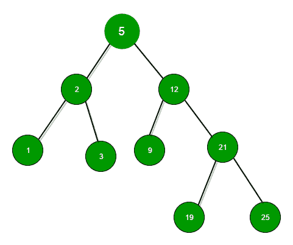

# BST 中小于或等于 N 的最大数值

> 原文:[https://www . geesforgeks . org/maximum-number-BST-less-equal-n/](https://www.geeksforgeeks.org/largest-number-bst-less-equal-n/)

我们有一个二叉查找树和一个数字 n。我们的任务是在二叉查找树找到小于或等于 n 的最大数字。如果元素存在，打印它的值，否则打印-1。



**举例:**
对于上面给出的二叉查找树——

```
Input : N = 24
Output :result = 21
(searching for 24 will be like-5->12->21)

Input  : N = 4
Output : result = 3
(searching for 4 will be like-5->2->3)
```

我们遵循递归方法来解决这个问题。我们从根节点开始搜索元素。如果我们到达一片叶子，它的值大于 N，元素不存在，所以返回-1。否则，如果节点值小于或等于 N，右值为空或大于 N，则返回节点值，因为它将是答案。

否则，如果节点的值大于 N，则在左子树中搜索元素，否则通过相应地传递左值或右值来调用相同的函数，在右子树中搜索元素。

## C++

```
// C++ code to find the largest value smaller
// than or equal to N
#include <bits/stdc++.h>
using namespace std;

struct Node {
    int key;
    Node *left, *right;
};

// To create new BST Node
Node* newNode(int item)
{
    Node* temp = new Node;
    temp->key = item;
    temp->left = temp->right = NULL;
    return temp;
}

// To insert a new node in BST
Node* insert(Node* node, int key)
{
    // if tree is empty return new node
    if (node == NULL)
        return newNode(key);

    // if key is less then or greater then
    // node value then recur down the tree
    if (key < node->key)
        node->left = insert(node->left, key);
    else if (key > node->key)
        node->right = insert(node->right, key);

    // return the (unchanged) node pointer
    return node;
}

// function to find max value less then N
int findMaxforN(Node* root, int N)
{
    // Base cases
    if (root == NULL)
        return -1;
    if (root->key == N)
        return N;

    // If root's value is smaller, try in right
    // subtree
    else if (root->key < N) {
        int k = findMaxforN(root->right, N);
        if (k == -1)
            return root->key;
        else
            return k;
    }

    // If root's key is greater, return value
    // from left subtree.
    else if (root->key > N)
        return findMaxforN(root->left, N);   
}

// Driver code
int main()
{
    int N = 4;

    // creating following BST
    /*
                  5
               /   \
             2     12
           /  \    /  \
          1   3   9   21
                     /   \ 
                    19   25  */
    Node* root = insert(root, 25);
    insert(root, 2);
    insert(root, 1);
    insert(root, 3);
    insert(root, 12);
    insert(root, 9);
    insert(root, 21);
    insert(root, 19);
    insert(root, 25);

    printf("%d", findMaxforN(root, N));

    return 0;
}
```

## Java 语言(一种计算机语言，尤用于创建网站)

```
// Java code to find the largest value smaller
// than or equal to N
class GfG {

static class Node {
    int key;
    Node left, right;
}

// To create new BST Node
static Node newNode(int item)
{
    Node temp = new Node();
    temp.key = item;
    temp.left = null;
    temp.right = null;
    return temp;
}

// To insert a new node in BST
static Node insert(Node node, int key)
{
    // if tree is empty return new node
    if (node == null)
        return newNode(key);

    // if key is less then or greater then
    // node value then recur down the tree
    if (key < node.key)
        node.left = insert(node.left, key);
    else if (key > node.key)
        node.right = insert(node.right, key);

    // return the (unchanged) node pointer
    return node;
}

// function to find max value less then N
static int findMaxforN(Node root, int N)
{
    // Base cases
    if (root == null)
        return -1;
    if (root.key == N)
        return N;

    // If root's value is smaller, try in right
    // subtree
    else if (root.key < N) {
        int k = findMaxforN(root.right, N);
        if (k == -1)
            return root.key;
        else
            return k;
    }

    // If root's key is greater, return value
    // from left subtree.
    else if (root.key > N)
        return findMaxforN(root.left, N);
    return -1;
}

// Driver code
public static void main(String[] args)
{
    int N = 4;

    // creating following BST
    /*
                5
            / \
            2     12
        / \ / \
        1 3 9 21
                    / \
                    19 25 */
    Node root = null;
    root = insert(root, 25);
    insert(root, 2);
    insert(root, 1);
    insert(root, 3);
    insert(root, 12);
    insert(root, 9);
    insert(root, 21);
    insert(root, 19);
    insert(root, 25);

    System.out.println(findMaxforN(root, N));
}
}
```

## 蟒蛇 3

```
# Python3 code to find the largest
# value smaller than or equal to N
class newNode:

    # Constructor to create a new node
    def __init__(self, data):
        self.key = data
        self.left = None
        self.right = None

# To insert a new node in BST
def insert(node, key):

    # if tree is empty return new node
    if node == None:
        return newNode(key)

    # if key is less then or greater then
    # node value then recur down the tree
    if key < node.key:
        node.left = insert(node.left, key)
    elif key > node.key:
        node.right = insert(node.right, key)

    # return the (unchanged) node pointer
    return node

# function to find max value less then N
def findMaxforN(root, N):

    # Base cases
    if root == None:
        return -1
    if root.key == N:
        return N

    # If root's value is smaller, try in
    # right subtree
    elif root.key < N:
        k = findMaxforN(root.right, N)
        if k == -1:
            return root.key
        else:
            return k

    # If root's key is greater, return
    # value from left subtree.
    elif root.key > N:
        return findMaxforN(root.left, N)

# Driver code
if __name__ == '__main__':
    N = 4

    # creating following BST
    #
    #             5
    #         / \
    #         2     12
    #     / \ / \
    #     1 3 9 21
    #                 / \
    #             19 25
    root = None
    root = insert(root, 25)
    insert(root, 2)
    insert(root, 1)
    insert(root, 3)
    insert(root, 12)
    insert(root, 9)
    insert(root, 21)
    insert(root, 19)
    insert(root, 25)
    print(findMaxforN(root, N))

# This code is contributed by PranchalK
```

## C#

```
// C# code to find the largest value
// smaller than or equal to N
using System;

class GFG
{

    class Node
    {
        public int key;
        public Node left, right;
    }

    // To create new BST Node
    static Node newNode(int item)
    {
        Node temp = new Node();
        temp.key = item;
        temp.left = null;
        temp.right = null;
        return temp;
    }

    // To insert a new node in BST
    static Node insert(Node node, int key)
    {
        // if tree is empty return new node
        if (node == null)
            return newNode(key);

        // if key is less then or greater then
        // node value then recur down the tree
        if (key < node.key)
            node.left = insert(node.left, key);
        else if (key > node.key)
            node.right = insert(node.right, key);

        // return the (unchanged) node pointer
        return node;
    }

    // function to find max value less then N
    static int findMaxforN(Node root, int N)
    {
        // Base cases
        if (root == null)
            return -1;
        if (root.key == N)
            return N;

        // If root's value is smaller,
        // try in right subtree
        else if (root.key < N)
        {
            int k = findMaxforN(root.right, N);
            if (k == -1)
                return root.key;
            else
                return k;
        }

        // If root's key is greater, return
        // value from left subtree.
        else if (root.key > N)
            return findMaxforN(root.left, N);
        return -1;
    }

    // Driver code
    public static void Main(String[] args)
    {
        int N = 4;

        // creating following BST
        /*
                    5
                / \
                2 12
            / \ / \
            1 3 9 21
                        / \
                        19 25 */
        Node root = null;
        root = insert(root, 25);
        insert(root, 2);
        insert(root, 1);
        insert(root, 3);
        insert(root, 12);
        insert(root, 9);
        insert(root, 21);
        insert(root, 19);
        insert(root, 25);

        Console.WriteLine(findMaxforN(root, N));
    }
}

// This code is contributed 29AjayKumar
```

## java 描述语言

```
<script>
// javascript code to find the largest value smaller
// than or equal to N
     class Node
     {
         constructor(){
        this.key = 0;
        this.left = null,this.right = null;
    }
    }

    // To create new BST Node
    function newNode(item)
    {
        var temp = new Node();
        temp.key = item;
        temp.left = null;
        temp.right = null;
        return temp;
    }

    // To insert a new node in BST
    function insert(node , key) {
        // if tree is empty return new node
        if (node == null)
            return newNode(key);

        // if key is less then or greater then
        // node value then recur down the tree
        if (key < node.key)
            node.left = insert(node.left, key);
        else if (key > node.key)
            node.right = insert(node.right, key);

        // return the (unchanged) node pointer
        return node;
    }

    // function to find max value less then N
    function findMaxforN(root , N)
    {

        // Base cases
        if (root == null)
            return -1;
        if (root.key == N)
            return N;

        // If root's value is smaller, try in right
        // subtree
        else if (root.key < N)
        {
            var k = findMaxforN(root.right, N);
            if (k == -1)
                return root.key;
            else
                return k;
        }

        // If root's key is greater, return value
        // from left subtree.
        else if (root.key > N)
            return findMaxforN(root.left, N);
        return -1;
    }

    // Driver code

        var N = 4;

        // creating following BST
        /*
         * 5
         / \
         2 12
        / \ / \
        1 3 9 21
             / \
            19 25
         */
var root = null;
        root = insert(root, 25);
        insert(root, 2);
        insert(root, 1);
        insert(root, 3);
        insert(root, 12);
        insert(root, 9);
        insert(root, 21);
        insert(root, 19);
        insert(root, 25);

        document.write(findMaxforN(root, N));

// This code is contributed by Rajput-Ji
</script>
```

**输出:**

```
3
```

**时间复杂度:** O(h)，其中 h 为 BST 的高度。
T3【参考:T5[https://www.careercup.com/question?id=5765237112307712](https://www.careercup.com/question?id=5765237112307712)

**迭代解**
下图是迭代解，不需要额外的空间用于递归调用栈。

## C++

```
// C++ code to find the largest value smaller
// than or equal to N
#include <bits/stdc++.h>
using namespace std;

struct Node {
    int key;
    Node *left, *right;
};

// To create new BST Node
Node* newNode(int item)
{
    Node* temp = new Node;
    temp->key = item;
    temp->left = temp->right = NULL;
    return temp;
}

// To insert a new node in BST
Node* insert(Node* node, int key)
{
    // if tree is empty return new node
    if (node == NULL)
        return newNode(key);

    // if key is less then or greater then
    // node value then recur down the tree
    if (key < node->key)
        node->left = insert(node->left, key);
    else if (key > node->key)
        node->right = insert(node->right, key);

    // return the (unchanged) node pointer
    return node;
}

// function to find max value less then N
void findMaxforN(Node* root, int N)
{
    // Start from root and keep looking for larger 
    while (root != NULL && root->right != NULL) {

        // If root is smaller go to right side
        if (N > root->key && N >= root->right->key)
            root = root->right;

        // If root is greater go to left side
        else if (N < root->key)
            root = root->left;

        else
            break;
    }
    if (root == NULL || root->key > N)
        cout << -1;
    else
        cout << root->key;
}

// Driver code
int main()
{
    int N = 50;
    Node* root = insert(root, 5);
    insert(root, 2);
    insert(root, 1);
    insert(root, 3);
    insert(root, 12);
    insert(root, 9);
    insert(root, 21);
    insert(root, 19);
    insert(root, 25);

    findMaxforN(root, N);
    return 0;
}
```

## 蟒蛇 3

```
# Python3 code to find the largest value
# smaller than or equal to N

class newNode:

    # To create new BST Node
    def __init__(self, data):

        self.key = data
        self.left = None
        self.right = None

# To insert a new node in BST
def insert(node, key):

    # If tree is empty return new node
    if (node == None):
        return newNode(key)

    # If key is less then or greater then
    # node value then recur down the tree
    if (key < node.key):
        node.left = insert(node.left, key)
    elif (key > node.key):
        node.right = insert(node.right, key)

    # Return the (unchanged) node pointer
    return node

# Function to find max value less then N
def findMaxforN(root, N):

    # Start from root and keep looking for larger 
    while (root != None and root.right != None):

        # If root is smaller go to right side
        if (N > root.key and N >= root.right.key):
            root = root.right

        # If root is greater go to left side
        elif (N < root.key):
            root = root.left
        else:
            break

    if (root == None or root.key > N):
        print(-1)
    else:
        print(root.key)

# Driver code
if __name__ == '__main__':

    N = 50

    root = None
    root = insert(root, 5)
    insert(root, 2)
    insert(root, 1)
    insert(root, 3)
    insert(root, 12)
    insert(root, 9)
    insert(root, 21)
    insert(root, 19)
    insert(root, 25)

    findMaxforN(root, N)

# This code is contributed by bgangwar59
```

## java 描述语言

```
<script>

// JavaScript code to find the largest value smaller
// than or equal to N

class Node
{
    constructor(data)
    {
        this.key=data;
        this.left=this.right=null;
    }
}

function insert(node, key)
{
    // If tree is empty return new node
    if (node == null)
        return new Node(key)

    // If key is less then or greater then
    // node value then recur down the tree
    if (key < node.key)
        node.left = insert(node.left, key)
    else if (key > node.key)
        node.right = insert(node.right, key)

    // Return the (unchanged) node pointer
    return node
}

function findMaxforN(root, N)
{
    // Start from root and keep looking for larger
    while (root != null && root.right != null)
    {    
        // If root is smaller go to right side
        if (N > root.key && N >= root.right.key)
            root = root.right

        // If root is greater go to left side
        else if (N < root.key)
            root = root.left
        else
            break
    }    
    if (root == null || root.key > N)
        document.write(-1)
    else
        document.write(root.key)
}
let N = 50;
let root = null;
root=insert(root, 2)
root=insert(root, 1)
root=insert(root, 3)
root=insert(root, 12)
root=insert(root, 9)
root=insert(root, 21)
root=insert(root, 19)
root=insert(root, 25)
findMaxforN(root, N)

// This code is contributed by rag2127

</script>
```

**输出:**

```
25
```

本文由**尼泰什·库马尔**供稿。如果你喜欢 GeeksforGeeks 并想投稿，你也可以使用[write.geeksforgeeks.org](https://write.geeksforgeeks.org)写一篇文章或者把你的文章邮寄到 review-team@geeksforgeeks.org。看到你的文章出现在极客博客主页上，帮助其他极客。
如果你发现任何不正确的地方，或者你想分享更多关于上面讨论的话题的信息，请写评论。