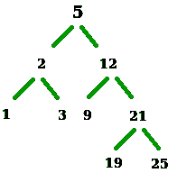

# BST(迭代方法)

中小于或等于 N 的最大数值

> 原文:[https://www . geesforgeks . org/maximum-number-less-equal-n-BST-iterative-approach/](https://www.geeksforgeeks.org/largest-number-less-equal-n-bst-iterative-approach/)

我们有一个二叉查找树和一个数字 n。我们的任务是在二叉查找树找到小于或等于 n 的最大数字。如果元素存在，打印它的值，否则打印-1。



例如:对于上面给出的二叉查找树-

```
Input : N = 24
Output :result = 21
(searching for 24 will be like-5->12->21)

Input  : N = 4
Output : result = 3
(searching for 4 will be like-5->2->3)
```

我们在下面的文章中讨论了递归方法。
[BST 中小于或等于 N 的最大数](https://www.geeksforgeeks.org/largest-number-bst-less-equal-n/)
这里讨论一种迭代方法。我们试图找到目标的前身。保留两个指针，一个指向当前节点，一个用于存储答案。如果当前节点的数据> N，我们向左移动。在另一种情况下，当当前节点的数据小于 N 时，当前节点可以是我们的答案(到目前为止)，我们向右移动。

## C++

```
// C++ code to find the largest value smaller
// than or equal to N
#include <bits/stdc++.h>
using namespace std;

struct Node {
    int key;
    Node *left, *right;
};

// To create new BST Node
Node* newNode(int item)
{
    Node* temp = new Node;
    temp->key = item;
    temp->left = temp->right = NULL;
    return temp;
}

// To insert a new node in BST
Node* insert(Node* node, int key)
{
    // if tree is empty return new node
    if (node == NULL)
        return newNode(key);

    // if key is less then or greater then
    // node value then recur down the tree
    if (key < node->key)
        node->left = insert(node->left, key);
    else if (key > node->key)
        node->right = insert(node->right, key);

    // return the (unchanged) node pointer
    return node;
}

// Returns largest value smaller than or equal to
// key. If key is smaller than the smallest, it
// returns -1.
int findFloor(Node* root, int key)
{
    Node *curr = root, *ans = NULL;
    while (curr) {
        if (curr->key <= key) {
            ans = curr;
            curr = curr->right;
        }
        else
            curr = curr->left;
    }
    if (ans)
        return ans->key;
    return -1;
}

// Driver code
int main()
{
    int N = 25;

    Node* root = insert(root, 19);
    insert(root, 2);
    insert(root, 1);
    insert(root, 3);
    insert(root, 12);
    insert(root, 9);
    insert(root, 21);
    insert(root, 19);
    insert(root, 25);

    printf("%d", findFloor(root, N));

    return 0;
}
```

## Java 语言(一种计算机语言，尤用于创建网站)

```
// Java code to find the largest value smaller
// than or equal to N
class GFG
{

static class Node
{
    int key;
    Node left, right;
};

// To create new BST Node
static Node newNode(int item)
{
    Node temp = new Node();
    temp.key = item;
    temp.left = temp.right = null;
    return temp;
}

// To insert a new node in BST
static Node insert(Node node, int key)
{
    // if tree is empty return new node
    if (node == null)
        return newNode(key);

    // if key is less then or greater then
    // node value then recur down the tree
    if (key < node.key)
        node.left = insert(node.left, key);
    else if (key > node.key)
        node.right = insert(node.right, key);

    // return the (unchanged) node pointer
    return node;
}

// Returns largest value smaller than or equal to
// key. If key is smaller than the smallest, it
// returns -1.
static int findFloor(Node root, int key)
{
    Node curr = root, ans = null;
    while (curr != null)
    {
        if (curr.key <= key)
        {
            ans = curr;
            curr = curr.right;
        }
        else
            curr = curr.left;
    }
    if (ans != null)
        return ans.key;
    return -1;
}

// Driver code
public static void main(String[] args)
{
    int N = 25;

    Node root = new Node();
    insert(root, 19);
    insert(root, 2);
    insert(root, 1);
    insert(root, 3);
    insert(root, 12);
    insert(root, 9);
    insert(root, 21);
    insert(root, 19);
    insert(root, 25);

    System.out.printf("%d", findFloor(root, N));
}
}

/* This code is contributed by PrinciRaj1992 */
```

## 蟒蛇 3

```
# Python3 code to find the largest value
# smaller than or equal to N

class newNode:

    def __init__(self, item):

        self.key = item
        self.left = None
        self.right = None

# To insert a new node in BST
def insert(node, key):

    # If tree is empty return new node
    if (node == None):
        return newNode(key)

    # If key is less then or greater then
    # node value then recur down the tree
    if (key < node.key):
        node.left = insert(node.left, key)
    elif (key > node.key):
        node.right = insert(node.right, key)

    # Return the (unchanged) node pointer
    return node

# Returns largest value smaller than or
# equal to key. If key is smaller than
# the smallest, it returns -1.
def findFloor(root, key):

    curr = root
    ans = None

    while (curr):
        if (curr.key <= key):
            ans = curr
            curr = curr.right
        else:
            curr = curr.left
    if (ans):
        return ans.key

    return -1

# Driver code
if __name__ == '__main__':

    N = 25
    root = None

    root = insert(root, 19)
    insert(root, 2)
    insert(root, 1)
    insert(root, 3)
    insert(root, 12)
    insert(root, 9)
    insert(root, 21)
    insert(root, 19)
    insert(root, 25)

    print(findFloor(root, N))

# This code is contributed by bgangwar59
```

## C#

```
// C# code to find the largest value smaller
// than or equal to N
using System;
using System.Collections.Generic;

class GFG
{

public class Node
{
    public int key;
    public Node left, right;
};

// To create new BST Node
static Node newNode(int item)
{
    Node temp = new Node();
    temp.key = item;
    temp.left = temp.right = null;
    return temp;
}

// To insert a new node in BST
static Node insert(Node node, int key)
{
    // if tree is empty return new node
    if (node == null)
        return newNode(key);

    // if key is less then or greater then
    // node value then recur down the tree
    if (key < node.key)
        node.left = insert(node.left, key);
    else if (key > node.key)
        node.right = insert(node.right, key);

    // return the (unchanged) node pointer
    return node;
}

// Returns largest value smaller than or equal to
// key. If key is smaller than the smallest, it
// returns -1.
static int findFloor(Node root, int key)
{
    Node curr = root, ans = null;
    while (curr != null)
    {
        if (curr.key <= key)
        {
            ans = curr;
            curr = curr.right;
        }
        else
            curr = curr.left;
    }
    if (ans != null)
        return ans.key;
    return -1;
}

// Driver code
public static void Main(String[] args)
{
    int N = 25;

    Node root = new Node();
    insert(root, 19);
    insert(root, 2);
    insert(root, 1);
    insert(root, 3);
    insert(root, 12);
    insert(root, 9);
    insert(root, 21);
    insert(root, 19);
    insert(root, 25);

    Console.Write("{0}", findFloor(root, N));
}
}

// This code is contributed by Rajput-Ji
```

## java 描述语言

```
<script>

// Javascript code to find the largest
// value smaller than or equal to N
class Node
{
    constructor(item)
    {
        this.key = item;
        this.left = null;
        this.right = null;
    }
}

// To create new BST Node
function newNode(item)
{
    let temp = new Node(item);
    return temp;
}

// To insert a new node in BST
function insert(node, key)
{

    // If tree is empty return new node
    if (node == null)
        return newNode(key);

    // If key is less then or greater then
    // node value then recur down the tree
    if (key < node.key)
        node.left = insert(node.left, key);
    else if (key > node.key)
        node.right = insert(node.right, key);

    // Return the (unchanged) node pointer
    return node;
}

// Returns largest value smaller than or
// equal to key. If key is smaller than
// the smallest, it returns -1.
function findFloor(root, key)
{
    let curr = root, ans = null;
    while (curr != null)
    {
        if (curr.key <= key)
        {
            ans = curr;
            curr = curr.right;
        }
        else
            curr = curr.left;
    }
    if (ans != null)
        return ans.key;
    return -1;
}

// Driver code
let N = 25;

let root = new Node(N);
insert(root, 19);
insert(root, 2);
insert(root, 1);
insert(root, 3);
insert(root, 12);
insert(root, 9);
insert(root, 21);
insert(root, 19);
insert(root, 25);

document.write(findFloor(root, N));

// This code is contributed by divyeshrabadiya07

</script>
```

**输出:**

```
25
```